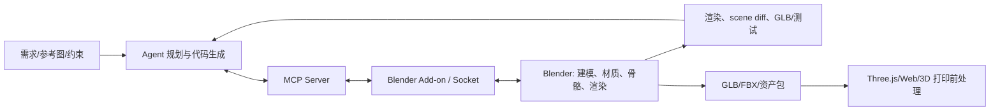

# Codex 与 Blender MCP 工具链视频深度调研

> [!summary]
> `BV1JhNC6zE8X` 的可靠结论不是某个“GPT 5.6 Sol/Sora”版本已经能一键交付高质量 3D，而是：以 BlenderMCP 为代表的工具链已可把 Agent 的自然语言规划接入 Blender 场景查询、物体/材质编辑和 Python 执行，并能用渲染结果形成迭代回路。视频中的具体模型名、模式、token、耗时、质量比较和社区案例均未取得可对应的官方一手证明；它们只能作为 B 级线索。**结论置信度：中等（工具架构）；低（模型品牌与生产质量/成本）。**

## 分类与研究边界

| 项目 | 结论 |
|---|---|
| 主分类 | **R05 产品、平台与工具选型调研** |
| 次分类 | R07 商业落地与需求真实性验证 |
| 分类理由 | 研究对象是“Agent 如何经 MCP 或 headless Blender 进入 3D 内容/工程工作流，以及团队应如何做 PoC 选型”，而非单一模型的能力排名。 |
| 研究边界 | 覆盖 BlenderMCP 的架构、部署/安全边界、MCP 与 headless 工作流的对比、PoC 验收和商业切口；不认定视频转录中的 GPT/Sol/Sora 名称，也不验证 IP、3D 打印或强化学习案例。 |

## 来源与证据质量

| 来源 | 等级 | 用途与限制 |
|---|---|---|
| [Bilibili source card](../_sources/bilibili-bv1jhnc6ze8x-gpt-5-6-sol-blender-mcp.md)；[ASR JSON](../../raw/_inbox/transcripts/2026-07-18-bilibili-bv1jhnc6ze8x-gpt-5-6-sol-blender-mcp.json) | B | 提供社区用法与博主的 17/27 分钟体验线索；作者、发布时间、模型标识和案例配置均未核验。 |
| [`SRC-ai-082`](../../raw/ai/documents/SRC-ai-082-blendermcp-project-readme.md)，`ahujasid/blender-mcp` README | A | 项目一手 README，核验 add-on + MCP server、场景操作、Python 执行、可选第三方资产/生成器与环境变量；它不是 OpenAI/Blender 官方产品公告，也不保证任何 Agent 的输出质量。 |

## 产品边界、工作流与架构

BlenderMCP 的两个组件是运行在 Blender 内的 add-on/socket server，以及实现 MCP 的 Python server。Agent 通过 MCP 请求读取场景、创建/修改/删除对象与材质，或执行 Blender Python；渲染图、场景状态、报错和导出文件才是下一轮修正的反馈。它是“让 Agent 调用确定性软件动作”的接口，不是 text-to-3D 基础模型本身。

视频提及两种路线：MCP 直连运行中的 Blender，或由 Agent 在 headless Blender/CLI 中生成脚本并渲染。前者适合交互式 scene inspection 和人工审阅，后者适合批处理、CI 与可复现导出。它们不应按“谁更快、更好”作无口径结论：实际差异取决于工具覆盖、脚本质量、资产来源、渲染器、任务大小、权限和人工返工。

## 事实、估计、判断与假设

| 类型 | 内容 | 证据与边界 |
|---|---|---|
| 已核验事实 | 该项目支持场景/对象信息读取、对象和材质操作、在 Blender 中执行 Python；系统由 Blender add-on 和 MCP server 组成。 | `SRC-ai-082`。任意 Python 执行也意味着需要隔离与审计。 |
| 已核验事实 | README 记录 Blender 3.0+、Python 3.10+、`uv` 安装路径及可选 Poly Haven、Sketchfab、Hyper3D、Hunyuan3D 等集成/凭证。 | `SRC-ai-082`；第三方服务许可、费用与可用性必须逐项核验。 |
| 视频线索 | 博主称仓库约 23k stars、MCP 比 headless 速度/质量更好，并展示手表、清明上河图和玩偶剧场。 | 本轮仅能确认项目存在且 README 述及能力；star 数、模型、输入提示、渲染参数、时长与质量均不可复现，不能当选型结论。 |
| 视频线索 | ASR 多次写成“GPT 5.6 Sol/Sora/So Medium/Ultra”。 | 未发现可对应的官方产品/版本一手资料；保留为 ASR/视频术语待核验，报告不以此建立事实。 |
| 判断 | 3D Agent 的护城河在“规划—工具调用—渲染检查—资产/导出验证”的闭环，而非一条长 prompt。 | 视频中也观察到短 prompt 易产生低细节资产；需用任务级指标验证。 |
| 假设 | Blender 负责高质量资产/动画，Three.js 负责 Web 交互展示，是中小团队较务实的分工。 | 可用 GLB 完整性、面数/贴图预算、加载性能、设计返工率与版权审查来验证。 |

## 兼容性、成本、许可证与安全

`SRC-ai-082` 说明该项目为社区项目，README 标注 MIT；但集成的外部资产库和 3D 生成服务可能另有 API key、许可、计费与商用限制。MCP 客户端从 GUI 启动时还会遭遇 PATH/`uvx` 发现、Python 版本与重启配置问题。更关键的是，若 Agent 能执行任意 Blender Python、下载资产或保存文件，就必须最小权限化：项目目录白名单、网络/凭证隔离、命令与导出审计、人工批准高风险操作，以及版权/商标/IP 检查。

| 路线 | 合适场景 | 优点 | 不适用条件 |
|---|---|---|---|
| MCP + 打开的 Blender | 设计师在环的概念模型、材质/布局迭代、调试 | 有 scene context、可即时预览与纠错 | 无人批处理、高安全隔离或需要严格可复现时不宜直接使用。 |
| Headless Blender + 脚本 | 批量生成、夜间渲染、CI、固定模板资产 | 易参数化、可保留脚本/日志/版本 | 复杂交互式雕刻、人工艺术指导、未经渲染验收的开放创作。 |
| 纯 Three.js 程序化 | Web 图表、低多边形交互、动态布局 | 运行时交互强、部署直接 | 需要成熟 UV、骨骼动画、复杂材质或可编辑 DCC 资产。 |

## 最小验证方案与选型建议

建议先选一个无品牌/IP 的桌面产品展示任务：给定 3 张参考图和尺寸约束，生成 Blender 场景、导出 GLB，并加载到网页。固定模型、提示词、机器和 20 分钟预算，分别跑 MCP 和 headless；验收门槛为：1）脚本/会话日志可回放；2）可打开无丢失的 GLB；3）渲染检查清单通过（比例、相机、材质、面数、纹理路径）；4）无未授权资产；5）人工修改不超过预定工时。达不到即停止，不把“视觉惊艳”替代为产品验收。

短期建议：将 BlenderMCP 作为**设计辅助/原型工具**而非自动生产管线；把 Agent 产生的 Blender Python、资产清单、渲染图和导出物一起纳入 Git/LFS 或资产版本系统。若需求主要是可编程 Web 场景，优先 Three.js；若需要可编辑资产、骨骼动画或专业材质，再引入 Blender。

## 商业应用可能性

| 维度 | 判断 |
|---|---|
| 高价值问题 | 电商/展会产品可视化、游戏预演、建筑/空间概念方案、教育内容等反复制作初版 3D 场景的成本与沟通延迟。 |
| 用户与付款 | 使用者为 3D 美术、技术美术、前端/创意开发；决策者为创意/产品负责人；付款来自内容制作、营销或软件工具预算。 |
| 可量化价值 | 首版时长、设计返工轮数、可复用资产比例、GLB 性能、人工修图/建模时间；不能仅用“看起来不错”衡量。 |
| 成熟度与成本 | MCP/脚本是可用工具层（中等置信度），自动高质量交付仍是 PoC/人工在环阶段。部署成本包括 DCC 许可证/硬件、API/资产费用、集成、渲染、版本管理和 IP/安全审查。 |
| 首批场景 | 1）SKU 产品展示；2）教育/博物馆交互展项原型；3）小型游戏/活动页面资产。它们可把质量标准和验收物写清。 |
| 1–2 年 / 3–5 年 | 1–2 年适合“设计师+Agent”提高首稿效率（中等置信度）；3–5 年是否规模化取决于资产版权、质量稳定性、成本和企业审计（低至中等置信度）。 |

## 中小型创业者的机会

| 分层 | 可做切口 | MVP、首单与限制 |
|---|---|---|
| 可立即验证 | 将 Blender/Three.js 交付流程产品化：模板、资产规范、渲染 QA、GLB 压缩、导出和部署。 | 为一个品牌/展馆交付 3 个可交互 SKU 展示；首个收费物是“可发布页面 + 资产包 + 验收报告”。需要 3D 技术美术、前端和版权运营，2–4 周验证。 |
| 需要条件成熟 | 垂直资产/工艺 skill：家具、展陈、机械外观、教育教具。 | 需要客户资产库和风格/尺寸 schema；复购来自模板、品牌规范、资产版本和工作流集成。 |
| 不建议进入 | 泛化“一句话生成电影级 3D”平台或代替客户持有全部 IP/资产的黑箱 SaaS。 | 模型、算力、版权与质量责任高度资本密集；视频没有交付质量、授权或单价的一级证据。 |

头部通用 Agent 未必愿意维护每个垂直行业的资产合规、导出规格、设计验收和客户现场工具链，因此小团队可以通过这些流程 know-how 获得切换成本。

## 反方证据、风险、证伪条件与监测

- **反方证据**：项目 README 主要展示能力而非基准；视频的“MCP 更快更好”是个人体验，无统一任务、token、硬件或人工返工口径。
- **证伪条件**：在固定任务下，传统模板/人工工作流以更低总成本达到相同验收；或 MCP 增加调试、安全与返工成本，无法减少交付周期。
- **监测指标**：首版交付时长、人工修正分钟、渲染/导出失败率、GLB 加载性能、资产授权通过率、每个发布资产的工具/API/算力成本、用户复购率。

## 待验证事项与下一步

1. 取得视频原始模型名称、提示词、任务文件和硬件配置；在相同预算下做 MCP/headless 对照，避免 ASR 名称误导。
2. 审核 BlenderMCP 代码的网络访问、文件写入与 Python 执行范围；企业环境先沙箱化再接入真实资产库。
3. 用客户实际 SKU 运行 10 个任务，建立“首次可用率、人工修正、授权、发布性能”四项基线后再采购/产品化。

## 关联连接

- [[_sources/bilibili-bv1jhnc6ze8x-gpt-5-6-sol-blender-mcp|本视频 source card]]
- [[_syntheses/bilibili-ai-daily-run-2026-07-18|Bilibili AI Daily Run 2026-07-18]]
- [[_syntheses/matlab-simulink-agentic-ai-tools-bilibili-2026-07-02|MATLAB/Simulink Agentic AI 工具链视频调研]]
- [[ai/00-index|AI]]
