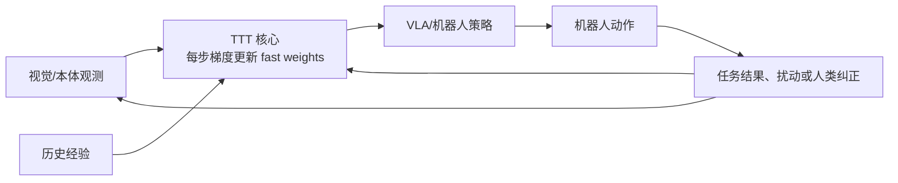

# RoboTTT 长上下文机器人策略视频深度调研

> [!summary]
> `BV1HkKG69EeD` 的可信核心是：RoboTTT 把测试时训练（TTT）放进机器人策略，以随训练和推理更新的 fast weights 压缩历史观测，从而把视觉—动作上下文扩展到 8K 时间步。论文在受控真机操作任务中报告了长程装配、从人类视频一次模仿、扰动恢复和在线纠错的提升；这仍是 2026-07-16 发布的预印本，不能等同于工厂现场的可靠、低成本或通用部署。**结论置信度：中高（机制与论文内结果）；低（跨本体、跨场景商业化）。**

## 分类与研究边界

| 项目 | 结论 |
|---|---|
| 主分类 | **R04 技术原理、论文与前沿方向调研** |
| 次分类 | R07 商业落地与需求真实性验证 |
| 分类理由 | 视频的决策问题是“长上下文/测试时训练能否成为机器人策略的有效能力轴，以及离部署还差什么”，核心对象为一篇模型与训练配方，而非公司或平台选型。 |
| 研究边界 | 覆盖 RoboTTT 的问题、机制、论文报告指标、工程/商业缺口及中国具身团队的验证路径；不把预印本外推为通用 VLA，不估算市场规模，也不复现论文。 |

## 来源与证据质量

| 来源 | 等级 | 用途与限制 |
|---|---|---|
| [Bilibili source card](../_sources/bilibili-bv1hkkg69eed-jim-fan-robottt-8k.md)；[ASR JSON](../../raw/_inbox/transcripts/2026-07-18-bilibili-bv1hkkg69eed-jim-fan-robottt-8k.json) | B | 提供视频叙事与术语线索；作者、发布时间和分区未知，ASR 中的“Gagger 蒸馏”不作为术语事实。 |
| [`SRC-robotics-307`](../../raw/robotics-embodied-ai/documents/SRC-robotics-307-robottt-context-scaling-for-robot-policies.md)，arXiv `2607.15275` / NVIDIA 项目页 | S | 第一作者团队的预印本与项目页，核验机制、作者报告的实验与指标；尚未经同行评审，也没有中国现场部署或订单证据。 |

## 问题、原理与系统架构

传统视觉—动作策略常只看单帧或很短历史，执行多阶段任务时会丢失“刚刚做过什么、示范的顺序是什么、纠错信号对应哪一步”。直接把 Transformer 上下文拉长会使计算与显存负担快速增加。RoboTTT 的解决方向不是保存全部 token，而是让一个内置的小型 TTT 模块在每个传感器读数到来时做梯度更新：历史被压缩到可变的 **fast weights**，随后策略从这些权重检索长程条件信息。

论文所述训练配方以 sequence action forcing 和 truncated backpropagation through time 扩展训练上下文；推理阶段仍持续更新 fast weights。它与“外部 RAG 记忆”“把更多帧拼进提示词”不同：状态位于参数空间而非显式 token 缓冲区。创新点是把 TTT 的长序列压缩能力与机器人基础策略结合，并报告预训练上下文越长、闭环表现持续变好的 scaling 现象。

## 事实、估计、判断与假设

| 类型 | 内容 | 证据与边界 |
|---|---|---|
| 已核验事实 | RoboTTT 将视觉—动作上下文扩展到 **8K timesteps**；论文称相对既有短上下文策略为三个数量级扩展，且不随上下文长度增加推理延迟。 | `SRC-robotics-307`；“不增长”是论文架构/实验主张，仍应在目标硬件测吞吐与尾延迟。 |
| 已核验事实 | 论文报告：相对 single-step context baseline，总体表现提升 **87%**；8K 预训练相对 1K 预训练提升 **62%**；完成一个约 **5 分钟、10 阶段**装配任务。 | 均为作者报告，比较对象、任务分布和成功定义不应省略。 |
| 已核验事实 | 支持的能力包括从人类视频 one-shot in-context imitation、人在环纠正下的 on-the-fly policy improvement、扰动后恢复及多阶段任务。 | `SRC-robotics-307`；这些是受论文任务设置约束的能力，不是任意人类视频或开放环境保证。 |
| 视频线索 | 视频称三个任务平均完成分 79%、128 到 8000 帧“完全没见顶”、把历史“全压进参数”。 | 机制与长上下文趋势得到论文支持；79% 的准确口径及“完全没见顶”的泛化表述未在本轮逐表核对，保留为待验证。 |
| 判断 | 长上下文的价值主要在多阶段状态跟踪、例外纠正和现场过程记忆，而不是单步抓取的替代品。 | 与论文任务性质一致；在高频闭环控制中还须和控制器、延迟预算、传感器同步联合评估。 |
| 假设 | 可复位工位的“人类示范 + 少量纠正”可能比重新采集大量离线数据更快覆盖长尾流程。 | 需以新增有效任务数、人工分钟、pass@1、干预率和安全事件做现场对照。 |

## 数据、评测、可复现性与失败模式

RoboTTT 的核心验证单元应是 episode，而不是单次演示图：任务版本、物体/初始位姿分布、相机与本体标定、示范视频、纠正事件、动作日志和成功判定都需版本化。最小复现应先固定一项 3–5 步桌面装配任务，对比 single-step、固定窗口、长窗口无 TTT 与 RoboTTT 风格 fast-weight 状态；统一报告 pass@1、每步延迟、恢复成功率、人工干预分钟和失败类别。

高风险失败模式包括：fast weights 将早期错误压缩并持续污染后续决策、隐式状态难审计、长序列训练/反传成本高、传感器时钟漂移导致历史错位，以及“纠正”本身被错误归因。论文 benchmark 的提升也不能证明跨本体、脏污/遮挡/柔性物体、人员共作和安全停机条件下的可靠性。

## 从论文指标到真实价值

论文结果说明“上下文长度”可以是机器人基础策略的研究轴，但商业价值只在它减少了昂贵的失败、重复示教或人工恢复时才成立。首批应验证在高价值、重复工位：电子装配、实验室样品处理、受控仓储拣放。采购方需要的不只是更高成功率，还需要可回放日志、异常退出、权限隔离、恢复时间和责任界面。

中国的优势在于制造场景密度、系统集成与机电供应链；短板/待验证点是高质量长程多模态数据、可验证试验工位、跨厂商控制接口与真实现场安全验收。当前成熟度为**实验室/受控真机验证（中等置信度）**，不是规模化可售通用能力。

## 商业应用可能性

| 维度 | 判断 |
|---|---|
| 高价值问题 | 多阶段操作中的状态遗忘、换型后重复示教、受扰后人工恢复；高频且失败成本高的受控工位最适合。 |
| 角色与付款 | 使用者为产线操作/调试人员，决策与采购为自动化、制造工程和 EHS/IT，付款通常来自产线改造或柔性自动化预算。 |
| 价值与成本 | 可量化为 pass@1、恢复率、人工介入分钟、换型时间和报废/停线损失；成本包括传感器/本体兼容、标定、长序列训练算力、现场安全、日志与维护。 |
| 落地顺序 | 1）固定料号装配纠错；2）可复位实验室操作；3）标准容器的仓储分拣。原因是状态与成功判定更清晰、可快速回退。 |
| 1–2 年 / 3–5 年 | 1–2 年可作为既有策略的记忆/恢复增强 PoC（中等置信度）；3–5 年能否形成重复采购取决于跨任务迁移、可审计性和总拥有成本（低置信度）。 |
| 规模门槛 | 多个客户工位上稳定的 pass@1/人工干预改善、明确的安全责任与可回滚升级；单次 five-minute demo 不足以跨越。 |

## 中小型创业者的机会

| 分层 | 可做切口 | MVP、首单与限制 |
|---|---|---|
| 可立即验证 | 长程 episode 日志/回放、扰动与人工纠正标注、成功判定 harness。 | 为一个协作臂工位交付“示范—纠正—回放—指标”工具包；首批客户是机器人集成商/具身团队。需要机器人 SDK、数据工程和现场安全能力，约 4–8 周验证。 |
| 需要条件成熟 | 适配多个本体的 fast-weight 策略运行时、工位级恢复策略服务。 | 首个收费物是固定任务的成功率/干预率改善报告；依赖客户开放控制接口、持续数据与可复位工位。 |
| 不建议进入 | 自研通用机器人基础模型或仅售“8K 上下文”概念。 | 需要巨大数据/算力/本体资源，且论文尚未验证跨客户复制；头部团队也会优先内化核心模型。 |

可形成复购的并非一次模型部署，而是 episode 资产、失败 taxonomy、工位适配配置和持续回归报告。头部模型公司通常不会深做每个客户的工装、验收和现场数据治理，正是小团队的服务/工具切口。

## 反方证据、风险、证伪条件与监测

- **反方证据**：论文为新预印本，长上下文增益可能依赖任务、数据和训练配方；没有独立复现、客户回款或跨工厂证据。
- **证伪条件**：在相同本体和任务下，固定窗口/外部记忆以更低成本达到同等 pass@1、延迟与恢复率；或 fast-weight 更新引入不可接受的漂移/安全事件。
- **监测指标**：context length 对 pass@1 的曲线、推理 P95 延迟、显存/训练成本、纠正后保持率、扰动恢复率、人工复位分钟、跨批次回归和安全停机次数。

## 待验证事项与下一步

1. 阅读论文 HTML/附录，逐表确认 79% 的任务/平均口径、baseline 与数据量。
2. 在目标国产协作臂上实现 5 步任务 PoC；先验收可回放日志、pass@1 与人工干预，再讨论模型扩容。
3. 核验训练数据许可、现场视频/人员数据合规和人机协作安全责任；未完成前不得将在线更新接入生产线。

## 关联连接

- [[_sources/bilibili-bv1hkkg69eed-jim-fan-robottt-8k|本视频 source card]]
- [[_syntheses/bilibili-ai-daily-run-2026-07-18|Bilibili AI Daily Run 2026-07-18]]
- [[robotics-embodied-ai/00-index|机器人与具身智能]]
- [[robotics-embodied-ai/09-training-data-deep-dive|机器人训练数据深度调研]]
- [[ai/00-index|AI]]
