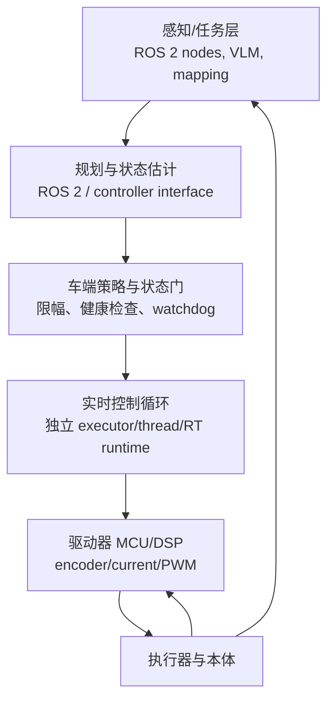

# ROS 2 机器人计算分层与实时控制边界深度调研

> [!summary]
> 视频提出“感知决策—运动控制—驱动执行”三层，作为**工程分工框架**是有用的：把 GPU/CPU 上的感知、规划和任务编排，同对截止期敏感的控制/驱动链隔离。ROS 2 官方设计资料同时明确：硬实时不是安装 ROS 2 后自然获得，需 RTOS/内核、内存与调度控制、执行模型和全链路测量共同保证。故应选型为“ROS 2 负责高层图与可观测性，独立受约束控制/驱动链负责最后执行”，而非按视频给出的固定频率或芯片清单部署。**结论置信度：中高（分层和实时边界）；低（视频中各机型、芯片、频率与智元示例）。**

## 分类与边界

| 项目 | 结论 |
|---|---|
| 主分类 | **R05 产品、平台与工具选型调研** |
| 次分类 | R04 技术原理、论文与前沿方向调研 |
| 分类理由 | 研究决策是如何为人形、四足或移动机器人选择 ROS 2、计算平台和控制链边界，并设定 PoC 验收；不是评判视频作者或特定机器人型号。 |
| 研究边界 | 覆盖 ROS 2 执行、`ros2_control` 异步硬件和实时设计约束；不验证视频所称 Jetson、RDK、RK3588、具体频率、教育版配置、智元示例或“消费版只有两层”等 B 级表述。 |

## 来源与证据质量

| 等级 | 来源 | 支持范围与限制 |
|---|---|---|
| B | [[_sources/bilibili-bv1ftu96zeng-ros2\|视频 source card]]；[ASR 原文](../../raw/_inbox/transcripts/2026-08-13-bilibili-bv1ftu96zeng-ros2.json) | 视频的三层解释、硬件例子和教学判断；无版本、代码、时序 trace 或重复实验。 |
| S | [ROS 2 实时系统设计提案](https://design.ros2.org/articles/realtime_proposal.html)；[实时背景](https://design.ros2.org/articles/realtime_background.html) | 实时系统需定义 deadline、jitter、失败模式，并规避动态分配、阻塞和不可预测调度；支持边界判断，不证明某一机器人实现。 |
| S | [ROS 2 Executors 文档](https://docs.ros.org/en/rolling/Concepts/Intermediate/About-Executors.html)；[`ros2_control` 异步硬件文档](https://docs.ros.org/en/rolling/p/hardware_interface/doc/asynchronous_components.html) | 默认 executor 不适于需要确定执行时间的实时应用；硬件可用独立线程/executor 避免阻塞控制循环。 |

## 视频源提取：事实、估计、判断与假设

| 类型 | 内容 | 处理 |
|---|---|---|
| 事实（B） | 视频按感知决策、运动控制、驱动执行划分机器人，分别关联建图/视觉/规划、动作目标、编码器/电流读取与 PWM。 | 作为教学性架构线索；具体划分会随本体、控制器与安全架构变化。 |
| 估计（B） | 视频称上层约十余 Hz、中层数百至上千 Hz、驱动数千至上万 Hz。 | 缺少任务、硬件、调度、jitter 和测量口径；不能作采购或安全指标。 |
| 事实（S） | ROS 2 的实时能力取决于 OS、调度、内存、通信和用户代码；executor 的选择影响执行顺序与确定性。 | 已由官方设计/文档支持。 |
| 判断 | 感知/规划与高频执行应隔离资源和故障域，并由车端独立安全策略约束。 | 合理，但必须经实际频率、最坏时延和失效模式测试。 |
| 假设 | 只要将 ROS 2 放在“上层”即可避免控制风险。 | 不成立；ROS 2 仍可能在控制路径中，且消息、QoS、锁、网络和线程都会造成抖动。 |

## 工具边界、架构与选型

ROS 2 不是单一“运行位置”，而是一组通信、节点、执行器和工具链。推荐把它放在对可观测性、组件复用、规划和任务编排有价值的层；若控制环经 ROS 2 通过，应以设计过的 executor、QoS、线程优先级、预分配内存和端到端 trace 证明 deadline。最终的限位、扭矩/速度/加速度约束、watchdog 和急停不能依赖大模型、云连接或上层队列。

| 方案 | 适用 | 优点 | 不适用 / 风险 |
|---|---|---|---|
| ROS 2 高层 + MCU/DSP 驱动闭环 | 大多数移动、四足和人形研发/产品化项目 | 清晰隔离、生态广、便于数据记录与调试 | 仍需定义中间接口和安全状态机；不是天然实时。 |
| ROS 2/`ros2_control` 进入控制路径 | 已有 RT Linux/RTOS、可测试硬件接口的团队 | 可组合控制器、硬件接口和可观测性 | 需要明确 executor、优先级、内存、通信和最坏时延；默认配置不应视为硬实时。 |
| 单 MCU/厂商控制器一体化 | 低复杂度轮式底盘或成熟模块 | 延迟短、集成简单 | 可扩展性、数据接口和高级感知/规划能力受限；不能由视频泛化到所有轮式机器人。 |

## PoC、性能与总拥有成本

**最小验证**：选一条可回放的低风险轨迹，分别在正常、CPU/GPU 压力、传感器延迟、网络抖动和节点重启条件下运行 100 次。记录控制周期 P50/P95/P99、deadline miss、jitter、watchdog 触发、通信丢失恢复、功耗/温度、碰撞/越界、人工接管和 trace 完整度。任一安全边界越权、急停失效或未定义的 deadline miss 即停止，不因平均帧率达标而放行。

部署成本包括工控机/边缘算力、控制器、现场 I/O、RT 内核或 RTOS、传感器标定、DDS/QoS 与时钟同步、日志/回放、功能安全评审、固件升级和现场运维。模型或 GPU 的吞吐不是控制系统 TCO 的替代指标；应按“一个完成且可审计的动作循环”计入硬件、工程人时、停机与安全成本。

## 商业应用可能性

| 问题 | 判断 |
|---|---|
| 高价值问题 | 复杂机器人项目常在高层算法可跑、现场动作不稳定之间失效；瓶颈是接口、时间同步、资源争用、诊断和安全验收。 |
| 使用者/采购者/付款者 | 使用者为控制、ROS、嵌入式和现场工程师；采购决策者为机器人研发负责人、集成商或工厂自动化负责人；预算来自研发、设备集成或运维。 |
| 价值与成熟度 | 可量化为 deadline miss、接管率、调试人时、停机时间、单位合格循环成本。ROS 2 生态成熟，但把它用于每类本体的确定性控制仍属工程化/PoC 到项目交付，不可由教程证明规模复购。 |
| 优先场景 | 1）实验室/产线工位的 ROS 2—驱动接口诊断；2）移动机器人导航与感知计算隔离；3）教育/研发平台的实时 trace 与回放。 |
| 近期/中期 | 1–2 年，面向既有 ROS 2 项目的控制链审计与调优，可能性中高；3–5 年，跨本体标准化产品取决于硬件接口、安全责任和客户现场数据，置信度中低。 |

## 中小型创业者的机会

| 分层 | 可交付物与首批客户 | 条件与边界 |
|---|---|---|
| 可立即验证 | 为一种底盘、机械臂或工位交付 ROS 2 性能基线：executor/QoS 配置审计、trace dashboard、watchdog/状态机模板和 100 次测试报告。首批客户是机器人创业团队、集成商和高校实验室。 | 需 ROS 2、嵌入式、测试自动化与安全常识；4–8 周可验证。复购来自新机型、版本升级和现场维护。 |
| 需要条件成熟 | 做垂直行业的控制/驱动适配包，包含通信驱动、故障码、标定和验收脚本。 | 需取得设备协议和客户现场数据；头部平台通常不会覆盖长尾设备和现场流程。 |
| 不建议进入 | 承诺“把任意 ROS 2 机器人一键变硬实时”或仅售卖 GPU/大模型就保证稳定行走。 | 硬实时和安全是系统性质，依赖硬件、OS、接口与验证；责任和交付风险过高。 |

## 反方证据、风险、证伪条件与监测指标

- **反方证据/冲突**：视频的三层模型容易被理解为静态行业标准；官方资料则强调实时要求由应用定义。不同底盘可能合并、拆分或用专有控制器实现这些功能。
- **风险**：优先级反转、动态分配、阻塞 I/O、DDS/QoS 误配、时间同步失败、网络抖动、传感器失真、热降频、固件不一致和上层越权。
- **证伪条件**：压力与故障注入下 P99 jitter/deadline miss 无法满足预定义门槛，或 watchdog 不能把系统带回安全态，则该方案不适用于目标控制路径。
- **监测指标**：deadline miss、P99 jitter、控制环周期、CPU/GPU/温度、DDS 丢包和延迟、watchdog/急停触发、接管率、故障恢复时间、单位合格循环成本。

## 待验证事项与下一步

1. 获取目标机器人实际控制架构、接口频率、OS、驱动器、QoS 与安全链，代替视频中的芯片/频率例子。
2. 为目标场景写清 deadline、最大 jitter、失败状态和可接受恢复时间，并做压力与故障注入。
3. 比较 MCU/DSP 闭环、RT Linux `ros2_control` 与厂商控制器三条路线的可测成本、维护和安全责任。

## 关联连接

- [[_sources/bilibili-bv1ftu96zeng-ros2|本视频 source card]]
- [[_syntheses/bilibili-ai-daily-run-2026-08-13|Bilibili AI Daily Run 2026-08-13]]
- [[robotics-embodied-ai/12-robotics-engineering-platforms-2026-06-04|机器人工程平台综合调研]]
- [[ai/00-index|AI]]
- [[robotics-embodied-ai/00-index|机器人与具身智能]]
