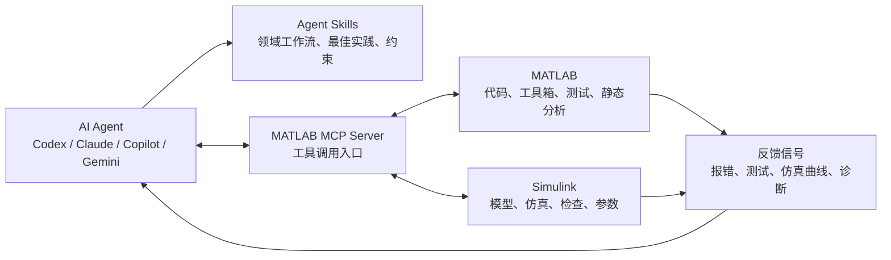

# MATLAB/Simulink Agentic AI 工具链视频调研

> [!summary]
> 该 Bilibili 视频的核心价值不是“5 个 GitHub 项目清单”，而是一个更大的行业信号：AI Coding Agent 正从代码补全走向工程软件的闭环执行层，开始覆盖代码运行、模型搭建、仿真、测试、诊断和参数迭代。对中国 AI 应用层与工业软件方向，这更像“Agent + 专业软件工具链”的早期样板。

## 结论

- **事实**: 视频提到的主要项目与 MathWorks 官方 `matlab` GitHub 组织下的项目基本对应，包括 `matlab-mcp-server`、`matlab-agentic-toolkit`、`simulink-agentic-toolkit` 和 `agent-skills-playground`。视频中的 “Simulink Authentic Tokit / MATLAB Agentic Toolkit / Simulink Genetic Toolkit”等表述应按 ASR 误听处理，官方项目名以 GitHub 为准。
- **事实**: MathWorks 官方 GitHub 组织页把这些项目归为 `MATLAB Development & AI Coding Projects`，定位覆盖 MATLAB MCP、Agentic Toolkits、Agent Skills、Slash Commands 和 AI coding prompts；官方页面明确列出 Claude Code、GitHub Copilot、Cursor、OpenAI Codex、Sourcegraph Amp、Gemini CLI 等 agent 支持范围。
- **判断**: 工程软件的 Agent 化路径会优先发生在“可脚本化、可测试、可仿真、反馈信号明确”的软件中。MATLAB/Simulink 是典型场景，因为它天然有命令执行、模型检查、仿真输出、单元测试和静态分析信号。
- **判断**: 视频对行业的启发是：Agent 能力不只取决于大模型本身，还取决于软件厂商是否把专业知识、工作流约束和工具调用接口打包成可执行的技能层。MCP Server 提供工具入口，Agentic Toolkit/Skills 提供领域约束，两者组合才形成可控闭环。
- **假设**: 类似范式会扩展到 CAD/CAE/EDA/PLC/工业仿真/数据分析平台。对中国市场，机会可能不在“再做一个通用 Copilot”，而在国产工业软件、仿真平台和垂直工程流程里补齐 agent-ready 接口、测试反馈和技能库。

## 来源与核验

| 线索 | 视频转录说法 | 外部核验 | 备注 |
|---|---|---|---|
| MATLAB MCP Server | 连接 Codex 和 MATLAB，可执行命令、运行脚本、读结果、查错、跑测试 | `matlab/matlab-mcp-server` 是 MathWorks 官方 MCP Server，README 描述其用于让 AI 应用启动/退出 MATLAB、运行 MATLAB 代码、评估代码风格与正确性 | 与视频主张一致；star 数量视频称约 1100，GitHub 页面显示约 1.1k |
| Simulink Agentic Toolkit | 让 Agent 操作 Simulink，添加/删除模块、改参数、连线、检查和仿真 | `matlab/simulink-agentic-toolkit` README 描述其面向 Simulink 和 Model-Based Design，提供读、建、改、测、检查 Simulink 模型的 MCP tools 与 skills | 视频 ASR 的 “Authentic Tokit” 应校正为 Agentic Toolkit |
| MATLAB Agentic Toolkit | 指导 Agent 正确调用工具箱、写脚本、运行测试、检查代码、生成报告 | `matlab/matlab-agentic-toolkit` README 描述其给 Agent 提供 MATLAB/toolbox 工作上下文，并自动安装 MATLAB MCP Server；支持 Codex 等 Agent | 与视频主张一致；官方强调减少 hallucination、漏用新特性和无效步骤 |
| Agent Skills Playground | 展示和实验 Agent Skills，包含系统工程、嵌入式 AI、交互式科学计算案例 | `matlab/agent-skills-playground` README 定位为 MATLAB/Simulink Agent Skills 原型和演示沙盒，包含 MBSE、embedded AI、Lorenz attractor 等 demo | 与视频主张一致；官方提示实验性质，正式技能应使用 Agentic Toolkits |
| “Simulink Skills / 高级调试” | 视频说面向高级调试、性能分析、代数环、求解器异常等 | 官方 `simulink-agentic-toolkit` repo 包含 `skills-catalog` 与 tools，且 MathWorks 博客中有 Simulink skills 相关入口；本轮未逐条核验每个高级调试 skill | 待后续代码级检查，不宜直接提升为强事实 |

## 技术结构

这个结构说明，工程软件 Agent 化至少需要三层：

1. **工具层**: MCP 或等价 API，把软件动作暴露给 Agent，例如执行代码、读模型、改参数、运行仿真。
2. **技能层**: 把领域专家的流程、检查清单、建模规范、测试约束和常见陷阱转成 agent-readable 规则。
3. **反馈层**: 让 Agent 能从报错、测试结果、仿真曲线、模型诊断中迭代，而不是一次性生成静态文本。

## 对 AI 行业的意义

### 事实

- MathWorks 已把 MATLAB/Simulink 的 Agent 支持拆成多个开源入口：MCP Server、Agentic Toolkits、Agent Skills Playground、prompts、slash commands、AI Agent SDK。
- 官方项目已经把 OpenAI Codex 明确列入支持的 coding agents；这说明 Codex 类工具不只是“写代码 UI”，而是可被专业软件厂商纳入工作流集成对象。
- 视频中示例集中在工程软件：MATLAB 脚本、Simulink 模型、PID 控制仿真、系统工程、嵌入式 AI、模型调试和性能诊断。

### 判断

- **应用层壁垒正在从 prompt 转向 workflow packaging**。简单 prompt 很容易复制，但 MCP tools + skills + 测试反馈 + 专业软件上下文的组合更像产品能力。
- **工业软件的 Agent 化可能先落在“工程效率工具”而非“完全自动设计”**。短期更可靠的价值是减少切换、自动跑测试、自动定位错误、生成初版模型、整理报告，而不是完全替代工程师判断。
- **专业软件厂商有天然优势**。他们掌握软件内部 API、模型诊断器、测试框架和最佳实践，能比第三方 Agent 更好地定义安全边界和可执行技能。
- **中国机会在国产工具链的 agent-ready 改造**。若国产 CAD/CAE/EDA/仿真/工业控制软件没有 MCP/API/技能层，Agent 生态会继续围绕海外平台积累模板和数据。

## 投资与产业观察点

| 观察点 | 为什么重要 | 监测指标 |
|---|---|---|
| 工业软件是否开放 MCP/API | 决定 Agent 能否闭环执行，而非停留在文档/代码建议 | 官方 MCP server、插件、SDK、命令行接口、脚本 API |
| 技能库数量和质量 | 决定 Agent 是否能按领域规范工作 | skills catalog、示例覆盖的工具箱/模型类型、测试流程 |
| 反馈信号可机器读取程度 | 决定 Agent 是否能自我修正 | 单元测试、模型检查、仿真日志、诊断报告结构化程度 |
| 用户从 demo 到生产的路径 | 决定商业化价值 | 安装步骤、权限模型、企业安全、审计日志、版本兼容 |
| 国产工业软件跟进速度 | 决定中国工程软件 Agent 生态是否被海外平台先占位 | 国内厂商是否发布 MCP/API/agent skills、是否支持 Codex/Claude/Copilot 类工具 |

## 职业与学习启发

- 对工程师，值得练习的不是“让 Agent 写一段 MATLAB 代码”，而是搭建 **可验证任务闭环**：需求 -> 脚本/模型 -> 测试/仿真 -> 错误诊断 -> 修正 -> 报告。
- 对平台/后端背景的人，切入点可以是 **Agent tool runtime 与 observability**：任务队列、权限隔离、日志、回放、测试 harness、模型/仿真结果结构化。
- 对工业软件/仿真方向的人，技能库写作会变成新型资产：把专家经验转成 agent-readable workflows，比零散 prompt 更可复用。
- 一个可做的作品集项目：选一个开源仿真或数据分析工具，写 MCP server + 3 个 skills + regression tests，展示 Agent 如何从错误中迭代。

## 风险与不确定性

- **视频来源等级为 B**：Bilibili 视频适合作为线索，不适合作为 star 数、功能边界或产品路线的唯一证据。
- **ASR 有误听**：例如 “Authentic Tokit / Genetic Toolkit / Ticket” 等，已按官方 GitHub 项目校正，但细节仍需代码级核验。
- **demo 不等于生产可用**：Agent 能搭一个演示模型，不代表能处理大型工业模型的权限、安全、版本、性能和责任问题。
- **厂商主导带来生态锁定**：如果 skills 与工具深度绑定某一软件生态，跨平台迁移成本会增加。

## 后续任务

- 核验 `simulink-agentic-toolkit/skills-catalog` 中是否覆盖视频提到的代数环、求解器异常、性能分析等高级诊断。
- 把 `MATLAB MCP Server`、`MATLAB Agentic Toolkit`、`Simulink Agentic Toolkit` 建成 `knowledge/_entities/` 或 `knowledge/_concepts/` 页面。
- 横向比较 MATLAB/Simulink Agentic Toolkit 与 EDA、CAD、CAE、数据分析平台的 Agent 接口成熟度。
- 对中国工业软件厂商做一次 agent-ready 能力扫描：是否有脚本 API、MCP/插件、测试反馈、技能库和安全审计。

## 关联连接

- [[_sources/bilibili-bv1bbtv6ueaf-5-skill-codex-matlab|安了这5个skill，让Codex自动控制matlab]]
- [[ai/00-index|AI]]
- [[_concepts/llm-wiki|LLM Wiki]]
