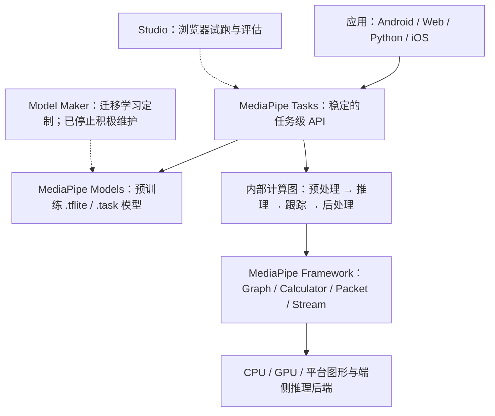
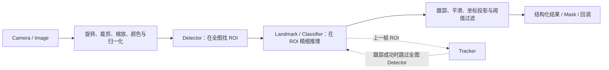

# Google MediaPipe 全面调研：功能、原理与使用方法

> [!summary]
> MediaPipe 不是一个单独的人脸或手势模型，而是一套面向端侧实时感知的“现成任务 API + 预训练模型 + 流式计算图框架”。它最强的领域仍是摄像头实时视觉：把预处理、模型推理、检测—跟踪、时序同步、CPU/GPU 调度和后处理封装成可跨 Android、Web、Python、iOS 复用的流水线。2026 年做新项目时，经典视觉/音频 Tasks 仍值得采用；Legacy Solutions 不应再作为新项目入口；生成式 AI 方向应优先考察 LiteRT-LM，而不是新押注 MediaPipe LLM/RAG/Function Calling 旧 SDK。

## 一句话理解

如果 LiteRT/ONNX Runtime 解决的是“怎样把一个模型在设备上跑起来”，MediaPipe 更接近解决“怎样把摄像头、预处理、一个或多个模型、跟踪、同步、后处理和回调组织成一个低延迟应用”。

它包含两种使用深度：

1. **MediaPipe Tasks / Solutions**：面向应用开发者的高层 API，下载模型后几行代码即可推理。
2. **MediaPipe Framework**：面向需要自定义实时多媒体流水线的底层计算图框架，以 Graph、Calculator、Packet、Stream 为核心。

官方原始论文将它定位为从原型走向跨平台产品的 perception pipeline 框架，而不是训练框架或云端识别服务。[`SRC-ai-068`](../../../raw/ai/documents/SRC-ai-068-mediapipe-a-framework-for-building-perception-pipelines.md)

## 1. 产品结构与当前状态

### 1.1 产品栈



| 层 | 解决的问题 | 适合谁 |
|---|---|---|
| Tasks | 用统一 API 运行分类、检测、关键点、分割等完整任务 | 大多数应用开发者 |
| Models | 提供已训练、带元数据或已打包的端侧模型 | 快速原型和标准场景 |
| Studio / Demos | 不写代码先测试输入、阈值与模型效果 | 产品、算法、前端验证 |
| Model Maker | 用迁移学习改分类头或定制部分受支持任务 | 小数据、低代码定制；新项目需评估替代工具 |
| Framework | 自定义计算图、节点、同步、调度、GPU 处理和复杂多模型流水线 | C++/端侧基础设施工程师 |

来源：[`SRC-ai-061`](../../../raw/ai/documents/SRC-ai-061-mediapipe-github-repository-and-readme.md)、[`SRC-ai-062`](../../../raw/ai/documents/SRC-ai-062-mediapipe-solutions-guide.md)、[`SRC-ai-064`](../../../raw/ai/documents/SRC-ai-064-mediapipe-framework-concepts.md)。

### 1.2 截至 2026-07-14 的维护状态

| 模块 | 状态 | 新项目建议 |
|---|---|---|
| MediaPipe Framework / 经典 Tasks | 仍在更新；已核验最新正式版为 `0.10.35`（2026-04-28） | 可用，但固定并验证具体版本，不要在生产环境直接依赖 `latest.release` |
| MediaPipe Solutions | 官方仍标记 Preview | 先做设备矩阵和模型效果验证，再决定生产采用 |
| Legacy Solutions | 多项自 2023-03-01 起停止支持；Hands、Face Mesh、Pose 等已升级到新 Task | 新代码使用 `mp.tasks.*`，不要照抄旧 `mp.solutions.*` 教程作为长期架构 |
| Model Maker | 仍可用，但官方标记“不再积极维护” | 小型迁移学习可试；长期训练链路优先选活跃框架并自行导出兼容模型 |
| LLM Inference API | Android/iOS/Web 进入 maintenance-only | 新生成式 AI 项目优先 LiteRT-LM |
| RAG SDK | deprecated，仍可用且主要面向 Android | 不建议作为长期新架构 |
| Function Calling SDK | deprecated，官方建议迁移 LiteRT-LM | 新项目直接评估 LiteRT-LM |

依据：[`SRC-ai-062`](../../../raw/ai/documents/SRC-ai-062-mediapipe-solutions-guide.md)、[`SRC-ai-069`](../../../raw/ai/documents/SRC-ai-069-mediapipe-model-maker-overview.md)、[`SRC-ai-070`](../../../raw/ai/documents/SRC-ai-070-mediapipe-llm-inference-guide.md)、[`SRC-ai-076`](../../../raw/ai/documents/SRC-ai-076-mediapipe-v0-10-35-release.md)、[`SRC-ai-078`](../../../raw/ai/documents/SRC-ai-078-ai-edge-rag-guide.md)、[`SRC-ai-079`](../../../raw/ai/documents/SRC-ai-079-ai-edge-function-calling-guide.md)。

> [!warning]
> 官方文档存在状态不一致：Tasks 总览仍写“iOS support is coming soon”，但同一官方站点已有 iOS 安装页、CocoaPods 包和多项 iOS Task 指南。工程判断应以具体 Task 的平台表、安装页和包仓库为准，而不是只看总览文案。

## 2. MediaPipe 能做什么

### 2.1 视觉任务

| 任务 | 核心输入/输出 | 典型用途 | 平台状态要点 |
|---|---|---|---|
| Object Detector | 图像/视频 → 框、类别、置信度 | 物体识别、计数、交互 | Android/Web/Python/iOS；可定制 |
| Image Classifier | 图像/ROI → 类别概率 | 商品、缺陷、场景、物种分类 | 四平台；可定制 |
| Image Segmenter | 图像 → 类别 mask / 置信度 mask | 人像抠图、背景虚化、部件分割 | Android/Web/Python |
| Interactive Segmenter | 图像 + 点选位置 → 目标 mask | 点选抠图、交互式编辑 | Android/Web/Python |
| Hand Landmarker | 图像/流 → 左右手、21 个图像坐标和世界坐标关键点 | 手势、遥控、动作分析、机器人示教前端 | Android/Web/Python/iOS |
| Gesture Recognizer | 手部图像/流 → 手势类别 + 手部关键点 | 无接触交互、自定义手势 | 四平台；可定制 |
| Face Detector | 图像/流 → 人脸框与关键点 | 人脸 ROI、特效前级 | 四平台 |
| Face Landmarker | 图像/流 → 478 个 3D 面部点，可选 blendshape 和变换矩阵 | 虚拟形象、表情、AR 特效 | 官方平台表为 Android/Web/Python |
| Pose Landmarker | 图像/流 → 33 个 3D 姿态点，可选人体 mask | 健身、动作计数、姿态交互 | 官方平台表为 Android/Web/Python |
| Image Embedder | 图像 → 特征向量 | 相似图搜索、聚类、去重 | Android/Web/Python |
| Holistic | 人体 → pose + face + 双手共 543 点 | 全身动作、手语、虚拟人 | 当前页面仍提示升级版即将到来，应视作过渡状态 |
| Image Generator | 文本 → 图像 | 端侧生成图像 | Android；生成式路线需单独评估维护方向 |

平台矩阵来自官方 Solutions 总表；具体平台可能随版本变化，应在开发前回查目标 Task 页面。[`SRC-ai-062`](../../../raw/ai/documents/SRC-ai-062-mediapipe-solutions-guide.md)

### 2.2 文本、音频与生成式 AI

| 类别 | 当前能力 | 输出 |
|---|---|---|
| 文本 | Text Classifier、Text Embedder、Language Detector | 类别、语义向量、语言代码与概率 |
| 音频 | Audio Classifier | 连续音频或片段的事件类别与概率 |
| 生成式 AI | LLM Inference、图像生成；另有 RAG、Function Calling SDK | 文本/图像或结构化调用 |

经典文本/音频 Tasks 适合端侧分类、embedding 和声音事件识别；生成式 AI 功能虽然仍能运行，但路线已经向 LiteRT/LiteRT-LM 迁移。[`SRC-ai-062`](../../../raw/ai/documents/SRC-ai-062-mediapipe-solutions-guide.md)、[`SRC-ai-070`](../../../raw/ai/documents/SRC-ai-070-mediapipe-llm-inference-guide.md)、[`SRC-ai-071`](../../../raw/ai/documents/SRC-ai-071-litert-overview.md)

### 2.3 它不是什么

- **不是模型训练大平台**：Tasks 主要负责部署；Model Maker 只覆盖有限任务的迁移学习，且已停止积极维护。
- **不是完整视频 I/O/GUI 库**：Python 摄像头与视频读取通常仍借助 OpenCV；Web/Android/iOS 也要自己接相机与 UI 生命周期。
- **不是云 API**：Tasks 的输入处理在设备上完成；模型文件和应用依赖通常由开发者打包或自行下载。
- **不是通用 3D 几何/SLAM 系统**：关键点的“世界坐标”是任务模型定义下的估计，不能自动替代相机标定、深度传感器、SLAM 或机器人坐标系标定。

## 3. 核心原理

### 3.1 Graph：用有向图表达完整流水线

MediaPipe 把处理流程表示为计算图。节点叫 **Calculator**，边叫 **Stream**，流动的数据单元叫 **Packet**：

- `Packet`：不可变 payload + 时间戳；payload 可是图像、tensor、检测框、关键点或任意 C++ 类型。
- `Calculator`：完成一个小步骤，例如颜色转换、裁剪、推理、NMS、平滑、绘制。
- `Stream`：按时间戳单调递增地传 Packet。
- `Side Packet`：运行期间基本不变的配置，如模型路径、阈值或静态参数。
- `Subgraph`：把一组 Calculator 封装成可复用模块。

来源：[`SRC-ai-064`](../../../raw/ai/documents/SRC-ai-064-mediapipe-framework-concepts.md)。

一个典型视觉 Task 可抽象为：



### 3.2 为什么“检测 + 跟踪”比每帧全图检测快

以 Hand Landmarker 为例，模型包包含掌心检测器和手部关键点模型：

1. 首帧或跟踪失败时，在整幅图像上运行掌心检测器。
2. 根据掌心框裁剪、旋转并规范化手部 ROI。
3. 在较小 ROI 上回归 21 个手部关键点与存在置信度。
4. 视频后续帧用上一帧关键点推断新 ROI；只在存在置信度过低或跟踪失败时重新做全图检测。

这同时降低计算量、减少模型需要学习的旋转/尺度变化，并提升连续帧稳定性。官方 Pixel 6 示例给出的完整 Hand Landmarker 延迟是 CPU 17.12 ms、GPU 12.27 ms，但这只是特定模型、设备和条件下的参考值，不能直接当成自己的 SLA。[`SRC-ai-067`](../../../raw/ai/documents/SRC-ai-067-mediapipe-hand-landmarker-guide.md)

### 3.3 时间戳、同步与确定性

MediaPipe 没有一个强制所有节点同一步运行的全局时钟；不同节点可以流水并行处理不同时间戳。时间戳是多路输入的同步键：

- 同一条 Stream 的时间戳必须单调递增。
- 默认输入策略把相同时间戳的数据放在一起，并按时间戳顺序处理。
- 默认策略不丢包，强调确定性；适合离线视频、测试和可复现处理。
- 实时场景可用 queue limit、backpressure 和 `FlowLimiterCalculator` 在明确位置丢弃过期帧，优先控制端到端延迟。

这解释了为什么 MediaPipe 特别适合“视频 + 检测结果 + 传感器/控制信号”的同步流水线，而不仅是单次模型调用。[`SRC-ai-065`](../../../raw/ai/documents/SRC-ai-065-mediapipe-synchronization.md)

### 3.4 调度与并发

每个 Graph 至少有一个 scheduler queue，每个 queue 对应一个 executor。节点在输入满足其策略后进入 ready 状态，由 executor 调用。重推理节点可以放到独立 executor；图中靠近输出侧的任务通常获得更高调度优先级。这个机制允许预处理、推理、后处理、渲染形成流水并行，但图作者仍要控制线程、队列、内存和数据生命周期。[`SRC-ai-065`](../../../raw/ai/documents/SRC-ai-065-mediapipe-synchronization.md)

### 3.5 CPU/GPU 与数据传输

MediaPipe 支持 CPU 与 GPU Calculator 混合，也支持多个 GPU context。其关键思路不是简单“打开 GPU”，而是：

- 尽量让连续 GPU 节点共享 GPU 表示，避免每步读回 CPU。
- 用 `GpuBuffer` 表示平台相关 GPU 图像数据。
- 通过转换 Calculator 在 `GpuBuffer` 与 CPU `ImageFrame` 间切换。
- 在慢推理路径和快渲染路径之间使用不同 GL context，避免互相拖慢。

因此性能瓶颈经常不只在模型推理，还可能在相机格式转换、CPU/GPU 拷贝、mask 深拷贝、绘制和 UI 主线程。[`SRC-ai-066`](../../../raw/ai/documents/SRC-ai-066-mediapipe-gpu-framework-support.md)

### 3.6 `.tflite` 与 `.task`

- `.tflite` 通常是单个 LiteRT/TFLite 模型及其 metadata。
- `.task` 是任务级 bundle，可包含多个模型和任务需要的附加元数据。例如 Hand Landmarker bundle 同时包含掌心检测与关键点模型；Gesture Recognizer 还可包含手势分类器。
- 生成式模型还可能使用 `.litertlm`；LLM bundle 会把模型与 tokenizer 参数等资源一起打包。

文件后缀本身不保证可用；模型的输入输出张量、metadata、标签和预处理约定必须符合对应 Task 的契约。[`SRC-ai-067`](../../../raw/ai/documents/SRC-ai-067-mediapipe-hand-landmarker-guide.md)、[`SRC-ai-070`](../../../raw/ai/documents/SRC-ai-070-mediapipe-llm-inference-guide.md)

## 4. 使用方法

### 4.1 先选对使用层级

| 需求 | 推荐入口 |
|---|---|
| 标准手、脸、姿态、分类、检测、分割 | 直接用 MediaPipe Task |
| 想先验证模型效果 | MediaPipe Demos / Studio |
| 更换同类兼容模型 | Task + 自定义 `.tflite`/`.task` |
| 增加自定义分类类别 | Model Maker 可试，但要考虑其维护状态；也可在活跃训练框架训练后导出 |
| 多摄像头、多传感器、自定义同步与 GPU 节点 | MediaPipe Framework / 自定义 Graph |
| 只需要运行自有模型，不需要现成感知流水线 | 优先评估 LiteRT 或其他通用推理运行时 |
| 新的端侧 LLM/Agent | 优先评估 LiteRT-LM |

### 4.2 平台安装

| 平台 | 安装方式 | 官方最低/关键约束 |
|---|---|---|
| Python | `python -m pip install mediapipe` | Python 3.9+；Windows/macOS/Linux，另支持 64 位 Raspberry Pi OS |
| Web | `npm install @mediapipe/tasks-vision` 等，或 CDN | Chrome/Safari；Wasm 模型初始化和同步推理应避免阻塞主线程 |
| Android | `com.google.mediapipe:tasks-vision:<version>` 等 | Android SDK 24+；模型放 `src/main/assets`；CPU 默认，可配置 GPU delegate |
| iOS | CocoaPods：`MediaPipeTasksVision` / `Text` / `GenAI` | iOS 12+、64 位；官方安装页称 Tasks 模型仅支持 CPU；模型放 app bundle |

来源：[`SRC-ai-072`](../../../raw/ai/documents/SRC-ai-072-mediapipe-python-setup-guide.md)、[`SRC-ai-073`](../../../raw/ai/documents/SRC-ai-073-mediapipe-web-setup-guide.md)、[`SRC-ai-074`](../../../raw/ai/documents/SRC-ai-074-mediapipe-android-setup-guide.md)、[`SRC-ai-075`](../../../raw/ai/documents/SRC-ai-075-mediapipe-ios-setup-guide.md)。

> [!tip]
> 官方示例常用 `latest.release` 或无版本号安装。原型可以这样做，生产环境应锁定已验证版本、模型文件哈希和设备测试矩阵。当前核验版本为 `0.10.35`，但不同语言包的发布节奏可能不完全同步。

### 4.3 Python：静态图片手部关键点最小示例

先从官方 Hand Landmarker 页面下载 `hand_landmarker.task`，然后：

```python
import mediapipe as mp

BaseOptions = mp.tasks.BaseOptions
HandLandmarker = mp.tasks.vision.HandLandmarker
HandLandmarkerOptions = mp.tasks.vision.HandLandmarkerOptions
RunningMode = mp.tasks.vision.RunningMode

options = HandLandmarkerOptions(
    base_options=BaseOptions(model_asset_path="hand_landmarker.task"),
    running_mode=RunningMode.IMAGE,
    num_hands=2,
    min_hand_detection_confidence=0.5,
)

image = mp.Image.create_from_file("hand.jpg")

with HandLandmarker.create_from_options(options) as landmarker:
    result = landmarker.detect(image)

print(result.handedness)       # 左/右手及置信度
print(result.hand_landmarks)   # 归一化图像坐标
print(result.hand_world_landmarks)  # 任务定义下的米制世界坐标
```

代码结构几乎适用于所有 Task：**准备模型 → 创建 BaseOptions → 创建 TaskOptions → 构造 Task → 调用推理方法 → 读取结构化结果 → 关闭资源**。官方 Python 指南见 [`SRC-ai-077`](../../../raw/ai/documents/SRC-ai-077-mediapipe-hand-landmarker-python-guide.md)。

### 4.4 IMAGE、VIDEO、LIVE_STREAM 的区别

| 模式 | 调用方式（以 Hand Landmarker 为例） | 时序行为 | 适合场景 |
|---|---|---|---|
| `IMAGE` | `detect(image)` | 同步阻塞；不利用连续帧跟踪 | 单张图片、服务端批处理单元 |
| `VIDEO` | `detect_for_video(image, timestamp_ms)` | 同步阻塞；时间戳递增；利用跟踪 | 文件视频逐帧处理、可复现离线分析 |
| `LIVE_STREAM` | `detect_async(image, timestamp_ms)` | 立即返回，通过 callback 取结果；忙时会忽略新帧 | 摄像头、交互界面、低延迟应用 |

视频与直播模式必须提供单调递增的毫秒时间戳。直播模式“忙时忽略新帧”不是 bug，而是以新鲜度换吞吐；若业务要求不丢帧，应使用 VIDEO/离线队列或自己设计背压策略。[`SRC-ai-077`](../../../raw/ai/documents/SRC-ai-077-mediapipe-hand-landmarker-python-guide.md)

直播模式的核心写法：

```python
def on_result(result, output_image, timestamp_ms):
    # 回调中避免做耗时 UI、磁盘或网络操作
    print(timestamp_ms, len(result.hand_landmarks))

options = HandLandmarkerOptions(
    base_options=BaseOptions(model_asset_path="hand_landmarker.task"),
    running_mode=RunningMode.LIVE_STREAM,
    result_callback=on_result,
)

# 摄像头循环中：
# landmarker.detect_async(mp_image, frame_timestamp_ms)
```

### 4.5 Web、Android、iOS 的最小依赖

Web：

```bash
npm install @mediapipe/tasks-vision
```

Android：

```gradle
dependencies {
    implementation "com.google.mediapipe:tasks-vision:0.10.35"
}
```

iOS：

```ruby
target 'MyApp' do
  use_frameworks!
  pod 'MediaPipeTasksVision'
end
```

平台 API 的类名和流程基本一致，但图像对象、相机生命周期、线程模型、GPU delegate 和模型资源路径各不相同。不要把 Python 的 OpenCV 循环直接照搬到移动端。

### 4.6 使用自定义模型

自定义有三条路线：

1. **替换为同一 Task 契约兼容的模型**：保持输入输出、metadata、标签等满足 Task 要求。
2. **迁移学习定制**：Model Maker 可对图像/文本/音频分类、目标检测、手势识别等部分任务改造分类层并量化导出；但它不能把分类模型改造成检测模型。
3. **完全自定义 Graph**：自己组合预处理、InferenceCalculator、后处理、跟踪和业务 Calculator。

Model Maker 文档建议分类任务约每类 100 个样本作为起点，并通常按 80%/10%/10% 切分训练、测试、验证；这只是经验起点，不是质量保证。真实数据应覆盖设备、光照、视角、肤色、遮挡、运动模糊和失败样本，并独立留出生产分布测试集。[`SRC-ai-069`](../../../raw/ai/documents/SRC-ai-069-mediapipe-model-maker-overview.md)

## 5. 参数怎么调

### 5.1 阈值不是越高越好

常见参数包括检测置信度、存在置信度、跟踪置信度、结果上限、类别 allowlist/denylist：

- 提高检测阈值：误报更少，但漏报更多。
- 提高存在阈值：更容易重新触发 detector，通常更稳但更耗算力。
- 提高跟踪阈值：跟踪更严格，可能减少漂移但增加重新检测。
- 增加 `num_hands`/`num_poses`：覆盖更多目标，同时增加延迟和内存。

调参应以业务指标为准：例如手势交互关注误触发率和 P95 端到端延迟；健身计数关注动作段稳定性；机器人遥操关注关键点抖动、遮挡恢复和控制安全边界。

### 5.2 坐标系要分清

- **Normalized landmarks**：`x/y` 通常相对图像宽高归一化，`z` 是模型定义的相对深度尺度。
- **World landmarks**：任务可返回以米为单位的三维估计，但原点和尺度定义随 Task 而异。
- **Robot/world frame**：要进入机器人控制，还需相机内外参、深度或多视角、手眼标定、时间同步和坐标变换。

把单目关键点的 world landmark 直接当成精密测量或机械臂末端真值，是危险误用。

## 6. 工程化、性能与隐私

### 6.1 性能优化顺序

1. 在目标设备上测 **P50/P95/P99 端到端延迟、FPS、掉帧率、功耗、峰值内存**。
2. 先缩小输入、减少目标数、降低模型复杂度，再尝试 GPU/NPU。
3. 避免 UI 主线程同步推理；Web 使用 Worker，移动端分离相机、推理和渲染线程。
4. 控制 CPU↔GPU 拷贝；mask 和大图回调要注意深拷贝。
5. 实时应用优先“最新帧”，离线分析优先“不丢帧和可复现”。
6. 队列过长时不要只加内存；应明确背压、降采样或丢帧策略。

### 6.2 模型效果验证

不要只看官方 demo：

- 建立本业务数据集，覆盖正常、困难、失败、对抗性和设备差异。
- 分别测模型指标与系统指标：关键点误差不等于交互成功率。
- 对视频测抖动、ID/左右手切换、遮挡后恢复、快速运动和出画重入。
- 对不同人群与环境做公平性和鲁棒性检查。
- 固定版本、模型哈希、阈值和测试数据，防止升级后静默回归。

### 6.3 隐私与合规

官方说明 MediaPipe Tasks 的图像、视频、文本等输入在设备上处理，不会由 MediaPipe 发送到 Google；但 Tasks API 会向 Google 发送性能和使用情况指标，开发者应按适用法律取得用户知情同意。[`SRC-ai-061`](../../../raw/ai/documents/SRC-ai-061-mediapipe-github-repository-and-readme.md)、[`SRC-ai-063`](../../../raw/ai/documents/SRC-ai-063-mediapipe-tasks-overview.md)

因此“端侧推理”不等于“天然合规”：

- 应核查具体 SDK 版本的指标采集、网络行为、隐私政策和关闭/配置能力。
- 人脸、人体、声音、儿童和健康场景仍需满足本地个人信息、生物识别和最小必要原则。
- 应限制原始帧留存，优先保存必要的派生结果，并为调试日志做脱敏。

### 6.4 许可证

MediaPipe 代码仓库使用 Apache-2.0；但模型、数据、生成式 AI 使用政策和第三方依赖可能有独立许可。商业发布前需要分别检查：代码许可证、模型卡/模型许可证、训练数据约束、NOTICE、第三方依赖以及生成式 AI 禁止使用政策。[`SRC-ai-061`](../../../raw/ai/documents/SRC-ai-061-mediapipe-github-repository-and-readme.md)

## 7. 优势、局限与替代方案

### 7.1 优势

- **完整流水线而非裸模型**：预处理、跟踪、后处理和结构化输出已经组合。
- **实时视频友好**：时间戳同步、flow control、异步回调和检测—跟踪复用是核心能力。
- **跨平台 API 心智相近**：Android、Web、Python、iOS 可复用任务概念和模型资产。
- **端侧和离线**：低网络依赖，适合隐私敏感、弱网和交互场景。
- **可逐级深入**：先用 Tasks，必要时再下沉到 Framework 和自定义 Calculator。

### 7.2 局限

- Solutions 仍为 Preview，平台支持不完全对齐，官方文档也存在滞后和冲突。
- 预训练模型是通用模型，不保证特定人群、姿态、工业环境或摄像头上的质量。
- Python 易于原型，但相机、UI、线程和部署仍需外围工程；复杂 Graph 的学习曲线偏陡。
- iOS 官方安装页仍写 Tasks 模型仅 CPU；不同平台的加速能力与性能差异较大。
- Model Maker、LLM/RAG/Function Calling 的维护方向已发生变化。
- 对 OCR、条码、通用传统 CV、SLAM、任意 ONNX 模型等需求，MediaPipe 不一定是最佳中心框架。

### 7.3 如何选

| 需求 | 更合适的首选 |
|---|---|
| 手、脸、姿态、实时分割，要求跨端快速上线 | MediaPipe Tasks |
| 只做 Android/iOS 的成熟开箱移动能力，如 OCR/条码/翻译 | 评估 ML Kit |
| 图像处理、标定、几何、传统特征、视频 I/O | OpenCV，常与 MediaPipe 组合 |
| 自有 `.tflite` 模型，需要极致运行时与 NPU/GPU 优化 | LiteRT |
| 自有 ONNX 模型和跨框架执行生态 | ONNX Runtime |
| 复杂端侧实时多模态图，需自定义同步与节点 | MediaPipe Framework，或与 ROS 2/自有 runtime 组合 |

该表是工程选型判断，不代表产品优劣排序。最可靠的方法是用同一目标设备、同一输入和同一业务指标做小型基准。

## 8. 在机器人与具身智能中的价值

MediaPipe 更适合作为**轻量人类感知前端**，不是机器人感知全栈：

- 手势控制、操作者姿态、遥操作 UI、示教视频的人体/手部关键点抽取。
- 人机协作安全区的辅助视觉信号，但不能单独承担安全认证。
- 健身、康复、养老陪护中的动作计数、姿态反馈和端侧隐私处理。
- 为 VLA/模仿学习生成弱标签、ROI、关键点和事件切片。

要进入机器人闭环，还需补齐深度、多视角、标定、时钟同步、状态估计、碰撞检测、安全控制和失败恢复。MediaPipe 的优势是快速把“看见人”转成结构化信号；它不负责把信号自动变成可靠动作策略。

## 9. 常见误解

1. **“MediaPipe 就是手势识别。”** 错。手势只是一个 Task；底层是通用实时计算图框架。
2. **“用了 GPU 一定更快。”** 错。小模型或频繁拷贝时 GPU 可能无优势，官方部分 benchmark 甚至出现 GPU 略慢。
3. **“LIVE_STREAM 会处理每一帧。”** 错。Task 忙时可能忽略新输入，以控制延迟。
4. **“World landmark 就是真实世界绝对坐标。”** 错。它是模型估计且有 Task 特定原点；机器人使用仍需标定。
5. **“旧 `mp.solutions` 教程还能一直用。”** 能运行不等于受支持；新项目应迁移 Tasks API。
6. **“MediaPipe 能训练任意模型。”** 错。它以部署和流水线为主，Model Maker 只覆盖有限迁移学习场景。
7. **“端侧就没有隐私问题。”** 错。仍有指标遥测、模型下载、日志、原始帧留存和生物识别合规问题。

## 10. 推荐上手路径

### 路线 A：一天内验证

1. 在官方 Web demo/Studio 测自己的图片和摄像头。
2. 选择一个 Task 和官方推荐模型。
3. 用 Python `IMAGE` 模式跑通。
4. 记录 20—50 个成功/失败样本，不只看演示图。

### 路线 B：一周内做实时原型

1. 切换 `VIDEO`，确保时间戳与颜色通道正确。
2. 再切 `LIVE_STREAM`，把推理与 UI/磁盘写入解耦。
3. 测目标设备 P95 延迟、掉帧、功耗、温升。
4. 调整模型、输入分辨率、目标数和阈值。
5. 加入异常帧、遮挡、多人、快速运动和重入测试。

### 路线 C：生产化

1. 固定 SDK 版本与模型哈希。
2. 建设备/系统/摄像头测试矩阵和回归集。
3. 明确队列、丢帧、背压、线程和资源关闭策略。
4. 做隐私、许可证、遥测和数据留存审查。
5. 只有 Tasks 无法表达时，才下沉自定义 Graph/Calculator。

## 11. 结论

**事实**：MediaPipe 仍是 Google AI Edge 中面向跨端实时感知流水线的核心开源项目，`0.10.35` 在 2026 年仍有 Framework、Tasks、Web、Android NPU 和 iOS 相关更新。[`SRC-ai-076`](../../../raw/ai/documents/SRC-ai-076-mediapipe-v0-10-35-release.md)

**判断**：它最有持续价值的部分是经典视觉/音频 Tasks 与底层 Graph Framework，尤其适合摄像头实时交互、人类关键点、分割与端侧隐私场景。

**判断**：新项目不宜把“MediaPipe”当成统一推荐答案。标准感知任务优先 Tasks；只有模型运行需求优先 LiteRT；生成式 AI 优先 LiteRT-LM；OCR/条码等移动能力应与 ML Kit 对比；机器人闭环则需和 ROS 2、标定、深度与控制栈组合。

**待验证**：官方文档中 Preview、iOS 支持说明、Holistic 升级状态仍有不一致；在采用具体 Task 前应重新核验目标语言包、模型链接和最近发布说明。

## 来源

- [`SRC-ai-061` MediaPipe GitHub repository and README](../../../raw/ai/documents/SRC-ai-061-mediapipe-github-repository-and-readme.md)
- [`SRC-ai-062` MediaPipe Solutions guide](../../../raw/ai/documents/SRC-ai-062-mediapipe-solutions-guide.md)
- [`SRC-ai-063` MediaPipe Tasks overview](../../../raw/ai/documents/SRC-ai-063-mediapipe-tasks-overview.md)
- [`SRC-ai-064` Framework concepts](../../../raw/ai/documents/SRC-ai-064-mediapipe-framework-concepts.md)
- [`SRC-ai-065` Synchronization](../../../raw/ai/documents/SRC-ai-065-mediapipe-synchronization.md)
- [`SRC-ai-066` GPU support](../../../raw/ai/documents/SRC-ai-066-mediapipe-gpu-framework-support.md)
- [`SRC-ai-067` Hand Landmarker overview](../../../raw/ai/documents/SRC-ai-067-mediapipe-hand-landmarker-guide.md)
- [`SRC-ai-068` MediaPipe framework paper](../../../raw/ai/documents/SRC-ai-068-mediapipe-a-framework-for-building-perception-pipelines.md)
- [`SRC-ai-069` Model Maker](../../../raw/ai/documents/SRC-ai-069-mediapipe-model-maker-overview.md)
- [`SRC-ai-070` LLM Inference](../../../raw/ai/documents/SRC-ai-070-mediapipe-llm-inference-guide.md)
- [`SRC-ai-071` LiteRT](../../../raw/ai/documents/SRC-ai-071-litert-overview.md)
- [`SRC-ai-072`—`SRC-ai-075` 平台安装指南](../00-source-capture-index.md)
- [`SRC-ai-076` v0.10.35 release](../../../raw/ai/documents/SRC-ai-076-mediapipe-v0-10-35-release.md)
- [`SRC-ai-077` Hand Landmarker Python guide](../../../raw/ai/documents/SRC-ai-077-mediapipe-hand-landmarker-python-guide.md)
- [`SRC-ai-078` RAG guide](../../../raw/ai/documents/SRC-ai-078-ai-edge-rag-guide.md)
- [`SRC-ai-079` Function Calling guide](../../../raw/ai/documents/SRC-ai-079-ai-edge-function-calling-guide.md)

## 关联连接

- [[../00-index|AI 相关 - 研究入口]]
- [[README|AI Research Notes]]
- [[../../robotics-embodied-ai/00-index|机器人与具身智能]]
- [[../../robotics-embodied-ai/12-robotics-engineering-platforms-2026-06-04|机器人工程平台综合调研]]
