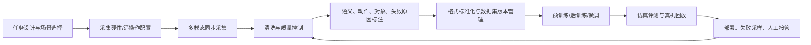

# 机器人（具身智能） - 训练数据生产与处理

> [!summary]
> 训练数据正在从“实验室零散示教”走向“数据工厂 + 遥操作平台 + 无本体人类数据 + 仿真/世界模型合成 + 标准化数据格式”的组合路线。对中国具身智能来说，这既是技术瓶颈，也是可能形成新基础设施公司的环节。

## 研究结论

- **事实**：具身模型需要的不只是视频，还要同步的状态、动作、力/触觉、任务语义、失败与恢复过程。智元 AGIBOT WORLD 2026 披露其数据包含 RGB(D)、触觉、LiDAR、IMU、全身关节状态，并经过清洗验证和层级标注；宇树 G1-D 已把采集、标注、审核、存储、导出、训练、仿真测试和部署打包成端到端平台。证据：[`SRC-robotics-044`](../../raw/robotics-embodied-ai/documents/SRC-robotics-044-agibot-open-agibot-world-2026.md) [`SRC-robotics-014`](../../raw/robotics-embodied-ai/documents/SRC-robotics-014-unitree-g1-d-end-to-end-platform-for-humanoid-robot.md)
- **事实**：开源研究正在形成三类基线：Open X-Embodiment/DROID/RoboMIND/AgiBot World 代表真实机器人轨迹，MimicGen/RoboTwin/GR00T-Dreams 代表数据合成与扩增，LeRobot 代表数据格式和训练工具链。证据：[`SRC-robotics-054`](../../raw/robotics-embodied-ai/documents/SRC-robotics-054-open-x-embodiment-robotic-learning-datasets-and-rt-x-models.md) [`SRC-robotics-055`](../../raw/robotics-embodied-ai/documents/SRC-robotics-055-droid-a-large-scale-in-the-wild-robot-manipulation-dataset.md) [`SRC-robotics-057`](../../raw/robotics-embodied-ai/documents/SRC-robotics-057-robomind-benchmark-on-multi-embodiment-intelligence-normative-data-for-robot-man.md) [`SRC-robotics-058`](../../raw/robotics-embodied-ai/documents/SRC-robotics-058-agibot-world-colosseo-a-large-scale-manipulation-platform-for-scalable-and-intel.md) [`SRC-robotics-060`](../../raw/robotics-embodied-ai/documents/SRC-robotics-060-mimicgen-a-data-generation-system-for-scalable-robot-learning-using-human-demons.md) [`SRC-robotics-059`](../../raw/robotics-embodied-ai/documents/SRC-robotics-059-robotwin-dual-arm-robot-benchmark-with-generative-digital-twins.md) [`SRC-robotics-051`](../../raw/robotics-embodied-ai/documents/SRC-robotics-051-enhance-robot-learning-with-synthetic-trajectory-data-generated-by-world-foundat.md) [`SRC-robotics-052`](../../raw/robotics-embodied-ai/documents/SRC-robotics-052-lerobot-github-repository.md)
- **判断**：未来 2-3 年内，数据资产的壁垒不在“采了多少小时视频”，而在任务覆盖、动作质量、失败/恢复轨迹、多本体可迁移性、数据标准化、质量控制、训练可复现和真实场景评测。
- **判断**：中国的优势是机器人本体制造、工程师密度、场景试点和潜在低成本采集；短板是高质量开放数据、统一评测、触觉/力觉数据、跨本体标准和数据合规。
- **假设**：如果具身模型出现可持续 scaling law，数据生产/处理会从整机厂内部能力外溢为独立供应链，类似自动驾驶早期的数据采集、标注、仿真和闭环平台。

## 数据生产路线

| 路线       | 数据来源                                   | 适用任务            | 优点                | 主要风险                   | 代表公司/论文                                          |
| -------- | -------------------------------------- | --------------- | ----------------- | ---------------------- | ------------------------------------------------ |
| 同构真机遥操作  | 人控制目标机器人完成任务                           | 精准操作、工业/仓储/服务任务 | 动作空间一致，最接近训练目标    | 成本高、速度慢、操作员培训难、长尾覆盖不足  | 智元、宇树 G1-D、IO-AI TeleXperience、DROID、RoboMIND    |
| 异构/跨本体数据 | 多种机械臂、人形、移动操作平台                        | 通用策略预训练、跨机器人迁移  | 数据规模更大，利于泛化       | 形态、动作空间、传感器差异大         | Open X-Embodiment、Octo、AgiBot World、LeRobot      |
| 无本体/人类数据 | 第一视角视频、数据手套、动捕、穿戴设备                    | 灵巧手、家务、复杂人机交互   | 可低成本覆盖真实世界长尾      | 从人到机器人的动作重定向难          | FirstMove、Robotin、IO-AI SenseXperience、pi0       |
| 仿真/数字孪生  | Isaac/Omniverse、Unity、MuJoCo、生成式 3D 场景 | 数据扩增、评测、安全边界    | 成本低、可控、可生成失败/边界样本 | sim-to-real 差距，物理真实性不足 | NVIDIA Isaac、RoboTwin、MimicGen                   |
| 世界模型合成   | 真实示教 + 视频/世界模型生成未来轨迹                   | 新任务、新环境、稀有场景    | 用少量真实数据扩展大量轨迹     | 合成动作可能不可执行，需严格验证       | NVIDIA GR00T-Dreams、Cosmos、Unitree UnifoLM-WMA-0 |
| 线上部署闭环   | 已交付机器人运行日志、失败回放、人工接管                   | 商业场景持续优化        | 真实 ROI 场景，数据价值最高  | 安全、隐私、客户授权和责任边界        | AMR/工业移动操作/服务机器人公司，待验证                           |

## 数据处理流水线

关键处理能力：

- 多模态同步：视频、深度、力/触觉、关节状态、末端执行器、语音/语言任务、环境元数据必须时间对齐。
- 数据清洗：剔除传感器漂移、动作中断、标定错误、低质量视角；但不应简单删除失败轨迹，失败原因和恢复过程是训练鲁棒性的关键数据。
- 层级标注：任务级 instruction、步骤级 action、原子技能、对象属性、接触状态、失败原因、人工接管点。
- 格式标准化：LeRobotDataset 使用视觉 MP4/images、状态/动作 Parquet 和元数据；它的价值在于降低不同实验室和不同本体之间的数据摩擦。证据：[`SRC-robotics-052`](../../raw/robotics-embodied-ai/documents/SRC-robotics-052-lerobot-github-repository.md) [`SRC-robotics-053`](../../raw/robotics-embodied-ai/documents/SRC-robotics-053-lerobotdataset-v3-0-documentation.md)
- 数据版本管理：同一任务要记录机器人本体、传感器配置、标定版本、控制频率、动作空间、采集日期、操作者、场景和许可。
- 训练可复现：优质数据平台应提供训练脚本、benchmark、模型 checkpoint、失败样例和 ablation，而不只是下载链接。

## 公司与解决方案图谱

详表见 [training_data_companies.csv](../../raw/robotics-embodied-ai/data/training_data_companies.csv)。

| 公司/平台 | 位置 | 解决方案 | 关注点 |
|---|---|---|---|
| 智元机器人 | 整机厂 + 数据平台 | AgiBot World / AGIBOT WORLD 2026 / AIDEA 线索 | 是否能把百万级数据、GO-1 模型、真实客户场景形成闭环。 |
| 宇树科技 | 整机厂 + 数采训练平台 | G1-D End-to-End Platform / UnifoLM-WMA-0 | G1-D 是否从产品页走向真实客户数据平台，开源模型生态是否活跃。 |
| IO-AI | 数据基础设施 | TeleXperience / SenseXperience / EmbodiFlow | 遥操作、人体数据和标注后处理是否可形成标准化 SaaS/工具链收入。 |
| Robotin 感进机器人 | 数据服务 | 真实家庭/杂乱场景视觉与操作数据 | 需验证样例数据、客户、交付规模和数据质量指标。 |
| FirstMove 第一推力 | 无本体数据引擎 | 第一视角真实物理交互数据 | 需验证技术路线如何转化为可训练机器人 action 数据。 |
| 智源/ModelScope | 开源平台 | 具身数据集汇聚和标准化处理 | 适合作为中国开源数据入口，但需跟踪版本、许可和可训练格式。 |
| 星海图 Galaxea | 整机 + 模型 + 数据采集 | 客户算法开发、场景落地、数据采集 | 官网披露服务客户多，但数据产品和开放数据需继续核验。 |
| NVIDIA | 海外平台 | Isaac/GR00T/Cosmos/GR00T-Dreams | 工具链领先，但中国公司需评估算力、许可和供应链约束。 |
| Hugging Face LeRobot | 开源工具链 | LeRobotDataset、采集/训练/部署工具 | 可能成为事实开源标准；国内公司适配度值得跟踪。 |
| Physical Intelligence | 海外模型公司 | pi0 VLA 模型与跨本体数据 | 作为海外前沿对标，商业数据资产不透明。 |

## 论文与数据集

详表见 [training_data_papers.csv](../../raw/robotics-embodied-ai/data/training_data_papers.csv)。

| 主题 | 代表工作 | 对行业研究的含义 |
|---|---|---|
| 跨本体数据 | Open X-Embodiment、Octo、LeRobot | 训练数据标准化可能比单一机器人结构更重要。 |
| 真实世界采集 | DROID、RoboMIND、AgiBot World | 多场景、多操作者、多任务和失败数据决定泛化。 |
| 国内大规模开放数据 | AgiBot World、RoboMIND、RoboMIND 2.0、RoboBrain 2.0 | 中国开始从“硬件叙事”转向“数据和模型生态叙事”。 |
| 合成与扩增 | MimicGen、RoboTwin、GR00T-Dreams | 真实示教仍是锚点，但未来增量可能来自仿真和世界模型。 |
| VLA/机器人基础模型 | pi0、GR00T N1、GO-1 | 数据质量、跨本体覆盖和后训练 recipe 是模型能力的核心。 |

## 中国投资与产业含义

- **可形成新利润池的环节**：遥操作硬件和平台、数据采集工厂、数据标注/质检平台、仿真与数字孪生、机器人数据格式转换、训练/评测平台、失败回放和远程接管系统。
- **更可能先商业化的客户**：整机厂、具身模型公司、高校/实验室、工业移动操作公司、仓储/零售/服务机器人公司，而不是终端家庭用户。
- **上市公司映射**：短期 A 股/H 股直接纯正标的较少，可跟踪机器人本体和传感器/控制公司是否自建数据闭环；数据工具链可能更多在未上市公司或云厂商/AI 平台内。
- **政策连接**：数据平台和评测体系与十五五期间“人工智能+先进制造”“未来产业”“智能装备标准化”高度相关；若地方政府建设具身智能公共训练场、数据工厂或测评中心，可能成为产业催化。

## 职业切入点

| 角色 | 需要能力 | 作品集/项目建议 |
|---|---|---|
| 数据产品经理 | 机器人任务拆解、数据 schema、标注体系、客户场景 | 设计一个 LeRobot 兼容的具身数据 schema 和质检看板。 |
| 数据平台工程 | 视频/传感器流处理、Parquet/MP4、元数据、数据版本 | 做一个多相机+动作数据采集、回放、切分、导出的 demo。 |
| 仿真/合成数据工程 | Isaac/MuJoCo/Unity、domain randomization、评测 | 用少量示教生成仿真扩增数据，并比较真机微调效果。 |
| 机器人学习工程 | 模仿学习、VLA、扩散策略、后训练 | 复现 LeRobot/Octo 小任务，从采集到训练到部署闭环。 |
| 解决方案/交付 | 工业现场、遥操作、远程运维、安全责任 | 设计“数据采集工厂”SOP：任务库、人员培训、质检、交付报告。 |

## 下一步调研清单

本清单已推进一轮并行深度调研，汇总页见 [[09-training-data-deep-dive]]，中间材料见 [[research-notes/README|研究中间笔记]]。

- 已推进：深入 UMI Gripper 路线的硬件、数据格式、训练管线和 ToB 落地，见 [[08-umi-gripper-research-and-business-plan]] 与 [[research-notes/umi-hardware-localization-2026-05-27]]。
- 已推进：建立 `training_data_companies.csv` 的二级字段草案，见 [training_data_company_verification_deep_dive.csv](../../raw/robotics-embodied-ai/data/training_data_company_verification_deep_dive.csv)。
- 已推进：对智元、宇树、IO-AI、Robotin、FirstMove、星海图做公司/融资/客户/格式交叉验证，见 [[research-notes/training-data-company-verification-2026-05-27]]。
- 已推进：补充中国政策与地方平台，北京、上海、深圳/广东、杭州/浙江、安徽/合肥已形成训练场/公共平台对照表，见 [[research-notes/local-policy-data-platforms-2026-05-27]]。
- 已推进：完成 Open X-Embodiment、DROID、RoboMIND、AgiBot World、LeRobot 的 schema 横向表，见 [robotics_dataset_schema_comparison.csv](../../raw/robotics-embodied-ai/data/robotics_dataset_schema_comparison.csv)。
- 已推进：完成“失败轨迹”和“人工接管数据”稀缺资产调研，见 [[research-notes/failure-intervention-data-2026-05-27]]。
- 已推进：补齐 UMI-like v0 采集 SOP/QC、UMI/Zarr 与 LeRobot schema 对照和客户数据包模板，见 [[research-notes/umi-v0-sop-schema-data-package-2026-05-28]]。
- 已推进：补充 LeRobot 初学者教学，解释 LeRobotDataset、目录结构、UMI/Zarr 转换和 ToB 数据服务意义，见 [[research-notes/lerobot-beginner-guide-2026-05-28]]。
- 待继续：下载最小样例数据核验字段和 license；合并升级 `training_data_companies.csv`；补充 Robotin/FirstMove/GenRobot/灵初等工商、招聘和客户交付证据；按 [[00-source-capture-index]] SOP 抽取本轮新增来源 raw artifact。
