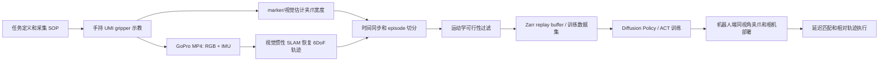

# 机器人（具身智能） - UMI Gripper 技术研究、学习计划与数据采集业务落地

> [!summary]
> [[10-umi-technical-terms-for-beginners#UMI|UMI]] [[10-umi-technical-terms-for-beginners#Gripper 夹爪|Gripper]] 的价值不只是一个低成本夹爪，而是一套“物理接口 + 数据处理 + 策略接口”的标准化方案：用人手拿着类机器人夹爪在真实环境示教，再把视频、[[10-umi-technical-terms-for-beginners#IMU|IMU]]、[[10-umi-technical-terms-for-beginners#End-Effector 末端执行器|末端位姿]]、[[10-umi-technical-terms-for-beginners#Gripper Width 夹爪宽度|夹爪宽度]]等信息转换成可训练的机器人[[10-umi-technical-terms-for-beginners#Trajectory 轨迹|轨迹]]。对国内创业或业务进入点而言，机会不在复刻开源夹爪本身，而在做成可交付的设备、数据质量体系、操作 [[10-umi-technical-terms-for-beginners#SOP|SOP]]、格式转换、[[10-umi-technical-terms-for-beginners#Baseline|基线训练]]和垂直场景数据服务。

> [!tip] 术语辅助阅读
> 初学者遇到报告里的技术词，可以先看 [[10-umi-technical-terms-for-beginners|UMI Gripper 初学者技术术语教学]]。常见入口：[[10-umi-technical-terms-for-beginners#IMU|IMU]]、[[10-umi-technical-terms-for-beginners#6DoF|6DoF]]、[[10-umi-technical-terms-for-beginners#SLAM|SLAM]]、[[10-umi-technical-terms-for-beginners#Zarr|Zarr]]、[[10-umi-technical-terms-for-beginners#LeRobot|LeRobot]]、[[10-umi-technical-terms-for-beginners#Diffusion Policy|Diffusion Policy]]、[[10-umi-technical-terms-for-beginners#ACT|ACT]]、[[10-umi-technical-terms-for-beginners#Episode|episode]]、[[10-umi-technical-terms-for-beginners#Time Synchronization 时间同步|时间同步]]。

> [!info] 关联研究资产
> 本文的后续调研已拆成可复用材料：[[research-notes/umi-hardware-localization-2026-05-27|UMI 硬件 BOM、国产化与数据包交付研究]]、[[research-notes/umi-v0-sop-schema-data-package-2026-05-28|UMI-like v0 采集 SOP、Schema 对照与客户数据包模板]]、[[research-notes/lerobot-beginner-guide-2026-05-28|LeRobot 初学者教学]]、[[research-notes/dataset-schema-comparison-2026-05-27|具身智能数据集 Schema 横向比较]]、[[research-notes/training-data-company-verification-2026-05-27|具身智能训练数据公司/方案交叉验证深度调研]]。

## 一句话理解

- **UMI 试图解决的问题**：机器人遥操作数据质量高但贵、慢、依赖真实机器人；纯人类视频便宜但缺动作和机器人可执行性。UMI 站在中间：让人拿着“机器人化的[[10-umi-technical-terms-for-beginners#Gripper 夹爪|手持夹爪]]”做任务，尽量同时保留人类示教的自然性和机器人动作空间的可迁移性。证据：[`SRC-robotics-066`](../../raw/robotics-embodied-ai/documents/SRC-robotics-066-universal-manipulation-interface-in-the-wild-robot-teaching-without-in-the-wild.md)
- **核心设计**：手持 [[10-umi-technical-terms-for-beginners#Parallel Gripper 平行夹爪|3D 打印平行夹爪]] + [[10-umi-technical-terms-for-beginners#GoPro|GoPro]] [[10-umi-technical-terms-for-beginners#Fisheye 鱼眼相机|鱼眼相机]] + 侧镜 + GoPro [[10-umi-technical-terms-for-beginners#IMU|IMU]] + [[10-umi-technical-terms-for-beginners#Marker 标记点|marker]] 夹爪宽度追踪 + [[10-umi-technical-terms-for-beginners#Visual-Inertial SLAM 视觉惯性 SLAM|视觉惯性 SLAM]] + [[10-umi-technical-terms-for-beginners#Relative Pose 相对位姿|相对末端轨迹]]动作表示 + 推理时[[10-umi-technical-terms-for-beginners#Latency 延迟|延迟]]匹配 + [[10-umi-technical-terms-for-beginners#Diffusion Policy|Diffusion Policy]]。证据：[`SRC-robotics-065`](../../raw/robotics-embodied-ai/documents/SRC-robotics-065-universal-manipulation-interface-project-page.md) [`SRC-robotics-066`](../../raw/robotics-embodied-ai/documents/SRC-robotics-066-universal-manipulation-interface-in-the-wild-robot-teaching-without-in-the-wild.md)
- **商业化直觉**：卖“夹爪套件”只是入口；真正 [[10-umi-technical-terms-for-beginners#ToB|ToB]] 价值是帮助客户稳定获得可训练、可复现、可评估、能导出到 UMI/[[10-umi-technical-terms-for-beginners#Zarr|Zarr]]/[[10-umi-technical-terms-for-beginners#LeRobot|LeRobot]]/[[10-umi-technical-terms-for-beginners#ACT|ACT]]/[[10-umi-technical-terms-for-beginners#Diffusion Policy|DP]] 的[[10-umi-technical-terms-for-beginners#Data Package 数据包|数据包]]。

## UMI 技术拆解

### 硬件接口

| 模块 | UMI 原始做法 | 为什么重要 | 国产化/产品化启发 |
|---|---|---|---|
| 手持夹爪 | 触发式 3D 打印平行夹爪、软指、80mm stroke、约 780g | 把人类动作约束到机器人可执行的平行夹爪空间 | v0 可 3D 打印；v1 要做轻量化、耐用性、快拆、人体工学和可维护性。 |
| GoPro + 鱼眼 | 155 度广角，直接使用 raw [[10-umi-technical-terms-for-beginners#Fisheye 鱼眼相机\|fisheye]] 图像 | [[10-umi-technical-terms-for-beginners#Wrist View 腕部视角\|腕部视角]]有限，广角能补场景上下文 | 可评估 GoPro、Insta360、工业鱼眼相机、国产运动相机，但要保证 IMU、时间戳和画质。 |
| 侧镜 | 在同一张图里形成隐式[[10-umi-technical-terms-for-beginners#Multi-View 多视角\|多视角]]/类立体信息 | 补深度线索，减少单目视觉局限 | FastUMI 去掉侧镜以留出传感器空间；是否保留要按任务实测。 |
| GoPro IMU | MP4 内带 IMU，用于视觉惯性 SLAM | 快速动作、模糊、弱纹理下提升轨迹恢复 | 产品化时必须把时间同步、传感器日志和可诊断性做成工具。 |
| 夹爪宽度 marker | 用 fiducial markers 连续追踪 gripper width | 比二值开合更适合投掷、插入、轻抓等任务 | 后续可升级为编码器、霍尔传感器、力/触觉融合。 |
| 机器人端同构视角 | 机器人夹爪也安装相同视角相机和指尖 | 减少人类示教和机器人部署的 [[10-umi-technical-terms-for-beginners#Observation Gap 观测差异\|observation gap]] | ToB 交付必须为不同 gripper 做适配件和视觉对齐夹具。 |

### 数据与策略接口

| 设计 | 解释 | 业务含义 |
|---|---|---|
| 视觉惯性 SLAM | UMI 用 [[10-umi-technical-terms-for-beginners#ORB-SLAM3\|ORB-SLAM3]] 分支从 GoPro 视频和 IMU 恢复带尺度的 [[10-umi-technical-terms-for-beginners#6DoF\|6DoF]] 轨迹。官方 README 也提醒 SLAM 是较脆弱环节。证据：[`SRC-robotics-067`](../../raw/robotics-embodied-ai/documents/SRC-robotics-067-universal-manipulation-interface-github-repository.md) | 国内产品要把“SLAM 成功率、失败原因、轨迹质量报告”做成核心卖点。 |
| 相对末端轨迹 | 动作用一段相对当前 [[10-umi-technical-terms-for-beginners#End-Effector 末端执行器\|EE]] [[10-umi-technical-terms-for-beginners#Pose 位姿\|pose]] 的 [[10-umi-technical-terms-for-beginners#SE(3)\|SE(3)]] 轨迹表示，避免依赖全局[[10-umi-technical-terms-for-beginners#Coordinate Frame 坐标系\|坐标系]]。证据：[`SRC-robotics-066`](../../raw/robotics-embodied-ai/documents/SRC-robotics-066-universal-manipulation-interface-in-the-wild-robot-teaching-without-in-the-wild.md) | 数据跨机器人可迁移的关键。客户如果只要某一台机器人，GELLO/ALOHA 式直接遥操作可能更简单。 |
| 推理时延迟匹配 | UMI 在推理时对相机、机器人、夹爪的 [[10-umi-technical-terms-for-beginners#Observation 观测\|observation]]/[[10-umi-technical-terms-for-beginners#Action 动作\|action]] latency 做对齐和提前发指令。证据：[`SRC-robotics-066`](../../raw/robotics-embodied-ai/documents/SRC-robotics-066-universal-manipulation-interface-in-the-wild-robot-teaching-without-in-the-wild.md) | 服务交付必须包含延迟测量，不然动态任务会出现抖动、错位和失败。 |
| Zarr 数据格式 | UMI 社区把 GoPro、SLAM 输出和 Zarr 作为数据层级；Zarr 里包含 camera [[10-umi-technical-terms-for-beginners#RGB\|RGB]]、demo start/end pose、eef pos/rot、gripper width 和 episode_ends。证据：[`SRC-robotics-068`](../../raw/robotics-embodied-ai/documents/SRC-robotics-068-umi-robot-dataset-community.md) | 商业数据包应支持 Zarr 和 LeRobot 双导出，附 [[10-umi-technical-terms-for-beginners#Dataset Schema 数据集结构\|schema]]、版本、[[10-umi-technical-terms-for-beginners#Sampling Rate 采样率\|采样率]]、[[10-umi-technical-terms-for-beginners#Compression 压缩\|压缩方式]]和[[10-umi-technical-terms-for-beginners#Quality Control 质检\|质检报告]]。 |
| 模仿学习算法 | UMI 原文主要使用 Diffusion Policy，同时指出 ACT 可作为替代。证据：[`SRC-robotics-066`](../../raw/robotics-embodied-ai/documents/SRC-robotics-066-universal-manipulation-interface-in-the-wild-robot-teaching-without-in-the-wild.md) | 服务不应绑定单一算法，应交付 [[10-umi-technical-terms-for-beginners#Baseline Training Recipe 基线训练配方\|baseline training recipe]] 和可复现配置。 |

## 相关实现路线对比

详表见 [umi_related_implementations.csv](../../raw/robotics-embodied-ai/data/umi_related_implementations.csv)。该表已补入 BOM/采购链接/许可证/关键传感器可得性/国内替代件字段；更细的硬件证据见 [umi_hardware_bom_and_localization.csv](../../raw/robotics-embodied-ai/data/umi_hardware_bom_and_localization.csv) 与 [[research-notes/umi-hardware-localization-2026-05-27]]。

| 路线 | 代表系统 | 解决了什么 | 新问题 |
|---|---|---|---|
| 原始 UMI | UMI | 低成本、便携、跨机器人、真实环境示教 | SLAM 对弱纹理/遮挡/动态场景敏感，复现门槛不低。 |
| 工程简化 | FastUMI | 用 [[10-umi-technical-terms-for-beginners#T265\|T265]] 直接获得 6DoF pose，降低 SLAM 部署复杂度，适配多种 gripper | [[10-umi-technical-terms-for-beginners#T265\|T265]] 供应和长期可得性风险，商业产品不能押单一停产传感器。 |
| 3D 感知增强 | UMI-3D | 用低成本 [[10-umi-technical-terms-for-beginners#LiDAR\|LiDAR]] 和 [[10-umi-technical-terms-for-beginners#3D SLAM\|3D SLAM]] 应对白墙、遮挡、动态物体、门/窗帘等任务 | 硬件、[[10-umi-technical-terms-for-beginners#Calibration 标定\|标定]]和数据处理复杂度上升。 |
| 力/触觉增强 | UMI-FT、TacUMI | 解决擦拭、插入、线缆、接触丰富任务中的力调制和事件切分 | [[10-umi-technical-terms-for-beginners#Force/Torque Sensor 力/力矩传感器\|力/力矩传感器]]、[[10-umi-technical-terms-for-beginners#Tactile Sensor 触觉传感器\|触觉传感器]]成本、耐用性、漂移、标定和维修会成为 ToB 难点。 |
| 多视角增强 | MV-UMI | 腕部第一视角看不全时增加第三方视角，提升大场景理解 | 重新引入环境布置和相机标定成本。 |
| 机器人端执行夹爪 | Actuated UMI | 把 UMI 几何转成可控机器人夹爪，用于部署和复现 | 不是完整数据流水线，需要和机器人、安全控制、训练系统结合。 |
| 直接遥操作 | GELLO、ALOHA、Mobile ALOHA | 数据天然机器人可执行，质量高 | 依赖真实机器人，环境迁移和规模化成本高。 |
| 家庭低成本工具 | Dobb-E | 用 reacher-grabber + iPhone 低成本采家庭数据 | 动作空间和机器人 [[10-umi-technical-terms-for-beginners#Embodiment Gap 本体差异\|embodiment gap]] 更大。 |

## 学习计划

详表见 [umi_learning_roadmap.csv](../../raw/robotics-embodied-ai/data/umi_learning_roadmap.csv)。

### 第 0 阶段：读懂 UMI 的总图，0-1 周

- 读 UMI 官网、论文摘要、方法部分和官方 README。
- 输出一张你自己的数据流图：人拿夹爪示教 -> [[10-umi-technical-terms-for-beginners#MP4|MP4]]/IMU/width -> SLAM -> Zarr -> DP/ACT -> robot [[10-umi-technical-terms-for-beginners#Rollout|rollout]]。
- 目标判断：你能向一个机器人创业公司 PM 解释 UMI 为什么比纯视频更有动作信息、为什么比遥操作更容易规模化。

### 第 1 阶段：补基础，1-2 周

- 坐标和运动：SE(3)、TCP、轴角、四元数、相对位姿、轨迹插值。
- 视觉和传感：鱼眼相机、IMU、视觉惯性 SLAM、marker、时间戳。
- 数据工程：[[10-umi-technical-terms-for-beginners#Episode|episode]]、采样率、同步、Zarr、[[10-umi-technical-terms-for-beginners#Replay Buffer|ReplayBuffer]]、视频压缩。
- 验收：能解释 UMI 的三件关键事：相对轨迹、延迟匹配、运动学过滤。

### 第 2 阶段：复盘官方软件流水线，2-3 周

- 按官方 README 纸面或实际跑通：example session -> `run_slam_pipeline.py` -> `07_generate_replay_buffer.py` -> `dataset.zarr.zip`。
- 打开 Zarr 看字段：`camera0_rgb`、`robot0_eef_pos`、`robot0_eef_rot_axis_angle`、`robot0_gripper_width`、`episode_ends`；其中 `rot_axis_angle` 可先理解为[[10-umi-technical-terms-for-beginners#Axis-Angle 轴角|轴角]]旋转表示。
- 记录三个质量指标：SLAM 成功率、丢弃 episode 数、轨迹是否平滑。

### 第 3 阶段：理解训练，3-5 周

- 读 Diffusion Policy 和 ACT 的核心思想，只抓和数据接口相关的部分。
- 用小数据包跑一个训练配置，先求“过拟合一个小任务”，不急着追求泛化。
- 输出：训练配置卡，包括 observation horizon、action horizon、图像 encoder、采样率、batch size、训练 GPU、数据量。

### 第 4 阶段：做 v0 手持原型，5-8 周

- 目标不是一次做完商业产品，而是建立“采集是否可控”的真实手感。
- 最小硬件：3D 打印夹爪、运动相机、marker、可识别的夹爪宽度、稳定安装结构。
- 最小任务：杯子摆放、物体分拣、抽屉拉开、简单擦拭四选一。
- 验收：50-100 条演示，至少 70% 可进入有效数据集；采集员能按 SOP 重复采。

### 第 5 阶段：端到端数据包，8-12 周

- 做数据质检表：视频清晰度、轨迹连续性、width 识别率、episode 边界、异常标签、可达性过滤。
- 导出至少一种训练格式：UMI/Zarr，后续补 LeRobot。
- 交付一个“客户能看懂”的数据包：任务说明、采集环境、传感器参数、字段 schema、质量报告、baseline 训练命令。

### 第 6 阶段：真实机器人闭环，12-16 周

- 选择一台可控风险机械臂：UR、Franka、xArm、越疆、节卡、遨博等。
- 做 robot-mounted gripper/camera 适配和延迟测量。
- 先做单臂低风险任务，再扩展双臂、动态、接触丰富任务。
- 验收：成功率、失败类型、延迟、碰撞/急停记录都要结构化。

### 第 7 阶段：选择商业化增强路线，16-24 周

- 工业弱纹理和大场景：优先 UMI-3D/LiDAR 或 MV-UMI。
- 接触丰富任务：优先 UMI-FT/TacUMI 的力/触觉路线。
- 客户已有机器人：优先 GELLO/ALOHA 式直接遥操作服务。
- 客户没有机器人或要规模化外场采集：优先 UMI/FastUMI 式手持设备。

## 国内 ToB 落地计划

### 定位

建议定位为“具身智能数据采集设备与数据服务商”，而不是“机器人夹爪厂商”。交付物应是：

- 数据采集设备：手持夹爪、相机/追踪模块、机器人端视角适配件、可选力触觉/LiDAR 模块。
- 数据生产服务：任务拆解、场景搭建、采集员培训、演示采集、质检、清洗、格式转换。
- 数据工程平台：episode 管理、轨迹回放、异常标注、Zarr/LeRobot/ACT/DP 导出、质量报告。
- 基线验证：用客户目标任务训练一个 baseline policy，证明数据不是“能看”，而是“能训”。

### 0-30 天：验证方向

- 访谈 15-20 个潜在客户：具身模型公司、机器人整机厂、高校实验室、工业移动操作公司、灵巧手/力触觉公司。
- 问三个核心问题：他们缺什么任务数据、现有遥操作成本多少、愿意为“有效 trajectory + 质量报告 + baseline”付费吗。
- 复现 UMI 纸面 BoM、许可证、数据格式和官方例子。
- 输出：客户需求矩阵、v0 BoM、风险清单、第一批试点任务候选。

### 31-60 天：做 v0 样机和数据 SOP

- 硬件：被动 UMI-like 夹爪一版，尽量使用国内可采购零件；如果走 FastUMI 路线，同时准备 [[10-umi-technical-terms-for-beginners#T265|T265]] 替代方案。
- 软件：采集脚本、时间同步、episode 切分、Zarr 导出、回放工具、质量报告模板。
- SOP：采集前检查、环境布置、任务随机化、失败重采、隐私/客户物料处理。
- 验收：内部完成 200 条演示，形成第一版有效数据率和采集成本估算。

### 61-90 天：做第一个付费或准付费试点

- 选择一个窄任务：仓储商品抓取、工装件摆放、实验室器皿整理、零售补货、线缆插接的简化版。
- 向客户交付：原始数据、清洗数据、字段说明、质量报告、baseline 训练结果和失败样例。
- 用指标谈价值：每小时有效演示数、有效轨迹率、每 100 条数据训练后的成功率、比客户自采省多少时间。

### 3-6 个月：产品化 v1

- 硬件 [[10-umi-technical-terms-for-beginners#DFM|DFM]]：轻量化、耐用、快拆、模块化传感器、标准安装接口。
- 工具平台：多项目管理、采集员账号、质检看板、轨迹回放、自动异常检测。
- 规格化服务包：单任务数据包、场景覆盖数据包、失败/恢复数据包、力触觉增强数据包。
- 建立供应链：3D 打印转小批量加工，镜片/相机/传感器多供应商，夹爪耗材可替换。

### 6-12 个月：垂直场景数据工厂

- 优先选择“真实客户愿意付费、任务可标准化、数据可复用”的场景。
- 建议优先级：仓储/零售物品操作、工业轻装配、实验室自动化、餐饮/清洁中的接触任务。
- 不建议一开始做家庭全能：任务边界模糊、隐私复杂、长尾太重、短期 ToB 付费不稳。
- 建立数据资产壁垒：任务库、物体库、场景库、失败标签、operator 培训体系、质量 benchmark。

### 12-24 个月：从项目交付变成平台

- 硬件平台：被动 UMI、FastUMI、3D/LiDAR、力触觉、多视角、机器人端执行夹爪模块化。
- 数据平台：支持客户私有部署、数据脱敏、版本管理、权限和审计。
- 模型平台：不必一开始做基础模型，但要提供 baseline、微调、评测和失败分析。
- 生态策略：兼容 LeRobot、UMI/Zarr、Open X-Embodiment schema，降低客户迁移阻力。

## 商业假设和风险

| 主题 | 判断 | 待验证证据 |
|---|---|---|
| 收入模式 | 前期更适合“设备租售 + 数据服务 + 试点项目”，后期再做平台订阅 | 客户是否愿意按有效 episode、任务包或项目制付费。 |
| 毛利来源 | 硬件毛利有限，数据 SOP、质检、格式转换、baseline 验证更有服务毛利 | 交付人天和返工率。 |
| 技术护城河 | 不在开源夹爪，而在稳定采集、低失败率、多场景数据质量和客户任务理解 | 每个任务从需求到可训练数据包的周期。 |
| 供应链风险 | GoPro、[[10-umi-technical-terms-for-beginners#T265\|T265]]、力触觉传感器、LiDAR 都可能有供应或成本问题 | 国产替代清单和长期供货协议。 |
| 数据合规 | 工厂、家庭、实验室场景可能涉及商业秘密、个人信息和设备安全 | 数据授权、脱敏、边缘处理、私有部署方案。 |
| 竞争风险 | 整机厂可能自建数据团队；开源 UMI/FastUMI 降低入门门槛 | 用质量、速度、场景经验和工具平台建立差异。 |

## 推荐第一条落地路径

**先做“UMI-like 被动夹爪 + Zarr/LeRobot 数据包 + 单臂桌面操作试点”，再扩展到 FastUMI/UMI-3D/力触觉。**

原因：

- 原始 UMI 能最快建立完整认知闭环。
- 被动设备成本低，适合快速试错客户需求。
- Zarr/LeRobot 导出和质量报告比硬件外观更能体现 ToB 能力。
- 先证明“数据能训练 baseline”，再谈多模态、规模化和垂直数据工厂。

## 下一步任务清单

> [!warning]
> 本清单于 2026-05-28 复核。已经补齐的内容只代表“研究资产/模板已完成”，不代表已经实采 100 条数据、跑出 baseline 成功率或获得客户验证；这些指标必须后续实测，不能预填。

| 任务 | 状态 | 产出/链接 | 仍待验证 |
|---|---|---|---|
| 把 `umi_related_implementations.csv` 增加字段：[[10-umi-technical-terms-for-beginners#BoM\|BOM]]、可采购链接、许可证、是否仍可买到关键传感器、国内替代件 | 已补到原表 | [umi_related_implementations.csv](../../raw/robotics-embodied-ai/data/umi_related_implementations.csv)、[umi_hardware_bom_and_localization.csv](../../raw/robotics-embodied-ai/data/umi_hardware_bom_and_localization.csv)、[[research-notes/umi-hardware-localization-2026-05-27]] | Dobb-E、Data Scaling Laws with UMI 未做硬件 BOM 核验；部分 Google Doc/采购页仍需人工复核。 |
| 选一个 v0 任务，建立 100 条演示采集 SOP 和质检表 | 已补模板，未实采 | [[research-notes/umi-v0-sop-schema-data-package-2026-05-28#v0 任务选择]]、[umi_v0_cup_transfer_sop_qc_template.csv](../../raw/robotics-embodied-ai/data/umi_v0_cup_transfer_sop_qc_template.csv) | 100 条 attempt、有效 episode、pose 失败率、baseline 结果均待实测。 |
| 做 UMI/Zarr 与 LeRobot schema 对照表 | 已补 | [[research-notes/umi-v0-sop-schema-data-package-2026-05-28#UMI/Zarr 与 LeRobot Schema 对照]]、[umi_zarr_lerobot_schema_crosswalk.csv](../../raw/robotics-embodied-ai/data/umi_zarr_lerobot_schema_crosswalk.csv) | 需要实际跑转换脚本，确认字段损失、fps/时间戳和视频编码兼容性。 |
| 对 IO-AI、Robotin、FirstMove、国内机器人整机厂的数据服务能力做二次交叉验证 | 已完成一轮 | [[research-notes/training-data-company-verification-2026-05-27]]、[training_data_company_verification_deep_dive.csv](../../raw/robotics-embodied-ai/data/training_data_company_verification_deep_dive.csv)、[[09-training-data-deep-dive#公司与方案]] | Robotin、FirstMove、GenRobot、灵初、禹纲仍需工商、招聘 JD、样例数据、客户案例补证。 |
| 做一页“给潜在客户看的数据包样例目录”：原始、处理后、标注、质量报告、baseline 结果、失败样例 | 已补模板 | [[research-notes/umi-v0-sop-schema-data-package-2026-05-28#客户版数据包样例目录]] | `evaluation_report.md`、`checkpoints/`、成功率等只能在实际训练后填写。 |

下一轮最小动作：实采一次杯子转移 v0 pilot，把 [umi_v0_cup_transfer_sop_qc_template.csv](../../raw/robotics-embodied-ai/data/umi_v0_cup_transfer_sop_qc_template.csv) 从模板变成真实 `episode_quality.csv`；随后跑 UMI/Zarr -> LeRobot 转换，记录字段损失和训练可读性。
