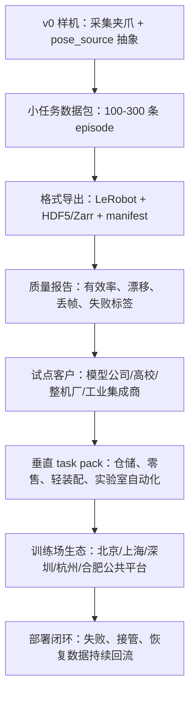

# 机器人（具身智能） - 训练数据深度调研

> [!summary]
> 本页承接 [[07-training-data]] 的“下一步调研清单”，汇总并行 subagent 的深度调研结果。中间材料保存在 [[research-notes/README|研究中间笔记]]，结构化表保存在 `raw/robotics-embodied-ai/data/`。

## 调研拆分

| 模块 | 产出 | 状态 |
|---|---|---|
| 公司/方案交叉验证 | [training_data_company_verification_deep_dive.csv](../../raw/robotics-embodied-ai/data/training_data_company_verification_deep_dive.csv) / [[research-notes/training-data-company-verification-2026-05-27]] | 已完成 |
| 地方政策/公共平台 | [embodied_ai_local_policy_platforms.csv](../../raw/robotics-embodied-ai/data/embodied_ai_local_policy_platforms.csv) / [[research-notes/local-policy-data-platforms-2026-05-27]] | 已完成 |
| 数据 schema 横向 | [robotics_dataset_schema_comparison.csv](../../raw/robotics-embodied-ai/data/robotics_dataset_schema_comparison.csv) / [[research-notes/dataset-schema-comparison-2026-05-27]] | 已完成 |
| 失败轨迹/人工接管 | [failure_intervention_data_sources.csv](../../raw/robotics-embodied-ai/data/failure_intervention_data_sources.csv) / [[research-notes/failure-intervention-data-2026-05-27]] | 已完成 |
| UMI 硬件国产化 | [umi_hardware_bom_and_localization.csv](../../raw/robotics-embodied-ai/data/umi_hardware_bom_and_localization.csv) / [[research-notes/umi-hardware-localization-2026-05-27]] | 已完成 |
| UMI v0 SOP/schema/客户数据包模板 | [umi_v0_cup_transfer_sop_qc_template.csv](../../raw/robotics-embodied-ai/data/umi_v0_cup_transfer_sop_qc_template.csv)、[umi_zarr_lerobot_schema_crosswalk.csv](../../raw/robotics-embodied-ai/data/umi_zarr_lerobot_schema_crosswalk.csv) / [[research-notes/umi-v0-sop-schema-data-package-2026-05-28]] | 模板已完成，实采待验证 |
| LeRobot 初学者教学 | [[research-notes/lerobot-beginner-guide-2026-05-28]] | 已完成 |
| Ego 视频到灵巧手训练数据 | [[research-notes/ego-video-to-dexterous-hand-training-data-system-design-2026-07-14]] | 已完成方案设计，PoC 待实施 |

## 结论摘要

- **事实**：国内具身数据基础设施已经分成四类玩家：整机厂自建数据闭环、独立 ToB 数据基础设施、第一视角/人体采集路线、数据 schema/治理工具链。智元、宇树、IO-AI、星海图证据链最完整；Robotin、FirstMove、灵初、GenRobot 等适合作为下一轮访谈和尽调对象。证据：[`SRC-robotics-014`](../../raw/robotics-embodied-ai/documents/SRC-robotics-014-unitree-g1-d-end-to-end-platform-for-humanoid-robot.md) [`SRC-robotics-044`](../../raw/robotics-embodied-ai/documents/SRC-robotics-044-agibot-open-agibot-world-2026.md) [`SRC-robotics-090`](../../raw/robotics-embodied-ai/documents/SRC-robotics-090-io-ai-embodiflow-product-page.md) [`SRC-robotics-091`](../../raw/robotics-embodied-ai/documents/SRC-robotics-091-io-ai.md) [`SRC-robotics-092`](../../raw/robotics-embodied-ai/documents/SRC-robotics-092-galaxea-open-world-dataset.md)。
- **事实**：北京、上海、深圳/广东、杭州/浙江、安徽/合肥已经把政策从“支持机器人产业”推进到“数据采集、训练场、测评、公共平台、语料/数据券、标准化试点”。证据：[`SRC-robotics-081`](../../raw/robotics-embodied-ai/documents/SRC-robotics-081-source.md) [`SRC-robotics-082`](../../raw/robotics-embodied-ai/documents/SRC-robotics-082-source.md) [`SRC-robotics-083`](../../raw/robotics-embodied-ai/documents/SRC-robotics-083-source.md) [`SRC-robotics-084`](../../raw/robotics-embodied-ai/documents/SRC-robotics-084-source.md) [[00-source-capture-index|SRC-robotics-085]] [`SRC-robotics-086`](../../raw/robotics-embodied-ai/documents/SRC-robotics-086-source.md) [`SRC-robotics-087`](../../raw/robotics-embodied-ai/documents/SRC-robotics-087-source.md) [`SRC-robotics-088`](../../raw/robotics-embodied-ai/documents/SRC-robotics-088-source.md) [`SRC-robotics-089`](../../raw/robotics-embodied-ai/documents/SRC-robotics-089-source.md)。
- **事实**：数据格式正在收敛到 episode/frame trajectory、observation multimodal dict、robot-specific action、task/language label、metadata manifest 这套骨架。研究生态偏 RLDS/OXE，工程交付更适合默认 LeRobot v3/Parquet+MP4+metadata，并提供 RLDS/HDF5/Zarr/MCAP 转换。证据：[`SRC-robotics-052`](../../raw/robotics-embodied-ai/documents/SRC-robotics-052-lerobot-github-repository.md) [`SRC-robotics-053`](../../raw/robotics-embodied-ai/documents/SRC-robotics-053-lerobotdataset-v3-0-documentation.md) [`SRC-robotics-054`](../../raw/robotics-embodied-ai/documents/SRC-robotics-054-open-x-embodiment-robotic-learning-datasets-and-rt-x-models.md) [`SRC-robotics-055`](../../raw/robotics-embodied-ai/documents/SRC-robotics-055-droid-a-large-scale-in-the-wild-robot-manipulation-dataset.md) [`SRC-robotics-057`](../../raw/robotics-embodied-ai/documents/SRC-robotics-057-robomind-benchmark-on-multi-embodiment-intelligence-normative-data-for-robot-man.md) [`SRC-robotics-058`](../../raw/robotics-embodied-ai/documents/SRC-robotics-058-agibot-world-colosseo-a-large-scale-manipulation-platform-for-scalable-and-intel.md)。
- **判断**：失败轨迹和人工接管数据正在从“采集噪声”变成独立资产。价值不在失败视频本身，而在失败前窗口、失败原因、接管点、恢复动作、最终 outcome、可训练格式和可审计元数据。证据：[`SRC-robotics-057`](../../raw/robotics-embodied-ai/documents/SRC-robotics-057-robomind-benchmark-on-multi-embodiment-intelligence-normative-data-for-robot-man.md) [`SRC-robotics-095`](../../raw/robotics-embodied-ai/documents/SRC-robotics-095-oopsie-data-manipulation-failure-dataset-project.md) [`SRC-robotics-096`](../../raw/robotics-embodied-ai/documents/SRC-robotics-096-oopsie-data-format-documentation.md) [`SRC-robotics-097`](../../raw/robotics-embodied-ai/documents/SRC-robotics-097-lerobot-human-in-the-loop-data-collection-documentation.md) [`SRC-robotics-098`](../../raw/robotics-embodied-ai/documents/SRC-robotics-098-hil-serl-precise-and-dexterous-robotic-manipulation-via-human-in-the-loop-reinfo.md) [`SRC-robotics-099`](../../raw/robotics-embodied-ai/documents/SRC-robotics-099-recovery-and-correction-improving-robotic-manipulation-with-real-world-failed-da.md)。
- **判断**：国内 UMI-like 设备产品化不应复刻单篇论文硬件，而应做“可替换追踪源 + 可训练数据包 + 质检报告”。UMI-3D/FastUMI 思路最适合 v1，UMI-FT/TacUMI/MV-UMI 更适合二期高价值模块。证据：[`SRC-robotics-065`](../../raw/robotics-embodied-ai/documents/SRC-robotics-065-universal-manipulation-interface-project-page.md) [`SRC-robotics-067`](../../raw/robotics-embodied-ai/documents/SRC-robotics-067-universal-manipulation-interface-github-repository.md) [`SRC-robotics-069`](../../raw/robotics-embodied-ai/documents/SRC-robotics-069-fast-umi-a-scalable-and-hardware-independent-universal-manipulation-interface.md) [`SRC-robotics-070`](../../raw/robotics-embodied-ai/documents/SRC-robotics-070-umi-3d-extending-universal-manipulation-interface-from-vision-limited-to-3d-spat.md) [`SRC-robotics-101`](../../raw/robotics-embodied-ai/documents/SRC-robotics-101-umi-3d-hardware-repository.md) [`SRC-robotics-102`](../../raw/robotics-embodied-ai/documents/SRC-robotics-102-coinft-force-torque-fingertip-sensor-project.md)。

### 公司与方案

| 梯队 | 公司/方案 | 证据状态 | 对业务落地的含义 |
|---|---|---|---|
| 第一梯队 | 智元、宇树、IO-AI、星海图 | 官网/产品页/开放数据集/公告/合作文章可交叉验证 | 可直接进入主表二级字段，作为竞品和合作标杆 |
| 第二梯队 | Robotin、FirstMove、灵初 Psi Data、GenRobot、禹纲数据 | 方向明确，但客户、融资、样例和格式披露不足 | 适合做工商、招聘、访谈和样例数据验证 |
| 工具链/生态补充 | Menily、Noematrix、智域基石等 | 多为工具链、schema、数据编译基础设施线索 | 适合跟踪“数据处理层”是否从采集设备中独立出来 |

本轮最关键的增量是 IO-AI：它明确把 TeleXperience、SenseXperience、EmbodiFlow 组合成“遥操作 + 人体/第一视角采集 + 数据标注管理和导出”，且 EmbodiFlow 公开支持 LeRobot、HDF5、MCAP。对进入 ToB 数据采集服务的人来说，它是国内最值得拆解的独立数据基础设施样本。证据：[`SRC-robotics-090`](../../raw/robotics-embodied-ai/documents/SRC-robotics-090-io-ai-embodiflow-product-page.md) [`SRC-robotics-091`](../../raw/robotics-embodied-ai/documents/SRC-robotics-091-io-ai.md)。

智元和星海图代表另一条路线：整机/模型公司把开放数据集作为生态入口，公开采用或兼容 LeRobot schema。它们未必把数据采集服务作为独立收入项，但会把市场预期拉到“可下载、可训练、可复现”的水平。证据：[`SRC-robotics-044`](../../raw/robotics-embodied-ai/documents/SRC-robotics-044-agibot-open-agibot-world-2026.md) [`SRC-robotics-092`](../../raw/robotics-embodied-ai/documents/SRC-robotics-092-galaxea-open-world-dataset.md)。

### 地方政策与公共平台

| 区域 | 最强信号 | 适合切入的业务 |
|---|---|---|
| 北京/亦庄 | 真实世界数据采集计划、实训场、数据券、数据交易共享 | 数据工厂、场景运营、数据产品采购 |
| 北京/台湖 | 数据训练基地、动作捕捉、考试系统、错题本、遥操作区 | 训练场设备、能力测评、错题/失败数据闭环 |
| 上海/浦东 | 具身语料、数字孪生实训场、标准化试点、`1+N` 训练场网络 | 标准适配、数据归集、训练场互联互通 |
| 深圳/广东 | 真机/仿真采集平台、开源数据集、训练场体系、数据银行 | 硬件供应链转数据基础设施 |
| 杭州/浙江 | 中试基地、虚拟/线下训练场、德清数据采集训练场 | 中试验证、工具链、物理 AI 数据基座 |
| 安徽/合肥 | 数据训练场、公共服务平台、制造场景复刻、奖补 | 工业场景数据采集和测试验证 |

地方政策的产业意义是：数据采集设备和 ToB 数据服务不必只等整机厂采购，可以先进入公共训练场、测评中心、中试平台和地方数据产品目录。若政策实施细则兑现，早期收入可能来自“场景任务包 + 有效 episode + QC 报告 + baseline 评测”，而不是单纯硬件销售。

### 数据 Schema

本轮横向比较显示，事实标准正在形成，但还不是单一格式：

| 层级 | 事实标准信号 | 业务建议 |
|---|---|---|
| 研究混合训练 | OXE/RLDS、DROID RLDS | 保留 RLDS exporter，便于学术和大模型团队复用 |
| 工程交付 | LeRobot v3 的 Parquet/MP4/meta 结构 | 默认导出 LeRobot，降低客户上手成本 |
| 原始传感器与回放 | HDF5、Zarr、rosbag/MCAP | 保存 raw 和 processed 双层数据，避免只交训练压缩格式 |
| 跨本体 action | 7D EE + gripper 是常见对齐目标 | 同时保存 normalized action 和 robot-native action |
| 生产级元数据 | robot_id、calibration、control mode、license、privacy、QC report | 把数据可追溯性作为交付物，而不是内部日志 |

AgiBot World 的 `instruction_segments`、`key_frame`、`take_over`、`h5_path`、`camera_parameters` 等扩展字段更接近生产数据工厂 schema；DROID 则说明固定硬件套件、采集员、场景、语言标签、raw+training-ready 双发布，对规模化很重要。

初学者先读 [[research-notes/lerobot-beginner-guide-2026-05-28]]，再读 [[research-notes/dataset-schema-comparison-2026-05-27]] 和 [[research-notes/umi-v0-sop-schema-data-package-2026-05-28#UMI/Zarr 与 LeRobot Schema 对照]]。

### 失败轨迹与人工接管

失败数据的商业价值来自“部署闭环”，不是普通标注外包。

最小可卖数据包应包含：

- `pre_intervention_window`：失败或接管前 1-10 秒窗口。
- `failure_category`：感知、规划、控制、抓取、接触、遮挡、指令、环境等。
- `intervention_segment`：人工接管动作、起止时间、接管来源、延迟。
- `recovery_action`：回到安全状态、重试、纠错片段或终止。
- `final_outcome`：成功、失败、部分成功、人工终止、安全停止。
- `policy_id/checkpoint_id`：失败分布和策略版本绑定。
- `quality_report`：时间同步、丢帧、动作状态对齐、标注一致性。

对国内公司而言，这一块可能比“成功示教数据”更容易形成差异化：成功示教会被整机厂和实验室大量自采，但失败/接管数据需要真实部署、风险控制、远程接管、客户授权和持续运营。

### UMI 硬件国产化

UMI-like 设备的产品化路线可以拆成四个版本：

| 版本 | 配置 | 适用场景 | 当前判断 |
|---|---|---|---|
| v0 被动 UMI-like | 3D 打印夹爪 + 运动相机/工业鱼眼 + marker/SLAM | 快速理解接口和采集 SOP | 可做内部验证，不适合作为最终商品 |
| v0-B FastUMI-like | 被动夹爪 + 独立 pose tracker + RGB + HDF5/Zarr/LeRobot | 第一批客户试点 | 工程上最接近可交付 kit，但避开 T265 依赖 |
| v1 UMI-3D | Livox MID-360 + Hikrobot camera + sync + LiDAR-SLAM | 弱纹理、遮挡、工业/仓储/零售 | 国内供应链友好，最适合产品化主线 |
| v2 Contact/Multi-view | v1 + 力/触觉/多视角 | 插接、线缆、擦拭、装配 | 高价值二期模块，需处理许可和传感器供应 |

国内首发 SKU 的核心不是“像 UMI”，而是让客户拿到一个完整项目包：硬件、标定、采集 SOP、数据 schema、raw/processed/qc/export 目录、baseline 训练命令和评测报告。

## ToB 落地路线

建议进入顺序：

1. 做一个 UMI-3D/FastUMI-like v0-B kit，优先验证 pose tracker、时间同步、标定和导出。
2. 选一个低风险任务包：桌面分拣、货架补货、实验室耗材整理、轻工业取放。
3. 每个任务采 100-300 条 episode，必须保留失败和重采标签。
4. 默认交付 LeRobot + HDF5/Zarr + manifest + QC report + baseline train command。
5. 对接北京亦庄、上海浦东、深圳/广东、杭州/浙江、合肥/安徽训练场或中试平台。
6. 把服务报价从“硬件”改成“有效 episode + 标注/QC + baseline 结果 + 复采服务”。

## 后续动作

- 下载 AgiBotWorld2026、Galaxea、RoboMIND、Oopsie 的最小样例，核验真实字段、license、loader 和失败标签。
- 对 Robotin、FirstMove、GenRobot、灵初、禹纲做工商、融资、招聘 JD 和客户案例补证。
- 把 `training_data_companies.csv` 合并升级为二级字段版本：融资、客户、数据样例、格式、LeRobot/OXE、案例视频、验证等级。
- 做一个 `failure_intervention_schema_comparison.csv`，对比 Oopsie、LeRobot HIL、RoboMIND、DROID、UMI、RLDS、Zarr。
- 已补：UMI-like v0 数据包目录、采集 SOP、QC 指标已沉淀为 [[research-notes/umi-v0-sop-schema-data-package-2026-05-28]]、[umi_v0_cup_transfer_sop_qc_template.csv](../../raw/robotics-embodied-ai/data/umi_v0_cup_transfer_sop_qc_template.csv) 和 [umi_zarr_lerobot_schema_crosswalk.csv](../../raw/robotics-embodied-ai/data/umi_zarr_lerobot_schema_crosswalk.csv)；报价模板仍待真实交付成本后补。
- 按 [[00-source-capture-index]] 的 SOP 持续抽取本轮新增 `SRC-*` raw 证据，并用 `tools/link_source_refs.py` 刷新链接。
