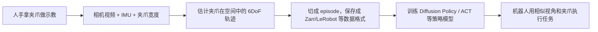

# UMI Gripper 初学者技术术语教学

> [!summary]
> 本页解释 [[08-umi-gripper-research-and-business-plan|UMI 调研报告]] 里出现的核心技术词。目标不是给严格数学定义，而是帮助初学者先建立“它是什么、在 UMI 里干什么、为什么重要、容易误解什么”的基本框架。

## 先看总图

UMI 的数据流可以先理解成：



如果只记一句话：UMI 要把“人做任务的过程”转成“机器人可以训练和执行的动作轨迹数据”。

## 术语速查

| 术语 | 先记住什么 |
|---|---|
| [[#UMI]] | 用手持类机器人夹爪采集机器人可学习数据的方法。 |
| [[#Gripper 夹爪]] | 机器人用来抓东西的末端工具。 |
| [[#IMU]] | 测量加速度和角速度的小传感器。 |
| [[#6DoF]] | 物体在三维空间的 3 个位置 + 3 个旋转自由度。 |
| [[#SLAM]] | 边看环境边估计自己在哪里。 |
| [[#T265]] | Intel RealSense 的追踪相机，可直接输出设备位姿，但已停产。 |
| [[#Zarr]] | 适合保存大量数组数据的数据格式。 |
| [[#LeRobot]] | Hugging Face 的机器人数据/训练工具链。 |
| [[#Diffusion Policy]] | 用扩散模型生成机器人动作的模仿学习方法。 |
| [[#ACT]] | 用 Transformer 一次预测一段动作的模仿学习方法。 |
| [[#Episode]] | 一次完整任务演示。 |

## UMI

UMI 是 Universal Manipulation Interface 的缩写，可以理解为“通用操作示教接口”。

它的基本思路是：不用每次都拿真实机器人遥操作，而是让人拿一个像机器人夹爪的手持设备去真实环境做任务，再把这个过程转成机器人可训练的数据。

在 UMI 报告中，它代表一条低成本、可移动、真实场景采集路线。

容易误解：UMI 不是一个普通夹爪硬件。夹爪只是入口，核心是“硬件 + 轨迹恢复 + 数据格式 + 训练接口”这一整套流程。

## Gripper 夹爪

Gripper 是机器人末端用来抓取、夹持、推动或接触物体的工具，中文常叫夹爪。

UMI 用手持夹爪，是为了让人类示教时的动作空间更像机器人，而不是用完整的人手动作。这样数据更容易迁移到机器人。

容易误解：夹爪不是越像人手越好。UMI 选择平行夹爪，是因为它简单、可控、和很多工业/协作机器人兼容。

## Parallel Gripper 平行夹爪

平行夹爪指两个手指平行开合的夹爪，像一个可控制开口宽度的夹子。

UMI 使用平行夹爪，是为了把抓取动作约束成“开合宽度 + 末端位姿”的简单表示。

业务意义：如果做 ToB 数据采集设备，平行夹爪更容易产品化、维修和标定，但它不适合所有任务，例如复杂灵巧手操作。

## Soft Finger 软指

软指是夹爪指尖上的柔性接触材料，通常用于增加摩擦、减少物体损伤、适应轻微形状误差。

在 UMI 中，软指可以让手持夹爪抓物体时更稳定。

容易误解：软指不是触觉传感器。它只是软材料，除非额外加传感器，否则不能直接测力或触觉。

## Stroke 行程

Stroke 指夹爪从最小开口到最大开口的可移动距离。

报告中的 80mm stroke 意味着夹爪最大开合范围约 80 毫米。

业务意义：行程决定能抓多大的物体。做设备时，行程、重量、耐用性和人体工学要一起权衡。

## GoPro

GoPro 是运动相机品牌。UMI 原始方案用 GoPro 是因为它小、广角、耐用，并且视频里可以带 IMU 数据。

在 UMI 中，GoPro 不只是拍视频，还参与轨迹估计。

容易误解：不是任何相机都能直接替代 GoPro。替代相机需要考虑画质、鱼眼标定、时间戳、IMU 数据、同步和软件支持。

## RGB

RGB 是 Red、Green、Blue 三个颜色通道。普通彩色视频或彩色图片通常就是 RGB 数据。

在 UMI 中，RGB 图像是策略模型看到的主要视觉输入。

容易误解：RGB 只能看到颜色，不直接包含深度或力信息。深度需要深度相机、双目、LiDAR 或算法估计。

## Fisheye 鱼眼相机

鱼眼相机是超广角相机，视野很大，但图像边缘会畸变。

UMI 使用鱼眼视角，是为了让腕部相机看到更多环境上下文。

容易误解：鱼眼不是“画面越广越好”。广角会带来畸变，必须做相机标定，否则空间估计会出错。

## IMU

IMU 是 Inertial Measurement Unit，惯性测量单元。你写的 “ime” 大概率指的是 IMU。

IMU 通常测量两类信息：加速度和角速度。它不能直接告诉你绝对位置，但能帮助估计设备运动。

在 UMI 中，GoPro 视频里的 IMU 数据和图像一起用于视觉惯性 SLAM，提高轨迹恢复能力。

容易误解：IMU 不是 GPS。IMU 会漂移，单独用很难长期准确定位，需要和视觉、LiDAR 或其他传感器融合。

## MP4

MP4 是常见视频文件格式。

在 UMI 中，GoPro MP4 可能同时包含视频帧和 IMU 相关元数据。

业务意义：如果替换相机，要确认导出的 MP4 或其他文件能保留需要的时间戳和传感器信息。

## Marker 标记点

Marker 是放在物体上的可识别视觉标记。机器人和视觉系统常用 ArUco、AprilTag 等 fiducial marker。

UMI 用 marker 追踪夹爪宽度，也就是估计两个夹爪手指张开多少。

容易误解：marker 看起来简单，但会受遮挡、反光、运动模糊、光照影响。

## Fiducial Marker 基准标记

Fiducial marker 是一种带编码的视觉标记，系统可以识别它的身份和姿态。

在 UMI 中，它可以用于夹爪宽度估计、相机标定或坐标对齐。

业务意义：它适合 v0 原型，但商业产品可能要换成编码器、霍尔传感器或电机反馈来提升稳定性。

## Gripper Width 夹爪宽度

Gripper width 指夹爪两个手指之间的开口宽度。

UMI 把它作为动作的一部分，因为机器人不仅要知道“移动到哪里”，还要知道“夹爪开多大”。

容易误解：夹爪宽度不是简单的开/关。很多任务需要连续宽度，例如轻抓、插入、推拉、投掷。

## Pose 位姿

Pose 指一个物体在空间里的位置和朝向。

位置通常是 x、y、z；朝向可以用欧拉角、四元数、旋转矩阵、轴角等表示。

在 UMI 中，最重要的是夹爪末端的 pose，也就是它在空间里的位置和方向。

## 6DoF

6DoF 是 six degrees of freedom，六自由度。

它包含 3 个平移自由度：前后、左右、上下；以及 3 个旋转自由度：绕 x/y/z 轴旋转。

在 UMI 中，恢复 6DoF 轨迹就是估计手持夹爪每一时刻在三维空间中的位置和朝向。

容易误解：6DoF 不是机器人有 6 个关节。它描述的是一个物体或末端工具在三维空间中的运动自由度。

## Trajectory 轨迹

Trajectory 是随时间变化的一串状态或动作。

在 UMI 中，轨迹可以是夹爪末端 pose 序列，也可以是机器人要执行的一串动作。

业务意义：数据质量很大程度取决于轨迹是否平滑、连续、时间同步、可被机器人执行。

## End-Effector 末端执行器

End-effector 是机器人手臂末端真正和环境交互的部分，比如夹爪、吸盘、焊枪、工具。

报告里 EE 是 end-effector 的缩写，EE pose 就是末端执行器的位姿。

容易误解：机器人手臂的“末端”不一定是最后一个关节，而是实际执行任务的工具坐标。

## TCP

TCP 是 Tool Center Point，工具中心点。

它是机器人控制时定义的工具参考点。例如夹爪两指中间的某个点可以被定义为 TCP。

在 UMI 中，TCP 很重要，因为人采集到的轨迹最终要变成机器人 TCP 的运动轨迹。

## SE(3)

SE(3) 是数学里表示三维刚体位姿的对象，包含位置和平移、旋转。

初学可以先把它理解成“一个完整 3D 位姿的标准数学表示”。

在 UMI 中，相对末端轨迹常常可以理解为一串 SE(3) 变换。

容易误解：SE(3) 不是一个软件库，也不是传感器；它是描述三维位姿变化的数学语言。

## Axis-Angle 轴角

轴角是一种表示旋转的方法：用一个旋转轴和一个旋转角度描述方向变化。

UMI 的数据字段里可能出现 `eef_rot_axis_angle`，表示末端执行器的旋转。

容易误解：轴角、欧拉角、四元数都能表示旋转，但各有优缺点。初学不用一开始全部掌握，先知道它们都在描述“朝向”。

## Quaternion 四元数

四元数是一种常用的三维旋转表示，机器人、图形学、SLAM 中很常见。

它的优点是适合插值、不容易遇到欧拉角的万向节锁问题。

在 UMI 学习阶段，你只需要知道四元数是“表示朝向的一种格式”，不要手算。

## Coordinate Frame 坐标系

坐标系是用来描述位置和方向的参考框架。

机器人里常见坐标系包括世界坐标系、机器人基座坐标系、相机坐标系、夹爪坐标系、TCP 坐标系。

UMI 的难点之一就是把相机看到的运动、手持夹爪运动和机器人末端运动放到可对齐的坐标系里。

## Relative Pose 相对位姿

相对位姿是一个物体相对于另一个物体的位姿，而不是相对于全局世界的绝对位姿。

UMI 使用相对末端轨迹，是为了减少对全局坐标系的依赖，提高跨机器人和跨环境迁移的可能性。

容易误解：相对位姿不是不需要坐标系，而是选择了更适合迁移的参考坐标系。

## Kinematics 运动学

运动学研究机器人关节、连杆和末端位置之间的关系，不直接考虑力。

在 UMI 中，运动学可行性过滤用于判断一条轨迹机器人是否真的能执行。

业务意义：采集到的轨迹如果机器人做不到，就算视频很好也没有训练价值。

## Kinematic Feasibility 运动学可行性

运动学可行性指一条动作轨迹是否在机器人关节范围、速度限制、姿态限制和工作空间内。

UMI 会过滤掉明显不可执行的轨迹。

容易误解：人手拿夹爪做得到，不代表机器人一定做得到。人的肩膀、手腕、身体移动能力和机器人机械臂不同。

## SLAM

SLAM 是 Simultaneous Localization and Mapping，同时定位与建图。

它要解决的问题是：设备一边观察环境，一边估计自己在哪里，并构建环境地图。

在 UMI 中，SLAM 用来从相机和 IMU 数据恢复手持夹爪的空间运动轨迹。

### SLAM 成功率是什么

SLAM 成功率是衡量“采集到的演示里，有多少条能成功恢复出可用空间轨迹”的指标。

在 UMI 场景里，SLAM 成功不只是程序没有报错，而是至少满足这些条件：

- 能从 episode 开始到结束输出连续的 6DoF pose。
- 轨迹没有明显跳变、飞走、尺度错误或方向翻转。
- 输出轨迹长度和视频/IMU 时间轴基本对齐。
- 轨迹通过后续质量检查，能进入训练数据集或只需轻微修正。

一个最基础的计算方式：

```text
SLAM 成功率 = 成功恢复可用轨迹的 episode 数 / 尝试跑 SLAM 的 episode 总数
```

例子：

```text
今天采了 100 条演示；
其中 90 条进入 SLAM 流水线；
70 条输出了可用轨迹；

按“进入 SLAM 的样本”计算：SLAM 成功率 = 70 / 90 = 77.8%
按“当天总采集样本”计算：端到端轨迹可用率 = 70 / 100 = 70%
```

这两个口径都要记录，不能混用：

| 指标 | 分母 | 用途 |
|---|---:|---|
| SLAM 成功率 | 实际尝试跑 SLAM 的 episode | 衡量 SLAM 算法和传感器设置是否稳定。 |
| 端到端轨迹可用率 | 当天采集的全部 episode | 衡量采集 SOP、环境、操作者和算法整体是否稳定。 |

更严格的产品化口径会把“成功”分级：

| 等级 | 含义 | 是否进入训练 |
|---|---|---|
| A | 轨迹连续、平滑、时间对齐，人工抽检通过 | 可以直接进入训练集 |
| B | 轻微抖动或短时丢失，但可修正或可截断 | 可进入低权重数据或人工复核 |
| C | 轨迹跳变、尺度错误、长时间丢失、任务关键段失败 | 不进入训练集，标记重采 |

UMI 数据服务里，建议同时记录这些字段：

```yaml
episode_id:
slam_status: success | partial | failed
slam_quality_grade: A | B | C
tracking_lost_frames:
tracking_lost_ratio:
trajectory_jump_count:
max_pose_jump:
time_alignment_error_ms:
failure_reason:
reviewer:
```

业务意义：SLAM 成功率直接影响采集成本。如果 100 条演示里只有 40 条能恢复轨迹，客户实际买到的不是 100 条数据，而是 40 条可训练数据。ToB 报价和交付应该按“有效 episode + 质量等级”核算，而不是按原始录制时长核算。

容易误解：SLAM 不是总能成功。弱纹理、强反光、快速运动、遮挡、动态人群都会让它失败。

## Visual-Inertial SLAM 视觉惯性 SLAM

视觉惯性 SLAM 是把相机图像和 IMU 数据结合起来做 SLAM。

视觉提供环境特征，IMU 提供短时运动变化，两者互补。

在 UMI 中，GoPro 视频和 IMU 被一起用于恢复 6DoF 轨迹。

## ORB-SLAM3

ORB-SLAM3 是一个开源 SLAM 系统，支持单目、双目、RGB-D 和视觉惯性等配置。

UMI 使用了 ORB-SLAM3 的分支来处理 GoPro 数据。

业务意义：如果要产品化，不能只说“用了 ORB-SLAM3”，还要能报告成功率、失败原因、轨迹质量和重采建议。

## T265

T265 通常指 Intel RealSense Tracking Camera T265，一种面向设备定位和运动追踪的追踪相机。

初学可以把它理解成：普通相机主要给你图像，T265 这类追踪相机则试图直接给你“设备现在在哪里、朝向哪里”的 6DoF pose。它内部依赖视觉惯性里程计/SLAM 类能力，把相机和 IMU 信息融合成运动轨迹。

在 FastUMI 路线里，T265 被用来替代原始 UMI 中更复杂的 GoPro + ORB-SLAM3 轨迹恢复流程。这样做的好处是工程上更直接，少一部分 SLAM 调试工作；坏处是会依赖一个具体商用传感器。

业务意义：T265 已经停产，且 FastUMI 相关资料提示它不被后续 librealsense 版本支持。因此商业产品不应押注长期采购 T265，而应把 `pose_source` 抽象出来，支持 RoboBaton Mini、ARKit、Vive Tracker、LiDAR-SLAM、外部 MoCap 或其他国产 VIO 模块。证据：[`SRC-robotics-069`](../../raw/robotics-embodied-ai/documents/SRC-robotics-069-fast-umi-a-scalable-and-hardware-independent-universal-manipulation-interface.md)、[[research-notes/umi-hardware-localization-2026-05-27]]。

容易误解：T265 不是普通深度相机，也不是训练算法。它只是位姿追踪来源之一；即使用 T265，也仍然需要标定、时间同步、数据质检和机器人端适配。

## LiDAR

LiDAR 是激光雷达，通过激光测距获取环境几何信息。

UMI-3D 使用低成本 LiDAR，是为了应对白墙、弱纹理、遮挡和动态场景中纯视觉 SLAM 的问题。

容易误解：LiDAR 不自动解决所有问题。它带来标定、同步、点云处理、硬件成本和安装复杂度。

## 3D SLAM

3D SLAM 使用三维信息估计设备运动和环境结构。

UMI-3D 中的 3D SLAM 更强调利用 LiDAR/点云信息，而不是只靠相机图像。

业务意义：工业、仓储、零售等弱纹理场景可能更适合 3D SLAM 路线。

## Calibration 标定

标定是确定传感器参数和传感器之间几何关系的过程。

例子包括相机内参、鱼眼畸变、相机和 LiDAR 的外参、相机和夹爪 TCP 的关系。

容易误解：标定不是一次性小步骤。标定质量会直接影响轨迹、训练数据和最终机器人执行。

## Time Synchronization 时间同步

时间同步是让视频帧、IMU、夹爪宽度、机器人状态和动作在同一时间轴上对齐。

UMI 中如果时间不同步，模型会学到错位关系，例如图像还没变化但动作已经执行。

业务意义：ToB 数据服务必须把时间同步报告作为质检项。

## Latency 延迟

Latency 是从观察到动作执行之间的时间差。

在机器人中，视频采集、模型推理、网络传输、控制器执行都会产生延迟。

UMI 强调推理时延迟匹配，是因为动态任务中几十毫秒到几百毫秒的错位都可能导致失败。

## Observation 观测

Observation 是模型在某一时刻看到的输入。

在机器人学习中，observation 可以包括 RGB 图像、深度、关节位置、夹爪宽度、力/触觉、语言指令等。

UMI 中的 observation 主要是腕部 RGB 图像和相关状态。

## Action 动作

Action 是模型输出给机器人执行的控制指令。

它可以是关节角、关节速度、末端位姿增量、夹爪开合宽度等。

UMI 关心 action 表示，是因为手持设备采到的人类动作必须变成机器人可执行的 action。

## Policy 策略模型

Policy 是把 observation 映射到 action 的模型。

简单说：模型看到当前画面和状态后，决定机器人下一步怎么动。

Diffusion Policy 和 ACT 都是 policy 的具体训练方法。

## Imitation Learning 模仿学习

模仿学习是让模型从示教数据中学习行为。

UMI 采集的数据主要用于模仿学习：人做任务，模型学人如何操作。

容易误解：模仿学习不是复制视频画面，而是学习“在这种观察下应该输出什么动作”。

## Diffusion Policy

Diffusion Policy 是一种机器人模仿学习方法，使用扩散模型生成一段连续动作。

初学可以把它理解成：模型不是只预测下一步，而是预测接下来一小段平滑动作。

UMI 原文主要使用 Diffusion Policy 做训练。

## ACT

ACT 是 Action Chunking with Transformers。

它用 Transformer 一次预测一段动作 chunk，常用于 ALOHA 等机器人模仿学习系统。

UMI 报告提到 ACT，是因为它可以作为 Diffusion Policy 之外的训练基线。

## Baseline

Baseline 是基线方法或基线结果。

在数据服务中，baseline 的作用是证明这批数据不仅能保存，还能训练出一个可运行的初始模型。

业务意义：对客户来说，有 baseline 比只有数据目录更可信。

## Rollout

Rollout 指让机器人或策略模型实际执行一段任务，并记录结果。

训练后的模型需要 rollout 来评估是否真的能完成任务。

容易误解：训练 loss 低不等于机器人成功率高，rollout 才是关键检验。

## Episode

Episode 是一次完整的任务演示或执行过程。

例如“拿起杯子并放到指定位置”从开始到结束就是一个 episode。

UMI 数据会把连续采集内容切成多个 episode，再保存到数据集中。

## Replay Buffer

Replay buffer 是保存轨迹数据的容器，常用于机器人学习和强化学习。

UMI 中的 Zarr replay buffer 可以理解为“训练算法能读取的轨迹数据仓库”。

容易误解：Replay buffer 不是视频播放器，而是结构化数据容器。

## Zarr

Zarr 是一种保存大型多维数组的数据格式。

机器人数据里常有大量图像、状态、动作、时间戳，Zarr 可以把它们分块、压缩、按需读取。

UMI 社区使用 Zarr 保存 replay buffer。

业务意义：商业数据包最好同时支持 Zarr 和更通用的 LeRobot/HDF5 等格式，降低客户使用门槛。

## LeRobot

LeRobot 是 Hugging Face 推出的机器人学习工具链，包含数据格式、数据集、训练、评测和部署相关工具。

它的重要性在于降低机器人数据和模型训练的工程门槛。

UMI 报告建议支持 LeRobot，是因为客户可能希望直接用开源工具加载和训练数据。

入门教学见 [[research-notes/lerobot-beginner-guide-2026-05-28]]。

## HDF5

HDF5 是一种成熟的数据文件格式，适合保存层级化的大型科学数据。

很多机器人数据集用 HDF5 保存图像、状态、动作和元数据。

业务意义：HDF5 在科研和机器人数据里很常见，适合作为兼容格式之一。

## Dataset Schema 数据集结构

Dataset schema 指一个数据集有哪些字段、字段类型是什么、目录怎么组织、元数据怎么写。

例如一个机器人数据 schema 可能规定：每个 episode 包含视频、动作、状态、任务文本、时间戳、标定文件和质量标签。

业务意义：没有 schema 的数据很难复用。ToB 数据交付必须有清晰 schema 文档。

## Sampling Rate 采样率

采样率指每秒记录多少次数据，常用 Hz 表示。

例如 30Hz 表示每秒 30 帧或 30 次状态记录。

在机器人数据中，不同传感器采样率可能不同，需要同步和对齐。

## Compression 压缩

压缩是减少数据占用空间的技术。

视频、图像、Zarr、HDF5 都可能使用压缩。

容易误解：压缩越强越好。过强压缩可能损伤图像细节，影响模型训练和轨迹恢复。

## Quality Control 质检

质检是检查数据是否可用的过程。

UMI 数据质检可以包括：视频清晰度、SLAM 是否成功、轨迹是否跳变、夹爪宽度是否丢失、episode 边界是否正确、时间同步是否正常。

业务意义：ToB 数据服务的核心竞争力之一就是稳定质检，而不是只采集原始视频。

## BoM

BoM 是 Bill of Materials，物料清单。

它列出做一个硬件设备需要哪些零件、型号、数量、采购链接和成本。

UMI 产品化必须有 BoM，因为客户关心能否稳定采购、维修和小批量生产。

## SOP

SOP 是 Standard Operating Procedure，标准操作流程。

在数据采集里，SOP 规定采集前检查、场景布置、任务步骤、失败重采、文件命名、质检和交付流程。

业务意义：没有 SOP，就很难规模化训练采集员，也很难稳定交付数据质量。

## ToB

ToB 是 To Business，面向企业客户。

UMI 报告讨论 ToB，是因为数据采集设备和服务的早期客户更可能是机器人公司、高校实验室、工业客户和模型公司，而不是普通消费者。

## DFM

DFM 是 Design for Manufacturing，面向制造的设计。

它关注一个原型能否低成本、稳定、可维护地批量生产。

UMI-like 设备从实验室原型走向商业产品，必须做 DFM。

## Force/Torque Sensor 力/力矩传感器

力/力矩传感器可以测量力和扭矩。

在机器人操作中，它用于感知接触，例如插入、擦拭、压紧、拧动。

UMI-FT 和 TacUMI 强调力/触觉，是因为很多接触丰富任务只靠视觉不够。

## Tactile Sensor 触觉传感器

触觉传感器用于感知接触、压力、滑动、纹理等信息。

它类似机器人指尖的“触觉”。

业务意义：触觉数据价值高，但硬件耐用性、标定、成本和数据处理都更难。

## Multi-View 多视角

多视角指用多个相机从不同角度观察同一任务。

UMI 原始路线偏腕部第一视角，MV-UMI 额外加入第三方视角，解决看不全的问题。

容易误解：多视角会增加信息，但也会增加相机布置、标定、同步和数据量。

## Wrist View 腕部视角

腕部视角是从机器人手腕或夹爪附近相机看到的画面。

它接近执行动作的位置，因此对精细操作有用。

缺点是视野容易被手、物体或遮挡限制。

## Robot-Mounted 机器人端安装

Robot-mounted 指设备安装在机器人上，而不是人手持。

UMI 要求机器人端部署时有相似的夹爪和相机视角，以减少训练和执行之间的差异。

## Observation Gap 观测差异

Observation gap 指训练时模型看到的画面/状态和部署时看到的不一致。

例如人手持相机采集的数据和机器人腕部相机画面差别太大，模型就可能无法泛化。

UMI 通过相似夹爪和相似腕部相机来减少这个差异。

## Embodiment Gap 本体差异

Embodiment gap 指不同身体结构或机器人结构之间的差异。

人手、UMI 手持夹爪、UR 机械臂、Franka 机械臂、人形机器人都有不同 embodiment。

业务意义：跨本体数据价值大，但动作映射和可执行性更难。

## Data Package 数据包

数据包是交付给客户的一整套数据资产。

好的机器人数据包不只是视频，还应包含 raw 数据、processed 数据、schema、标定、任务说明、质量报告、训练配置和样例回放。

UMI 报告的商业化建议，本质上是把采集设备变成可交付的数据包服务。

## Baseline Training Recipe 基线训练配方

训练配方是跑通一个模型训练所需的配置和步骤。

它通常包括数据路径、模型类型、图像编码器、采样率、batch size、训练步数、评测方式等。

业务意义：客户拿到数据后能复现实验，才会相信数据质量。
