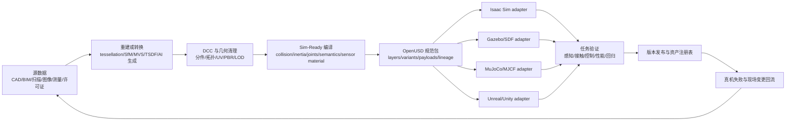

# 3D 仿真资产生产技术管线综合调研与方案对比

> [!summary]
> **不存在一条技术路线同时在度量几何、视觉真实、物理可信、可编辑性和批量成本上最优。** CAD/BIM 最适合保留工程结构，摄影测量与 LiDAR 最适合恢复现实外观和尺度，NeRF/3DGS 最适合新视角渲染，程序化生成最适合批量变体，生成式 3D 最适合快速产候选；真正的生产方案应是“多源输入 + OpenUSD 规范化 + 独立物理/语义编译 + 多仿真器适配 + 任务证据”的混合资产工厂。一个模型能被导入或看起来逼真，不等于它已经 Sim-Ready。

## 一、结论摘要

### 1.1 直接回答

| 需求 | 首选路线 | 原因 | 必补环节 |
|---|---|---|---|
| 工业设备、机器人、产线数字孪生 | CAD/PLM 转换为主，扫描校核 | 尺寸、装配层级和零件身份来自工程源 | 三角化、减面、碰撞、惯量、关节、材质和语义 |
| 真实工厂/仓库/室内空间 | LiDAR/RGB-D + 摄影测量混合 | LiDAR 保尺度，图像保纹理 | 去噪、补洞、分件、动态物体重建、碰撞代理 |
| 高真实视觉背景或 novel view | 3DGS/NeRF + 隐藏代理几何 | 外观恢复速度快、视觉保真高 | 单独的 metric mesh、collider、语义和可交互对象 |
| 大规模训练场景和长尾变化 | 程序化/参数化生成 | 可控、可复现、边际成本低 | 规则校准、真实分布约束、real holdout 验证 |
| 快速概念、低重要度道具 | 生成式 3D + 自动/人工 QA | 候选生成快 | 尺度、拓扑、背面、PBR、许可、碰撞和物理重做 |
| 抓取、装配、开门等接触任务 | CAD/测量 + DCC 清理 + 物性测试 | 任务对接触面、摩擦、质心和关节极敏感 | 真实物理试验与闭环任务 A/B |
| 企业级长期资产库 | 混合资产工厂 | 能同时处理多源输入、版本和多运行时 | Schema、规则、血缘、回归测试和治理 |

**推荐默认架构：** 保留 CAD、扫描、图像、测量记录等源数据；以 OpenUSD 作为可组合的规范化资产包；把 visual、collision、physics、semantics、sensor material 和 simulator adapter 分层；最后以任务验证而不是截图验收。OpenUSD 支持 layer、reference、payload、variant 和非破坏式 override，适合作为长期资产编译层，但它本身不保证动力学正确。[`SRC-robotics-407`](../../../raw/robotics-embodied-ai/documents/SRC-robotics-407-openusd-introduction-and-composition-model.md)

### 1.2 总体判断与置信度

| 判断 | 置信度 | 证据边界 |
|---|---:|---|
| 生产环境应采用混合管线而非单一路线 | 高 | 各路线输入和输出能力互补；官方工具链也采用多源导入 |
| OpenUSD 是当前最适合跨 DCC/仿真资产组织的中间层 | 中高 | 组合、版本、几何、材质、物理 schema 成熟；跨引擎行为仍非完全等价 |
| 3DGS/NeRF 不能单独承担交互式物理资产 | 高 | 核心表示面向辐射场/高斯渲染；mesh、collider、物性和语义需额外构建 |
| 生成式 3D 会显著降低候选生成成本，但短期不会消灭技术美术和物理 QA | 高 | 已能输出 mesh/PBR；维度、拓扑、物理、许可和一致性仍未被输入充分约束 |
| 最大商业价值将从“建模人天”转向“资产规范、自动 QA、物性标定和任务验证” | 中高 | SimReady 规则化、平台化和复用趋势明确；客户付费与毛利需项目数据验证 |

## 二、分类与研究边界

- **主分类**：R05 产品、平台与工具选型调研。
- **次分类**：R04 技术原理与前沿方向；R02 产业链专题。
- **分类理由**：用户需要比较不同 3D 仿真资产生产方案并做工程选型；同时需要解释重建、程序化和生成式 3D 的技术边界，以及资产生产环节的交付物、质量和商业价值。
- **覆盖范围**：机器人/具身智能、工业数字孪生、合成数据与仿真测试中的对象、机器人、场景资产；覆盖建模、重建、优化、物理/语义编译、格式适配和验收。
- **不覆盖**：影视纯渲染资产、完整仿真器选型、有限元专用网格、医学影像重建、游戏玩法制作，以及未经目标任务验证的统一成本/工期报价。
- **截止日期**：2026-08-06。

### 2.1 事实、估计、判断和假设

| 类型 | 本报告如何使用 |
|---|---|
| 事实 | 官方文档明确支持的格式、表示、导入、schema、导出和验证能力 |
| 估计 | 不给出行业统一人天或单资产价格；此类成本高度依赖复杂度、精度和复用率 |
| 判断 | 路线评分、适用条件、推荐架构和创业优先级；评分是 1–5 的相对工程判断，不是统一 benchmark |
| 假设 | 企业有权访问 CAD/扫描原始数据，并愿意建立长期资产库；若源数据不可得，应切换到扫描/DCC 路线 |

## 三、先定义交付物：SimAsset 不是一个 mesh 文件

### 3.1 最小资产合同

一个可生产使用的仿真资产至少应把以下层分开管理：

| 层 | 典型内容 | 如果缺失会怎样 |
|---|---|---|
| Source / lineage | CAD、扫描、照片、标定、许可证、供应商和版本 | 无法复现、更新或证明权属 |
| Visual | render mesh、UV、PBR/MaterialX、LOD | 看起来粗糙或运行成本过高 |
| Metric geometry | 坐标系、单位、尺度、表面误差、关键尺寸 | 抓取位姿、间隙、传感器深度失真 |
| Collision | primitives、convex hull/decomposition、SDF 或 task-specific collider | 穿透、抖动、接触数爆炸、训练变慢 |
| Physics | 质量、质心、惯量、摩擦、恢复系数、阻尼、柔顺/变形参数 | 动力学和接触不可信 |
| Articulation | link/joint tree、轴、限位、驱动、传动和初始状态 | 门柜、工具和机器人不能正确交互 |
| Semantics | class、instance、part、affordance、receptacle、状态 | 无法生成可靠标签或定义任务 |
| Sensor material | RGB/PBR、LiDAR/雷达/声学/透明度等响应参数 | 视觉逼真但传感器分布错误 |
| Runtime adapter | USD/URDF/SDF/MJCF/引擎插件和参数 override | 一个引擎可用、另一个引擎行为漂移 |
| Task evidence | 几何、物理、性能、传感器和闭环任务测试报告 | 只有“可加载”证据，没有“可用”证据 |

OpenUSD 的 rigid-body schema明确需要 pose、质量分布、碰撞表示、物理材质和关节等信息；它目前主要覆盖刚体基线，不应把 schema 存在误解为所有软体、流体或传感器材料已统一解决。[`SRC-robotics-408`](../../../raw/robotics-embodied-ai/documents/SRC-robotics-408-openusd-rigid-body-physics-schema.md) SimReady Foundation 进一步把 collider、material、joint、semantic 等要求组织为可机器检查的 capability、feature 和 profile，这一思路很适合企业内建质量门。[`SRC-robotics-409`](../../../raw/robotics-embodied-ai/documents/SRC-robotics-409-simready-foundation-specification-and-validation-framework.md)

### 3.2 推荐生产链

NVIDIA 的当前 Isaac Sim 入口同样把 CAD、URDF 和现实采集先转换为 USD，再分配材质、启用物理并配置机器人/传感器，支持这一“多源输入—统一编译”的架构，而不是“把任意文件直接扔进仿真器”。[`SRC-robotics-410`](../../../raw/robotics-embodied-ai/documents/SRC-robotics-410-nvidia-isaac-sim-current-asset-ingestion-overview.md)

## 四、九类生产路线及优劣

机器可读表见 [3D 仿真资产生产路线比较 CSV](../../../raw/robotics-embodied-ai/data/3d-simulation-asset-production-routes-comparison-2026-08-06.csv)。其中 1–5 分是本报告在统一维度下的相对判断，不代表跨工具 benchmark。

### 4.1 手工 DCC 建模

**典型链路**：参考图/尺寸 → Blender/Maya/3ds Max 建模 → UV/PBR → LOD → collider → USD/glTF/FBX。

- **优势**：可编辑性、拓扑质量和视觉控制最好；适合 hero asset、复杂有机物、扫描修复和所有自动路线的异常处理。
- **劣势**：人力密集、质量依赖人员；仅凭美术参考不能保证尺寸、惯量和物性。
- **适用**：少量高价值对象、需要严格视觉风格或自动重建失败的对象。
- **不适用**：数万 SKU 全靠逐件手工、需频繁跟随工程变更的产线。

### 4.2 CAD/BIM/PLM 转换

**典型链路**：STEP/JT/Parasolid/IFC/原生 CAD → 装配和元数据过滤 → tessellation → 去小件/减面 → 材质替换 → physics/semantics。

- **优势**：真实尺寸、零件层级、关节轴和工程身份最可信；上游变更可重导入。
- **劣势**：制造 CAD 通常过度精细，包含螺纹、紧固件和内部结构；没有适合实时渲染的 UV/PBR；知识产权敏感。
- **核心权衡**：CAD 曲面转实时三角网格必然在几何逼近误差与三角数之间取舍。Datasmith 以 chord tolerance、normal tolerance 和 stitching 控制此过程。[`SRC-robotics-413`](../../../raw/robotics-embodied-ai/documents/SRC-robotics-413-unreal-engine-datasmith-cad-import-and-tessellation-workflow.md)
- **适用**：机器人本体、工业装备、车辆、产线、建筑设施。
- **不适用**：没有工程源文件的存量现场、软体/杂物/自然环境。

### 4.3 摄影测量（SfM/MVS）

**典型链路**：多视角重叠图像 + 标尺/GCP → 相机位姿和稀疏点 → dense MVS → mesh → 清理/重拓扑/纹理烘焙。

- **优势**：设备门槛低，纹理和真实外观好，适合中小物体与静态空间。
- **劣势**：反光、透明、纯色、重复纹理、遮挡和细杆件容易失败；无尺度约束时不是天然 metric；隐藏表面无法恢复。
- **适用**：消费品、室内陈设、文化遗产、静态场景外观。
- **证据**：COLMAP 的公开管线覆盖相机位姿、稀疏结构、dense MVS、点云和 mesh，是可审计的开源基线。[`SRC-robotics-414`](../../../raw/robotics-embodied-ai/documents/SRC-robotics-414-colmap-structure-from-motion-and-multi-view-stereo-pipeline.md)

### 4.4 LiDAR/RGB-D 扫描到网格

**典型链路**：标定和同步 → 位姿/配准 → 点云去噪分类 → TSDF/Poisson/商业 Scan-to-Mesh → 分块/分件 → 纹理融合。

- **优势**：尺度和大场景结构优于纯图像；适合厂房、仓库、道路、室内空间和碰撞包络参考。
- **劣势**：点密度、噪声、动态物体和遮挡造成孔洞；网格巨大；扫描不会自动给出可动件、关节、质量和摩擦。
- **工程约束**：ReCap 的本地 Scan-to-Mesh 文档明确提示计算量和大文件压力，并建议大量临时空间，说明“扫描完成”距离可部署资产仍有显著处理成本。[`SRC-robotics-415`](../../../raw/robotics-embodied-ai/documents/SRC-robotics-415-autodesk-recap-local-scan-to-mesh-workflow.md)
- **适用**：大空间 metric scene、as-built 变化检测、数字孪生底图。

### 4.5 NeRF / 3D Gaussian Splatting

**典型链路**：图像/视频 + 相机位姿 → radiance field 或 Gaussians → novel-view renderer；交互区域另建 mesh/collider。

- **优势**：复杂光照、细纹理、半透明/细碎结构的视觉恢复通常优于干净网格；3DGS 渲染快，适合真实背景和 neural sensor scene。
- **劣势**：核心是外观表示，不天然提供闭合表面、碰撞、质量、关节和语义；动态光照与编辑困难；相机模型和导出支持因实现而异。
- **证据边界**：Nerfstudio 当前 splat 路线可导出 PLY，但其文档明确表示不能直接导出 mesh/point cloud，且 rasterizer 假设透视相机。[`SRC-robotics-416`](../../../raw/robotics-embodied-ai/documents/SRC-robotics-416-nerfstudio-gaussian-splatting-implementation-and-export-limits.md)
- **适用**：视觉背景、novel view、传感器图像回放/渲染、远离交互区的场景层。
- **不适用**：单独承担抓取、碰撞、机器人通行空间或精密装配。

### 4.6 程序化/参数化生成

**典型链路**：类别 grammar/参数分布/布局约束 → 生成 geometry/material/joint/semantic → variants → 自动校验 → 场景采样。

- **优势**：一次开发后可生成大量可控、可复现变体；非常适合 domain randomization、长尾覆盖和 articulated object family。
- **劣势**：前期需要高水平 technical artist、几何算法和领域知识；规则写错会系统性生成“不像真实世界”的数据。
- **工具形态**：Houdini Solaris 原生围绕 USD 的 component、material、variant、payload 和 layering 组织节点式资产工厂。[`SRC-robotics-422`](../../../raw/robotics-embodied-ai/documents/SRC-robotics-422-houdini-solaris-procedural-usd-workflow.md) Infinigen-Sim 则展示了程序化 articulated assets 和物理属性导出到机器人仿真器的研究路线，但论文实验不能外推为所有工业品类已成熟。[`SRC-robotics-417`](../../../raw/robotics-embodied-ai/documents/SRC-robotics-417-infinigen-sim-procedural-articulated-simulation-assets.md)
- **适用**：柜门、抽屉、容器、货架、包装、道路/植被、仓库布局等族谱清晰的资产。

### 4.7 生成式 AI 3D

**典型链路**：text/image → 生成 mesh/3DGS/radiance field → 自动重拓扑/UV/PBR → 规则校验 → 人工复核 → Sim-Ready 编译。

- **优势**：候选生成、概念探索和低重要度道具速度快；能快速补齐视觉多样性。
- **劣势**：输入通常无法约束真实尺寸、隐藏面、装配关系、质心、摩擦和许可证；同 prompt 重复性和跨视图一致性仍需审计。
- **当前能力**：Hunyuan3D 2.1 的官方仓库提供 image-to-mesh 与 PBR 材质生成；TRELLIS 可输出 radiance field、3D Gaussians 和 mesh/GLB。[`SRC-robotics-418`](../../../raw/robotics-embodied-ai/documents/SRC-robotics-418-hunyuan3d-2-1-image-to-3d-and-pbr-asset-generation.md) [`SRC-robotics-419`](../../../raw/robotics-embodied-ai/documents/SRC-robotics-419-trellis-structured-3d-latent-asset-generation.md)
- **正确定位**：**候选生成器，不是最终发布器。** 对交互资产默认按“不可信输入”进入尺寸、拓扑、IP、碰撞、物性和任务 QA。

### 4.8 资产库复用

**典型链路**：内部 registry/厂商 CAD/授权库 → 许可证和版本审计 → profile 验证 → runtime adapter。

- **优势**：首个 PoC 最快，标准机器人、常见 props 和工业件的边际成本最低。
- **劣势**：质量、坐标、材质、碰撞和许可高度不一致；客户专有 SKU 与现场变更覆盖不足。
- **适用**：先复用再制作；所有项目应先做 catalog search，避免重复生产。

### 4.9 混合式资产工厂（推荐）

不是把所有工具串起来，而是按对象类型路由：

- 机器人/设备：CAD/URDF 为结构主源，扫描做 as-built 校核，DCC 做 visual，实测做 physics。
- 空间：LiDAR/RGB-D 为 metric 主源，摄影测量或 3DGS 做 appearance，CAD/BIM 补语义与可维护结构。
- 长尾物体：资产库优先；AI 生成候选；高频类别程序化；高价值接触对象测量重做。
- 场景组合：OpenUSD layers/variants/payloads；每个运行时只放 adapter override，不污染 canonical asset。

这一路线首期治理成本最高，但只有它能稳定处理工程变更、复用、批量生成和多仿真器发布。

## 五、方案栈对比

| 方案栈 | 典型管线 | 强项 | 短板/锁定 | 推荐条件 |
|---|---|---|---|---|
| NVIDIA/OpenUSD/SimReady | CAD/URDF/采集 → USD → SimReady rules → Isaac Sim/Replicator | 机器人、RTX 传感器、合成数据、规则化资产 | NVIDIA 运行时与 GPU 依赖；跨引擎需再验证 | 已采用 Isaac/Isaac Lab、需要高保真传感器和规模 SDG |
| 开源低成本栈 | Blender + COLMAP/Open3D/Nerfstudio + USD/glTF + URDF/SDF/MJCF | 成本低、可控、格式透明、易定制 | 工具拼接和 QA 自建，企业协作/资产治理较弱 | 小团队 PoC、研究、预算有限且有工程能力 |
| Unreal/Datasmith 栈 | CAD/BIM/扫描 → Datasmith/Dataprep → Unreal | CAD/BIM 和实时视觉、交互展示、工业可视化 | 机器人动力学/训练需插件或外部物理栈 | 视觉数字孪生、人在环、展示和自动驾驶场景 |
| Houdini/Solaris 工厂 | 程序化 SOP/LOP → USD component/variants → 多运行时 | 大规模变体、非破坏式流程、技术美术自动化 | 学习和许可成本高，物理验证仍需目标引擎 | 资产量大、品类重复、有 technical artist/TD 团队 |
| 扫描重建工厂 | LiDAR/RGB-D/相机 → registration/mesh/texture → DCC/USD | as-built 场景和真实外观 | 采集、清理、分件和动态/隐藏区域补建成本高 | 工厂、仓库、道路、建筑和现实复刻 |
| AI 辅助工厂 | Hunyuan3D/TRELLIS → mesh/PBR → QA/重做 → USD | 候选与视觉变化快，适合目录长尾 | 尺度、IP、物理和稳定性不可默认信任 | 背景 props、概念设计、人工审核充足 |

### 5.1 格式建议

- **Canonical**：优先 OpenUSD 包，不把 `.usdz`、`.glb` 或单个 `.usd` 文件等同于完整资产库。
- **Robot/interface**：保留 URDF/Xacro、SDF、MJCF 等源适配层。Isaac Sim 的 URDF importer 会生成符合其资产结构的 USD，并可从 visual 自动生成 convex collision，但这种便利选项不能代替 collision QA。[`SRC-robotics-411`](../../../raw/robotics-embodied-ai/documents/SRC-robotics-411-nvidia-isaac-sim-urdf-importer-extension.md)
- **Visual interchange**：glTF/GLB 适合轻量发布；FBX/OBJ 适合作为兼容中间件，不宜承载完整物理和血缘合同。
- **Neural appearance**：PLY/专用 3DGS 或 neural field 与 proxy mesh 并存，不强行把 appearance layer 当 canonical geometry。
- **Material**：尽量采用 PBR + MaterialX/USDShade，并对 LiDAR/雷达等传感器响应维护独立参数层。

## 六、SimReady 验收标准与自动化

> [!important]
> **“SimReady 验收通过”必须说明通过了哪一个 Profile、哪个版本、哪一个资产 hash、哪些目标运行时和哪些任务。** 官方 SimReady validator 通过只构成 **L1 规范符合性**；生产发布还必须通过 **L2 运行时验收** 和适用的 **L3 任务验收**。不得用 L1 通过替代物理可信、传感器增益或真机任务证据。

机器可执行的验收模板见 [SimReady 验收清单 CSV](../../../raw/robotics-embodied-ai/data/simready-acceptance-checklist-2026-08-06.csv)。

### 6.1 三级验收模型

| 层级 | 回答的问题 | 主要依据 | 通过条件 | 单独通过能否发布 |
|---|---|---|---|---|
| L1 规范符合性 | USD 是否满足选定 SimReady Profile | Profile → Feature → Requirement → Rule | 选定 profile 的 requirement 零失败；MUST 零豁免；SHOULD 偏离有批准记录 | 否 |
| L2 运行时验收 | 在目标 simulator/runtime 中是否稳定、正确且满足预算 | clean load、physics sanity、关节 sweep、性能和重复性测试 | 所有声明运行时的适用 MUST test 通过，未知 warning 为零 | 否，若资产承载任务 |
| L3 任务验收 | 是否支持感知、导航、抓取或控制目标 | 仿真闭环、真实 holdout、失败分类和 A/B | 达到预先冻结的任务 KPI；关键 asset-induced failure 为零 | 是，连同 L1/L2 和证据包 |

官方规范把 profile 定义为具名、版本化的 feature 集；验证时逐级解析 feature、requirement 和 Python rule。任一 requirement 失败会使其 feature 失败，并最终使 profile 失败。[`SRC-robotics-423`](../../../raw/robotics-embodied-ai/documents/SRC-robotics-423-simready-foundation-profile-validation-workflow-2026-04-1.md)

### 6.2 Profile 选择和冻结

| 资产类型/目标 | 默认候选 Profile | 验收重点 | 额外说明 |
|---|---|---|---|
| 普通机器人场景道具，运行时中立 | `Prop-Robotics-Neutral` | core、neutral rigid body、multi-body、grasp、materials | 适合作 canonical base，不代表 PhysX/Isaac runtime 已通过 |
| 道具面向 PhysX | `Prop-Robotics-Physx` | Neutral 基础 + PhysX physics/collider | 需再做目标 PhysX 版本运行时测试 |
| 道具面向 Isaac Sim | `Prop-Robotics-Isaac` | PhysX 基础 + Isaac composition/adaptation | Isaac adapter 不能写回污染 neutral canonical |
| 机器人本体，运行时中立 | `Robot-Body-Neutral` | rigid body、articulation、driven joints、base hierarchy | 适合跨运行时源资产 |
| 可运行机器人，PhysX | `Robot-Body-Runnable` | PhysX physics、robot core、PhysX joints | 仍需控制、关节 sweep 和稳定性验收 |
| 机器人面向 Isaac Sim | `Robot-Body-Isaac` | Isaac robot core、joints、composition | 仍需目标 Isaac 版本和控制栈回归 |
| 需要 semantic label 的合成数据资产 | 以上合适 profile + semantic feature，或项目自定义 labeled profile | class/instance/part 等 label rule | **不能假设基础 prop/robot profile 已包含业务所需语义** |
| environment、vehicle、deformable、特殊 sensor material | 先查现有 profile；不匹配则扩展项目 profile | 场景专用 feature 和 rules | 不应拿不适用的 prop profile 通过来宣称完整 SimReady |

以上 profile 列表来自 2026.04.1 官方工作流；生产必须把 `spec release + profile name + profile version` 固定在验收合同和 CI 中，不追随 `latest` 漂移。[`SRC-robotics-423`](../../../raw/robotics-embodied-ai/documents/SRC-robotics-423-simready-foundation-profile-validation-workflow-2026-04-1.md)

### 6.3 L1 规范符合性：硬性判定

1. 资产必须声明唯一的 `asset_id`、版本、内容 hash、目标用途和所选 Profile/版本。
2. 在锁定的 validator、rules、features 和 profiles 环境中执行 `simready-validate`。
3. **选定 Profile 的失败 requirement 数必须为 0。** 不能因为“当前任务看起来不受影响”而把失败的 requirement 当作通过；应修复、换成正确 Profile，或升级为明确的项目扩展/偏离流程。
4. 官方 `MUST` 是绝对要求，违反即 spec error；`SHOULD` 偏离必须有书面理由、影响、责任人和到期/修复日期。[`SRC-robotics-425`](../../../raw/robotics-embodied-ai/documents/SRC-robotics-425-simready-foundation-requirement-severity-conventions-2026-04-1.md)
5. 保存 JSON 结果、exit code、触发 prim path、工具与 profile 版本、命令、环境 lockfile 和资产 hash。
6. 仅在完整通过后写入 `SimReady_Metadata` validation stamp；stamp 至少关联 profile、版本、日期和通过的 features。官方 CLI 支持 JSON 结果与 `customLayerData` 验证历史，失败运行返回非零状态。[`SRC-robotics-424`](../../../raw/robotics-embodied-ai/documents/SRC-robotics-424-simready-foundation-asset-validation-cli-and-metadata-stamping-2026-04-1.md)

> [!warning]
> 官方示例文档中存在用于演示流程的已知 failing requirements；这不等于生产资产可以带失败项发布。生产验收采用“所选 Profile requirement 零失败”，否则状态为 `FAIL`，而不是“基本通过”。

### 6.4 L1 之外的项目强制项

| Gate | 必检项 | 生产通过标准 | 典型阻断项 |
|---|---|---|---|
| G0 合同、权属与血缘 | source、许可、客户授权、recipe、version、hash | 资产、来源、构建和分发权可追溯 | 来源或商用/再分发权不明 |
| G1 包、坐标与尺度 | default prim、dependency、units、up axis、origin、frame tree | clean environment 全部解析；关键尺寸满足预先冻结容差 | 断链、尺度错误、左右手系未声明 |
| G2 visual | geometry、normal、UV、texture、material、LOD/proxy | Profile rules 通过且目标视图无缺件/错误 fallback | 关键表面缺失、材质/纹理断链 |
| G3 collision/physics | collider、mass、CoM、inertia、friction、restitution、damping | validator 通过；接触关键面保留；sanity test 达标 | 无 collider、惯量非法、持续穿透/爆炸/抖动 |
| G4 articulation | link/joint、axis、limit、drive、self-collision、initial state | hierarchy 通过；全行程 sweep 无断裂、异常碰撞或不稳定 | 轴/限位错误、驱动失控、意外自碰撞 |
| G5 semantics/sensor | ontology、instance/part/affordance、sensor response | consumer 要求全部进入 profile 或项目 lint；真实数据对比达标 | 语义缺失、sensor material 只靠视觉 PBR 代替 |
| G6 runtime | target adapter、clean load、warning、memory、step/render、repeatability | 每个声明 runtime 独立通过预算和回归 | 崩溃、未知 warning、性能超预算、结果漂移 |
| G7 task evidence | perception/navigation/manipulation/control、real holdout | 达到冻结 KPI；关键 asset-induced failure 为零 | sim-only 提升无法迁移、任务成功率不足 |

MuJoCo 官方文档明确区分 visual mesh 与碰撞：任意三角网格可以被显示，但碰撞检测使用 convex hull；它还能从网格推断惯量，但这建立在形状和密度假设上，不等于实测物性。[`SRC-robotics-420`](../../../raw/robotics-embodied-ai/documents/SRC-robotics-420-mujoco-model-asset-collision-and-inertia-documentation.md) ROS 2 的 URDF 教程也把 visual、collision、inertial 和 joint dynamics 分开定义。[`SRC-robotics-421`](../../../raw/robotics-embodied-ai/documents/SRC-robotics-421-ros-2-urdf-physical-and-collision-properties-tutorial.md)

### 6.5 L2 运行时最小测试集

| 测试 | Props | Robot/articulated | Environment | 通过判据 |
|---|---:|---:|---:|---|
| clean-cache load + dependency resolution | 必须 | 必须 | 必须 | 无 missing dependency/fatal；所有 warning 已处置 |
| 静置稳定性 | 动态件必须 | 必须 | 可选 | 冻结时窗内无非预期漂移、穿透或能量爆炸 |
| drop / incline / push / grasp-slip | 按任务 | 按任务 | 不适用 | 与实测或批准的随机范围一致 |
| joint full-range sweep | 不适用或按需 | 必须 | 动态门/设备必须 | 轴、限位、驱动和 collision 连续正确 |
| contact stress | 交互件必须 | 必须 | 导航/交互区必须 | contact 数、求解稳定性和 step rate 在预算内 |
| fixed-seed repeat | 训练件必须 | 训练件必须 | 训练场景必须 | 结果差异在合同容差内；随机源和 seed 可追溯 |
| resource/performance | 必须 | 必须 | 必须 | load、RAM/VRAM、render/physics throughput 达预算 |
| adapter comparison | 多运行时必须 | 多运行时必须 | 多运行时必须 | canonical hash 不变；每个 adapter 独立出具报告 |

所有数字阈值必须在制作前由目标消费者冻结。报告不设置“一刀切”的三角数、纹理尺寸、毫米误差或 FPS，因为抓取、导航、视觉背景和工业装配的容差不同；未冻结阈值时只能记 `OPEN`，不能验收为 `PASS`。

### 6.6 L3 任务级验收

- **感知/合成数据**：在 held-out real data 上与 agreed baseline 做 A/B；至少报告 detection/segmentation/6D pose 等任务 KPI、分场景失败和置信区间。画面相似或 synthetic-only 分数不能替代 real holdout。
- **导航**：验证 traversability、clearance、碰撞、定位/感知输出、规划成功、安全停止和计算预算；扫描外观层与 navigation collider 分开验收。
- **抓取/操作**：验证接触关键面、摩擦/滑移、抓取稳定、开合/插入成功、力/力矩、人工接管和真机 holdout。
- **机器人本体/控制**：验证 joint limits、drive、self-collision、传感器 frame、静态姿态、轨迹跟踪和控制周期；“模型能站住/能加载”不足以验收。
- **失败归因**：必须区分 asset、runtime、sensor、controller/policy 和 task definition；关键 asset-induced failure 未关闭时不得发布。

### 6.7 结果状态与签署

| 状态 | 定义 | 是否允许生产发布 |
|---|---|---|
| `PASS` | L1 零失败；所有适用 L2/L3 MUST 通过；证据包和签署完整 | 是 |
| `CONDITIONAL PASS` | 仅存在批准的 SHOULD 偏离或非关键、有限期问题；不得含 L1 failure 或适用 MUST failure | 仅限批准范围和期限 |
| `FAIL` | 任一 Profile requirement、项目 MUST、运行时硬门或任务硬门失败 | 否 |
| `NOT APPLICABLE` | 经消费者和审核者确认不属于资产用途；有理由和签署 | 不计失败，但保留记录 |

最终证据包必须包含：canonical asset、runtime adapters、manifest、source/license ledger、build recipe、profile/spec/tool 版本、validator JSON 与 stamp、偏离记录、几何/物性测量、L2 报告、L3 报告、失败清单和 exact release hash。最低签署人为资产负责人、仿真/运行时负责人和任务消费者；涉及合成数据、现场安全或第三方权利时增加数据、安全或法务负责人。

### 6.8 不应使用的验收口径

- “成功导入”不等于 Profile、坐标、惯量和接触正确。
- “validator 大部分通过”不等于所选 Profile 通过。
- “画面逼真/PSNR 高”不等于 metric、semantic、sensor 或 physics 正确。
- “碰撞不穿透”不等于接触力、摩擦和任务行为可迁移。
- “仿真任务成功”不等于真机成功；适用任务必须保留真实 holdout。
- “USD/URDF 合规”不等于跨引擎数值一致；adapter 必须分别回归。

## 七、统一 PoC 设计与选型建议

### 7.1 三类基准资产

1. **刚体 SKU**：带凹槽、反光/透明材质的盒/瓶/零件；测试视觉、尺寸、抓取接触。
2. **关节物体**：柜门 + 抽屉或工具；测试 link/joint、限位、摩擦、操作成功率。
3. **大型场景**：10–30 m 工位/仓库区域；测试扫描、语义、导航、传感器和性能。

每类至少选两条生产路线，统一输出 canonical package 和相同 runtime adapters。不要比较各家宣传样片。

### 7.2 核心指标

| 维度 | 建议指标 |
|---|---|
| 几何 | 关键尺寸误差；点到面误差 p50/p95；完整率；薄件/孔洞保留率 |
| 视觉/传感器 | RGB/depth/LiDAR 分布差；目标检测/分割/6D pose 在 real holdout 的 KPI |
| 物理 | 斜面摩擦、跌落/恢复、摆动/质心、关节力矩/阻尼、抓取滑移 |
| 任务 | 仿真和真机成功率、失败类型、人工接管率、节拍和置信区间 |
| 性能 | 加载时间、内存/VRAM、渲染 FPS、physics step rate、contact 数 |
| 生产 | 首件人时、复用后第 N 件人时、返工率、自动 QA 覆盖率、变更更新时间 |
| 治理 | 许可证完整率、血缘完整率、可复现 build、跨版本回归通过率 |

### 7.3 6 周最小验证

| 周期 | 工作 | 通过标准 |
|---|---|---|
| 第 1 周 | 冻结任务、资产合同、三类样本和真实测量基准 | 指标、容差、预算和停止条件签字确认 |
| 第 2–3 周 | CAD/扫描/程序化或 AI 路线并行制作；发布 canonical v0 | 每个资产可复现构建，G0–G4 通过 |
| 第 4 周 | 生成至少两个 runtime adapter | 可加载、性能达标、物理 sanity tests 通过 |
| 第 5 周 | 仿真任务、sensor dataset 和真实 holdout A/B | 报告 sim-only 与 real KPI，不只展示视频 |
| 第 6 周 | 统计人时、返工、缺陷和更新成本，形成选型 | 选择主路由、备用路由和不采用路线 |

**停止条件**：目标资产的关键尺寸或物理无法通过合理成本校准；许可/数据权属不清；仿真提升在真实 holdout 消失；第 N 件边际成本不下降；跨运行时差异不可控。

### 7.4 按团队规模给出默认选型

- **个人/小团队**：Blender + COLMAP/Open3D + USD/glTF + URDF/SDF/MJCF；先做 20–50 个高价值资产，优先自动检查坐标、路径、collider 和 metadata。
- **机器人创业公司**：内部 registry + OpenUSD canonical + CAD/扫描双路由；主仿真器一个、辅助仿真器一个；不要同时自研 DCC、solver 和生成模型。
- **大型制造企业**：PLM/CAD 是 source of truth，扫描管理 as-built，Houdini/自研 recipe 批处理，OpenUSD 做发布层，按工位/任务维护 physics 和 semantics override。
- **合成数据服务商**：核心不是“模型数量”，而是 task ontology、参数分布、sensor material、自动 QA、real holdout 和可重复数据版本。

## 八、商业应用可能性

### 8.1 谁为它付费

| 角色 | 主要诉求 |
|---|---|
| 使用者 | 仿真/感知/RL/数字孪生工程师需要可加载、可调试的资产 |
| 决策者 | 研发负责人希望缩短从现场/CAD 到可验证场景的周期 |
| 采购者 | 研发采购、数字化部门或产线集成商采购软件、资产包和服务 |
| 付款者 | 机器人公司、主机厂、制造企业、仿真平台商、训练场/公共平台 |

高频高成本问题包括：工程 CAD 无法直接实时使用、现场扫描难转为可交互对象、物性和关节靠手调、资产跨引擎破坏、每个项目重复制作、合成数据没有真实增益证明。可量化价值应落在“资产交付周期、返工率、可复用率、仿真吞吐、真机调试时间、真实数据/停线成本和模型 KPI”，而不是只计算三角数或画面评分。

### 8.2 成熟度判断

- **规模化成熟**：传统 DCC、CAD tessellation、摄影测量、LiDAR scan-to-mesh、常见格式转换。
- **早期规模化/快速发展**：OpenUSD 企业资产治理、SimReady 规则化、程序化机器人资产、3DGS neural scene。
- **PoC 到早期商业**：生成式 3D 直接进入仿真资产生产、自动物性推断、跨引擎自动等价转换。

近期 1–2 年最可能落地：工业 CAD-to-SimReady、工厂/仓库 Real2Sim、机器人/关节物体资产库、合成数据和回归测试。中期 3–5 年：生成式候选 + 自动几何/语义/物理 QA、以任务为单位的资产持续交付。前者置信度高，后者置信度中。

### 8.3 中国位置与十五五关联

中国的优势是制造业场景密集、CAD/供应链/机器人客户丰富、激光雷达/RGB-D 设备和 3D 生成模型生态较强；短板是 OpenUSD/MaterialX/物理引擎高级人才、可审计的物性数据库、跨仿真器标准、工业数据权属和高质量 technical artist 供给。腾讯 Hunyuan3D 说明国内在生成式 3D 上已有可用开源入口，但这不能替代工程源数据和任务验证。

政策上，上海具身智能实施方案已明确提出数字孪生实训场、仿真训练—真实验证—迭代学习闭环、数据/工具链和标准体系建设，说明资产生产属于具身数据与训练基础设施，而非边缘美术环节。[`SRC-robotics-083`](../../../raw/robotics-embodied-ai/documents/SRC-robotics-083-source.md) 十五五期间更值得关注的是标准、公共训练场、工业场景开放和国产工具链，而不是把补贴直接推导为商业订单。

## 九、中小型创业者的机会

### 9.1 可立即验证

| 切口 | MVP | 首批客户 | 首个收费交付物 | 为什么大厂会买 |
|---|---|---|---|---|
| CAD/URDF-to-SimReady 转换与 QA | 支持 3 类设备、1 个 canonical schema、2 个 simulator adapter | 机器人本体厂、系统集成商 | 10–50 个资产包 + 验证报告 | 客户不愿长期养小众 technical-art 团队 |
| 工厂/仓库 Real2Sim 服务 | 一处工位扫描、分件、语义和导航/抓取验证 | 制造企业、训练场 | 工位数字孪生 + 更新 SLA | 现场采集和交付属重运营，平台厂商难覆盖长尾 |
| 物性标定与任务级验证 | 摩擦/质量/惯量/关节测试夹具和报告 | 抓取、移动操作、灵巧手团队 | 物性包 + sim/real A/B | 真正稀缺的是可信参数和证据，不是 mesh |
| 资产 lint/CI 工具 | USD/URDF/SDF/MJCF 静态规则 + runtime smoke test | 仿真平台和机器人团队 | 私有部署工具/CI 插件 | 通用且复用率高，头部愿采购而非重复维护 |
| 垂直资产库 | 柜体、仓储容器、工具、汽车工位等一个品类 | 同一产业集群客户 | 带版本、许可、physics 和 semantics 的订阅库 | 垂直测量和 know-how 不值得每家自建 |

建议团队：2–5 人，至少包含 3D/technical art、机器人仿真/物理、数据平台/CI 三类能力。验证周期 6–12 周；启动资金以“轻设备 + 工作站 + 客户现场服务”为主，明显低于自研基础模型或物理引擎。

复购壁垒来自：客户私有 schema、历史资产、现场变更 diff、任务失败库、测量 SOP、跨引擎适配和自动回归数据，而不是单个模型文件。

### 9.2 需要条件成熟

- 生成式 3D 到 SimReady 的全自动编译：需要稳定 topology、尺度、part decomposition、物性和 license provenance。
- neural sensor scene 订阅：需要证明在客户真实感知任务上优于传统渲染/扫描，并解决动态编辑和传感器模型。
- 跨引擎物理等价层：需要公开标准、可复现实验和大量 engine-specific adapter 数据。

### 9.3 不建议进入

- 没有权属、物理和任务证据的通用 3D 模型 marketplace。
- 用“高画质 3DGS”包装为可交互数字孪生，却没有 proxy geometry 和物理层。
- 小团队自研通用 physics solver、完整 DCC 或通用 3D 基础模型。
- 承诺“一键把任何照片/CAD 变成生产级仿真资产”的结果制项目。

## 十、反方证据、风险与证伪条件

### 10.1 反方证据与知识冲突

- **“USD 会统一一切”**：OpenUSD 统一的是场景描述和组合；UsdPhysics 自身把范围定位为刚体基线，且不同 runtime 对 schema 的解释可能不同。
- **“扫描比 CAD 更真实”**：扫描更接近 as-built 外观和空间，但隐藏结构、关节、BOM 和物性通常不如 CAD/测量；两者的“真实”口径不同。
- **“3DGS 已可替代 mesh”**：它可替代部分视觉渲染，但 Nerfstudio 当前实现的导出限制和表示性质都说明它不能自然替代 collision/physics mesh。
- **“生成式 3D 已 production-ready”**：官方项目可以生成 mesh/PBR，属于视觉生产进步；报告未找到其对真实尺寸、惯量、摩擦或闭环机器人任务的通用保证。
- **“自动生成 collider 就完成物理资产”**：convex hull/decomposition 只解决碰撞表示的一部分；质量、质心、惯量、接触材料和任务相关精度仍需验证。

### 10.2 主要风险

1. 工业 CAD、现场图像和扫描数据的保密与授权。
2. 单位、坐标、part identity 和路径在多格式转换中漂移。
3. 视觉 mesh 过密导致仿真变慢，collision mesh 过粗导致任务失真。
4. 物理参数靠经验调到“看起来对”，产生不可审计的策略过拟合。
5. 合成数据分布与真实场景错配，造成 real holdout 无增益。
6. 平台/插件版本更新破坏 importer、shader 或 physics 行为。
7. AI 生成资产存在训练数据、商标、外观设计和再分发风险。

### 10.3 会改变本报告结论的证据

- 若生成式 3D 在公开、可复现的工业基准上同时达到尺寸、拓扑、articulation、物性和真机任务门槛，可把 R7 从候选生成器升级为主生产路线。
- 若客户只需要远程展示/novel view、没有交互和传感器要求，3DGS 可成为最终交付而非辅助层。
- 若项目只有一个封闭 runtime 且生命周期短，OpenUSD canonical 的治理收益可能低于直接使用原生格式。
- 若 CAD 权属不可取得且现场不可扫描，只能退回 DCC/AI 估计，并应降低“数字孪生”精度声明。

## 十一、监测指标与下一步

### 11.1 持续监测

- SimReady Foundation 的 profile、rule、runtime adapter 和非刚体覆盖。
- OpenUSD 对 Gaussian splats、physics、MaterialX 和 sensor schema 的演进。
- Hunyuan3D、TRELLIS 等输出在 topology、part、PBR、license 和工程格式上的稳定性。
- 3DGS/NeRF 到可编辑 mesh、动态场景和非透视传感器的进展。
- 国内训练场、制造企业对资产格式、验收、数据权属和采购模式的实际要求。

### 11.2 待验证

- **成本**：不同复杂度的首件/第 N 件人时和 GPU/采集成本，需用目标团队的三类 PoC 实测。
- **跨引擎一致性**：相同 canonical asset 在 Isaac、Gazebo 和 MuJoCo 的接触、关节和传感器误差。
- **商业价格**：主流 SimReady 服务、扫描服务和资产库的中国报价、SLA、权属和复售条款。
- **真实增益**：合成/重建资产对目标感知、导航和操作任务的 real holdout 提升。

## 十二、来源与证据质量

- **S 级**：OpenUSD/UsdPhysics/SimReady 规范，Isaac Sim、Datasmith、COLMAP、Nerfstudio、MuJoCo、ROS、Houdini 官方文档，Infinigen-Sim 论文，Hunyuan3D/TRELLIS 官方代码。
- **A级**：本报告未以厂商营销案例作为关键性能证据；商业成熟度判断主要来自产品可用性和公开工程入口，不等于审计收入。
- 详细来源和边界见 [[_sources/3d-simulation-asset-production-pipeline-source-set|3D 仿真资产生产管线来源集]]。

## 关联连接

- [[robotics-embodied-ai/research-notes/isaac-sim-vs-gazebo-vs-mujoco-2026-07-14|Isaac Sim vs Gazebo vs MuJoCo]]
- [[robotics-embodied-ai/research-notes/roboverse-platform-and-real-data-deep-dive-2026-07-28|RoboVerse 与 Real2Sim 数据增益]]
- [[robotics-embodied-ai/research-notes/lightwheel-company-and-commercial-model-deep-dive-2026-08-06|光轮智能与 SimReady 商业模式]]
- [[_concepts/embodied-ai|Embodied AI]]
- [[_concepts/robot-training-data|Robot Training Data]]
- [[robotics-embodied-ai/00-index|机器人（具身智能）研究入口]]
