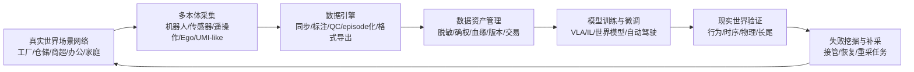

# 博登智能商业逻辑、商业计划与技术方案综述

> [!warning] 证据边界
> 本文基于 Bilibili 视频 `BV1q3TE6AE4b` 的 ASR 原文、source card 与已完成的单视频深研页综合而成。视频是 B 级线索，不是公司招股书、官网、工商、客户公告或融资公告。文中涉及博登智能的融资、客户、基地规模、机器人数量、营收、资质、专利、订单和产品名称，均应视为“视频称/待验证”。本文可用于理解商业叙事和研究框架，不能直接作为投资事实依据。

原始视频：[博登智能：估值超10亿，AI卖铲人闷声发大财](https://www.bilibili.com/video/BV1q3TE6AE4b)

## 一句话判断

视频中的博登智能叙事，本质上是在把传统 AI 数据标注公司升级为 [[_concepts/robot-training-data|Robot Training Data]] 时代的“真实世界数据工厂”：先用自动化标注平台吃下自动驾驶和多模态数据处理现金流，再用实体训练基地、跨本体采集平台、数据资产管理和现实验证体系，试图成为 [[_concepts/embodied-ai|Embodied AI]] / Physical AI 公司绕不开的数据基础设施节点。

如果这个叙事成立，博登智能卖的不是“人力标注小时”，而是三类稀缺资产：

| 资产 | 具体含义 | 商业价值 |
|---|---|---|
| 真实场景 | 工厂、仓储、商超、办公、家庭等可复现实训空间 | 降低客户自建训练场和数据采集团队的资本开支 |
| 数据生产机器 | 多传感器同步、遥操作、Ego/UMI-like 采集、自动标注、质检、episode 化 | 把原始物理交互转成可训练、可复训、可评测的数据资产 |
| 数据治理与验证 | 脱敏、确权、数据血缘、交易流通、行为/时序/物理/长尾验证 | 让数据从项目交付升级为平台、资产和持续复购 |

## 商业逻辑

### 1. 需求侧：Physical AI 缺的不是互联网数据，而是可执行的真实交互数据

数字 AI 可以从互联网文本、图片、视频中获得大规模预训练语料；Physical AI 面对的是机器人、自动驾驶、机械臂等真实执行系统，需要的是“观察、动作、语言、状态、结果、失败恢复”共同对齐的数据。视频把这个差异概括为：AI 不仅要看懂世界，还要理解并执行现实世界任务。

这与仓库既有判断一致：具身智能训练数据的价值不只在 episode 数量，而在 schema、质检、失败/接管标注、格式转换、baseline 复现和客户训练栈适配。也就是说，客户真正购买的不是“多少小时视频”，而是“这些数据能不能让模型在真实场景里更可靠”。

### 2. 供给侧：从人力外包升级为数据生产基础设施

视频叙事中的博登智能有三次定位升级：

| 阶段 | 视频中的定位 | 商业重心 | 关键变化 |
|---|---|---|---|
| 2019-2024 | AI 数据标注服务商 | 自动驾驶等数据加工项目 | 跑通现金流和交付流程 |
| 2024-2025 | 多模态 AI 数据处理基础设施 | 图像、视频、文本、点云、传感器数据处理 | 从人力密集转向平台和自动化 |
| 2025 以后 | 真实世界 AI 训练基础设施商 | 实景训练基地、全域采集、数据资产、现实验证 | 从软件平台扩展到软件 + 硬件 + 场地 |

这个升级逻辑的核心是定价单位变化：从按帧、按时长、按项目收费，逐步转向平台 license、私有化部署、训练基地容量、数据资产交易和验证服务。若能实现，客户切换成本会从“换一家标注供应商”变成“替换一整套数据闭环”，粘性显著提高。

### 3. 壁垒：不在单点算法，而在重资产、流程 know-how 和客户嵌入

视频反复强调的护城河不是某个模型领先，而是三层组合：

| 壁垒 | 视频叙事 | 我的判断 |
|---|---|---|
| 实体产能 | 三地训练基地、近 500 台机器人、真机数据年产能等 | 待验证；若真实存在，确实比普通标注平台更难复制 |
| 工程流程 | 德国工业式标准化、CMMI、质控体系、自动化平台迭代 | 这类 know-how 难从外部快速判断，但对 ToB 交付很关键 |
| 数据和客户嵌入 | 客户数据在平台上采集、处理、管理、验证 | 只要进入客户模型训练和验收流程，替换成本会提高 |
| 合规资质 | 数据交易所挂牌、脱敏、确权、隐私合规 | 数据资产化的必要条件，但挂牌和成交规模需继续核验 |

反过来，风险也来自同一组资产：基地和机器人是壁垒，也是固定成本；客户嵌入能带来粘性，也可能造成大客户依赖和回款压力；合规产品有政策想象空间，但如果数据交易成交规模不足，短期仍只是叙事加分项。

## 商业计划

这里的“商业计划”不是公司正式 BP，而是根据 ASR 原文和深研页反推的视频叙事路线图。

### 1. 战略目标

视频给出的口号是 “Train at scale, Validate in reality”，即规模化训练，并在真实世界中验证。对应的商业目标可以拆成三层：

| 层级 | 目标 | 关键成功指标 |
|---|---|---|
| 近期 | 保住数据处理现金流 | 数据处理收入、交付准确率、客户复购、项目毛利 |
| 中期 | 建成 Physical AI 数据基建 | 基地利用率、有效 episode 产能、跨本体适配数、平台 license 收入 |
| 长期 | 成为非结构化 AI 核心基础设施节点 | 数据资产交易规模、行业标准影响力、客户模型训练闭环中的不可替代性 |

### 2. 产品与收入结构

视频把博登智能的收入拆成三类：数据处理服务费、平台 license / 订阅费、数据资产交易分成。结合产品叙事，可以整理为：

| 产品/能力 | 视频中的角色 | 收入方式 | 战略意义 |
|---|---|---|---|
| BASE/贝思 自动化标注平台 | 当前现金流核心 | 按帧、按时长、按项目；SaaS 或私有化部署 | 用自动化替代人海标注，提高交付效率和毛利 |
| BreakRobot / Breck Robot 具身训练平台 | 第二增长曲线 | 真机采集、训练基地服务、定制训练方案、平台授权 | 把公司从数据加工推向机器人真实交互数据生产 |
| Blink / Link 数据资产管理平台 | 数据治理和资产化载体 | 数据管理平台、合规治理、交易分成 | 让数据可确权、可脱敏、可定价、可流通 |
| BIBOT 企业智能体平台 | 技术外溢产品 | 企业 workflow、政务/客服等应用 | 目前更像生态拓展，不是主增长引擎 |

视频给出的收入占比是：数据处理服务费 75%-85%，平台 license / 订阅费 10%-15%，数据资产交易分成约 5%。这些比例未验证，但它们揭示了一个合理的商业演进：先用项目制服务养活团队，再用平台化提高毛利，最后用数据资产化提高天花板。

### 3. 客户分层

视频把客户结构描述为金字塔：

| 层级 | 客户类型 | 需求 | 对博登智能的意义 |
|---|---|---|---|
| Tier 1 | 头部车企和智驾公司 | 自动驾驶数据标注、道路实景数据处理 | 稳定大单和行业背书 |
| Tier 2 | 科技巨头、云厂商、芯片公司 | 多模态数据对齐、大模型数据集 | 扩大数据类型和平台能力 |
| Tier 3 | 具身智能本体厂和模型公司 | 真机训练数据、机器人作业数据标准化 | 未来增长核心 |
| Tier 4 | 科研机构和创业公司 | 前沿任务验证、小规模数据包 | 技术验证和生态入口 |

这个分层的合理性在于：自动驾驶业务提供现金流，多模态大模型业务提供平台泛化，具身智能业务提供战略期权。但需要警惕的是，越往上游模型/机器人客户走，客户越可能自建数据团队；博登智能必须证明外部专业数据工厂比客户内部团队更便宜、更快、更标准、更可验收。

### 4. 资本使用和扩张计划

视频称 2026 年融资资金将用于完善三层能力生态：扩展真实世界场景网络、升级自动化数据引擎、建设现实世界验证体系。抽象成商业计划，就是：

1. 扩训练场：增加场景、机器人本体、采集设备和任务模板。
2. 升平台：把 BASE、BreakRobot、Blink 的能力从项目工具升级为可私有化、可审计、可复用的平台。
3. 做标准：建立行为验证、时序一致性验证、物理规则验证、长尾场景验证等验收口径。
4. 建飞轮：用模型失败案例反向驱动补采、重标、再训练、再验证。

真正要看的不是“产能小时数”，而是几个运营指标：

| 指标 | 为什么重要 |
|---|---|
| 基地利用率 | 决定重资产是护城河还是财务负担 |
| 有效 episode 成本 | 比采集小时数更接近客户真实 ROI |
| QC pass rate | 决定数据能否直接进入训练 |
| 客户训练效果提升 | 数据价值必须通过 holdout / rollout / 任务成功率体现 |
| 复购率和回款周期 | 数据服务公司最怕收入增长但现金流恶化 |
| 平台收入占比 | 衡量是否真的从项目制服务升级为基础设施 |

## 技术方案

### 1. 总体架构：场景网络 + 数据引擎 + 验证体系

视频中的技术方案可以概括为一个闭环：

这与 [[robotics-embodied-ai/research-notes/vla-world-model-data-infrastructure-platform-design-2026-07-06|VLA&世界模型数据基建平台系统调研与设计]] 的 episode-first 架构高度一致：核心对象不是视频文件，而是对齐后的 `observation + action + language + quality + outcome`。

### 2. BASE：多模态自动化标注引擎

视频称 BASE/贝思平台已经多代迭代，内嵌大量预标注模型和垂类模型，支持图像、视频、文本、点云和传感器数据。它的技术要点包括：

| 能力 | 含义 | 对商业的作用 |
|---|---|---|
| SOTA 模型定向微调 | 对 SAM、CLIP 等基础能力做工程化适配 | 降低纯人工标注比例 |
| 4D 时序拼接 | 在 3D 空间基础上加入时间维度，做跨帧一致标注 | 提高视频和自动驾驶数据处理效率 |
| 主动学习闭环 | 让模型只把不确定样本交给人工 | 把人力用于高价值样本，提升毛利 |
| 多交付方式 | SaaS、私有化部署、项目制 | 适配不同客户的数据安全和预算要求 |

BASE 的商业意义是“今天”：它承接自动驾驶和多模态数据处理的现金流，并为后续具身数据平台沉淀标注、质检、项目管理和客户交付能力。

### 3. BreakRobot：具身数据采集与重建平台

视频把 BreakRobot/Breck Robot 描述为“机器人培训学校”的核心平台。它要解决的是：如何把真实世界的人类操作、机器人执行和多传感器记录，变成机器人模型可学的数据。

| 技术点 | 视频中的描述 | 系统含义 |
|---|---|---|
| 多传感器同步 | 相机、IMU、音频、力矩等时间对齐 | 没有同步就无法建立可靠的 state-action 对 |
| 3D 骨骼重建 | 从第一视角或动作捕捉中还原动作 | 把人类示教映射到机器人动作空间 |
| 动作原子切分 | 把复杂任务拆成伸手、抓取、移动、放置等原子动作 | 支撑长程任务学习和失败定位 |
| 跨本体适配 | 视频称适配多种机器人型号 | 若成立，是平台化而非单机型服务的关键 |
| 失败和接管记录 | 视频提到开源数据集记录“什么时候需要人帮、怎么救回来” | 对强化学习、HIL 和真实部署改进价值很高 |

技术上，BreakRobot 最应该形成的不是“视频库”，而是具备任务、场景、机器人、本体、传感器、动作、成功/失败、接管、恢复、质检报告的 episode registry。这样才能对接 LeRobot、HDF5、Zarr、MCAP、RLDS、OpenVLA/OpenPI、ACT、Diffusion Policy 或企业自研训练栈。

### 4. Blink：数据合规、确权与资产化平台

视频中的 Blink/Link 负责从采集、治理、脱敏、确权到合规流转的全生命周期管理。它对应的是数据资产化问题：原始数据只有被清洗、标注、授权、定价、版本化、可审计之后，才可能从一次性交付变成可复用资产。

关键模块应包括：

| 模块 | 作用 |
|---|---|
| 数据目录 | 记录数据集、任务、场景、来源、采集设备、质量报告 |
| 脱敏流水线 | 处理人脸、车牌、商业敏感信息、家庭/工厂隐私 |
| 权限和审计 | 控制谁能访问 raw、processed、export 和客户私有数据 |
| 血缘与版本 | 追踪数据从采集、标注、清洗、导出到训练使用的全过程 |
| 确权和交易适配 | 服务数据交易所挂牌、授权、分成和合规证明 |

这里的挑战是：数据资产化不等于把数据挂到交易所。真正的难点是客户愿意为可复用、可验收、合规清晰的数据集持续付费，并且数据授权边界不会阻碍模型训练和商业部署。

### 5. BIBOT：企业智能体平台

视频中的 BIBOT 支持文本、语音、图像多模态交互和低代码 workflow 编排。与前三个产品相比，它更像数据平台能力的应用外溢：把数据处理、知识管理、流程编排能力迁移到政务、客服或企业自动化场景。

我的判断是，BIBOT 不是博登智能 Physical AI 数据基建叙事的核心。除非它能反向增强数据生产运营，例如自动生成标注规范、质检报告、客户交付文档、任务拆解和采集 SOP，否则容易变成与主线分散的通用企业智能体产品。

## 关键风险与待验证问题

| 类别 | 风险/问题 | 下一步应找的来源 |
|---|---|---|
| 公司主体 | ASR 出现博登、伯能、国登、博能等多种写法 | 工商、官网、公众号、融资公告 |
| 产品名称 | BASE/贝思、BreakRobot/Breck Robot、Blink/Link/Blinc 写法不一致 | 官方产品页、客户案例、软著/商标 |
| 融资估值 | 视频称 2026 年 A+ / A++ 融资、估值 10-18 亿元 | 投资方公告、权威媒体、公司新闻 |
| 客户订单 | 视频列举车企、大厂、机器人客户和千台级订单 | 客户侧公告、招投标、合同新闻 |
| 训练基地 | 三地 3 万平方米、近 500 台机器人、50 万小时产能 | 园区/政府新闻、设备采购、第三方探访 |
| 数据资产 | 10PB、数据交易所挂牌、百万小时 Ego/UMI 数据 | 交易所页面、数据产品目录、成交记录 |
| 经济性 | 重资产模式是否盈利 | 毛利率、基地利用率、回款周期、平台收入占比 |

## 结论

博登智能视频最有价值的地方，不是给出了一组公司指标，而是提供了一个具身智能数据服务商升级模板：从标注外包，到多模态数据处理平台，再到真实世界数据生产与验证基础设施。

这条路线的核心商业逻辑是：Physical AI 的瓶颈会从“有没有模型”逐步转向“有没有足够多、足够好、足够可验证的真实交互数据”；谁能把真实场景、采集工具、自动标注、质检、合规、训练格式和失败补采做成闭环，谁就有机会成为机器人基础模型时代的卖铲人。

但在一级来源补齐之前，博登智能仍应作为“高潜力线索”而非“已验证样本”处理。下一步研究应该优先验证公司主体、产品页面、训练基地、客户订单、融资公告和数据交易所记录；只有这些关键证据成立，才能把它正式纳入 [[robotics-embodied-ai/11-embodied-ai-data-service-companies-2026-06-02|具身智能数据采集和服务公司对比]] 的重点公司分析。

## 关联连接

- [[_syntheses/bilibili-boden-intelligence-data-infrastructure-deep-dive-2026-07-08|博登智能 Physical AI 数据基建视频深度调研]]
- [[_sources/bilibili-bv1q3te6ae4b-10-ai|博登智能：估值超10亿，AI卖铲人闷声发大财]]
- [[robotics-embodied-ai/research-notes/vla-world-model-data-infrastructure-platform-design-2026-07-06|VLA&世界模型数据基建平台系统调研与设计]]
- [[robotics-embodied-ai/09-training-data-deep-dive|机器人训练数据深度调研]]
- [[_concepts/robot-training-data|Robot Training Data]]
- [[_concepts/embodied-ai|Embodied AI]]
