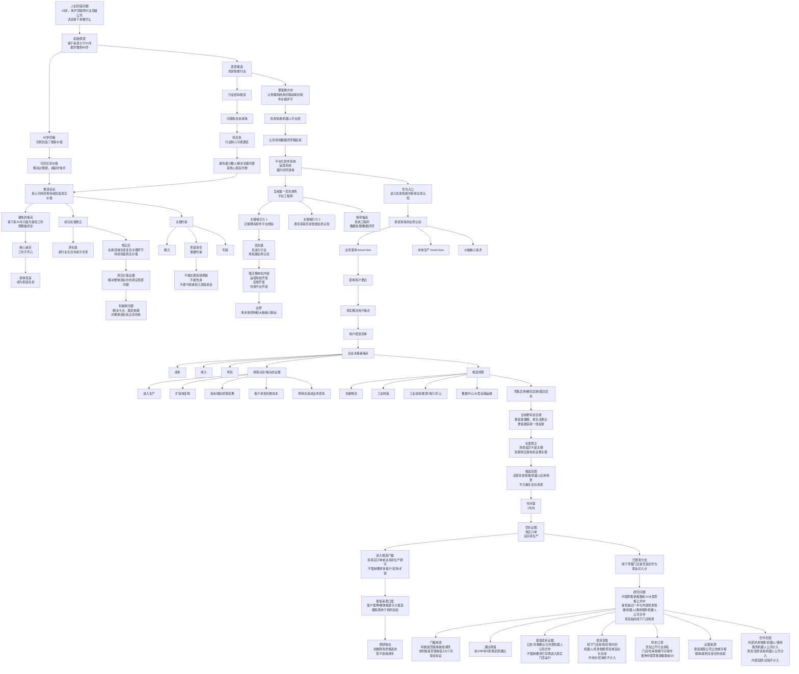

# 具身智能业务落地 know-how 职业方向思考

> [!summary]
> 这是一份基于 Thinking Partner 对话沉淀的职业方向综合，不是来源完备的行业研究结论。当前锚点是：通过 [[robotics-embodied-ai/00-index|具身智能]] 的业务落地 know-how，解决企业决策者的成本、收入或风险痛点。下一步要验证的不是“具身智能是否热门”，而是哪些真实场景存在可进入、可反馈、可长期创造价值的业务卡点。

> [!warning]
> 本页的用户目标、约束和职业偏好来自 2026-06-09 对话；行业判断和场景假设需要后续用 `raw/` 来源、客户访谈、招聘 JD、订单/复购证据继续验证。

## 当前锚点

我想在接下来 10 到 20 年里，做一件身心可持续、能够持续创造真实价值的事情。

更具体地说：我希望通过进入一个新领域，逐步积累全局认知和经验，并在其中负责复杂且不可替代的关键环节。当前更准确的方向锚点是：

> 通过具身智能的业务落地 know-how，解决企业决策者的成本、收入或风险痛点。

这个锚点比“进入具身智能行业”更准确。具身智能不是目标本身，而是一个候选领域；真正的目标是找到一个长期有真实问题、反馈清晰、能持续创造价值、同时不牺牲健康和家庭责任的方向。

## 目标澄清

### 最初表述

- 43 岁，软件开发和互联网行业 20 年经验。
- 离开了行业内最好的公司。
- 想决定接下来干什么。
- 希望接下来的事情至少能做 10 年，最好做到 60 岁。
- 初步选择具身智能行业，但感觉自己在这个行业里没有明显优势。

### 第一层目标

到 60 岁回顾过去 10 多年时，可以对别人说：这 10 多年仍然创造了很多价值。

另一个现实目标是：这几年收入至少能维持家庭支出。但后续澄清中，收入不是最核心约束，也不是家庭维持的必要条件。

### 更深层 Why

- 如果一生没有创造一些价值，尤其是不那么平凡的价值，会感觉白活。
- 年纪更高、不能再创造价值时，可以回忆这些经历，这会带来快乐。
- 过去 20 年中，回忆自己解决过的难题，并讲给别人听，会带来快乐。
- 因此，“可回忆的价值”很重要。

### 目标变化

最开始以为核心是“创造不平凡的外部成果”。后来澄清为：对现在的我来说，更重要的是完成一次高难度的自我转变。

进一步追问后发现，“自我转变”也不是最终目标，而是回应旧行业价值下降、AI 冲击和软件开发行业结构变化的一种方式。

更深的核心痛点是：

> 不希望接下来 20 年只是为了保住工作而委曲求全，每天工作不开心。

工作占人生时间比例很高。如果长期不开心，会影响身体；身体不好会带来更大痛苦，也可能成为家庭负担。

因此，更稳定的底层目标是：

> 接下来 10 到 20 年，做一份能让身心状态可持续的工作。

## 成功标准

### 原始成功标准

在新行业生存下来，并成为专家。

### 后续修正

“成为专家”不是最终必要条件。即使最终没有成为能解决关键问题的专家，只要持续创造了真实价值，也会对自己满意。

更准确的成功标准是：

> 在新领域里，通过负责复杂关键环节，持续创造真实价值。

### 真实价值的证据

最初提出的证据：

- 做出来的东西真的有用户在用，并且反馈好。
- 或者确认自己解决的是整体目标中的某个真实局部问题，而不是伪命题。

早期判断时，更优先选择第二类证据：

> 自己解决的是整体目标里的真实局部问题。

因为真实用户的正反馈、客户买单和产品数据指标都有较长 delay，更适合最终判断商业闭环是否真实。

### 如何判断不是伪命题

一个局部问题如果满足以下条件，更可能是真问题：

- 它解决的是整体目标中的卡点。
- 它满足了关键依赖。
- 它对整体目标有正向作用。
- 停掉它会影响业务进展，而不只是影响展示效果。

## 关键约束

已确认的重要约束：

- 精力。
- 家庭责任。
- 年龄。

其中最硬的是家庭责任。

家庭责任对方向选择的具体约束：

- 不能过于劳累，比如长期加班、熬夜。
- 不能把身体搞坏。
- 不能让自己成为家庭负担。
- 不能亏钱做这件事。
- 不能投入家庭资金。

收入本身不是核心问题。接下来的工资收入并不是维持家庭的必要条件。

## 行业结构假设

具身智能最初的吸引点包括：

- 行业还有很多要解决的问题。
- 问题不集中。
- 很多问题尚无成熟解法。
- 动手机会多，不只是坐在电脑前或开会。
- 能接触物理世界。
- 可能更容易看到反馈。

经过澄清后，最重要的吸引点是：

> 问题多且未成熟。

这个吸引点背后的真实原因：

- 机会多。
- 行业耐心可能更足。
- 不容易形成“极少数人解决关键问题，其他人都可有可无”的结构。
- 可以降低疯狂内卷对身心可持续的破坏。

因此，对候选行业的结构要求是：

> 问题足够多、卡点足够分散，让我不必靠高强度内卷来证明自己还有位置。

## 更准确的方向表达

“具身智能行业”太宽泛，也容易落入本体、控制、硬件、前沿算法等自己没有优势的位置。

更合理的锚点是：

> 让物理系统真的跑起来的软件关键环节。

在具身智能/机器人平台层中，当前最吸引的关键环节是：

> 让仿真和数据闭环跑起来。

这个方向的吸引力来自：

- 离机器人本体远一些。
- 能发挥软件开发经验优势。
- 可以逐步积累和迁移具身智能相关知识和技能。
- 可以作为进入具身智能并获得全局认知的入口。

## 希望获得的全局认知

如果“平台/运营系统”只是入口，那么 3 年后希望通过这个入口获得的全局认知包括：

- 具身智能行业的业务落地 know-how。
- 本体生产 know-how，例如供应链管理。
- 具身智能大脑的核心技术。

其中，最能支撑未来 10 年持续创造真实价值的是：

> 具身智能行业的业务落地 know-how。

原因：

- 它距离用户更近。
- 真实价值最好的 metric 是真实解决用户痛点。
- 用户愿意买单，是价值的重要证据。

## 企业痛点焦点

当前更关心的用户痛点不是一线使用者的效率、安全、体验痛点，而是：

> 企业决策者的成本、收入或风险痛点。

这不是说一线反馈不重要，而是最终商业闭环需要企业决策者愿意买单，尤其是愿意复购。

早期阶段，一线使用者反馈很重要，因为：

- 真实客户买单，尤其复购，有 delay。
- 产品数据指标也有 delay。
- 一线反馈能更快形成 feedback loop。
- 快速反馈能让事情进展更快。

## 排除试点和噱头的证据

用于判断某个具身智能方向是否真的在解决企业决策者的成本、收入或风险痛点：

1. 从试点进入生产，而不是停留在 demo、展会、联合实验室或 POC。
2. 客户愿意扩容或复购，比如从一个点位扩到多个场地，或从一个流程扩到多个流程。
3. 指标绑定真实经营结果，例如降低人工成本、减少停机、提高吞吐、减少损耗、提升良率、降低安全事故。
4. 客户愿意承担真实切换成本，例如改流程、接系统、培训员工、承担上线风险。
5. 系统停掉会造成真实业务损失，而不只是少一个创新展示。

一句话版本：

> 客户愿意为它付费，并且愿意把它接入真实业务流程；上线后指标能指向成本、收入或风险；后续有扩容、复购或跨场景复制。

## 候选场景

已讨论过的场景包括：

- 仓储物流。
- 工业制造。
- 商业服务。
- 养老医疗。
- 工业巡检 / 能源 / 化工 / 电力 / 矿山。
- 建筑 / 工地自动化。
- 农业 / 精准农业。
- 矿山 / 港口 / 园区 / 机场等封闭或半封闭场景。
- 能源与公用事业。
- 公共安全 / 消防 / 应急救援。
- 国防 / 安防 / 边境 / 特种场景。
- 数据中心 / 机房 / 大型设施运维。
- 零售后场 / 餐饮后厨 / 酒店后台。
- 高价值设备维护 / 航空航天 / 船舶 / 铁路。

根据当前反馈，最有亲近感的新增场景是：

> 零售后场 / 餐饮后厨 / 酒店后台。

原因：

- 更容易理解。
- 离生活更近。
- 更适合作为切入点。
- 更容易得到一线使用者反馈。

## 当前待验证问题

下一步不应直接设计方案，而应继续验证：

- 哪些场景在短期内更可能出现真实订单或试点转生产。
- 哪些任务真的存在企业决策者愿意买单的成本、收入或风险痛点？
- 哪些场景存在足够多、足够分散、足够长期的真实卡点？
- 是否存在平台化软件、运营系统、仿真和数据闭环可以发挥作用的位置？
- 是否能以不牺牲健康、不投入家庭资金的方式进入？
- 是否能通过一线使用者反馈获得快速 feedback loop？

### 角色选择标准修正

跨场景候选池 v0.1 之后，新的判断是：

> 除医疗手术机器人过于硬核、暂不适合作为职业切入点之外，其他短期落地场景当前没有明显差异。

因此，下一层决策变量从“场景”转向“角色 / 岗位”：

- 系统工程师。
- 平台工程师（第一优先验证）。
- 数据处理 / 数据闭环相关角色。

这些角色更接近 20 年软件开发经验，也更接近此前确认的入口：让物理系统真的跑起来的软件关键环节、平台化软件系统、运营系统、仿真和数据闭环。

当前第一优先验证角色是：

> 平台工程师。

它的关键吸引力不是岗位名称本身，而是同时满足两个进入目标：

- 能迁移既有的软件平台经验，让 20 年开发经验继续产生复利。
- 能作为进入具身智能的入口，在真实项目中逐步获得全局认知。

如果一个岗位只能强满足其中一个，当前优先选择“经验迁移更强”。原因是先有工作进入行业，才有机会在真实环境中逐步拓展到全局认知、业务落地 know-how、本体、数据闭环和大脑技术。

当前认为更能强迁移既有经验的岗位内容包括：

- 运营系统开发。
- 后端开发。
- 仿真平台开发。

相对边界：岗位最好离机器人本体控制和“大脑”核心技术稍远一点。它们重要，但不是当前最利于发挥既有优势、低摩擦进入行业的入口。

原因是：当前没有嵌入式编程和大模型训练经验。如果第一阶段直接切入本体控制或大脑核心技术，会更像从零开始竞争，削弱 20 年软件开发经验的迁移价值。它们仍是长期需要理解的领域，但不适合作为第一份进入行业工作的主战场。

系统工程师和数据处理 / 数据闭环相关角色暂作为相邻备选，后续用于对照平台工程师岗位是否更能进入真实项目、发挥软件经验并获得业务落地 know-how。

### 场景选择标准修正

线下零售门店初扫之后，场景选择标准发生了重要修正：

> 场景差异本身不是当前职业决策里的关键；短期应用前景更重要，因为只有短期真实落地，才更可能形成真正的 feedback loop。

因此，下一轮调研不应先问“哪个场景更有亲近感”，而应问：

> 哪个场景更可能在短期出现真实订单或试点转生产，并让人进入真实项目中学习业务落地 know-how。

当前确认的时间窗是：

> 短期 = 1 年内。

当前确认的候选范围是：

> 全部具身智能/机器人应用场景都纳入比较，不只看零售、餐饮、酒店等生活近场景；工业、仓储、巡检、能源、制造等场景也纳入。

当前确认的短期落地证据优先级是：

- 真实订单。
- 试点转生产。

当前确认的进入候选门槛是：

> 某个场景只要出现真实订单或试点转生产证据，即可进入“优先切入点”候选；不要求一开始就看到多家公司、多客户、复购或扩容。

当前确认的证据来源口径是：

> 客户案例和媒体报道可以作为“进入候选”的最低证据，但内容必须指向真实订单或试点转生产；公司公告、年报、招股书、政府/客户采购公告等更硬来源作为更强证据，用于后续排序和加权。

当前确认的调研输出形式是：

> 先做跨场景候选池，不直接给出优先级排序。候选池只要求记录进入候选的证据、证据来源强弱、是否指向 1 年内真实订单或试点转生产。

招聘热度、展会 demo、联合实验室和概念发布只能作为线索，不能替代真实订单或试点转生产。

## 已澄清分支：线下零售门店是否适合作为职业切入点

本轮澄清后，问题从“零售后场有哪些具体机会”回到更上层的职业切入点判断，并进一步放宽为“线下零售门店场景是否存在足够实践机会”：

> 线下零售门店场景是否有足够多真实客户合作机会，让我能进入实践场景，而不是停留在自学或个人项目。

选择零售后场作为优先验证场景的原因：

- 相比餐饮后厨或酒店后台，零售后场的场景标准化程度更高。
- 标准化程度更高，意味着更容易衡量操作效果。
- 更容易衡量，意味着更容易形成数据飞轮。
- 更容易形成数据飞轮，意味着更容易发现真实问题并提升迭代速度。

### 当前研究问题

用于判断“线下零售门店是否适合作为职业切入点”的研究问题是：

> 中国市场中，按零售销售额排名前 10 的大型零售公司里，是否有超过一半已经与外部具身智能、机器人或通用服务机器人公司启动线下门店场景的机器人/具身智能项目。

这个“超过一半”的门槛同时用于判断：

> 线下零售门店场景是否值得继续调研，以及是否值得作为职业切入点投入 6 个月验证。

判定口径：

> 前 10 公司中有 5 家满足条件，即视为门槛通过。

### 样本口径

- 地域：中国市场。
- 公司范围：大型零售/电商公司。
- 排名口径：优先使用公开行业排名；如果拿不到统一的门店/仓库规模排名，则使用中国零售销售额前 10。
- 替代口径理由：零售销售额在一定程度上可以反映企业规模，比 GMV/平台交易额或公司总营收更贴近零售业务本身。
- 零售范围：线下零售门店场景，包括商超、生鲜、便利店、仓储会员店等门店前场和门店后场；不把电商/零售公司的中央仓、区域仓或纯仓配体系计入。
- 项目范围：只算线下门店场景内的机器人/具身智能项目和自动化仓库；门店前场的导购、巡店、清洁、安防等机器人项目计入；不把一般计算机视觉、智能货架、自动补货、智能物流、数字化运营等宽泛零售自动化项目计入，除非它们明确包含门店场景内的机器人/具身智能系统或自动化仓库。
- 合作范围：必须有外部具身智能、机器人或通用服务机器人公司参与；清洁机器人、安防巡检机器人等通用服务机器人公司计入；大型零售公司内部自研或内部试验不计入。

### 最低项目证据

行业仍处初期，因此早期标准可以相对宽泛。当前最低标准是：

> 公司公告或年报确认大型零售公司与外部具身智能、机器人或通用服务机器人公司合作，且合作内容指向线下门店场景的机器人/具身智能项目或自动化仓库项目。

暂不要求公告或年报明确写明项目已经进入真实门店运行，也暂不要求已经证明复购、扩店或长期 ROI；这些更适合作为后续更强证据。

### 证据来源口径

判断“进入真实门店或仓库运行”时，最低接受证据为：

> 公司公告或年报。

媒体报道、案例文章、展会材料、供应商宣传和采访可以作为线索，但不能单独作为确认该项目合作存在的充分证据。

### 分支状态

- 已完成澄清：判断零售后场职业切入点所需的核心外部证据。
- 已完成澄清：样本排名口径优先用公开行业排名；若门店/仓库规模口径不可得，则使用中国零售销售额前 10。
- 已完成澄清：项目落地证据最低接受公司公告或年报；媒体报道和案例文章只作为线索。
- 已完成澄清：项目范围中“自动化仓库”计入；“智能物流”等其它泛化说法不计入，除非明确包含机器人/具身智能系统或自动化仓库。
- 已完成澄清：中央仓、区域仓和纯仓配体系不计入；必须发生在线下零售门店场景。
- 已完成澄清：必须有外部具身智能、机器人或通用服务机器人公司参与；清洁机器人、安防巡检机器人等通用服务机器人公司计入；零售公司内部自研或内部试验不计入。
- 已完成澄清：公告/年报确认与外部机器人公司合作即可计入；不要求公告/年报明确说明项目已经进入真实门店后场运行。
- 已完成澄清：门店前场的导购、巡店、清洁、安防等机器人项目也计入，不再只限于门店后场。
- 已完成澄清：“超过一半前 10 公司有合作”同时作为值得继续调研和值得投入 6 个月验证的门槛。
- 已完成澄清：前 10 公司中有 5 家满足条件，即视为门槛通过。
- 待调研验证：中国零售销售额前 10 的大型零售公司名单，以及各自是否存在与外部具身智能、机器人或通用服务机器人公司合作并进入线下门店场景的公开证据。

## 思考拓扑图

## 当前一句话总结

我不是单纯想追逐具身智能热点，而是在寻找一个与物理世界相关、问题分散且长期存在、可以发挥软件经验、能通过业务落地 know-how 解决企业成本/收入/风险痛点，同时不牺牲健康和家庭责任的新领域入口。

## 关联连接

- [[robotics-embodied-ai/00-index|机器人（具身智能） - 研究入口]]
- [[robotics-embodied-ai/06-career-view|机器人职业视角]]
- [[retail-store-robotics-entry-scan-2026-06-10|线下零售门店机器人合作验证初扫]]
- [[robotics-embodied-ai/12-robotics-engineering-platforms-2026-06-04|机器人工程平台综合调研]]
- [[_concepts/embodied-ai|Embodied AI]]
- [[_concepts/robot-training-data|Robot Training Data]]
- [[index|Knowledge Index]]
