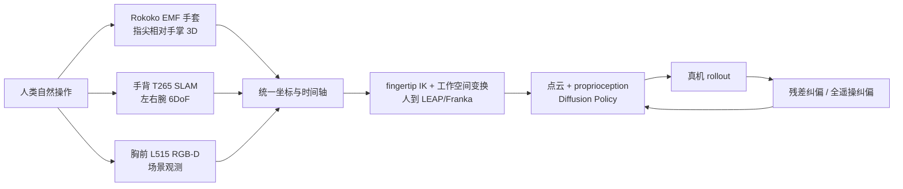

# DexCap 灵巧操作动捕数据采集系统深度调研

> [!summary] 结论摘要
> **DexCap 最有价值的创新不是一件手套，而是把“自然人手示教”编译成机器人可学习 episode 的完整链路。**它用电磁手套记录手指、手背 SLAM 相机记录腕部 6DoF、胸前 RGB-D 记录环境，再用 fingertip IK、坐标变换和点云 Diffusion Policy 缩小人手与 LEAP Hand 的 embodiment gap。
>
> 论文证明了这条路线的研究可行性，但没有证明规模商业可行性。作者报告在前三个任务各用 30 分钟人类数据，默认模型平均成功率 72%；Packaging 用 1 小时、104 条示教达到 47% 完整任务和 40% 未见物体成功率。剪刀和泡茶在纯人类数据下完整任务为 0%，加入 30 次人工纠偏后分别只有 20% 和 25%。这恰好说明：**便携采集提升吞吐，不会自动消除力觉缺失、视觉盲区、精细接触和跨本体差异。**
>
> **2026 年不建议照搬原 BOM 直接量产。**论文使用 Intel RealSense T265/L515 与 Rokoko 手套，续航约 40 分钟、预算低于 US$4,000；官方仓库截至 2026-08-09 的默认分支最后提交仍是 2024-08-18。代码 MIT 开源，但硬件、Rokoko 软件/协议、数据和第三方依赖并不因此自动获得同一许可。
>
> 总置信度：**高**（论文机制、作者实验、代码边界），**中低**（当前可采购 BOM、跨操作者稳定性、商业 TCO 与客户复购）。

## 1. 分类与研究边界

| 字段 | 定义 |
|---|---|
| 主分类 | `R04 技术原理、论文与前沿方向调研` |
| 次分类 | `R05 产品、平台与工具选型`、`R07 商业落地与需求真实性` |
| 分类理由 | 研究重点是 DexCap/DexIL 的数据采集与学习机制，并判断其是否适合中国灵巧操作数采 PoC 和服务化。 |
| 覆盖 | 硬件、数据流、重定向、策略学习、论文实验、代码/许可、失败模式、商业与创业机会、PoC。 |
| 不覆盖 | 不独立复现实验；不提供当前完整采购报价；不把作者实验换算为客户 SLA、收入或市场份额。 |

## 2. 它解决什么问题

传统真机遥操作产生的是 robot-native action，物理一致性较好，但机器人占用、动作慢、碰撞风险与运维成本高。普通视频便宜且易扩展，却缺少可靠的 3D 手指/腕部动作、力和机器人执行语义。DexCap 选择中间路线：让人直接在真实环境完成任务，同时用穿戴传感器获取可重定向的三维动作和同步场景观测。

## 3. 系统组成与数据产品

| 层 | 论文/代码实现 | 输出 | 关键边界 |
|---|---|---|---|
| 手指动捕 | 双 Rokoko 电磁手套，60 Hz | 左右手指关节/指尖相对手掌位置 | 抗视觉遮挡，但受商用设备、校准和潜在磁干扰约束 |
| 腕部位姿 | 两台手背 T265 + 第三台胸前 tracking camera | 世界系中左右腕 6DoF | SLAM 会失跟踪/漂移；原硬件已非稳健量产供应链 |
| 环境观测 | 胸前 RealSense L515 | RGB、depth、点云 | 移动视角、遮挡、反光透明物和视野外目标仍会失败 |
| 便携计算 | NUC 13 Pro + 40,000 mAh power bank | 本地录制 | 作者报告背包 3.96 lb、约 40 分钟续航 |
| 标定 | tracking cameras 先插入胸前固定槽，再移到手背 | 相机间初始外参 | 作者称穿戴/校准约 10 秒；多操作者/长时重复精度未系统报告 |
| 重定向 | 指尖 IK，舍弃小指，映射到 16-DoF LEAP Hand | 双臂腕位姿 + 手关节目标 | LEAP 手约比人手大 50%，指尖对齐不等于接触/力等价 |
| 策略 | 点云 Perceiver + Diffusion Policy | 两臂两手、46 维、20-step action sequence | 20 Hz 位置控制；没有力/触觉闭环 |
| 数据格式 | frame 目录原始数据；处理后 robomimic HDF5 | 可训练 dataset | 不是 LeRobot 原生格式；生产还需 schema、QC、版本和 provenance |

证据：[`SRC-robotics-277`](../../../raw/robotics-embodied-ai/documents/SRC-robotics-277-dexcap-scalable-and-portable-mocap-data-collection-system-for-dexterous-manipula.md)、[`SRC-robotics-504`](../../../raw/robotics-embodied-ai/documents/SRC-robotics-504-dexcap-official-code-repository-at-commit-4b0bed0.md)。

## 4. 实验结果：能证明什么，不能证明什么

所有结果均为作者在双 Franka + 双 LEAP Hand 系统上的实验；每个常规模型/任务随机初始位置测试 20 次，Packaging 对 6 个训练物体做 30 次、9 个未见物体做 45 次。

| 任务 | 人类数据 | 纯 DexCap 默认模型 | 加 30 次人工纠偏 | 正确解释 |
|---|---:|---:|---:|---|
| Sponge picking | 30 min / 251 demos | 85% | 未报告 | 受控单手抓取可学 |
| Ball collecting | 30 min / 179 demos | 60% | 未报告 | 不是所有简单任务都达到高可靠 |
| Plate wiping | 30 min / 102 demos | 70% | 未报告 | 展示双手协调，不等于工业节拍/耐久 |
| Packaging | 1 h / 104 demos / 10+ scenes | 47% full；40% unseen | 57% full；42% unseen | 人工纠偏改善训练物体，未见物体增益很小 |
| Scissor cutting | 1 h / 96 demos | 0% full | 20% full；45% subtask | 精细工具使用仍远离生产可靠性 |
| Tea preparing | 1 h / 55 demos | 0% full；30% uncap | 25% full；65% uncap | 长程任务依赖纠偏，主要失败在精细夹取 |

作者还报告 Ball collecting 的采集吞吐约为传统遥操作 3 倍，接近人类自然动作速度。它只证明该任务/装置下的 throughput，不包含穿戴、校准、清洗、漂移修正、失败重采、模型训练和真机验证的端到端有效小时成本。

## 5. 为什么点云路线有效

- 胸前相机随人体移动，直接 RGB 图像会把视角变化和“人手/机器人手外观差”混入学习问题。
- DexIL 把 RGB-D 转到稳定世界坐标系，裁掉桌面等无关区域，再把机器人手 FK mesh 点云加入观测。
- 论文中直接使用完整 RGB 的 BC-RNN/Diffusion Policy 成功率为 0；点云路线在前三项任务均超过 60%，默认 Perceiver 版本平均 72%。
- 这支持“几何归一化可缩小视觉 embodiment gap”，但不证明点云对所有相机、场景或 VLA 都优于 RGB。

## 6. 关键失败模式与反方证据

| 风险/反方证据 | 论文证据 | 工程后果 | 验证方式 |
|---|---|---|---|
| 无力/触觉 | 作者明确列为限制；Packaging 关盒时难稳定箱体 | 位置正确仍可能滑动、夹坏或无法施力 | 加触觉/力矩；contact-rich A/B |
| 人手到机器人手差异 | LEAP 手更大、手指比例不同；剪刀需深插握环 | fingertip IK 不是接触拓扑/力传递 | retargeting residual、接触约束、真机可执行率 |
| 胸前视野盲区 | Packaging 箱盖会移出视野 | 训练标签存在但 policy 看不到目标 | 多视角/腕相机；visibility QC |
| 续航仅约 40 分钟 | 论文明确限制 | 换电、热、存储和操作员节奏削弱吞吐 | 4 小时 shift soak test |
| 原关键硬件生命周期 | T265/L515 已不适合作为新量产 BOM 的稳定假设 | 复现需替代追踪/RGB-D，标定和代码需重做 | 现代传感器替代 A/B |
| 仓库维护停滞 | 2026-08-09 审计时 head 仍为 `4b0bed0`（2024-08-18） | Windows/Ubuntu/Python/驱动依赖维护由采用方承担 | 干净环境复现、SBOM、依赖锁定 |
| 无商业真实性证据 | 公开材料是研究页面、论文、代码/数据 | 不能据此声称付费试点、复购、收入或规模部署 | 客户合同、回款、重复交付与现场 KPI |

## 7. 代码、数据与许可边界

- 官方仓库覆盖采集、处理、HDF5 数据集构建和 policy training，根目录许可证为 MIT。
- 采集端依赖 Windows、Rokoko Studio/手套、相机驱动、Redis；训练端为 Python 3.8-era，依赖 robomimic、Diffusion Policy、Deoxys、LEAP Hand API。
- 原始/处理数据链接到 Hugging Face；公开可下载不应自动理解为可用于任意商业训练或再分发，必须逐项读 dataset card/terms。
- MIT 只覆盖仓库有权许可的代码，不自动覆盖硬件 CAD、商用设备 SDK、数据、品牌素材及第三方依赖。

## 8. 与相邻路线的选型关系

| 路线 | 优点 | 缺点 | 适合 |
|---|---|---|---|
| DexCap 式人类动捕 | 自然动作快、无需占用采集机器人、抗手指视觉遮挡 | 跨本体 gap、无力觉、穿戴与标定、传感器供应链 | 大规模动作先验、候选任务发现、初始 policy |
| 真机遥操作 | action 物理一致、能保留机器人观测/力觉 | 吞吐、设备占用、碰撞与运维成本高 | 精细接触、最终微调、客户现场数据 |
| UMI/同构手持接口 | action/末端结构更接近目标机器人、便携 | 通常低于人手自由度；接口限制自然灵巧性 | 夹爪/末端工具任务的规模示教 |
| 普通 ego 视频 | 规模最大、成本最低、历史存量多 | 3D、力、尺度、时间同步与 robot action 缺失 | 表征预训练、任务语义、弱监督先验 |
| 外骨骼/同构灵巧手 | 接触/运动学更贴近机器人 | 穿戴负担、硬件成本、操作者适配 | 高价值灵巧接触数据 |

最佳生产方案更可能是分层混合：人类动捕扩任务与先验，真机遥操作/纠偏补物理一致性，失败与接管数据完成闭环，而不是由单一路线包办全部数据。

## 9. 商业应用可能性

### 客户与价值链

| 角色 | 最可能主体 |
|---|---|
| 使用者 | 数据采集员、机器人学习工程师、算法研究员 |
| 决策者 | 具身智能负责人、数据/算法平台主管、机器人产品负责人 |
| 采购者/付款者 | 机器人公司、研究院、高校实验室、垂直自动化集成商 |
| 预算来源 | 研发/数据工程预算；不是终端生产线运营预算，除非通过 rollout ROI 证明 |

最可能的首批场景是双手包装/整理、柔性日用品操作和工具任务探索，因为它们有人手示教优势、又比夹爪任务更需要手指动作。当前成熟度应定为**研究原型/可复现 PoC**，没有证据升级为重复采购或规模化。

- **近期 1–2 年：中等可能性，中等置信度。**适合研究机构和机器人公司内部 PoC、现有数据工厂的灵巧数据补充线；价值指标必须是每个有效 episode 全成本、retarget 可执行率和真机增益。
- **中期 3–5 年：有条件的中高可能性，低到中等置信度。**条件是现代传感器替代、力触觉加入、跨本体重定向、自动 QC、LeRobot/OXE 等格式与真机 holdout 形成标准交付。

从试点到规模订单的门槛：4–8 小时稳定班次、多操作者一致性、现代 BOM 可采购、episode 合格率、策略相对 robot-only baseline 的增益、数据权利和现场安全。

## 10. 中小型创业者的机会

| 分层 | 机会 | MVP / 首个收费交付物 | 资本与周期 |
|---|---|---|---|
| 可立即验证 | DexCap-compatible 数据编译与 QC | 导入原始 frame，输出 LeRobot/robomimic episode、同步/漂移/可见性/IK 质量报告 | 2–4 人；低资本；4–8 周 |
| 可立即验证 | 现代传感器替代与集成服务 | 用现售 RGB-D + wrist tracker/手套复现 1 个任务，交付 BOM、标定包、SOP、基准报告 | 中低资本；6–10 周 |
| 可立即验证 | 人类数据 + 真机纠偏的数据服务 | 交付 1 个客户任务的数据包、baseline policy、20+ 真机 holdout 与失败集 | 中资本；8–12 周 |
| 需要条件成熟 | 力/触觉穿戴采集插件 | 同步 contact/force schema 与 contact-rich 增益 A/B | 需要硬件合作方 |
| 需要条件成熟 | 跨灵巧手 retargeting SaaS/SDK | 同一人类 episode 映射 2–3 种手并报告可执行率 | 需要本体/手型数据和大量真机验证 |
| 不建议进入 | 只复制 2024 原 BOM 卖“整机数采背包” | 供应链和维护风险高、易被集成商替代 | 硬件库存与售后重 |
| 不建议进入 | 出售“小时数”而不交付任务增益 | 容易产生不可训练/不可迁移数据，客户不会稳定复购 | 数据资产壁垒虚弱 |

头部团队愿意外购的理由不是“不会搭硬件”，而是供应商能承担跨设备驱动、标定、操作员 SOP、QC、数据 schema、失败补采与基准回归这些脏活。护城河来自跨任务质量数据库、retargeting 失败模式、交付流程和客户真机闭环，不来自胸前相机支架。

## 11. 推荐 PoC 与验收门

先选一个单手 pick-place 和一个双手 contact-rich 任务，比较四组：`robot teleop only`、`DexCap-like only`、`naive mix`、`quality-gated mix + correction`。

| 门 | 指标 | 建议停止条件 |
|---|---|---|
| 采集 | 连续采集时长、重启/失跟踪、同步丢帧、有效 episode/h | 无法完成 2 小时连续采集或有效吞吐不优于遥操 |
| 标定/重定向 | wrist/fingertip 误差、机器人工作空间可达率、碰撞率 | 超 10% episode 需大量手工修正，或目标手接触拓扑无法映射 |
| 数据 | schema 完整、provenance、视野覆盖、自动 QC precision/recall | 无法自动发现主要坏数据，人工成本吞噬吞吐优势 |
| 学习 | 固定 seeds 的成功率、未见物体、失败类别 | mix 不优于等成本 robot-only baseline |
| 商业 | 每个有效 episode 全成本、部署时间、维护工时 | 客户节省不足以覆盖硬件折旧、集成和售后 |

## 12. 风险、证伪条件与监测指标

结论会被以下证据改变：现代 markerless hand/object reconstruction 在目标遮挡下达到同等 3D 精度与更低 TCO；同构真机接口达到相同吞吐且策略增益更高；或 DexCap-like 数据在多本体 holdout 中持续无法超过 robot-only baseline。

每月/每版本监测：有效 episode/h、SLAM lost rate、校准漂移、retarget 可执行率、人工清洗分钟/有效分钟、真机成功率与置信区间、未见对象/场景增益、纠偏次数、BOM 交期、依赖安全与许可变更。

## 13. 待验证事项与下一步

- `待验证`：2024 hardware update 的完整 BOM、当前替代硬件、真实采购价和许可证。
- `待验证`：公开数据集的 dataset card、商业使用/再分发权和完整 schema。
- `待验证`：跨操作者标定、长时漂移、磁干扰、透明/反光物体和多场景数据质量。
- `待验证`：统一算力/数据预算下，对现代 UMI、Vision Pro/markerless、外骨骼与真机遥操的端到端对比。
- 下一步：做 6–10 周双任务 PoC；只有通过采集、重定向、训练和商业四级门，才进入硬件产品或数据服务立项。

## 14. 关联连接与来源

- [[DexCap|DexCap 实体页]]
- [[_sources/dexcap-paper-project-code-source-set|DexCap 论文、官网与代码来源集]]
- [[ego-video-to-dexterous-hand-training-data-system-design-2026-07-14|Ego 视频到灵巧手训练数据]]
- [[teleoperation-training-data-cost-and-share-2026-07-09|遥操训练数据成本]]
- [[robot-training-data-value-evaluation-2026-06-29|机器人训练数据价值评估]]
- [项目官网](https://dex-cap.github.io/)
- [RSS 2024 论文](https://www.roboticsproceedings.org/rss20/p043.html)
- [固定提交代码](https://github.com/j96w/DexCap/tree/4b0bed0966c87368f3cde4476aadb7585c3b94b5)

