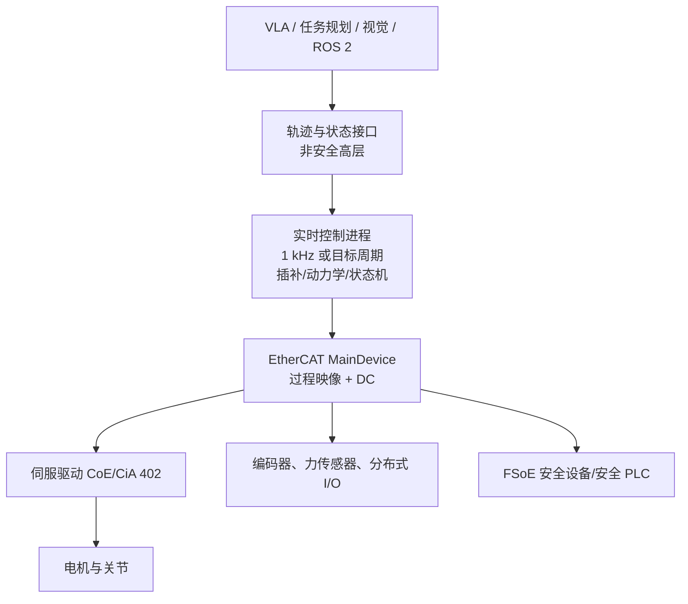

# EtherCAT 技术原理、产业生态与机器人工程选型深度调研

> [!summary] 先给结论
> **EtherCAT 是高性能运动控制和分布式 I/O 的成熟底层网络，不是机器人智能本身。**它的关键不是把普通以太网“跑快”，而是让一个以太网帧穿过各从站时由硬件就地读写过程数据，再用分布式时钟对齐采样和输出，从而在多轴伺服、半导体设备、机床、包装、测试测量和机器人关节控制中获得短周期、低抖动与可诊断性。
>
> **对自研机器人，EtherCAT 最值得用于控制器—驱动器—编码器/I/O 的确定性内环；ROS 2、VLA、视觉和任务规划留在上层。**但“用了 EtherCAT”不等于整机硬实时：Linux 调度、主站栈、NIC/驱动、控制算法 WCET、驱动器模式、安全回路和布线都可能成为瓶颈。
>
> **生态成熟但不是无锁定。**协议已进入 IEC 61158/61784，MainDevice 实现许可免版税，ESC 芯片通常内含许可；可是技术本身并非开源，设备开发还涉及 Vendor ID、ESI、CTT、一致性、profile 与供应商工具链。开源 SOEM/IgH 能降低 PoC 门槛，不自动提供商业 SLA 或功能安全认证。
>
> **中国机会主要在国产伺服/驱动/I/O、机器人实时控制平台、协议测试诊断和垂直集成，不在再造一个通用 EtherCAT 协议。**政策支持高实时高可靠机器人控制、工业互联网和标准测试，但没有点名 EtherCAT，不能把宏观政策直接外推为该协议的独占性利好。
>
> **总判断置信度：高（原理、标准、许可与实现边界）；中（中国商业结构与创业机会）；低（市场份额和利润池规模，公开可比数据不足）。**

## 1. 分类与研究边界

| 字段 | 本次定义 |
|---|---|
| 主分类 | `R04 技术原理、论文与前沿方向调研` |
| 次分类 | `R05 产品、平台与工具选型`、`R07 商业落地与需求真实性` |
| 分类理由 | EtherCAT 是机器人和智能装备中的底层实时通信技术；核心决策是理解其原理、工程边界及何时应采用，而非建立独立“EtherCAT 行业”市场规模。 |
| 覆盖 | 协议机制、同步/实时、对象字典与驱动 profile、主从站实现、开源栈、TSN/竞品边界、机器人架构、中国生态、商业/创业机会及 PoC。 |
| 不覆盖 | 不购买 IEC 标准全文；不做供应商报价/市场份额排名；不独立测试具体 PLC、伺服和 ESC；不提供功能安全或知识产权法律意见。 |

## 2. 一句话理解与系统位置

EtherCAT（Ethernet for Control Automation Technology）由 Beckhoff 最初开发，2003 年公开并形成 ETG。它解决的是：**一个控制器如何以确定周期与大量分布式驱动、I/O 和传感器交换过程数据，并让各节点在同一个高精度时间基准上动作。**

关键边界：EtherCAT 负责 `C↔E/F/G` 的确定性数据交换；它不替代规划、动力学、ROS 2 QoS、AI 推理或独立安全论证。

## 3. 为什么它能实时

### 3.1 On-the-fly：一帧串行扫过所有节点

普通交换式以太网常在每个节点收完整帧、解析、再转发。EtherCAT SubDevice Controller 在帧经过时识别其负责的逻辑地址，直接插入输入数据或取出输出数据；同一帧可服务多个节点。这样减少逐节点独立报文、协议栈和交换存储转发开销。[`SRC-robotics-505`](../../../raw/robotics-embodied-ai/documents/SRC-robotics-505-ethercat-technology-overview.md)

### 3.2 FMMU 与过程映像

Fieldbus Memory Management Unit 将每个设备的本地寄存器/内存映射到统一逻辑过程映像。控制器按连续输入/输出区读写，不必在控制循环中逐设备拼包。这对多轴状态采集、目标值下发和故障定位非常重要。

### 3.3 Distributed Clocks（DC）

网络选定一个支持 DC 的节点作参考时钟，测量并补偿链路传播延迟，各从站用本地硬件时钟触发采样或输出。ETG 给出的保守表述是系统同步 jitter 显著小于 `1 µs`；这代表设备时钟同步能力，不等于上位机控制程序端到端 jitter 也小于 `1 µs`。

### 3.4 Working Counter 与诊断

每个 datagram 带 Working Counter，成功读取/写入的设备会按规则更新。控制器可发现“预期处理数量”和“实际处理数量”不一致，再结合链路状态、从站状态机与错误寄存器定位故障。这比仅知道“某次 socket 超时”更适合设备级维护。

## 4. 通信栈和驱动控制

| 层/机制 | 用途 | 机器人常见意义 |
|---|---|---|
| EtherCAT data link | 原始以太网帧、datagram、逻辑寻址 | 周期过程数据主路径 |
| PDO | 周期性 process data | 位置、速度、力矩、状态字、传感器值 |
| CoE | CANopen application layer over EtherCAT | 常用 CiA 402 驱动 profile、对象字典、SDO 配置 |
| SoE | Servo drive profile over EtherCAT | SERCOS 风格驱动参数与服务通道 |
| FoE | File access over EtherCAT | 固件/文件传输 |
| EoE | Ethernet over EtherCAT | 传输普通以太网流量，不应挤占关键周期设计 |
| FSoE | Safety over EtherCAT | 安全数据通道；系统仍须满足 IEC 62061/ISO 13849 等 |

对机器人最常见的是 `CoE + CiA 402`。典型模式包括 CSP（周期同步位置）、CSV（速度）和 CST（力矩）。要做高性能力控，不能只确认“支持 EtherCAT”，还要确认驱动器的 mode、PDO 可映射字段、DC sync、额定周期、内部电流环/速度环带宽、编码器与安全能力。

## 5. 性能数字怎样正确解读

ETG 的设计目标包括周期 `≤100 µs`、同步 jitter `≤1 µs`，示例还给出 100 个伺服轴、每轴 8 byte 输入 + 8 byte 输出约 `100 µs`。这些数字证明协议架构的上限潜力，但不是采购后的默认结果。

端到端控制周期至少受以下链条约束：

`控制算法 WCET + OS 调度 + MainDevice 栈 + NIC/驱动 + 帧传播 + 从站应用延迟 + 驱动内部环路 + 传感器采样`

因此验收应看 `p99.9/max 周期抖动、deadline miss、DC 偏差、WKC 错误、轴跟随误差、急停反应、长时运行`，而不只看平均周期或链路带宽。

## 6. 拓扑、布线与规模边界

- 支持线、树、星、菊花链和分支；SubDevice 通常有两个端口，便于无外置交换机串联。
- 标准 EtherCAT 常用 100BASE-TX；节点间铜缆距离通常按以太网物理层约束设计，长距离/强干扰需光纤或合适介质转换。
- Hot Connect、线缆冗余和分支不是所有 MainDevice/SubDevice 默认具备，需按 ETG Master Class/feature 和具体产品确认。
- EtherCAT G 通过 1 Gbit/s 或更高分支和并行段提高高数据量应用能力，并能接入传统 100 Mbit/s 段；常规多轴控制不应仅因“新”而升级。[`SRC-robotics-509`](../../../raw/robotics-embodied-ai/documents/SRC-robotics-509-ethercat-g-technology-overview.md)

## 7. 实现路线与总拥有成本

### 7.1 MainDevice 路线

| 路线 | 优点 | 主要成本/风险 | 适合 |
|---|---|---|---|
| 商业 PLC/IPC + vendor stack | 配置、诊断、profile、支持成熟 | 许可、工具链和供应商锁定 | 交付型设备、停机成本高 |
| SOEM | 轻量 C 库、Linux/Windows/嵌入式、易做最小 PoC | 自己承担配置、恢复、实时化、测试和支持 | 研究、小型控制器、原型 |
| IgH EtherCAT Master | Linux 内核路线、原生 NIC 驱动、成熟 API | GPLv2 与内核集成、升级/驱动维护 | Linux 工控、可控系统栈 |
| 自研 MainDevice | 可深度裁剪 | 一致性、profile、诊断、维护成本最高 | 有明确差异化和长期团队 |

MainDevice 不要求专用通信处理器，普通 Ethernet MAC 即可；但“能发 EtherCAT 帧”与“能稳定跑生产控制”之间仍隔着实时 OS、驱动、故障恢复、冗余、配置管理与验证。

### 7.2 SubDevice 路线

从站通常采用 ESC ASIC、带 EtherCAT 的 MCU/SoC、通信模块或 FPGA IP。产品化需要 ESI XML、Vendor ID、状态机、PDO/SDO、同步模式、EEPROM/SII、EMC/电气和一致性测试。官方 ETC 认证通常不是协议设备的法律强制项，但客户可能要求；CTT 自测是 ETG 兼容性治理的一部分。[`SRC-robotics-507`](../../../raw/robotics-embodied-ai/documents/SRC-robotics-507-ethercat-faq-licensing-and-implementation.md)

## 8. 开放、开源与许可

需要同时记住四句话：

1. EtherCAT 已标准化并对使用者开放；
2. 技术受专利和兼容性许可治理，**协议本身不是开源项目**；
3. MainDevice 实现许可免版税；ESC 芯片中的许可通常已由芯片供应商处理；
4. SOEM、IgH 等具体实现各有自己的开源许可证，和 EtherCAT 技术许可不是同一层。

供应商锁定更多发生在：工程工具、诊断体验、运动控制库、安全 PLC、专有扩展、ESI 质量、驱动参数和售后，而不是线缆或帧格式本身。

## 9. 与替代方案的关系

EtherCAT 与普通 TCP/UDP socket 的协议位置、周期时延和同步语义详见 [[ethercat-vs-tcp-ip-robot-control-latency-2026-08-12]]。

| 方案 | 强项 | 相对 EtherCAT 的典型差异 | 何时优先 |
|---|---|---|---|
| PROFINET IRT | Siemens/欧洲工厂自动化生态、控制与 IT 融合 | 交换式调度/IRT 生态不同 | 已标准化 Siemens 工厂和供应链 |
| EtherNet/IP + CIP Motion | ODVA/Rockwell 北美生态，标准 Ethernet/TCP/IP 体系，CIP Sync | IEEE 1588 时间同步与 CIP 对象模型 | Rockwell/ODVA 资产占主导 |
| SERCOS III | 高性能运动控制传统 | 生态规模和设备选择不同 | 既有 SERCOS 设备/能力 |
| CANopen/CAN FD | 低成本、布线简单、嵌入式广 | 带宽、同步和大规模多轴能力较弱 | 节点少、周期不苛刻、成本敏感 |
| TSN | 异构交换网络的时间同步、调度和资源保证 | 更像上层融合骨干；配置和多厂商确定性复杂 | 要在统一网络承载多类实时/非实时流 |

EtherCAT 与 TSN 不必二选一：TSN 可承载控制器到 EtherCAT segment 的确定性流，段内继续 EtherCAT，既有从站无需全部改变。[`SRC-robotics-510`](../../../raw/robotics-embodied-ai/documents/SRC-robotics-510-ethercat-and-tsn.md)

## 10. 中国产业位置与“十五五”判断

### 事实

- ETG 在中国设办公室，会员目录可见大量中国控制器、伺服、机器人、半导体设备、科研院所与集成商；这证明生态参与广，不证明各家的出货或收入。[`SRC-robotics-506`](../../../raw/robotics-embodied-ai/documents/SRC-robotics-506-ethercat-technology-group-organisation-and-standardization.md)
- 工信部人形机器人政策要求网络控制系统架构、高实时高可靠专用操作系统、基础部组件、标准体系和测试验证能力，但没有指定 EtherCAT。[`SRC-robotics-514`](../../../raw/robotics-embodied-ai/documents/SRC-robotics-514-source.md)
- 2026—2028 工业互联网平台行动方案属于“十五五”时期工厂数字化上层基础设施背景，不是 EtherCAT 专项采购文件。[`SRC-robotics-515`](../../../raw/robotics-embodied-ai/documents/SRC-robotics-515-2026-2028.md)

### 判断

中国优势在伺服、运动控制、机器人整机和设备制造的巨大应用场景、快速产品迭代及本地交付；短板更可能出现在高端实时控制软件的长期可靠性、功能安全工具链、ESC/IP/高端芯片的供应链自主性、一致性测试经验和国际高端客户认证，而非“完全不会 EtherCAT”。这些短板需要逐公司 BOM、证书、客户与故障数据验证。

## 11. 商业应用可能性

| 场景 | 痛点与价值 | 成熟度 | 近期判断 |
|---|---|---|---|
| 多轴机床、包装、印刷、半导体设备 | 多轴同步、短节拍、复杂 I/O、停机诊断 | 规模化成熟 | 高 |
| 工业/协作机器人内部总线 | 关节同步、状态采集、力矩/位置指令 | 成熟至规模化 | 高 |
| 人形机器人自研关节网络 | 轴数多、分布式时钟、驱动生态 | PoC 到早期量产，架构分化 | 中高 |
| 高端测试测量、机器视觉联动 | 精确时间戳、大量同步采样 | 成熟细分 | 高 |
| 通用 AMR 上层通信 | 导航/调度更看 IP 网络与 ROS 2 | EtherCAT 仅适合底盘内环 | 中低 |

使用者是控制/电气工程师，决策者是设备研发负责人或 CTO，采购者多为设备 OEM/整机厂，付款者来自设备 BOM 与研发项目预算。价值应量化为节拍、跟随误差、良率、停机时间、布线/节点成本和调试工时，而不是“总线快”。

从试点到规模订单的门槛是：目标周期下长时零 deadline miss、故障可定位、跨批次设备一致、功能安全闭环、EMC/布线可靠、供应连续、现场工程师可维护和单位 BOM/TCO 合理。近期 1—2 年成熟工业场景继续稳定渗透；3—5 年在人形机器人中的份额取决于集中式/分布式驱动架构、带宽需求、线束重量、功能安全和替代实时网络，置信度中等。

## 12. 中小型创业者的机会

### 可立即验证

| 切口 | MVP | 首批客户/首个收费交付 | 为什么可做 |
|---|---|---|---|
| EtherCAT 诊断与产线健康工具 | WKC/DC/jitter/拓扑/ESI 日志采集与报告 | 中小设备 OEM；一次现场诊断 + 工具许可 | 多供应商系统问题碎片化，头部厂商工具偏自家生态 |
| ROS 2 + 实时 Linux + EtherCAT 集成 | 6—12 轴参考控制器、ros2_control 接口、延迟测试 | 机器人初创；PoC 集成与验收包 | 客户缺的是可靠模板、恢复和测试，不只是协议栈 |
| 国产驱动/传感器互操作测试 | 自动跑状态机、PDO、DC、断线恢复、ESI lint | 伺服/力传感器厂；预认证测试报告 | 官方认证前有大量工程自测需求 |
| 垂直设备控制改造 | 选一个包装/点胶/测试设备完成总线升级 | 老设备 OEM；节拍/布线/维护改善项目 | 场景 know-how 和交付响应比通用平台更重要 |

典型团队为 2—5 人：实时 Linux/C/C++、运动控制、电气与现场交付。启动资金可控制在数十万至低百万元人民币量级，但测试台、示波器/分析仪、伺服安全和现场售后不能省；验证周期约 2—6 个月，具体取决于客户设备周期。

### 需要条件成熟

- 面向人形机器人的轻量化 EtherCAT P/单线供电通信、关节级 ESC+驱动参考设计：需要整机客户共同定义电气、安全、散热和批量成本。
- FSoE 组件、认证工具或安全控制器：存在价值，但需要功能安全人才、流程、测试中心合作和较长认证周期。
- EtherCAT G 高数据关节/视觉传感网络：先证明 100 Mbit/s 确实成为瓶颈，避免为带宽创造需求。

### 不建议进入

- 再造无差异通用 MainDevice 协议栈：成熟商业与开源方案多，支持和一致性成本高。
- 以“国产替代”口号复制低价 I/O/网关但没有可靠性、工具或渠道优势：易陷入价格战。
- 把非安全 EtherCAT 通信包装成功能安全方案：责任与认证风险不可接受。

## 13. 机器人 PoC 与验收标准

建议先做 6 轴或 12 轴台架，不直接上整机：

1. 冻结 MainDevice、实时内核、NIC、驱动器、ESI、PDO 和控制模式版本；
2. 目标周期分别跑空载、额定运动、外部扰动和网络故障；
3. 记录至少 8—24 小时的周期直方图、`p99/p99.9/max`、deadline miss、DC deviation、WKC、状态机和轴跟随误差；
4. 注入断线、从站掉电、丢帧、错误 ESI、单轴 fault 和控制进程超时；
5. 分开验收通信恢复、运动安全、急停/STO 和上层 ROS 2 降级；
6. 与候选 CAN FD、厂商专有总线或另一工业以太网用同一轨迹/负载比较 TCO。

最低通过门建议由具体任务设定，但断言语义应是：**零未解释 deadline miss；所有注入故障进入预期安全状态；恢复不产生非预期运动；长期 WKC/DC/跟随误差均在预先冻结阈值内。**

## 14. 风险、反方证据与证伪条件

- **协议优势不等于产品优势**：若设备轴数少、周期宽松，CANopen 或普通实时以太网方案可能更便宜。
- **生态不等于互操作零成本**：profile、PDO、ESI 与厂商扩展会造成集成差异。
- **AI 机器人可能改变带宽结构**：高分辨率触觉/视觉可能促使 EtherCAT G、TSN 或专有高速链路，但低层伺服仍可能保留 EtherCAT。
- **国产化判断证据不足**：缺少统一的中国 ESC、主站、驱动出货和毛利数据。
- **安全风险**：FSoE 只是安全通信机制的一部分，不能替代整机风险评估和 SIL/PL 证明。

若统一台架显示替代协议以更低 TCO 达到相同最坏时延、同步、诊断和安全指标，或目标机器人架构证明 EtherCAT 线束/功耗/带宽显著不适合，则应下调采用建议。

## 15. 监测指标与待验证事项

- ETG 中国会员中的有效产品、CTT/官方 ETC 证书数量和头部客户复购；
- 国产 MainDevice/ESC/驱动的供应链、批量故障率、交期和售后成本；
- 人形机器人量产架构中 EtherCAT、CAN FD、TSN/专有链路的真实 BOM 占比；
- EtherCAT G/FSoE 在中国的认证产品和项目采用；
- 同一 12/24 轴机器人台架的最坏周期、DC、WKC、轴误差、故障恢复和 TCO；
- IEC/ETG 规范版本、Linux 实时栈、SOEM/IgH 维护状态和许可证变动。

## 16. 事实、估计、判断与假设台账

| 类型 | 内容 |
|---|---|
| 事实 | EtherCAT 已进入 IEC 61158/61784；ETG 管理一致性；MainDevice 许可免版税；技术本身不是开源。 |
| 事实 | ETG 官方资料描述 on-the-fly、FMMU、DC、WKC、CoE/SoE/FSoE 等机制。 |
| 估计 | 2—5 人团队、2—6 个月可验证集成/诊断类 MVP；需按客户设备复杂度修正。 |
| 判断 | 自研机器人优先把 EtherCAT 放在实时内环，而非让 ROS 2/VLA 直接承担硬实时控制。 |
| 假设 | 人形机器人多轴量产会扩大高可靠实时总线需求，但最终协议份额尚未定型。 |

## 17. 来源与证据质量

本报告使用 11 项 S 级来源，完整台账见 [[_sources/ethercat-technology-implementation-policy-source-set|EtherCAT 来源集]]。未使用咨询机构市场规模数字，也未把厂商宣传的性能直接升级为产品 SLA。

## 关联连接

- [[_sources/ethercat-technology-implementation-policy-source-set|EtherCAT 技术、实现、生态与政策来源集]]
- [[ethercat-vs-tcp-ip-robot-control-latency-2026-08-12]]
- [[embodied-ai|具身智能]]
- [[robotics-embodied-ai/02-technology-and-products|机器人技术与产品]]
- [[robotics-embodied-ai/research-notes/00-index|机器人研究笔记索引]]
