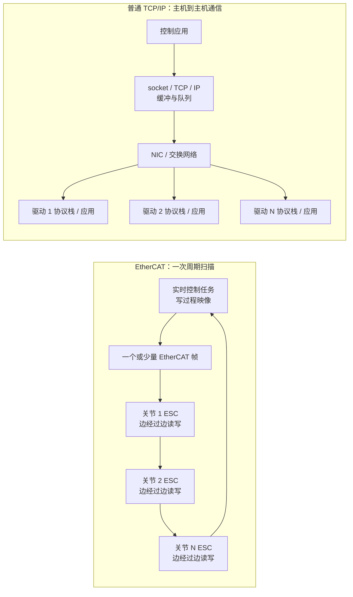

# EtherCAT 为什么在机器人实时控制中通常比 TCP/IP 更快

> [!summary] 先给结论
> **EtherCAT 在机器人控制中“更快”，主要不是网线传得更快，而是更快、更稳定地完成一次全体关节的周期性交换。**它让一个以太网帧依次穿过各从站，EtherCAT SubDevice Controller（ESC）在帧经过时由硬件直接取出目标值、写入反馈值；同一帧可以服务多个关节。普通 TCP/IP 则是面向通用主机互联的分层协议栈，常见实现需要经过 socket、TCP/IP、网卡队列、交换机、对端协议栈和应用处理，而且通常每个驱动器是一条连接或一组报文。
>
> **TCP 的可靠、有序、重传并不是“落后”，而是目标不同。**文件、配置和远程管理需要“旧数据也不能丢”；高速闭环更关心“这一个周期的数据是否按时到达”，迟到的旧控制指令往往已经失去价值。TCP 丢包后为保持有序交付会重传并阻塞后续字节流，尾部时延难以限定；EtherCAT 通过周期刷新、Working Counter 和设备状态在本周期发现数据不完整，再由控制系统进入保持、降级或安全状态。
>
> **这不是峰值带宽结论。**标准 EtherCAT 常用 `100 Mbit/s`，而普通 TCP/IP 可以跑在 `1/10/100 Gbit/s` Ethernet 上；传大文件、图像或点云时，TCP/IP 完全可能更快。EtherCAT 的优势是短周期、低抖动、多轴同步和可诊断性，而不是任意负载下的吞吐量。
>
> **结论置信度：高（协议机制）；中（任意具体机器人上的性能倍数，因为本轮未做统一硬件 A/B 台架）。**

## 1. 分类与研究边界

| 字段 | 本次定义 |
|---|---|
| 主分类 | `R04 技术原理、论文与前沿方向调研` |
| 次分类 | `R05 产品、平台与工具选型` |
| 分类理由 | 问题的核心是解释两种通信体系在机器人周期控制中的时延、抖动和同步机制，并把原理转为可验证的选型标准。 |
| 覆盖 | EtherCAT 与普通 TCP/UDP over Ethernet 的协议位置、数据路径、实时语义、量化口径、机器人分层架构、适用边界和 A/B PoC。 |
| 不覆盖 | 不把 EtherNet/IP、PROFINET IRT、TSN 等工业实时 IP 方案等同于普通 socket；不购买完整 IEC/IEEE 标准；不声称任一倍数适用于所有机器人。 |

## 2. 先纠正比较口径：这不是同一层协议

“TCP/IP 控制协议”不是一个严格、唯一的机器人控制协议：

- **EtherCAT**是直接使用标准 Ethernet 帧的实时工业网络；EtherType 为 `0x88A4`，周期过程数据不需要 TCP/IP 或 UDP/IP 栈。[`SRC-robotics-505`](../../../raw/robotics-embodied-ai/documents/SRC-robotics-505-ethercat-technology-overview.md)
- **IP**负责跨网络寻址和路由；**TCP**是在 IP 上提供可靠、有序字节流的传输协议。控制应用还要自行定义消息、时间戳、设备模型、同步、故障语义和安全状态。[`SRC-robotics-530`](../../../raw/robotics-embodied-ai/documents/SRC-robotics-530-rfc-9293-transmission-control-protocol-tcp.md)
- **UDP**只提供较小的 datagram 机制，不保证送达、去重或有序；它比 TCP 更适合低时延数据，但不会自动获得 EtherCAT 的过程映像、ESC 硬件处理、Distributed Clocks（DC）或 Working Counter（WKC）。[`SRC-robotics-531`](../../../raw/robotics-embodied-ai/documents/SRC-robotics-531-rfc-768-user-datagram-protocol.md)

因此，公平的问题应是：

> 在同一机器人、同一轴数、同一控制周期下，`EtherCAT + 实时主站 + 支持 DC 的驱动器`，为什么通常比`普通 TCP/UDP socket + IP 网络 + 各驱动应用协议`获得更小且更可预测的全轴周期时间？

## 3. 两条数据路径的直觉差异

EtherCAT 官方原理页明确描述：MainDevice 发出的帧穿过每个节点，从站在帧移动中读取属于自己的数据并插入输入数据；帧主要增加硬件传播延迟。网络中只有 MainDevice 主动发送 EtherCAT 帧，ESC 完全由硬件执行 on-the-fly 处理，因此数据路径比“每个节点收完整消息—交给协议栈和应用—生成回复”更固定。[`SRC-robotics-505`](../../../raw/robotics-embodied-ai/documents/SRC-robotics-505-ethercat-technology-overview.md)

## 4. EtherCAT 快在六个机制

### 4.1 一帧服务多轴，而不是逐设备完成独立事务

EtherCAT 的逻辑寻址把多个从站的过程数据映射进统一 process image。同一个 datagram 可以覆盖多个设备；MainDevice 每周期主要是填充输出区、发送帧、收回已经被各节点写入的输入区。

普通 TCP 是 unicast 字节流。若 12 个驱动器各有一条连接，控制器仍要调度多条流、形成多个报文并在各端点解析；即使并行发送，不再线性等待 12 个往返，也会增加包数、队列竞争和唤醒次数。若在 IP 网络前增加集中网关来合并所有关节数据，真正完成聚合和实时调度的已经是网关后的现场总线或专用协议。

### 4.2 从站由 ESC 硬件边转发边处理

普通交换网络通常需要在端点完整接收帧，再由网卡、驱动、内核网络栈和应用逐层处理。交换机也可能产生存储转发、排队或流量竞争。EtherCAT 从站不作为普通 IP 主机逐个主动回复，而是在帧经过端口时由 ESC 硬件取数/写数，节点实现差异对网络转发时间的影响更小。

> [!important]
> “硬件处理”不代表机器人整机自动硬实时。MainDevice 的 OS 调度、控制算法最坏执行时间、NIC/驱动、驱动器内部环路、传感器采样和安全逻辑仍需端到端验收。

### 4.3 固定主站、固定拓扑、受控流量，减少不可预测排队

EtherCAT 周期段由一个 MainDevice 主动发帧，拓扑和过程映像在启动时配置，链路用途单一。普通 TCP/IP 的设计目标是让不同主机、不同流量和不同路由共存；共享交换机、后台流量、拥塞控制、socket 缓冲和操作系统调度都可能增加尾部时延。

这并不意味着“只要有 IP 就不实时”。专用网段、实时 Linux、CPU/IRQ 隔离、合适 NIC、TSN、IEEE 1588/PTP、工业应用 profile 和硬件时间戳可以显著缩小差距；但这些附加机制正是在给通用 Ethernet/IP 补上时间与调度约束。

### 4.4 Distributed Clocks 把“到包时刻”变成“本地定时动作”

机器人真正需要的不只是所有数据尽快到，而是多个关节在同一时刻采样和输出。EtherCAT DC 测量并补偿传播延迟，让从站本地硬件时钟按统一时间触发动作。ETG 页面给出的系统同步 jitter 为显著小于 `1 µs`；这是一项官方设计口径，不是任意产品组合的 SLA。[`SRC-robotics-505`](../../../raw/robotics-embodied-ai/documents/SRC-robotics-505-ethercat-technology-overview.md)

因为动作由本地 DC 事件触发，MainDevice 的帧只要在截止时间前到达，不必让“每个包恰好同时到”。普通 TCP socket 只保证字节顺序，不定义多设备共同采样时刻；应用必须另加 PTP/TSN、时间戳和定时执行语义。

### 4.5 TCP 的可靠有序语义会放大丢包后的尾部时延

RFC 9293 定义 TCP 为可靠、有序字节流，使用 sequence number、ACK、重传、流量窗口和拥塞控制。连接建立后并不需要每周期重新握手，发送方也不必每个周期都同步等待一个 ACK；但一旦某段丢失，后续字节即使已经到达，也不能越过缺口有序交给应用，这就是控制场景不喜欢的队头等待。重传超时还必须随网络状态动态计算。[`SRC-robotics-530`](../../../raw/robotics-embodied-ai/documents/SRC-robotics-530-rfc-9293-transmission-control-protocol-tcp.md)

对周期控制，`t` 时刻丢失的旧目标在 `t + 2T` 才重传成功，通常不如直接使用 `t + 2T` 的最新目标。EtherCAT 更接近“本周期成功就使用；不完整就明确报错，并由控制器决定保持/降级/安全停机”的 freshness 语义。

### 4.6 Working Counter 直接回答“本周期所有目标节点处理了吗”

EtherCAT datagram 的 WKC 会被成功处理该操作的从站更新。MainDevice 每周期可把实际 WKC 与预期值比较，结合链路、从站状态机和错误计数器定位异常。普通 TCP ACK 只表明某段字节被 TCP 端点接收，不等于某个驱动已经在指定时刻执行目标值，更不等于全部关节完成同一周期的采样与输出。

WKC 同样不直接证明电机已经产生目标力矩或关节已经到位；它证明的是预期的 EtherCAT 数据操作被相应从站处理。物理执行仍要用驱动状态字、编码器/力矩反馈和任务级误差闭环验证。

## 5. “快”需要拆成五个指标

| 指标 | 对机器人控制的意义 | EtherCAT 的典型优势 | TCP/IP 可能占优之处 |
|---|---|---|---|
| 平均时延 | 一次命令/反馈平均多久 | 数据路径短、集中帧 | 高速直连、优化栈可能很低 |
| 最坏/尾部时延 | 是否错过控制 deadline | 拓扑和调度更可预测 | 普通 TCP 没有通用最坏时延保证 |
| 抖动 | 周期是否等间隔 | DC 与固定周期 | 需 RTOS/PTP/TSN/应用调度补齐 |
| 多轴同步偏差 | 各关节是否同时采样/动作 | DC 为原生机制 | TCP 本身不提供；需另加时间系统 |
| 吞吐量 | 图像、点云、日志搬运 | 标准 EtherCAT 不是强项 | 千兆/万兆 TCP/IP 通常更强 |

因此，不能用“EtherCAT 100–200 Hz、TCP/IP 20 Hz”之类脱离轴数、payload、硬件、OS、拓扑和时延分位数的单一口号做选型。

## 6. 一个反直觉的算例：原始带宽并不能解释优势

假设 6 轴机器人每轴每周期交换 `8 byte` 目标值和 `8 byte` 反馈值，则有效过程数据为：

$$
D = 6 \times (8 + 8) = 96\ \text{byte}
$$

只计算 payload 的理想串行化时间：

$$
t_{100M} = \frac{96 \times 8}{100 \times 10^6} = 7.68\ \mu s
$$

$$
t_{1G} = \frac{96 \times 8}{1 \times 10^9} = 0.768\ \mu s
$$

> [!note] 算例边界
> 这不是完整帧或端到端 benchmark，未计 Ethernet/EtherCAT/IP/TCP header、preamble、inter-frame gap、线缆传播、节点/交换机、DMA、OS 和应用时间。它只证明：**若只看 bit rate，1 Gbit/s TCP/IP 链路更快；EtherCAT 的实时优势必须来自聚合、固定数据路径、硬件处理、同步和故障语义。**

一个更接近控制系统的账本是：

$$
T_{cycle} = T_{control\ WCET} + T_{OS/NIC} + T_{network} + T_{drive/sample} + T_{margin}
$$

EtherCAT 主要压缩并稳定 `T_network`，DC 还降低“帧到达抖动”向“采样/执行抖动”的传导；它不会自动消除其他四项。

ETG 把短周期 `≤100 µs`、同步 jitter `≤1 µs`列为技术开发重点。应把它们当作协议潜力和 PoC 量级参考，而不是购买任意主站、驱动和网卡后必然得到的数值。[`SRC-robotics-505`](../../../raw/robotics-embodied-ai/documents/SRC-robotics-505-ethercat-technology-overview.md)

## 7. 机器人里怎样分层最合理

| 层 | 典型内容 | 推荐通信取向 |
|---|---|---|
| 任务/云端层 | VLA、任务规划、远程运维、模型/文件 | TCP/IP、HTTP、DDS 等 |
| 感知/状态层 | 图像、点云、日志、非实时状态 | 高带宽 Ethernet/IP；按需求用 UDP/共享内存 |
| 实时控制层 | 动力学、插补、状态机、目标周期控制 | 实时进程 + EtherCAT MainDevice 或经验证的等价实时网络 |
| 驱动/关节层 | CSP/CSV/CST、编码器、力矩、I/O | EtherCAT PDO + DC；驱动内部电流/速度环仍在本地 |
| 安全层 | 急停、STO、安全限位 | 独立安全设计；FSoE 只是安全通信的一部分 |

一句话架构建议：**TCP/IP 负责“把复杂信息送到机器人”，EtherCAT 负责“让所有关节按同一个节拍动作”。**两者通常是上下层协作，不是全机二选一。

## 8. 什么时候 TCP/UDP/IP 已经够用

- 只有 1–2 个执行器，控制周期宽松，且驱动器原生只提供 Ethernet socket API；
- 上层发送轨迹段，驱动器本地完成高速闭环，而不是上位机逐周期下发力矩；
- 主要负载是相机、点云、日志、模型和远程维护；
- 已采用经过验证的实时 IP 方案，例如专用网段、硬件时间戳、PTP/TSN、工业 motion profile 和严格的 RTOS/NIC 配置；
- 统一台架证明其 `p99.9/max`、deadline miss、同步误差、跟随误差和故障恢复在相同 TCO 下满足任务。

反过来，若是 6–30 轴、多驱动器、多传感 I/O、上位机需要高频同步下发位置/速度/力矩，并且错过周期会影响稳定性或安全，EtherCAT 的系统级优势才最明显。

## 9. A/B PoC：不要用 ping 平均值选总线

建议在 6 轴或 12 轴台架上比较候选 EtherCAT 与 TCP/UDP/IP 实现：

1. 冻结同一控制器、实时内核、CPU/IRQ 亲和、NIC、轴数、payload、轨迹、驱动内部模式和安全配置；
2. 分别运行空载、额定运动、CPU 压力、网络背景流量和 8–24 小时长稳；
3. 记录控制周期 `p50/p99/p99.9/max`、deadline miss、端到端命令年龄、采样同步偏差、关节跟随误差和 CPU 占用；
4. EtherCAT 记录 WKC、DC deviation、从站状态和链路错误；IP 方案记录 socket queue、丢包、乱序、重传、RTT、PTP offset 和交换机队列；
5. 注入丢帧、断线、驱动掉电、单轴 fault、控制进程超时和交换机拥塞，验证是否进入预定义安全状态；
6. 不用平均 `ping` 或峰值 Mbps 代替控制闭环结果，验收阈值在测试前冻结。

通过条件应写成：**在目标控制周期下无未解释 deadline miss；所有轴的同步/跟随误差在阈值内；任何注入故障均进入预期安全状态；恢复不产生非预期运动。**具体微秒阈值必须由机器人动力学、控制器裕度和驱动能力倒推，不能从协议宣传页照搬。

## 10. 商业应用可能性

EtherCAT 已适用于工业机器人、协作机器人、机床、半导体设备、包装和测试测量等多轴同步场景。高频、高成本问题是节拍、同步误差、布线复杂度、跨品牌驱动集成和停机定位；使用者是控制/电气工程师，决策者通常是整机 CTO 或研发负责人，采购与付款来自设备 BOM、控制平台和项目交付预算。

商业价值要落到 `节拍、良率、跟随误差、调试工时、停机时间、故障定位时间和 TCO`。最可能优先落地的是多轴机器人/机床、半导体与测试设备、包装/印刷等高同步设备，因为 deadline miss 会直接影响轨迹、节拍或良率。部署成本包括实时控制器/内核、EtherCAT 驱动与 I/O、ESI/profile 集成、布线/EMC、安全论证、长稳测试和现场售后；从 PoC 到规模订单的门槛是跨批次互操作、故障可定位、零未解释 deadline miss、供应连续和可维护性。

成熟工业场景已进入重复采购或规模化，近期 1–2 年应用可能性高；人形机器人仍处于 PoC、早期产品或小批量分化阶段，3–5 年采用比例取决于线束重量、关节分布式架构、100 Mbit/s 带宽是否够用、功能安全和 CAN FD/TSN/专用链路竞争，判断置信度中等。中国政策支持高实时、高可靠机器人控制和测试能力，但现有官方材料没有指定 EtherCAT，不能据此推导独占性政策红利。详见 [[ethercat-technology-ecosystem-engineering-deep-dive-2026-08-09]]。

## 11. 中小型创业者的机会

### 可立即验证

- **EtherCAT 健康诊断**：采集 WKC、DC、jitter、拓扑、ESI 和状态机，首个收费交付物是 6/12 轴现场诊断报告与长期监控工具；
- **ROS 2 + 实时 Linux + EtherCAT 集成包**：给机器人初创提供可复现控制器、驱动适配、故障恢复和 A/B 验收；
- **国产驱动互操作测试**：自动验证 PDO、CoE/CiA 402 状态机、DC、断线恢复、ESI 和长稳，服务伺服/力传感器供应商。

适合的最小团队约 2–5 人，需要 C/C++、实时 Linux、运动控制、电气与现场交付能力；启动资金粗估为数十万至低百万元人民币，验证周期约 2–6 个月，均须按轴数、测试仪器和客户安全要求修正。首批合作方应是愿意开放驱动器、ESI、故障日志和测试台的机器人初创、设备 OEM、国产伺服/传感器厂及测试机构。头部供应商通常有自家诊断工具，但多品牌互操作、ROS 2 集成和客户现场恢复高度碎片化，愿意采购中立交付；护城河来自跨供应商回归用例、长期故障数据、验收模板和客户控制流程，而不是协议帧格式本身。

### 需要条件成熟

- EtherCAT P/关节级 ESC+驱动参考设计，需要整机客户共同定义线束、供电、热、安全和批量 BOM；
- FSoE 产品与认证服务需要功能安全人才、流程和测试机构合作；
- EtherCAT G 应先证明视觉/高分辨率触觉确实使 100 Mbit/s 成为瓶颈。

### 不建议进入

- 仅以“比 TCP/IP 快”为卖点复制通用主站栈；成熟商业/开源方案已经很多，真正成本在长期可靠性、诊断和售后；
- 把平均 `ping` 或厂商标称周期包装成整机硬实时证明；
- 把普通 EtherCAT 通信直接宣传为功能安全方案。

## 12. 风险、反方证据、证伪条件与监测指标

- **反方证据**：1/10 Gbit/s 的专用 Ethernet/IP 在原始序列化和大 payload 吞吐上可显著超过 100 Mbit/s EtherCAT；优化 UDP/TSN/PTP/RTOS 后也可能满足多轴控制。
- **轴数少时收益有限**：若驱动本地闭环、上位机只发低频轨迹，EtherCAT 的复杂度和器件成本可能不划算。
- **EtherCAT 也会失败**：非实时内核、差 NIC/驱动、错误 PDO/DC 配置、线缆/EMC 和驱动内部延迟都能破坏端到端实时性。
- **供应商数字的限制**：ETG 性能数据来自技术组织官方资料，不是独立的跨协议、跨厂商 benchmark。

若统一台架显示优化后的 IP 方案以更低 TCO 达到相同或更好的 `max/p99.9`、同步误差、跟随误差、故障诊断和安全恢复，则应否定“本机器人必须用 EtherCAT”的假设。

持续监测：目标机器人的轴数与控制模式、实际 payload、deadline miss、DC/PTP offset、WKC/丢包/重传、关节同步与跟随误差、故障恢复时间、CPU/线束/BOM、驱动与主站版本、功能安全证书，以及替代实时网络在同一台架的 TCO。

## 13. 事实、估计、判断、假设、待验证与下一步

| 类型 | 内容 |
|---|---|
| 事实 | EtherCAT 周期数据可直接置于 Ethernet 帧，由 ESC on-the-fly 处理；TCP 是可靠、有序字节流并通过重传纠错；UDP 不保证送达或有序。 |
| 事实 | EtherCAT DC 与 WKC 分别提供分布式时间对齐和周期数据一致性诊断机制。 |
| 计算 | 6 轴、每轴 16 byte 的 `96 byte` payload 在 100 Mbit/s 与 1 Gbit/s 链路上的理想串行化时间分别为 `7.68 µs` 和 `0.768 µs`；未计任何帧和系统开销。 |
| 判断 | 机器人多轴内环里，EtherCAT 优势主要来自通信模型和可预测性，不是单纯带宽。 |
| 假设 | 候选机器人采用集中式 6–30 轴周期控制；若驱动本地自治程度更高，结论会弱化。 |
| 待验证 | 同一 6/12 轴真机上 EtherCAT、TCP、UDP/TSN 的尾时延、同步、跟随误差、故障恢复和 TCO。 |
| 下一步 | 按第 9 节冻结同一硬件、轨迹、payload 和验收阈值，先跑 8–24 小时基准与压力测试，再做断线、掉电、拥塞和进程超时故障注入。 |

## 14. 来源与证据质量

- S 级 EtherCAT 机制：ETG 官方技术页及 IEC/实现来源，汇总于 [[_sources/ethercat-technology-implementation-policy-source-set]]；性能数字按官方设计口径处理，不升级为产品 SLA。
- S 级 TCP/UDP 定义：IETF/RFC Editor 的 [`RFC 9293`](../../../raw/robotics-embodied-ai/documents/SRC-robotics-530-rfc-9293-transmission-control-protocol-tcp.md) 与 [`RFC 768`](../../../raw/robotics-embodied-ai/documents/SRC-robotics-531-rfc-768-user-datagram-protocol.md)。
- 本轮没有真实机器人或统一 NIC/交换机台架数据，因此不提供“快几倍”的确定数字。

## 关联连接

- [[ethercat-technology-ecosystem-engineering-deep-dive-2026-08-09]]
- [[_sources/ethercat-technology-implementation-policy-source-set]]
- [[robotics-embodied-ai/02-technology-and-products]]
- [[robotics-embodied-ai/00-source-capture-index]]
- [[embodied-ai]]
