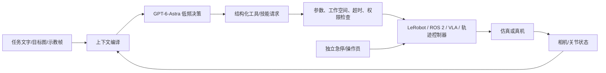

# GPT-6-Astra 控制机器人的开源复现项目调研

> [!summary]
> **要在 SO-101 真机上最快复现“GPT-6-Astra 发高层动作、机器人执行”**，首选 **quackd + LeRobot**：项目明确给出 `openai:gpt-6-astra`、SO-101 真机记录、mock/MuJoCo/真机分级路径和 Apache-2.0 许可。**要复现可计分仿真实验**，首选 **RPent + LIBERO-PRO**；**要研究纯 VLM 经离散动作语法控制双臂**，选 **RoboDawn + RoboTwin/RoboDojo**，但先核对其 Chat Completions 文本请求参数与官方 Astra 要求。**GPT-Policy** 最贴近“上下文示教 + Astra + 真机闭环”的研究问题，ARX/YAM 管线已公开，但项目许可待定、完整实验资料未公开，不应称为可自由再分发的完整开源复现。上述成功率均为作者报告，本轮只做源代码/文档核验，未付费调用模型、安装大型仿真器或驱动真机。**结论置信度：接口和公开物高；原项目性能和跨机复现中低。**

## 一、分类与研究边界

| 项目 | 说明 |
|---|---|
| 主分类 | **R05 产品、平台与工具选型**：决策是选哪个项目，以最小成本复现 Astra 机器人控制。 |
| 次分类 | **R04 技术原理与可复现性**、**R06 候选池扫描**。 |
| 纳入标准 | 有公开代码、明确机器人/仿真执行路径、可定位模型接入点；优先已明确运行 `gpt-6-astra` 的项目。 |
| 排除标准 | 仅有短视频/榜单、只有机器人外观设计、只做问答、不能定位动作执行层的项目不进入短名单。 |
| 截止日 | 2026-09-30；公开仓库会变化，主表引用固定提交和抓取件。 |
| 本轮未验证 | 用户账号是否可调用模型；真机端口/标定/相机；GPU、资产和模型权重安装；任何报告成功率的独立重跑。 |

中国场景以 SO-101、ROS 2 与可替换机械臂为落点。`SRC-robotics-004` 的十五五未来产业框架把具身智能列为方向，但政策方向不构成本报告项目性能或商业订单证据。

## 二、Astra 在机器人系统中的位置

OpenAI 官方模型页明确 `gpt-6-astra` 支持**图像输入、文本输出、结构化输出和函数调用**，不支持原生音频或视频输入；**API function calling** 须走 **Responses API**。RoboDawn 的纯文本命令生成不属于这类 API 工具调用。因此“视频示教”在该类系统里通常先被处理成帧/文字/动作参考，再送入模型，不能把它描述成模型直接接收连续视频流。官方标价快照为输入 **$10/百万 token**、输出 **$50/百万 token**，单次机器人任务成本仍取决于图像、历史、推理与多轮调用数；账号可用性、实际账单需实测。[`SRC-robotics-582` 原文](../../../raw/robotics-embodied-ai/documents/SRC-robotics-582-gpt-6-astra-model-api-documentation.md)、[`SRC-robotics-583` 原文](../../../raw/robotics-embodied-ai/documents/SRC-robotics-583-openai-function-calling-guide.md)。



**工程判断**：Astra 适合任务理解、下一步技能选择、失败恢复与交互；伺服控制、碰撞约束、限速、急停应由执行器侧确定性组件承担。图像解释和模型输出都可能出错，模型完成消息也不等于物理成功。这个边界与 [[_syntheses/bilibili-codex-ros2-mcp-robot-control-deep-dive-2026-08-12|ROS MCP 控制分析]]及 GPT-Policy 的安全说明一致。

## 三、候选项目和复现等级

等级只评价**公开复现路径**：A＝固定代码有明确目标设备、安装/配置/运行命令和可逐级验证入口；B＝代码与实验合同公开，但需大型外部栈或接口探针；C＝关键许可或实验资料未开放。等级不是性能或安全排名。

| 项目与固定证据 | Astra 角色与硬件 | 公开/许可 | 复现等级与主要缺口 | 推荐用途 |
|---|---|---|---|---|
| **[quackd](https://github.com/rokbenko/quackd)**，[`SRC-robotics-584`](../../../raw/robotics-embodied-ai/documents/SRC-robotics-584-quackd-readme-at-9777c0a.md)，`9777c0a` | 直接选 `openai:gpt-6-astra`，按受限动词操纵 SO-101；作者报告 2026-09-15/23 真机运行；另有 mock 和 MuJoCo 路线 | Apache-2.0；LeRobot 与机器人模型各自条款另查 | **A：可按文档启动局部复现**。账号、实体臂、端口、标定、摄像头和人工安全检查需自备；早期真实运行有断开后掉臂，后续 26 次中 19 次未移动，改进尚未全部真机复核 | 现有 SO-101 最短路径 |
| **[RPent](https://github.com/RLinf/RPent)**，[`SRC-robotics-586`](../../../raw/robotics-embodied-ai/documents/SRC-robotics-586-rpent-readme-at-ec4e18f.md)，`ec4e18f` | Astra/Codex 作高层规划，组合冻结 VLA 技能；LIBERO-PRO、RoboCasa 等仿真，也有真机扩展 | Apache-2.0；仿真资产/VLA 权重独立条款 | **B：完整仿真栈成本高**。需 GPU、仿真资产、π0.5/SAM3 checkpoint、记忆版本与模型接入；作者报 LIBERO-PRO 741/800（92.63%），非本轮重跑 | 验证“规划器 + VLA”复合架构 |
| **[RoboDawn](https://github.com/Hugo-AGI/RoboDawn)**，[`SRC-robotics-587`](../../../raw/robotics-embodied-ai/documents/SRC-robotics-587-robodawn-readme-at-9247f36.md)，`9247f36` | Astra 看相机/机器人状态，每轮给平移、旋转、夹爪离散文本命令；RoboTwin 2.0/RoboDojo | MIT；两套 benchmark/资产另验 | **B：公开 prompts、128 个示教、种子和日志，调用参数需核验**。作者报 RoboTwin 368/500（73.6%）、RoboDojo 47.17%；默认 `temperature=0` 与 Astra 高推理档位的官方要求冲突，直接运行**待验证** | 纯 VLM 机器人策略、示教消融和失败分析 |
| **[GPT-Policy](https://github.com/cheng-haha/GPT-Policy)**，[`SRC-robotics-585`](../../../raw/robotics-embodied-ai/documents/SRC-robotics-585-gpt-policy-readme-at-ab970d8.md)，`ab970d8`；[论文](https://arxiv.org/abs/2609.19138) | Astra 结合目标图/示教帧/历史提出结构化动作，ARX X5 与 I2RT/YAM adapter 检验后执行 | **许可证待定**，README 明说未授予再分发与商业使用权 | **C：研究预览**。ARX/YAM pipeline 标记已发布，`gpt-policy --check` 可离线验配置；完整物理演示记录、现场标定、评测环境和 RoboDojo pipeline 未发布 | 学算法结构，等待许可与复现包 |
| **[ROS MCP Server](https://github.com/robotmcp/ros-mcp-server)**，[`SRC-robotics-588`](../../../raw/robotics-embodied-ai/documents/SRC-robotics-588-ros-mcp-server-readme-at-476591a.md)，`476591a` | 任意 MCP 客户端经 rosbridge/rosapi 调 ROS 1/2；Astra 可作上层任务代理 | Apache-2.0 | **B：通用接口、非 Astra 原版实验**。需自建 MCP 客户端与白名单；直接暴露任意 ROS 写操作风险高 | 已有 ROS 2/Nav2/MoveIt 系统的受控接入 |

**选型**：用户若拥有 SO-101，先做 quackd 的只读/仿真/真机三级验证；若先研究 benchmark，先做 RPent 的一个 LIBERO-PRO 任务；若要比较“模型本身能否在无 VLA 时控制双臂”，使用 RoboDawn。GPT-Policy 可研究和本地实验，但在许可证明确前不要基于其代码做商业集成或二次分发。ROS MCP Server 适用于已经有可靠 ROS action 的平台，不构成可直接运行的 Astra 实验成绩。

## 四、复现方案 A：SO-101 + quackd

**前提**：SO-101 follower、USB 摄像头、Python 3.12、LeRobot 标定、OpenAI API 账号，能在操作员控制下停机。下面命令来自固定提交 README；`/dev/tty.*` 和 `opencv://N` 应换成实际设备。项目的 `uv venv`/`uv pip` 用法适用于项目自身仓库；本文不在本知识库仓库运行其安装脚本。

```bash
git clone https://github.com/rokbenko/quackd.git
cd quackd
git checkout 9777c0a846caa3d207fa3688747cf15665acaf5d
uv venv --python 3.12
uv pip install 'quackd[lerobot,openai,lerobot-sim]'
source .venv/bin/activate

# 将 OPENAI_API_KEY 放在私有环境中，勿写进日志/仓库。
lerobot-find-port
lerobot-calibrate --robot.type=so101_follower --robot.port=/dev/tty.usbmodemXXXX --robot.id=arm-01
quackd doctor --robot lerobot:real --address /dev/tty.usbmodemXXXX
quackd robot add arm-01 lerobot:real --address /dev/tty.usbmodemXXXX --llm openai:gpt-6-astra
quackd robot rest-pose arm-01
quackd run lerobot-lookout --robot arm-01 --llm fake

# 摄像头索引需先由 lerobot-find-cameras opencv 确认。
quackd robot edit arm-01 --camera-url 'opencv://N'
quackd robot twin arm-01
quackd preflight lerobot-lookout --robot arm-01-sim --llm fake
quackd run --goal 'Wave to the camera with an extended arm' --robot arm-01 --max-steps 10 --dry-run
```

上述 `doctor`、`lerobot-lookout`、`preflight` 和 `--dry-run` 分别验证设备状态、只读工具、仿真路径与模型拟发动作。只有在这些记录通过、工作空间清空、实物急停可用、标定覆盖折叠/停放姿态后，才进入一次低速、无接触、有人看护的真机动作：

```bash
quackd run --goal 'Wave to the camera with an extended arm' --robot arm-01 --max-steps 10
```

**输入/输出合同**：输入是文本目标、相机帧、臂状态、模型 ID 和受限动词表；输出应保存每轮模型工具调用、参数、拒绝原因、机器人状态、照片/视频、停止/接管事件及成本。项目现成日志字段与导出方式需按固定提交实际运行核验。**验收**：先连续 10 次只读/仿真任务无越权，再在封闭场地做至少 10 次简单真机目标；逐次记录成功、误动作、人工接管、端到端 p50/p95 延迟、API 用量和任务成本。任何越界、停机失效或不可解释动作都停止真机试验。10 次是本报告建议的工程门槛，不是论文统计结论。

## 五、复现方案 B：RPent + LIBERO-PRO

RPent 中 Astra 是**规划器**，底层动作由冻结 VLA 和仿真环境执行；因此其成功率不能解读为“Astra 单独直接输出关节动作”。项目提供 `codex` planner，使用 Codex SDK 和本地 MCP 工具；`--model gpt-6-astra --reasoning-effort low` 有文档实例，认证/账单路径与直接 API 项目不同。安装依赖和权重较重，先核对 Python/CUDA、LIBERO-PRO 资产及 `PI05_CHECKPOINT_PATH`、`SAM3_CHECKPOINT_PATH`。具体命令以固定提交的 [README](https://github.com/RLinf/RPent/tree/ec4e18fc2f6a73a00c6a5c035a8a3fdb17950b61) 和 [planner 文档](https://github.com/RLinf/RPent/blob/ec4e18fc2f6a73a00c6a5c035a8a3fdb17950b61/docs/source-en/rst_source/guides/configure_planner.rst) 为准：

```bash
rpent-check-llm --planner codex --json
rpent --robot libero --suite libero_goal_swap --task 1 --seed 1 \
  --planner codex --model gpt-6-astra --reasoning-effort low
```

**验收**：固定 Git SHA、仿真资产/模型权重哈希、suite/task/seed、记忆版本、API/SDK 版本；保留轨迹、工具调用与失败分类。先跑一个任务的 3–5 个 seed 并与冻结 VLA 单独执行作同场对照，再扩到作者的 800 episode 口径。性能数字只有同一资产和评分协议下才可比。

## 六、复现方案 C：RoboDawn 与 GPT-Policy

**RoboDawn** 的优点是公开离散命令 grammar、示教、固定 seed 和失败 episode，适合做模型上下文学习消融；RoboTwin 需要 SAPIEN/cuRobo，RoboDojo 需要 Isaac Sim 5.1 和资产。README 提供 `--model gpt-6-astra` 单任务命令，[固定提交的 `llm_client.py`](https://github.com/Hugo-AGI/RoboDawn/blob/9247f366cd31f278e10f2fbe5fe8469b5f1b5b94/harness/agent/llm_client.py) 向 **Chat Completions** 发送图像和文本消息并解析文本命令，**没有使用 API function tools**；因此“工具调用必须走 Responses”并不直接否定这条路径。但该客户端默认发送 `temperature=0`，同时给 Astra 设 `reasoning_effort=high`，而 OpenAI 官方部署清单要求非 `none` 推理档移除 `temperature`。首轮应先以 `temperature=None` 做单次响应探针，检查图像进入、命令格式和 reasoning token，再跑仿真，不把 README 命令宣称为在官方端点已验证。基线结果为作者自报，且真机 Franka 结果使用的是 Gemini 3.8 Flash；仓库只公开真机骨架和 mock，并未给出 Astra 真机同条件结果。[`SRC-robotics-587`](../../../raw/robotics-embodied-ai/documents/SRC-robotics-587-robodawn-readme-at-9247f36.md)、[`SRC-robotics-591`](../../../raw/robotics-embodied-ai/documents/SRC-robotics-591-transferring-the-intelligence-of-vlms-to-robotic-control.md)、[`SRC-robotics-592`](../../../raw/robotics-embodied-ai/documents/SRC-robotics-592-openai-api-deployment-checklist.md)。

**GPT-Policy** 的控制环是：多模态上下文 → VLM 结构化动作 → adapter 检查顺序 IK/时序/夹爪 → 执行 → 新观测。它不是可直接搬到 SO-101 的项目；当前 ARX/YAM 硬件依赖、标定和现场相机需要自备。可先用 `gpt-policy --check` 做无硬件/无模型配置检查，但这不复现论文中的物理成功率。README 所述“目标图/自我历史/人机交互均 100%”基于各自仅六项任务条件，且原始试验记录未完整发布，不能外推到其他物体、机器人或安全等级。[`SRC-robotics-585`](../../../raw/robotics-embodied-ai/documents/SRC-robotics-585-gpt-policy-readme-at-ab970d8.md)、[`SRC-robotics-590`](../../../raw/robotics-embodied-ai/documents/SRC-robotics-590-in-context-robot-learning-with-vlm-agents.md)。

## 七、统一评估、风险与证伪

| 维度 | 最小记录与判定 |
|---|---|
| 功能 | 同一目标、初始条件和预算下，任务成功率；独立视觉/人工判定，不以模型说“完成”为准。 |
| 安全 | 越权工具调用、关节/工作空间越界、近碰/碰撞、急停有效性、通信超时后停机、人工接管。零安全边界突破才允许扩大试验。 |
| 效率 | 每任务推理轮数、p50/p95 决策时延、总墙钟时间、人工干预分钟数。 |
| 成本 | 每次成功任务的模型输入/输出/缓存 token、图像、GPU、电力、机器人磨损和工程维护；不能只按单价判断。 |
| 泛化 | 新物体、灯光、相机视角、初始姿态和任务顺序的 holdout；记录失败视频与动作轨迹。 |
| 对照 | 同机器人上的固定脚本、传统规划器、VLA-only、Astra 高层规划器；保持时间预算和试验条件可比。 |

**反方证据**：quackd 自认目前七类机器人中仅 SO-101 有真实硬件运行，其 MuJoCo twin 未与实臂逐项校准；RoboDawn 真机某 Piper 布料折叠任务为 0/10、精密任务维度成功率低；GPT-Policy 缺原始试验环境且许可待定；RPent 的高成功率依赖 VLA、感知和记忆复合系统。它们共同反驳“仅换成 Astra 即可通用、安全控制机器人”的推断。

**会改变选型的条件**：quackd 在目标 SO-101 上多次出现错误关节动作或干预成本高于脚本；RPent 同 seed 的 VLA-only 基线接近或超过复合架构；RoboDawn 调整官方 API 请求参数后表现显著下降；GPT-Policy 发布可再分发许可证、原始记录及可运行评测包。每月检查仓库 release、issue、许可、API 接口和目标设备日志。

## 八、商业应用可能性

**近期（1–2 年，判断，低到中置信度）**：研发演示、机器人集成调试、低频受控技能编排有 PoC 价值。使用者是机器人算法/集成/现场工程师；决策者是研发主管或集成商；付款通常来自研发效率、交付和运维预算。最可能先落地的是现有技能白名单上的“巡检诊断、标准化 pick-and-place 编排、异常恢复建议”，因为底层运动能力已有可验证控制器。与人工或固定脚本比较，应量化每个合格任务节省的工程时长、误动作和接管成本，而不是按视频演示数量计价。

**中期（3–5 年，假设，待验证）**：若任务成功率、现场安全与单位成本在多个客户/物体/班次上稳定，可进入付费试点到重复采购；当前这些仓库没有提供可核验的客户合同、SLA、回款和规模部署证据。集成成本包括相机/标定、机器人 action 适配、权限、日志、现场 EHS、网络/数据处理、模型费用和售后。中国客户若要求私有网络或敏感图像不出现场，还需评估云 API 数据路线或替代模型的精度损失。首个规模门槛是**在客户验收场景连续稳定完成任务，并能解释和处理失败**。

## 九、中小型创业者的机会

| 分类 | 切口、最小交付物与验证 |
|---|---|
| **可立即验证** | 给已有 SO-101/ROS 2 团队做“受限技能网关 + 试验日志 + 回放评测”：1–2 名 ROS/机器人软件工程师与 1 名现场集成工程师，先在一个客户研发场地交付 2–4 周 PoC，按合格任务数、干预率、节省工时收费。头部模型厂商通常不掌握客户具体设备、工位标定与售后流程；复购来自持续设备适配、回归测试和场景变化。启动资金等级：低到中（估计，硬件/现场人员主导，金额待报价）。 |
| **需要条件成熟** | 特定工艺的动作库、场景数据服务与模拟到真机回归包。前提是拿到客户授权轨迹、可计分任务和明确验收协议；验证周期至少跨多个环境版本。首个可收费物是可复跑的任务包及失败报告，而非抽象“机器人智能体平台”。 |
| **不建议进入** | 以单个 Astra 视频宣称通用无监督真机控制，或重做通用机器人基础模型/整机。所需硬件、数据、安全验证和销售周期超出多数小团队承受范围。GPT-Policy 代码许可待定，也不适合作商业产品基座。 |

## 十、下一步与来源

1. **若目标是用户现有 SO-101**：按第四节完成设备清单和只读/仿真/真机三级记录；需确认操作系统、LeRobot 版本、端口、相机、独立急停和 API 账号。适配到既有 ROS 2/MuJoCo 项目时，优先只开放预定义 action/skill，而不开放任意 joint 或速度发布。
2. **若目标是论文数值复现**：先选一个 benchmark 与固定任务，冻结代码/资产/模型/seed/预算，再逐步扩样本。提交运行日志、失败视频和基线表，明确第三方成功率是否被复现。
3. **若目标是新系统架构**：比较“纯 Astra 离散动作”（RoboDawn）、“Astra + VLA 技能”（RPent）和“通用任务编排 + 固定 ROS action”（ROS MCP）在同一设备与任务上的成功率、时延、安全和成本。

来源登记：[`sources.csv`](../sources.csv) 的 `SRC-robotics-582`–`592`；抓取状态见 [`source_capture_manifest.csv`](../../../raw/robotics-embodied-ai/documents/source_capture_manifest.csv)，本次 11 项均为 `ok`，脚本整体退出码 1 仅因清单中已有 `SRC-robotics-580` 的历史失败项。官方与项目原始入口：[OpenAI Astra 模型页](https://developers.openai.com/api/docs/models/gpt-6-astra)、[OpenAI 函数调用指南](https://developers.openai.com/api/docs/guides/function-calling)、[OpenAI 部署清单](https://developers.openai.com/api/docs/guides/deployment-checklist)、[quackd](https://github.com/rokbenko/quackd)、[RPent](https://github.com/RLinf/RPent)、[RoboDawn](https://github.com/Hugo-AGI/RoboDawn)、[GPT-Policy](https://github.com/cheng-haha/GPT-Policy)、[ROS MCP Server](https://github.com/robotmcp/ros-mcp-server)。

## 关联连接

- [[robotics-embodied-ai/00-index|机器人（具身智能）目录]]
- [[robotics-embodied-ai/00-source-capture-index|机器人来源抽取索引]]
- [[_syntheses/bilibili-codex-ros2-mcp-robot-control-deep-dive-2026-08-12|CodeX、ROS MCP 与 ROS 2 机器人控制]]
- [[robotics-embodied-ai/research-notes/lerobot-beginner-guide-2026-05-28|LeRobot 初学者指南]]
- [[robotics-embodied-ai/research-notes/isaac-sim-vs-gazebo-vs-mujoco-2026-07-14|Isaac Sim、Gazebo 与 MuJoCo 选型]]
