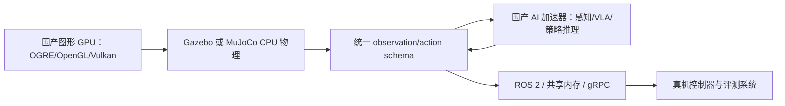
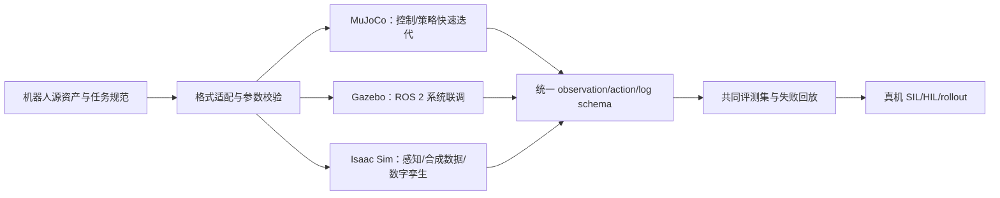

# Isaac Sim vs Gazebo vs MuJoCo：机器人仿真平台选型调研

> [!summary] 核心结论
> 三者不是简单的同类替代品。**Isaac Sim** 最适合高保真视觉/传感器仿真、合成数据、OpenUSD 数字孪生和 Isaac Lab 学习闭环；**Gazebo** 最适合 ROS 2 系统联调、移动机器人/导航、传感器与中间件集成；**MuJoCo** 最适合控制、接触密集任务、系统辨识和大规模策略训练。若把国产 GPU 纳入硬约束：**Gazebo 的标准图形 API 路径最有工程适配空间，MuJoCo 核心可稳定退回 CPU，但 MJX 国产加速仍缺官方 JAX/Warp 后端，Isaac Sim 则没有脱离 NVIDIA RTX 栈的官方运行路径**。具身智能团队通常应按任务选择一主一辅，而不是从第一天同时维护三套资产。

> [!warning] 名称与比较口径
> 正确拼写是 **Isaac Sim**，不是 “Issac Sim”。另外，Isaac Sim 是完整仿真平台，Gazebo 是模块化机器人系统仿真器，MuJoCo 更接近可嵌入的物理引擎/库；Isaac Lab、MJX/MuJoCo Warp 才分别承担更直接的机器人学习并行训练能力。

## 一页式选型

| 主要目标 | 首选 | 原因 | 辅助选择 |
|---|---|---|---|
| 视觉感知、LiDAR/Radar、合成数据、数字孪生 | **Isaac Sim** | RTX 传感器、Replicator、OpenUSD/CAD 工作流和 SIL/HIL 验证最完整 | 用 MuJoCo 做轻量控制迭代 |
| ROS 2 导航、AMR、机器人系统/驱动联调 | **Gazebo** | `ros_gz`、SDF、传感器/噪声模型和 ROS 版本配套成熟 | 用 Isaac Sim 做高保真视觉回归 |
| 强化学习、模仿学习、运动控制、接触优化 | **MuJoCo** | 低层 API、MJCF、控制/逆动力学/系统辨识能力和 MJX-Warp 批量仿真 | 用 Isaac Sim/Gazebo 做系统级验证 |
| 教学、CI、无高端 GPU 的快速原型 | **MuJoCo 或 Gazebo** | CPU 可用、部署和自动化测试成本更低 | 有明确感知需求再引入 Isaac Sim |
| 工业场景 USD/CAD 资产、仓储/工厂数字孪生 | **Isaac Sim** | OpenUSD、CAD 导入、资产材质与场景工具链更强 | Gazebo 做 ROS fleet 接口测试 |
| 国产 GPU/AI 加速器是硬约束 | **Gazebo 或 CPU MuJoCo** | Gazebo 可基于 OpenGL/Vulkan/EGL 驱动做适配；MuJoCo 物理核心不依赖 GPU | 国产 AI 加速器承担感知/VLA 推理旁路 |

## 当前版本基线（2026-07-14）

| 平台 | 当前应关注版本 | 版本判断 |
|---|---|---|
| Isaac Sim | **6.0.1，2026-06** | 官方下载页同时提供 Linux x86_64、Linux aarch64 和 Windows 构建。[`SRC-robotics-284`](../../../raw/robotics-embodied-ai/documents/SRC-robotics-284-nvidia-isaac-sim-6-0-1-download-and-release-page.md) |
| Gazebo | **Jetty LTS**；ROS 2 Jazzy 项目仍优先 **Harmonic LTS** | Jetty 支持至 2031-05；官方 ROS 配套页当前推荐 Ubuntu 24.04 + ROS 2 Jazzy + Gazebo Harmonic，不能只按“最新”选版本。[`SRC-robotics-287`](../../../raw/robotics-embodied-ai/documents/SRC-robotics-287-gazebo-release-lifecycle.md) [`SRC-robotics-289`](../../../raw/robotics-embodied-ai/documents/SRC-robotics-289-installing-gazebo-with-ros-compatibility-guide.md) |
| MuJoCo | **3.9.0，2026-05-27** | 3.5.0 已将 MuJoCo Warp 正式发布；后续版本继续补批量渲染、柔性体和编译诊断。[`SRC-robotics-291`](../../../raw/robotics-embodied-ai/documents/SRC-robotics-291-mujoco-changelog.md) [`SRC-robotics-294`](../../../raw/robotics-embodied-ai/documents/SRC-robotics-294-mujoco-official-releases.md) |

> [!warning] Gazebo Classic
> 本文的 Gazebo 指当前 **Gazebo Sim**，不是已停止主线演进的 Gazebo Classic。旧教程里的 `gazebo_ros_pkgs`、Ignition 名称和命令不能直接套到 Jetty/Harmonic。

## 核心能力矩阵

以下 `1–5` 分是本调研的**场景适配判断**，不是官方 benchmark；`5` 表示在该需求上通常最合适，并不表示所有任务都更快或更准确。

| 维度 | Isaac Sim | Gazebo | MuJoCo |
|---|---:|---:|---:|
| 高保真视觉/材质/光照 | **5** | 3 | 2 |
| 可控合成数据与标注 | **5** | 3 | 2 |
| ROS 2 系统集成 | 4 | **5** | 2 |
| 控制、逆动力学、系统辨识 | 4 | 3 | **5** |
| 大规模 RL/IL 并行训练 | **5**（配 Isaac Lab） | 2 | **5**（配 MJX/Warp） |
| 移动机器人/导航整栈 | 4 | **5** | 2 |
| 接触密集操作/腿足控制研究 | 4 | 3 | **5** |
| CAD/OpenUSD/工业数字孪生 | **5** | 3 | 2 |
| 轻量部署、单元测试、CI | 2 | 4 | **5** |
| 非 NVIDIA 硬件灵活性 | 1 | **5** | 4 |
| 商业再分发许可简洁度 | 2 | **5** | **5** |

## 逐项对比

### 1. 平台定位与架构

| 平台 | 原生定位 | 工程含义 |
|---|---|---|
| Isaac Sim | 基于 Omniverse/OpenUSD 的机器人仿真、测试与合成数据参考框架 | 场景、资产、材质、传感器、物理、Replicator、ROS 和 Isaac Lab 可在同一平台组织；能力广，但依赖和学习面也最大。[`SRC-robotics-114`](../../../raw/robotics-embodied-ai/documents/SRC-robotics-114-nvidia-isaac-sim-developer-page.md) |
| Gazebo | 由 `gz-sim`、physics、rendering、sensors、transport、GUI、Fuel、SDF 等组件组成的模块化仿真器 | 适合把仿真当作 ROS 机器人系统的一部分；物理、渲染、通信均可插件化，但版本组合需要治理。[`SRC-robotics-290`](../../../raw/robotics-embodied-ai/documents/SRC-robotics-290-gazebo-sim-official-repository-features-and-license.md) |
| MuJoCo | 面向多关节接触动力学的 C/C++ 库与 C API，并提供 Python 绑定、MJCF 编译器和 OpenGL viewer | 更容易嵌入算法训练、优化和测试循环；默认不提供 Gazebo/Isaac 那样完整的机器人系统工作台。[`SRC-robotics-292`](../../../raw/robotics-embodied-ai/documents/SRC-robotics-292-mujoco-overview-and-key-features.md) |

### 2. 物理与控制

- **Isaac Sim**：以 PhysX 为成熟主线，并开始纳入 Newton 等新后端；适合 GPU 物理、articulation、工业场景和 Isaac Lab 训练。平台能力多不代表无需校准，接触参数、摩擦、执行器、控制频率仍要与真机对齐。
- **Gazebo**：通过 Gazebo Physics 接多种物理引擎。优点是替换和扩展灵活；缺点是“Gazebo 的物理结果”并非单一固定实现，跨引擎/版本可能出现差异，回归测试必须固定 engine、solver 和 step size。[`SRC-robotics-290`](../../../raw/robotics-embodied-ai/documents/SRC-robotics-290-gazebo-sim-official-repository-features-and-license.md)
- **MuJoCo**：核心优势是广义坐标、多关节接触动力学、低层状态/API，以及控制合成、状态估计、逆动力学和系统辨识用途。MJCF 比 URDF 表达更完整；URDF 可导入，但只是较受限的入口格式。[`SRC-robotics-292`](../../../raw/robotics-embodied-ai/documents/SRC-robotics-292-mujoco-overview-and-key-features.md)

**判断**：若问题本质是“控制器是否稳定、接触是否合理、策略能否大量 rollout”，优先 MuJoCo；若是“整套机器人节点、传感器和消息是否协同”，优先 Gazebo；若是“感知与物理在复杂视觉场景能否共同工作”，优先 Isaac Sim。

### 3. 渲染、传感器与合成数据

| 项目 | Isaac Sim | Gazebo | MuJoCo |
|---|---|---|---|
| 渲染 | RTX/Omniverse，面向高保真材质、光照和复杂场景 | OGRE 2 等插件渲染，支持 PBR，系统仿真够用 | 原生 OpenGL viewer 偏分析/调试；MJX-Warp 已支持批量 RGB/depth 渲染 |
| 传感器 | Camera/depth、RTX LiDAR/Radar/Acoustic、IMU、contact/effort 等 | Camera、2D/3D LiDAR、RGB-D、contact、force-torque、IMU、GPS 等，并可加噪声 | 模型内传感器、相机和接触读出完整，但现成真实传感器型号与 ROS topic 工作流较弱 |
| 合成数据 | Replicator、domain randomization、标注器和 USD 资产工作流最完整 | 可以通过传感器、插件和 world randomization 自建，但不是统一 SDG 产品线 | 适合批量状态/动作/像素 rollout；若追求照片级感知数据通常需外接渲染器 |

Gazebo 传感器清单与噪声模型见 [`SRC-robotics-290`](../../../raw/robotics-embodied-ai/documents/SRC-robotics-290-gazebo-sim-official-repository-features-and-license.md)；Isaac Sim 的合成数据、OpenUSD 与 SIL/HIL 工作流见 [`SRC-robotics-114`](../../../raw/robotics-embodied-ai/documents/SRC-robotics-114-nvidia-isaac-sim-developer-page.md)；MJX-Warp 批量渲染与后端边界见 [`SRC-robotics-293`](../../../raw/robotics-embodied-ai/documents/SRC-robotics-293-mujoco-xla-and-mujoco-warp-documentation.md)。

### 4. 强化学习与并行仿真

- **Isaac Sim + Isaac Lab**：适合 GPU 并行的 RL/IL、域随机化、多模态 observation 和从训练到高保真验证的统一工作流。代价是显存、驱动、USD 资产和 extension 版本复杂度。
- **MuJoCo + MJX/MuJoCo Warp**：核心 MuJoCo 可做低开销 CPU 仿真；MJX-JAX 可运行在 JAX/XLA 支持的 NVIDIA/AMD GPU、Apple Silicon 和 TPU，MJX-Warp 针对 NVIDIA GPU 优化 contact/constraint 吞吐。当前文档明确：MJX-Warp 不支持自动微分，不能把“更完整的 GPU 后端”误解成“可微物理后端”。[`SRC-robotics-293`](../../../raw/robotics-embodied-ai/documents/SRC-robotics-293-mujoco-xla-and-mujoco-warp-documentation.md)
- **Gazebo**：可以接 RL，但它的主要优势是系统仿真和 ROS 集成，并非默认的大规模向量化训练吞吐。若训练需要数千并行环境，通常不应把 Gazebo 作为第一选择。

> [!important] 不做无条件“谁最快”结论
> 速度取决于机器人自由度、接触数量、传感器分辨率、并行环境数、headless/render 设置、求解器精度和硬件。没有在同一模型、同一误差容忍度、同一 observation 下复现的 benchmark，不能把某个 demo 的 steps/s 外推为平台总排名。

### 5. ROS 2 与系统联调

- **Gazebo** 与 ROS 2 的关系最直接，但必须先锁版本。当前官方建议新用户使用 Ubuntu 24.04 + ROS 2 Jazzy + Gazebo Harmonic；Jetty 则与 ROS 2 Rolling/Lyrical 配套更好。[`SRC-robotics-289`](../../../raw/robotics-embodied-ai/documents/SRC-robotics-289-installing-gazebo-with-ros-compatibility-guide.md)
- **Isaac Sim** 提供 ROS 2 bridge、导航、MoveIt 2、相机/LiDAR/Radar topic、QoS 与 simulation control 教程，适合把高保真场景接到 ROS 2 栈；但 Omniverse/extension 生命周期会增加集成面。
- **MuJoCo** 核心是 API/物理库，不以 ROS 2 为中心。可通过社区包或自建节点接入，但消息、时钟、TF、control plugin 和传感器适配要由项目承担。

### 6. 资产与格式

| 平台 | 原生格式 | 外部导入 | 主要风险 |
|---|---|---|---|
| Isaac Sim | OpenUSD/USD | URDF、MJCF、CAD、场景重建 | 转成 USD 后的材质、碰撞体、关节 drive 和单位需复核 |
| Gazebo | SDF | URDF、Fuel 模型 | URDF/SDF 双份维护容易漂移；插件和 sensor tag 与 Gazebo 版本绑定 |
| MuJoCo | MJCF | URDF | URDF 表达力弱于 MJCF；mesh、inertia、contact、actuator 需人工校验 |

**建议**：不要把一次格式转换当成“数字孪生已完成”。为每个机器人建立自动验收：质量/惯量、关节限位、零位、碰撞对、静态站立、控制增益、传感器坐标系和固定 seed rollout。

### 7. 硬件与运维成本

| 平台 | 起步门槛 | 运维特征 |
|---|---|---|
| Isaac Sim 6.0.1 | 官方 x86_64 最低为 32GB RAM、RTX 4080、16GB VRAM；无 RT Core 的 A100/H100 不受支持 | GPU/driver、资产包、extension、USD 和 headless streaming 都要纳入环境锁定；复杂传感器场景显存压力高。[`SRC-robotics-285`](../../../raw/robotics-embodied-ai/documents/SRC-robotics-285-nvidia-isaac-sim-6-0-1-system-requirements.md) |
| Gazebo | Ubuntu 上可用 CPU/常见 GPU 启动；server-only 可用于 CI | Linux/ROS 配套最好；Windows/macOS 支持和运行体验应按目标版本实测，Windows 当前仍有 server/GUI 分开启动等限制。[`SRC-robotics-290`](../../../raw/robotics-embodied-ai/documents/SRC-robotics-290-gazebo-sim-official-repository-features-and-license.md) |
| MuJoCo | 基础 CPU 环境即可；Python/C/C++ 均易嵌入 | 适合容器、CI 和批量无渲染测试；上 MJX/Warp 后才进入 JAX/CUDA 版本治理和显存规划 |

### 8. 许可证与商业化

| 平台 | 许可证事实 | 商业注意点 |
|---|---|---|
| Isaac Sim | GitHub 源码为 Apache 2.0，但 Omniverse Kit SDK、模型和纹理另有许可 | 内部商业研发免费；只销售仿真输出或自有 Python/USD 资产无需 AI Enterprise；若把含 Omniverse Kit 的完整环境再分发或作为第三方服务交付，官方 FAQ 要求 NVIDIA AI Enterprise。[`SRC-robotics-286`](../../../raw/robotics-embodied-ai/documents/SRC-robotics-286-nvidia-isaac-sim-6-0-1-license-faq.md) |
| Gazebo | `gz-sim` 为 Apache 2.0 | 自研插件、内部部署和再分发边界相对清晰；仍需逐项检查第三方 asset 与 physics/rendering 插件许可。[`SRC-robotics-290`](../../../raw/robotics-embodied-ai/documents/SRC-robotics-290-gazebo-sim-official-repository-features-and-license.md) |
| MuJoCo | 官方仓库为 Apache 2.0 | 核心引擎商业使用与再分发边界清晰；模型、mesh、第三方环境和数据集仍各自有许可。[`SRC-robotics-295`](../../../raw/robotics-embodied-ai/documents/SRC-robotics-295-mujoco-apache-2-0-license.md) |

> [!warning] 非法律意见
> 上表用于技术选型初筛。面向客户提供云仿真、交付完整环境、再分发资产或封装商用产品时，应让法务按实际交付物逐项复核。

## 按机器人类型选型

### 人形/四足运动控制

首选 **MuJoCo/MJX-Warp** 或 **Isaac Lab**。MuJoCo 适合快速控制与接触迭代；Isaac Lab 适合 NVIDIA GPU 上的大规模训练并可无缝进入 Isaac Sim 高保真验证。若最终控制栈强依赖 ROS 2，再补 Gazebo/真机 SIL 测试，不必把 Gazebo 当训练主引擎。

### 机械臂、灵巧手与 VLA

- 动力学重定向、抓取接触、策略训练：MuJoCo。
- RGB-D、多相机、材质/透明反光物体、合成数据：Isaac Sim。
- ROS 2、MoveIt 2、控制器和工站逻辑联调：Gazebo 或 Isaac Sim。

较稳妥的组合是“MuJoCo 快训练/动作验收 + Isaac Sim 感知闭环/合成数据 + 小规模真机 rollout”，但只有在统一 action/observation schema 和评测 runner 后才值得维护双仿真器。

### AMR、无人车与仓储物流

若核心是 Nav2、SLAM、TF、地图、激光雷达、fleet 和 ROS 2 节点，优先 **Gazebo Harmonic + ROS 2 Jazzy**。若要做 RTX LiDAR/Radar、复杂仓库视觉、工业数字孪生或大规模合成感知数据，再引入 Isaac Sim。

### 算法教学、研究复现和个人作品集

- 控制/RL：先 MuJoCo，最短路径建立模型—训练—评测闭环。
- ROS/导航：先 Gazebo，固定 ROS/Gazebo LTS 组合。
- 感知/数字孪生：硬件满足后再学 Isaac Sim；不要用低于官方最低配置的体验判断平台质量。

## 中国团队的选型视角

### 事实

- Isaac Sim 6.0.1 的硬件路径明显绑定 NVIDIA RTX/RT Core，且在线资产默认依赖外部内容服务；官方支持下载完整离线资产包，因此内网/隔离环境可部署，但需要额外的资产分发与缓存治理。[`SRC-robotics-284`](../../../raw/robotics-embodied-ai/documents/SRC-robotics-284-nvidia-isaac-sim-6-0-1-download-and-release-page.md) [`SRC-robotics-286`](../../../raw/robotics-embodied-ai/documents/SRC-robotics-286-nvidia-isaac-sim-6-0-1-license-faq.md)
- Gazebo 与 MuJoCo 核心均为 Apache 2.0，基础运行对特定 GPU 厂商依赖较低。
- MJX-JAX 的官方文档列出 NVIDIA/AMD GPU、Apple Silicon 和 TPU；但 MJX-Warp 仍专门优化 NVIDIA GPU。[`SRC-robotics-293`](../../../raw/robotics-embodied-ai/documents/SRC-robotics-293-mujoco-xla-and-mujoco-warp-documentation.md)

### 判断

- **供应链/国产化**：需要国产 GPU、边缘 CPU 或大规模内网部署时，Gazebo/MuJoCo 的可控性通常更高；Isaac Sim 的高保真能力对应更强的 NVIDIA 软硬件依赖。
- **工程人才**：国内移动机器人、无人车和系统集成岗位更容易复用 ROS/Gazebo 能力；具身学习、腿足/灵巧操作和合成数据岗位更常需要 MuJoCo、Isaac Sim/Lab、Python/CUDA 与数据评测组合。
- **创业产品**：面向客户销售“仿真平台服务”时，Isaac Sim 的交付许可、GPU 成本和 USD 资产治理必须提前进入商业模型；只做内部研发或销售仿真输出时边界更宽松。
- **十五五关联**：三者都服务于机器人、工业软件、智能制造和具身智能研发，但中国平台机会不只是“重做一个仿真器”，更现实的是 sim-ready 资产、国产硬件适配、仿真评测、数据闭环和行业数字孪生工具。

## 中国国产 GPU/AI 加速器支持情况（截至 2026-07-14）

### 先定义“支持”

国产厂商常用“兼容 CUDA/ROCm、支持主流框架”描述软件生态，但这不足以证明某个仿真平台能直接运行。本文把支持拆成四级：

| 级别 | 含义 | 本文判定方法 |
|---|---|---|
| **官方支持** | 平台安装包、兼容矩阵或厂商联合方案明确列出该硬件 | 可直接进入生产 PoC |
| **标准 API 可适配** | 平台通过 OpenGL/Vulkan/EGL 等标准接口，GPU 厂商提供对应 Linux 图形驱动 | 先做正确性与稳定性验证，不能默认性能达标 |
| **需移植** | 厂商有 CUDA/ROCm 兼容层，但平台依赖未被覆盖的 JAX/PJRT、Warp、RTX/OptiX、二进制插件或扩展 | 视为研发项目，不视为现成支持 |
| **推理旁路** | 仿真器仍运行在 CPU/另一张 GPU，国产加速器通过 ROS 2、共享内存或 RPC 执行感知、VLA、策略推理 | 可用于国产算力闭环，但不是“仿真器跑在国产 GPU 上” |

> [!warning] 负面证据的口径
> 下文的“无官方支持”表示截至调研日，在已核验的平台兼容矩阵和厂商官方材料中**未发现明确支持声明**；它不等于技术上永远无法移植，也不排除厂商或客户存在未公开的适配项目。

### 平台级结论

| 平台/能力层 | 国产硬件结论 | 证据与边界 |
|---|---|---|
| **Isaac Sim 整体运行** | **❌ 无官方国产 GPU 路径** | 6.0.1 最低配置明确为 NVIDIA RTX 4080，且无 RT Core 的 A100/H100 也不受支持，说明依赖的不只是 CUDA 通用计算，而是 RTX/Omniverse/驱动能力组合。[`SRC-robotics-285`](../../../raw/robotics-embodied-ai/documents/SRC-robotics-285-nvidia-isaac-sim-6-0-1-system-requirements.md) |
| **Isaac Sim + 国产 AI 卡** | **↔️ 仅建议推理旁路** | 可让昇腾、寒武纪、壁仞、天数智芯、海光等执行策略/VLA/视觉模型，再经 ROS 2 或 RPC 与运行在 NVIDIA RTX 上的 Isaac Sim 通信；这不解除 Isaac Sim 主机的 NVIDIA 依赖。 |
| **Gazebo 物理/server-only** | **✅ 可不依赖 GPU** | 物理和系统联调可在 CPU 运行；无 GPU 时 OGRE 还能回退到软件渲染，适合 CI 和内网服务器。[`SRC-robotics-298`](../../../raw/robotics-embodied-ai/documents/SRC-robotics-298-gazebo-headless-rendering-with-egl.md) |
| **Gazebo GUI、相机与 GPU 传感器** | **⚠️ 国产图形 GPU 有适配路径，未见官方认证** | Gazebo Rendering 的 OGRE2 后端支持 `vulkan` 与 `gl3plus`，headless 使用 EGL；因此关键是国产驱动是否完整实现目标 Ubuntu、OpenGL/Vulkan/EGL 组合，而不是 CUDA 兼容性。[`SRC-robotics-297`](../../../raw/robotics-embodied-ai/documents/SRC-robotics-297-gazebo-rendering-installation-and-backend-guide.md) [`SRC-robotics-298`](../../../raw/robotics-embodied-ai/documents/SRC-robotics-298-gazebo-headless-rendering-with-egl.md) |
| **MuJoCo 核心物理** | **✅ CPU 路径稳定，GPU 厂商无关** | 基础仿真、控制、系统辨识和无渲染 rollout 可直接使用 CPU；这是国产化场景中风险最低的路径。 |
| **MuJoCo OpenGL viewer** | **⚠️ 国产图形 GPU 可测试** | viewer 使用 OpenGL；能否稳定显示取决于显卡驱动、窗口系统、离屏/EGL 与纹理/深度缓冲兼容性，官方未给出国产 GPU 矩阵。[`SRC-robotics-292`](../../../raw/robotics-embodied-ai/documents/SRC-robotics-292-mujoco-overview-and-key-features.md) |
| **MJX-JAX GPU 加速** | **❌ 无国产 GPU 官方后端；🧪 可研究移植** | JAX 官方安装矩阵列出 NVIDIA CUDA、AMD ROCm、TPU、CPU及实验性 Intel GPU 插件，没有列出国产后端。[`SRC-robotics-296`](../../../raw/robotics-embodied-ai/documents/SRC-robotics-296-jax-installation-and-accelerator-backend-support.md) |
| **MJX-Warp / MuJoCo Warp** | **❌ 当前绑定 NVIDIA CUDA** | MuJoCo 官方文档把 Warp 实现定义为面向 NVIDIA GPU 的后端；国产厂商的 CUDA 迁移工具或兼容层不能自动覆盖 Warp kernel、driver API 与二进制依赖。[`SRC-robotics-293`](../../../raw/robotics-embodied-ai/documents/SRC-robotics-293-mujoco-xla-and-mujoco-warp-documentation.md) |

### 主要国产厂商的可行性矩阵

| 国产硬件/软件栈 | Isaac Sim | Gazebo | MuJoCo | 当前更现实的定位 |
|---|---|---|---|---|
| **摩尔线程 MUSA / 全功能 GPU** | ❌ 无官方支持；`musify` 不能替代 RTX/Omniverse 运行时 | **⚠️ 第一优先 PoC 候选**：官方工具覆盖 OpenGL、OpenGL ES、Vulkan 与 D3D，具备验证 OGRE2 的接口基础 | 核心 CPU ✅；OpenGL viewer ⚠️；MJX/Warp ❌ 官方支持 | 国产图形渲染 + ROS 仿真；AI 推理可同卡或分卡部署。[`SRC-robotics-299`](../../../raw/robotics-embodied-ai/documents/SRC-robotics-299-moore-threads-musa-sdk-software-stack.md) [`SRC-robotics-300`](../../../raw/robotics-embodied-ai/documents/SRC-robotics-300-moore-perf-system-graphics-api-support.md) |
| **沐曦 MXMACA / 曦彩 G 系列等** | ❌ 无官方支持 | **⚠️ 候选**：官方称产品覆盖图形渲染，但公开页面未给出 Gazebo、OGRE2 或具体 OpenGL/Vulkan/EGL 认证 | 核心 CPU ✅；viewer 与 MJX 均需实测/移植 | 向厂商索取 Linux 图形 API、EGL headless 与 OGRE2 兼容清单后再做 PoC。[`SRC-robotics-303`](../../../raw/robotics-embodied-ai/documents/SRC-robotics-303-metax-products-and-mxmaca-software-ecosystem.md) |
| **海光 DCU / ROCm 兼容栈** | ❌ 无官方支持 | ↔️ 更适合 AI/HPC 旁路，不把 DCU 默认当作 OGRE 图形卡 | 核心 CPU ✅；MJX-JAX **🧪**，需验证 PJRT/XLA plugin、算子与 JAX wheel | 海光披露 DCU 全面兼容 ROCm，但 JAX 的官方 ROCm 路径由 AMD 提供且面向 AMD GPU，不能据此直接判定 MJX 可用。[`SRC-robotics-301`](../../../raw/robotics-embodied-ai/documents/SRC-robotics-301-hygon-dcu-rocm-compatibility-disclosure.md) [`SRC-robotics-296`](../../../raw/robotics-embodied-ai/documents/SRC-robotics-296-jax-installation-and-accelerator-backend-support.md) |
| **昇腾 CANN / Atlas** | ❌ 无官方支持 | ↔️ 作为 ROS 2 感知/VLA 节点；Gazebo 仍走 CPU/图形 GPU | 核心 CPU ✅；MJX/Warp ❌ 官方支持；可做策略推理旁路 | CANN 官方定位是 AI 异构计算并支持 MindSpore、PyTorch、TensorFlow等，不是通用图形渲染或 JAX/Warp 后端。[`SRC-robotics-302`](../../../raw/robotics-embodied-ai/documents/SRC-robotics-302-ascend-cann-8-3-rc1-documentation-index.md) |
| **壁仞 BIRENSUPA、天数智芯软件栈** | ❌ 无官方支持 | ↔️ AI/HPC 旁路；公开页未披露 Gazebo/OGRE 图形支持 | 核心 CPU ✅；MJX/Warp ❌ 官方支持 | 两者公开材料重点均是训练、推理、主流 AI 框架和通用计算，不能外推成仿真器支持。[`SRC-robotics-304`](../../../raw/robotics-embodied-ai/documents/SRC-robotics-304-birensupa-software-platform.md) [`SRC-robotics-305`](../../../raw/robotics-embodied-ai/documents/SRC-robotics-305-iluvatar-corex-software-stack.md) |
| **寒武纪 MLU / BANGPy** | ❌ 无官方支持 | ↔️ 感知/VLA 推理旁路 | 核心 CPU ✅；MJX/Warp ❌ 官方支持 | BANGPy 面向 MLU 神经网络算子开发，不提供 Gazebo 图形后端或 JAX/Warp 兼容承诺。[`SRC-robotics-306`](../../../raw/robotics-embodied-ai/documents/SRC-robotics-306-cambricon-bangpy-developer-manual.md) |

### 推荐的国产算力组合

如果目标是“机器人研发链路尽可能国产化”，当前更可落地的是**解耦式异构架构**，而不是强行让每个仿真器都直接运行在同一张国产卡上：

- **系统仿真主线**：Gazebo Harmonic/Jetty + CPU 物理；优先测试摩尔线程，其次测试具备明确 Linux 图形产品线的沐曦。
- **控制/RL 主线**：MuJoCo CPU 先建立可复现基线；只有厂商能提供 JAX/PJRT 或 Warp 适配承诺时，才把国产 GPU 并行训练列入里程碑。
- **模型推理主线**：昇腾、寒武纪、壁仞、天数智芯、海光等通过 ROS 2 node、共享内存或 RPC 运行感知/VLA/策略；把端到端延迟、拷贝次数和时间戳一致性纳入评测。
- **高保真 NVIDIA 隔离线**：若项目必须使用 Isaac Sim，将其保留为 NVIDIA RTX 上的合成数据/视觉回归工位，不让它成为国产部署链路的唯一验证入口。

### 国产 GPU PoC 验收清单

1. 固定 OS、kernel、GPU driver、Gazebo/MuJoCo 版本和容器镜像，记录完整 BOM。
2. 分别验证 GUI、OpenGL/Vulkan backend、EGL headless、无 GPU 软件渲染，不把“窗口能打开”当作传感器正确。
3. 对 RGB、depth、segmentation、2D/3D LiDAR、阴影、透明材质、纹理和坐标系做像素/点云基准对比。
4. 连续运行 24 小时，记录 crash、GPU reset、显存增长、帧时间 P50/P95/P99 和驱动日志。
5. 测试容器权限、多卡枚举、远程桌面/无头模式、ROS 2 QoS 与仿真时钟；国产 AI 卡旁路还要测 host-device 拷贝和端到端控制延迟。
6. 对 MJX 候选后端先跑 JAX 官方 smoke test，再跑 MuJoCo contact、batch、render 和数值一致性测试；只有通过后才报告 steps/s。

> [!important] 采购建议
> 当前不宜按厂商宣称的 CUDA/ROCm 兼容率直接采购仿真集群。采购前应要求厂商提供：目标 OS/驱动、OpenGL/Vulkan/EGL conformance、JAX/PJRT 或 Warp 支持状态、已复现的 Gazebo/MuJoCo 版本，以及可由客户复跑的容器和测试脚本。

## 推荐的双层仿真架构

推荐顺序：

1. 先定义真机 KPI、observation/action schema、控制频率和失败分类。
2. 只选一个主仿真器跑通模型、训练/控制、评测和日志闭环。
3. 只有当第二仿真器能补齐明确缺口（感知真实性、ROS 集成或训练吞吐）时才引入。
4. 对两个仿真器运行相同的静态、运动学、接触和任务回归测试。
5. 最终以真机成功率、安全边界和维护成本判定，不以画面或单次 demo 判定。

## 选型问题清单

| 问题 | 若答案为“是” | 倾向 |
|---|---|---|
| 是否需要可控 RGB/depth/LiDAR/Radar 合成数据？ | 传感器与渲染是主要瓶颈 | Isaac Sim |
| 是否主要测试 Nav2、TF、ros2_control、topic/service/action？ | 中间件和整栈行为最重要 | Gazebo |
| 是否需要数百至数千并行环境训练策略？ | 吞吐和批处理优先 | MuJoCo/MJX-Warp 或 Isaac Lab |
| 是否需要模型预测控制、逆动力学、系统辨识？ | 低层动力学 API 优先 | MuJoCo |
| 是否只有普通 CPU/无 RTX GPU？ | 算力约束明显 | MuJoCo 或 Gazebo |
| 是否需要 CAD/OpenUSD 工业场景和数字孪生？ | 资产协作与视觉保真优先 | Isaac Sim |
| 是否要把完整仿真环境交付为第三方服务？ | 许可与运维进入产品边界 | 优先审查 Gazebo/MuJoCo；Isaac Sim 先做许可核验 |

## 本调研未解决的问题

- 尚未在同一机器人、同一接触容差、同一传感器负载和同一硬件上做三方 benchmark。
- 已完成国产 GPU 的官方资料与接口层可行性判断，但尚未在摩尔线程、沐曦、海光、昇腾等实机上验证 Gazebo 渲染、MuJoCo viewer、MJX-JAX 或推理旁路性能。
- 未按目标机器人资产实测 URDF/SDF/MJCF/USD 转换损失。
- 许可证结论只覆盖核心官方页面，未覆盖目标项目的第三方模型、纹理、插件和数据集。

## 关联连接

- [[robotics-embodied-ai/12-robotics-engineering-platforms-2026-06-04|机器人工程平台综合调研]]
- [[_syntheses/bilibili-isaac-sim-tutorial-deep-dive-2026-07-07|Isaac Sim 教程视频深度调研]]
- [[_syntheses/bilibili-mujoco-tutorial-deep-dive-2026-07-11|MuJoCo 教程视频深度调研]]
- [[robotics-embodied-ai/research-notes/libero-lifelong-robot-learning-platform-2026-06-11|LIBERO 终身学习仿真平台调研]]
- [[robotics-embodied-ai/research-notes/dora-1-vs-ros2-2026-06-23|dora 1.0 vs ROS 2 调研]]
- [[_concepts/embodied-ai|Embodied AI]]
- [[_concepts/robot-training-data|Robot Training Data]]

## 来源

### Isaac Sim

- [`SRC-robotics-114`](../../../raw/robotics-embodied-ai/documents/SRC-robotics-114-nvidia-isaac-sim-developer-page.md)：官方平台能力、OpenUSD、合成数据、物理、ROS 与 Isaac Lab。
- [`SRC-robotics-284`](../../../raw/robotics-embodied-ai/documents/SRC-robotics-284-nvidia-isaac-sim-6-0-1-download-and-release-page.md)：6.0.1 版本与平台下载。
- [`SRC-robotics-285`](../../../raw/robotics-embodied-ai/documents/SRC-robotics-285-nvidia-isaac-sim-6-0-1-system-requirements.md)：硬件、OS、GPU/VRAM 要求。
- [`SRC-robotics-286`](../../../raw/robotics-embodied-ai/documents/SRC-robotics-286-nvidia-isaac-sim-6-0-1-license-faq.md)：Apache 2.0 源码与附加组件/交付许可边界。

### Gazebo

- [`SRC-robotics-287`](../../../raw/robotics-embodied-ai/documents/SRC-robotics-287-gazebo-release-lifecycle.md)：Jetty/Harmonic 生命周期。
- [`SRC-robotics-288`](../../../raw/robotics-embodied-ai/documents/SRC-robotics-288-gazebo-jetty-release-notes.md)：Jetty 特性与 Zenoh transport。
- [`SRC-robotics-289`](../../../raw/robotics-embodied-ai/documents/SRC-robotics-289-installing-gazebo-with-ros-compatibility-guide.md)：ROS 2/Gazebo 配套矩阵。
- [`SRC-robotics-290`](../../../raw/robotics-embodied-ai/documents/SRC-robotics-290-gazebo-sim-official-repository-features-and-license.md)：架构、physics/rendering/sensors、SDF/Fuel、平台限制与 Apache 2.0。

### MuJoCo

- [`SRC-robotics-291`](../../../raw/robotics-embodied-ai/documents/SRC-robotics-291-mujoco-changelog.md)：3.9.0 与 MuJoCo Warp 版本演进。
- [`SRC-robotics-292`](../../../raw/robotics-embodied-ai/documents/SRC-robotics-292-mujoco-overview-and-key-features.md)：物理、控制、MJCF/URDF、API 与 viewer。
- [`SRC-robotics-293`](../../../raw/robotics-embodied-ai/documents/SRC-robotics-293-mujoco-xla-and-mujoco-warp-documentation.md)：MJX-JAX/MJX-Warp、硬件支持和自动微分边界。
- [`SRC-robotics-294`](../../../raw/robotics-embodied-ai/documents/SRC-robotics-294-mujoco-official-releases.md)：官方 release 列表。
- [`SRC-robotics-295`](../../../raw/robotics-embodied-ai/documents/SRC-robotics-295-mujoco-apache-2-0-license.md)：Apache 2.0 许可证。

### 国产 GPU/AI 加速器与通用后端

- [`SRC-robotics-296`](../../../raw/robotics-embodied-ai/documents/SRC-robotics-296-jax-installation-and-accelerator-backend-support.md)：JAX 官方 accelerator backend 安装矩阵。
- [`SRC-robotics-297`](../../../raw/robotics-embodied-ai/documents/SRC-robotics-297-gazebo-rendering-installation-and-backend-guide.md)：Gazebo Rendering 的 OGRE2、Vulkan 与 `gl3plus` 后端。
- [`SRC-robotics-298`](../../../raw/robotics-embodied-ai/documents/SRC-robotics-298-gazebo-headless-rendering-with-egl.md)：Gazebo 的 OGRE2/EGL headless 路径与软件渲染回退。
- [`SRC-robotics-299`](../../../raw/robotics-embodied-ai/documents/SRC-robotics-299-moore-threads-musa-sdk-software-stack.md)：摩尔线程 MUSA 软件栈与 `musify` 转换工具。
- [`SRC-robotics-300`](../../../raw/robotics-embodied-ai/documents/SRC-robotics-300-moore-perf-system-graphics-api-support.md)：摩尔线程 OpenGL/Vulkan 等图形 API 覆盖。
- [`SRC-robotics-301`](../../../raw/robotics-embodied-ai/documents/SRC-robotics-301-hygon-dcu-rocm-compatibility-disclosure.md)：海光 DCU 的 ROCm 兼容披露。
- [`SRC-robotics-302`](../../../raw/robotics-embodied-ai/documents/SRC-robotics-302-ascend-cann-8-3-rc1-documentation-index.md)：昇腾 CANN 的 AI 框架与编程定位。
- [`SRC-robotics-303`](../../../raw/robotics-embodied-ai/documents/SRC-robotics-303-metax-products-and-mxmaca-software-ecosystem.md)：沐曦 GPU 产品线、图形渲染定位与 MXMACA 软件栈。
- [`SRC-robotics-304`](../../../raw/robotics-embodied-ai/documents/SRC-robotics-304-birensupa-software-platform.md)：壁仞 BIRENSUPA 软件平台。
- [`SRC-robotics-305`](../../../raw/robotics-embodied-ai/documents/SRC-robotics-305-iluvatar-corex-software-stack.md)：天数智芯训练、推理与通用计算软件栈。
- [`SRC-robotics-306`](../../../raw/robotics-embodied-ai/documents/SRC-robotics-306-cambricon-bangpy-developer-manual.md)：寒武纪 BANGPy/MLU 算子开发栈。
