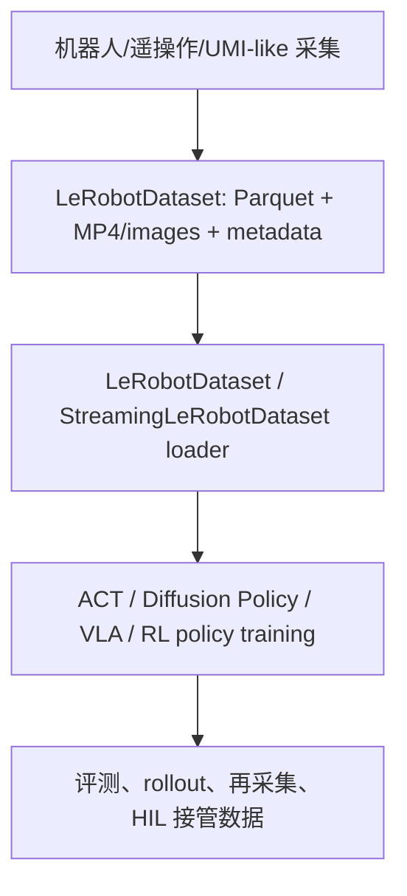

# LeRobot 初学者教学

> [!summary]
> LeRobot 可以先理解成 Hugging Face 做的“机器人学习工具箱”：它把机器人数据格式、数据采集、数据加载、模仿学习/强化学习/VLA 策略训练和评测接口放在同一个生态里。对 [[08-umi-gripper-research-and-business-plan|UMI 数据采集业务]] 来说，LeRobot 最重要的价值不是某个模型，而是让客户更容易读取、检查、训练和复用数据包。

> [!tip] 先读哪里
> 如果只是为了看懂 UMI 报告里的 `Zarr/LeRobot 导出`，先读 [[#一句话理解]]、[[#LeRobotDataset v3 怎么存数据]] 和 [[#和 UMI/Zarr 的关系]] 就够了。更细的字段对照见 [[umi-v0-sop-schema-data-package-2026-05-28#UMI/Zarr 与 LeRobot Schema 对照]]。

## 一句话理解

LeRobot 做两件事：

1. **把机器人数据组织成统一格式。** 典型数据包括多路相机视频、机器人状态、动作、时间戳、任务文本和 episode 元数据。
2. **让这些数据能直接进入训练和评测工具链。** 例如用 `LeRobotDataset` 加载数据，用 ACT、Diffusion Policy、VLA 等策略训练，再做 rollout 或 benchmark。

可以把它类比成机器人领域的“数据格式 + DataLoader + 训练脚手架 + Hub 生态”。

## 它解决什么问题

机器人数据很容易碎片化：不同实验室、不同机器人、不同相机、不同动作空间，文件结构都不一样。这样会导致三个问题：

- 数据集能下载，但训练脚本读不了。
- 字段名一样，但含义、单位、坐标系或频率不同。
- 视频、状态和动作没有清晰 episode 边界和元数据，后续很难质检、复训和复现实验。

LeRobot 的目标是降低这些摩擦。官方仓库说明它提供 real-world robotics 的 models、datasets 和 tools，并强调 LeRobotDataset 是用于解决机器人数据碎片化的标准化格式。证据：[`SRC-robotics-052`](../../../raw/robotics-embodied-ai/documents/SRC-robotics-052-lerobot-github-repository.md)。

## LeRobot 的三层



| 层 | 初学理解 | 对数据服务的意义 |
|---|---|---|
| 数据格式 | 规定视频、状态、动作、任务、episode 元数据怎么放 | 客户拿到数据后能用统一 loader 读取。 |
| 数据加载 | 用 `LeRobotDataset` 或 streaming loader 把数据变成训练样本 | 降低客户写自定义 dataloader 的成本。 |
| 训练/评测工具 | 提供 ACT、Diffusion、VLA、HIL 等策略或流程入口 | 数据包可以附 baseline recipe，而不是只交文件夹。 |

## LeRobotDataset v3 怎么存数据

官方 LeRobotDataset v3 文档把数据拆成三类：低维信号存在 Parquet，视觉数据存在 MP4 或 images，schema/统计/episode 边界等存在 metadata。证据：[`SRC-robotics-053`](../../../raw/robotics-embodied-ai/documents/SRC-robotics-053-lerobotdataset-v3-0-documentation.md)。

| 目录或字段 | 初学解释 | 常见内容 |
|---|---|---|
| `meta/info.json` | 数据集说明书 | features、shape、dtype、fps、路径模板、codebase version |
| `meta/stats.json` | 归一化统计 | mean/std/min/max 等训练前常用统计 |
| `meta/tasks.jsonl` | 任务文本表 | 每个任务的自然语言描述和 task id |
| `meta/episodes/` | episode 索引 | episode 长度、任务、在 Parquet/MP4 里的 offset |
| `data/` | 低维时间序列 | timestamp、frame_index、episode_index、`observation.state`、`action` |
| `videos/` | 图像/视频数据 | `observation.images.front`、`observation.images.wrist` 等相机视频 |
| `observation.state` | 机器人看到的低维状态 | 关节、末端位姿、夹爪宽度、底盘状态等，具体含义要靠 schema 解释 |
| `observation.images.*` | 机器人看到的图像 | 腕部相机、头部相机、第三方相机等 |
| `action` | 模型要预测或机器人要执行的动作 | 关节动作、末端动作、夹爪动作等，语义必须写清 |

> [!warning]
> `observation.state` 和 `action` 只是容器名，不自动告诉你每一维代表什么。ToB 交付必须额外写清维度、单位、坐标系、控制模式和转换函数版本。

## 和 UMI/Zarr 的关系

UMI 原始社区资料把数据分成 GoPro MP4、SLAM 输出和 Zarr replay buffer 等层级。Zarr 适合 Diffusion Policy 训练中的数组随机读取；LeRobot 更像工程互通和生态接入格式。证据：[`SRC-robotics-068`](../../../raw/robotics-embodied-ai/documents/SRC-robotics-068-umi-robot-dataset-community.md)、[`SRC-robotics-053`](../../../raw/robotics-embodied-ai/documents/SRC-robotics-053-lerobotdataset-v3-0-documentation.md)。

| 问题 | UMI/Zarr | LeRobot |
|---|---|---|
| 更像什么 | 训练 replay buffer | 数据交换和训练生态格式 |
| 典型数据 | `camera0_rgb`、`robot0_eef_pos`、`robot0_gripper_width`、`episode_ends` | `observation.images.*`、`observation.state`、`action`、`meta/tasks`、`meta/episodes` |
| 优点 | 数组结构直接，适合特定训练 pipeline | 元数据、任务文本、Hub/streaming、PyTorch loader 生态更清晰 |
| ToB 建议 | 作为 UMI/DP 兼容导出保留 | 作为默认客户交付格式之一 |

更细字段映射见 [umi_zarr_lerobot_schema_crosswalk.csv](../../../raw/robotics-embodied-ai/data/umi_zarr_lerobot_schema_crosswalk.csv) 和 [[umi-v0-sop-schema-data-package-2026-05-28#UMI/Zarr 与 LeRobot Schema 对照]]。

## 初学者学习路径

### 第 0 步：只看概念

- 读 [[_entities/HuggingFaceLeRobot|LeRobot]]、[[_entities/Episode|Episode]]、[[_entities/DatasetSchema|Dataset Schema 数据集结构]]、[[_entities/Observation|Observation 观测]]、[[_entities/Action|Action 动作]]。
- 目标：能解释“LeRobot 不是一个机器人，而是机器人数据和训练工具链”。

### 第 1 步：看一个数据目录

重点看这些文件夹：

```text
meta/
data/
videos/
```

目标：能说出视频、低维状态/动作、任务文本、episode 边界分别放在哪里。

### 第 2 步：看一条样本

关注 loader 返回的字段：

```text
observation.images.<camera>
observation.state
action
timestamp
episode_index
frame_index
task_index
```

目标：能判断“模型看到什么”和“模型要预测什么”。

### 第 3 步：接到 UMI-like 数据包

对 [[08-umi-gripper-research-and-business-plan|UMI-like 数据采集]]，最小转换思路是：

- 腕部 RGB -> `observation.images.wrist`
- 末端位姿、夹爪宽度 -> `observation.state`
- 机器人可执行的末端/夹爪命令 -> `action`
- `episode_ends` -> `meta/episodes` offset/length
- 任务说明 -> `meta/tasks.jsonl`
- 质检结果 -> `episode_quality.csv` 或 metadata 扩展

### 第 4 步：训练一个最小 baseline

初学不要一开始追求大模型泛化。更合适的验收是：

- 数据能被 `LeRobotDataset` 打开。
- 一个小任务能 overfit 或在训练集附近复现。
- 评测报告写清成功率、失败类型、训练配置和数据版本。

这部分可与 [[umi-v0-sop-schema-data-package-2026-05-28#客户版数据包样例目录]] 的 `training/` 目录对应。

## 常见误解

- **误解 1：LeRobot 等于某一个模型。**  
  更准确地说，它是数据、模型、训练和评测工具链；里面可以接 ACT、Diffusion、VLA 等不同策略。

- **误解 2：只要导成 LeRobot，就一定能训练好。**  
  格式正确只是第一步。相机是否清晰、动作是否对齐、episode 是否切对、action 是否可执行、任务标签是否一致，仍然决定数据价值。

- **误解 3：`observation.state` 可以随便拼。**  
  可以拼，但必须写清每一段的含义、单位、坐标系和顺序，否则客户或未来的自己会读不懂。

- **误解 4：LeRobot 会替代 raw 数据。**  
  不应替代。ToB 数据包仍要保留 raw videos、原始传感器日志、标定文件、转换脚本和 QC 报告，LeRobot 是其中一个训练/互通导出层。

## 对中国 ToB 数据服务的意义

LeRobot 让数据服务从“给客户一堆视频和 CSV”升级为“给客户一个能直接进入训练工具链的数据包”。这和 [[07-training-data|训练数据生产与处理]] 中的数据平台判断一致：未来价值不只在采集量，而在 schema、质检、格式转换、baseline 复现和跨客户复用。

对国内 UMI-like 设备/数据服务商，建议默认交付：

- raw 数据：视频、传感器日志、标定、采集 manifest。
- processed 数据：episode 切分、同步后的状态/动作、清洗记录。
- LeRobot 导出：`meta/`、`data/`、`videos/`。
- UMI/Zarr 或 HDF5 导出：服务客户现有训练栈。
- QC 报告：帧丢失、时间同步、轨迹跳变、失败/重采原因。
- baseline recipe：训练命令、配置、评测结果和失败样例。

## 相关笔记

- [[07-training-data|训练数据生产与处理]]
- [[09-training-data-deep-dive|训练数据深度调研]]
- [[08-umi-gripper-research-and-business-plan|UMI Gripper 技术研究、学习计划与数据采集业务落地]]
- [[_entities/README|UMI Gripper 初学者技术术语教学]]
- [[dataset-schema-comparison-2026-05-27]]
- [[umi-v0-sop-schema-data-package-2026-05-28]]
- [[failure-intervention-data-2026-05-27]]

## 来源

- [`SRC-robotics-052`](../../../raw/robotics-embodied-ai/documents/SRC-robotics-052-lerobot-github-repository.md): LeRobot GitHub repository.
- [`SRC-robotics-053`](../../../raw/robotics-embodied-ai/documents/SRC-robotics-053-lerobotdataset-v3-0-documentation.md): LeRobotDataset v3.0 documentation.
- [`SRC-robotics-068`](../../../raw/robotics-embodied-ai/documents/SRC-robotics-068-umi-robot-dataset-community.md): UMI Robot Dataset Community.
- [`SRC-robotics-097`](../../../raw/robotics-embodied-ai/documents/SRC-robotics-097-lerobot-human-in-the-loop-data-collection-documentation.md): LeRobot human-in-the-loop data collection documentation.
- Official docs checked on 2026-05-28: [LeRobotDataset v3.0](https://huggingface.co/docs/lerobot/lerobot-dataset-v3), [LeRobot GitHub](https://github.com/huggingface/lerobot).
