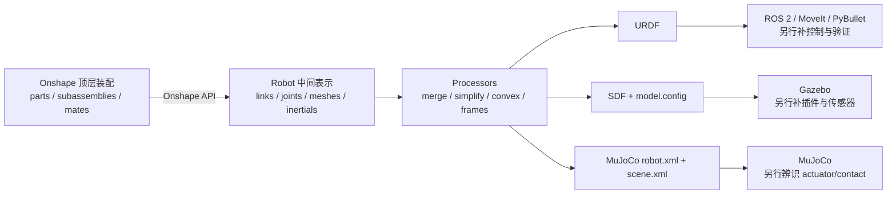

# onshape-to-robot 用法、工程边界与选型调研

> [!summary]
> **结论（中高置信度）**：`onshape-to-robot` 很适合 Onshape-first 的机器人团队，把按约定组织的顶层装配通过 Onshape API 转成 URDF、SDF 或 MuJoCo XML，并自动带出 STL、质量、质心、惯量、关节、frame/site 和部分执行器/接触配置。它的价值是减少 CAD→机器人描述的重复手工录入；它不是“一键可用的 ROS 2/MoveIt/控制/高保真仿真生产线”。推荐先用 2–4 DoF 真实装配做版本锁定的 PoC，再决定是否纳入模型 CI。不要直接用大型、嵌套复杂或来源不可信的装配作为首个验证对象。

## 分类与研究边界

- **主分类**：R05 产品、平台与工具选型调研。
- **次分类**：R04 技术原理、论文与前沿方向调研。
- **分类理由**：研究问题是如何安装、建模、配置、导出和验证一个 CAD→机器人描述工具，以及什么条件下值得采用；核心决策是工程选型而非行业规模或公司投资。
- **覆盖**：当前版本、许可证、架构、Onshape 设计约定、认证、`config.json`、URDF/SDF/MuJoCo、processors、示例、PoC、风险和商业化边界。
- **不覆盖**：不使用用户 Onshape 凭据，不修改云端文档，不复现具体机器人；不把生成模型直接认定为真机控制模型；不评估 Onshape 订阅价格、企业条款或中国网络可用性的实时 SLA。

## 一句话理解

它是一个“**从 Onshape 装配读取结构、几何和质量属性，再编译成机器人描述文件**”的 Python 工具：CAD 端用命名约定表达 link、joint、frame 和闭环，工具端用 processors 整理中间模型，再由 exporter 输出 URDF、SDF 或 MJCF。[`SRC-robotics-516`](../../../raw/robotics-embodied-ai/documents/SRC-robotics-516-onshape-to-robot-official-repository-at-commit-7d0803d.md) [`SRC-robotics-518`](../../../raw/robotics-embodied-ai/documents/SRC-robotics-518-onshape-to-robot-design-time-conventions.md) [`SRC-robotics-523`](../../../raw/robotics-embodied-ai/documents/SRC-robotics-523-onshape-to-robot-processors-documentation.md)



## 版本、许可证与维护快照

| 项目 | 2026-08-10 核验结果 | 选型含义 |
|---|---|---|
| PyPI 稳定版 | `1.8.2`，Python `>=3.9`；核心依赖是 NumPy、Requests、commentjson、numpy-stl、transforms3d、python-dotenv 等 | 生产 PoC 应先 pin 版本，不要无约束安装 latest |
| 默认分支 | 固定到 `7d0803db16c99efa0bd59482f2dc81f9558aa7ba`，提交日 2026-06-19 | master 晚于 v1.8.2，不能把 latest docs 与已发布 wheel 视为完全相同 |
| v1.8.2→master | 一次合并，涉及 OAuth 文档、gear relation 空值保护、SDF pose 修复 | 特别是 SDF 用户应分别验收 v1.8.2 与固定 master commit |
| 许可证 | MIT | 代码可商用；Onshape 服务条款、CAD/零件 IP、生成 meshes 的权利另行审查 |
| 自动化测试 | 固定提交树中未发现测试目录或 pytest/tox/nox 配置；GitHub Actions 只看到发行构建 | 上游没有替你提供目标模型回归保证，内部 golden model CI 是采用前提 |
| 本轮验证 | 官方网页与 raw artifact 抽取、固定提交源码审阅、Python `compileall` 通过 | 未持有 Onshape API 密钥，不能声称已完成真实导出或动力学闭环 |

证据见 [[_sources/onshape-to-robot-official-source-set|onshape-to-robot 来源集]]；PyPI 页面正文抽取超时，但 HTML 已保存，版本与依赖由 PyPI JSON 和固定 `pyproject.toml` 交叉核验。[`SRC-robotics-525`](../../../raw/robotics-embodied-ai/documents/SRC-robotics-525-onshape-to-robot-pypi-package.md)

## 最小可运行用法

### 1. 安装并锁版本

官方文档给出的入口是：

```bash
python -m pip install onshape-to-robot
```

工程上更建议创建独立环境并 pin 本轮核验版本；如果需要内置 viewer，再安装 extras：

```bash
uv venv
source .venv/bin/activate
uv pip install "onshape-to-robot[pybullet,mujoco]==1.8.2"
onshape-to-robot --version
```

只有使用对应处理器时再增加依赖：

```bash
uv pip install pymeshlab
uv pip install coacd trimesh
```

- `simplify_stls` 需要 `pymeshlab`。
- `convex_decomposition` 的源码会尝试导入 `coacd` 和 `trimesh`。
- `use_scads` 还需要系统安装 OpenSCAD，不只是 Python 包。

安装和 CLI 入口以官方文档与固定提交 `pyproject.toml` 为准。[`SRC-robotics-517`](../../../raw/robotics-embodied-ai/documents/SRC-robotics-517-onshape-to-robot-getting-started-documentation.md) [`SRC-robotics-516`](../../../raw/robotics-embodied-ai/documents/SRC-robotics-516-onshape-to-robot-official-repository-at-commit-7d0803d.md)

### 2. 配置认证，不把密钥写进模型仓库

在项目根目录创建 `.env`：

```dotenv
ONSHAPE_API=https://cad.onshape.com
ONSHAPE_ACCESS_KEY=replace_me
ONSHAPE_SECRET_KEY=replace_me
```

或者使用 OAuth bearer：

```dotenv
ONSHAPE_API=https://cad.onshape.com
ONSHAPE_SECRET_BEARER=replace_me
```

并把 `.env` 加入 `.gitignore`。旧版把凭据放进 `config.json` 的方式在源码中仅为兼容而保留，官方已标为 deprecated。优先创建最小权限、可轮换的凭据；CI 使用 secret manager，不提交日志或 shell history。[`SRC-robotics-517`](../../../raw/robotics-embodied-ai/documents/SRC-robotics-517-onshape-to-robot-getting-started-documentation.md)

### 3. 先按工具约定整理 Onshape 装配

| Onshape 端约定 | 导出含义 | 关键注意 |
|---|---|---|
| 顶层 assembly | 工具读取的机器人入口 | 不要假设任意嵌套装配里的 DoF 都能自动展开 |
| assembly 列表中的第一个 instance | base link | 顺序错误会改变根链接 |
| 每个 instance | 一个候选 link | 可用 `fix_` 合并固定部件；孤儿 link 会被固定到 base 并报警 |
| `dof_<name>` mate connector | joint `<name>` | revolute/cylindrical→revolute，slider→prismatic，fastened→fixed；轴沿 joint frame 的 z 轴 |
| `dof_<name>_inv` | 反转关节轴 | 常用于左右轮或对称关节方向统一 |
| `link_<name>` | 指定 link 名 | 应先确定 ROS/控制栈的稳定命名规范 |
| `frame_<name>` | URDF dummy link、SDF frame、MuJoCo site | 适合 TCP、足端、相机、标定点 |
| `fix_<name>` | 固定并合并两个 link | 合并后要重新核对质量、质心和碰撞体 |
| `closing_<name>` | 闭合运动学环 | MuJoCo 可导出 equality；URDF 本身不能原生表达闭环 |
| Onshape gear relation | URDF/SDF mimic，MuJoCo equality | 源/目标关节选择顺序影响方向和比例 |
| Onshape joint limits | 导出 joint limits | 仍需用真机规格和安全控制层复核 |

完整约定见 [`SRC-robotics-518`](../../../raw/robotics-embodied-ai/documents/SRC-robotics-518-onshape-to-robot-design-time-conventions.md)。官方示例覆盖两轮车、机械臂、四足、人形、闭环机构和静态场地，但这些示例只是成功样本，不是“任意装配可导出”的兼容性证明。[`SRC-robotics-524`](../../../raw/robotics-embodied-ai/documents/SRC-robotics-524-onshape-to-robot-examples-repository-at-commit-7e40fd6.md)

### 4. 创建最小 `config.json`

目录结构：

```text
my-robot/
└── config.json
```

最小配置：

```json
{
  "url": "https://cad.onshape.com/documents/<document>/v/<version>/e/<element>",
  "output_format": "urdf"
}
```

推荐优先使用 `/v/<version>/` URL 做可复现构建；`/w/<workspace>/` 适合迭代，但指向可变状态，源码也不会对 workspace 请求使用同样的缓存策略。若文档里有多个 assembly，可增加 `assembly_name`。

面向 ROS 的实用起点：

```json
{
  "url": "https://cad.onshape.com/documents/<document>/v/<version>/e/<element>",
  "output_format": "urdf",
  "robot_name": "my_robot",
  "output_filename": "my_robot",
  "assets_directory": "assets",
  "package_name": "my_robot_description",
  "joint_properties": {
    "default": {
      "max_effort": 10.0,
      "max_velocity": 2.0
    },
    "shoulder_*": {
      "friction": 0.1
    }
  }
}
```

上面的 effort、velocity、friction 是**示例占位值，不是任何具体执行器的推荐参数**；上线前必须用电机/减速器/控制器规格和实验校准替换。`package_name` 会生成 `package://...` mesh URI，因此输出目录应被放进相应 ROS description package。全局参数见 [`SRC-robotics-519`](../../../raw/robotics-embodied-ai/documents/SRC-robotics-519-onshape-to-robot-config-documentation.md)，URDF 参数见 [`SRC-robotics-520`](../../../raw/robotics-embodied-ai/documents/SRC-robotics-520-onshape-to-robot-urdf-exporter-documentation.md)。

### 5. 导出与查看

```bash
onshape-to-robot my-robot
```

典型输出：

- URDF：`my-robot/robot.urdf` + `assets/`。
- SDF：`robot.sdf` + `model.config` + assets。
- MuJoCo：`robot.xml` + `scene.xml` + assets。

可选 smoke test：

```bash
onshape-to-robot-bullet my-robot
onshape-to-robot-mujoco my-robot
```

viewer 能打开只证明文件可加载，不证明 joint axis、惯量、接触、执行器和任务行为正确。[`SRC-robotics-517`](../../../raw/robotics-embodied-ai/documents/SRC-robotics-517-onshape-to-robot-getting-started-documentation.md)

## 三种输出怎么选

| 输出 | 最适合 | 工具自动提供 | 仍需人工补齐/验证 |
|---|---|---|---|
| URDF | ROS 2、MoveIt、robot_state_publisher、PyBullet 入口 | links/joints、mesh、inertial、limits、frame dummy links、mimic | Xacro/包结构、SRDF、ros2_control、transmission、controller YAML、Gazebo 插件、碰撞简化、自碰矩阵 |
| SDF | Gazebo 模型与多根/frames 表达 | SDF 1.7、`relative_to`、frames、`model.config`、geometry overrides | Gazebo 版本兼容、sensor/plugin、materials、contact/solver、控制桥；v1.8.2 与 master 差异验证 |
| MuJoCo XML | 控制、RL、系统辨识、闭环机构仿真 | body/joint/mesh/inertial、site、默认 actuator、equality、`scene.xml` | actuator 类型和增益、armature、frictionloss、contact、sensor、tendon、keyframe、真实参数辨识 |

URDF、SDF、MuJoCo 的官方专用参数分别见 [`SRC-robotics-520`](../../../raw/robotics-embodied-ai/documents/SRC-robotics-520-onshape-to-robot-urdf-exporter-documentation.md)、[`SRC-robotics-521`](../../../raw/robotics-embodied-ai/documents/SRC-robotics-521-onshape-to-robot-sdf-exporter-documentation.md)、[`SRC-robotics-522`](../../../raw/robotics-embodied-ai/documents/SRC-robotics-522-onshape-to-robot-mujoco-exporter-documentation.md)。

## Processors 与高级工作流

### Retrieve/convert 分离

```bash
onshape-to-robot --retrieve my-robot
onshape-to-robot --convert my-robot
```

`--retrieve` 保存 `robot.pkl`，之后可反复跑 processors/exporter，减少 Onshape API 请求。[`SRC-robotics-523`](../../../raw/robotics-embodied-ai/documents/SRC-robotics-523-onshape-to-robot-processors-documentation.md)

但应注意：

- 当前 open issue 报告，修改 `joint_properties` 后复用旧 `robot.pkl` 可能不生效；在维护者确认前，修改 joint/geom 配置后应重新 retrieve，并把这一行为加入回归测试。[`SRC-robotics-528`](../../../raw/robotics-embodied-ai/documents/SRC-robotics-528-onshape-to-robot-issue-206-retrieve-convert-config-behavior.md)
- Python pickle 可执行任意对象反序列化逻辑。不要加载别人提供或来源不明的 `robot.pkl`，`--safe` 也不能把不可信 pickle 变安全。

### 常用 processors

| 参数 | 作用 | 建议 |
|---|---|---|
| `merge_stls` | 合并同一 link 的多个 STL | 降低文件数，但会降低局部材质/碰撞可编辑性；前后比较 mesh 和 inertial |
| `simplify_stls` + `max_stl_size` | 用 pymeshlab 简化大 STL | 分开 visual/collision 目标；不能只按文件大小验收 |
| `use_scads` | 用 OpenSCAD primitives 近似 collision | 适合人工可审计的粗碰撞；需要维护 `.scad` |
| `convex_decomposition` | 用 CoACD 分解 collision mesh | 对接触仿真有用；分解数量、缝隙和运行成本需目标任务验收 |
| `add_dummy_base_link` | 增加单一根 `base_link` | URDF 多根模型常用；会固定其他根，不能表达根间自由度 |
| `ball_to_euler` | ball joint 拆成三个 revolute | 只在下游不支持 ball 时使用；Euler 顺序与奇异性需验收 |
| `no_collision_meshes` / `collisions_as_visual` | 移除或可视化 collision | 适合调试，不应用可视化成功替代接触正确性 |
| `use_fixed_links` | 每个 part 保留为 fixed link | 可保留颜色/调试结构，但官方明确提示物理性能可能较差 |

### 安全运行模式

```bash
onshape-to-robot --safe my-robot
```

固定提交源码中，普通 `config.json` 可以指定自定义 Python processor 和 `post_import_commands`；默认流程还会调用部分外部工具。处理不可信项目时应加 `--safe`，并在隔离环境中审阅 `config.json`。即便如此，仍不要 `--convert` 不可信 pickle，也不要运行来源不明的 OpenSCAD/mesh processor 输入。

## 常见失败与定位顺序

| 现象 | 优先检查 | 处理 |
|---|---|---|
| 403 | API 凭据、document 权限、是否拥有示例文档副本 | 官方示例要求复制到自己有权限的 Onshape 文档，再更新 URL [`SRC-robotics-524`](../../../raw/robotics-embodied-ai/documents/SRC-robotics-524-onshape-to-robot-examples-repository-at-commit-7e40fd6.md) |
| 429 | parts 数、重复请求、是否使用 live workspace | 拆小 PoC；使用固定 version；retrieve 一次后离线 convert；记录请求数和 Retry-After。约 1000 parts 仅是一个用户案例，不是固定阈值 [`SRC-robotics-526`](../../../raw/robotics-embodied-ai/documents/SRC-robotics-526-onshape-to-robot-issue-170-onshape-api-rate-limit.md) |
| 0 DoF / 关节丢失 | 是否顶层 assembly、mate connector 名是否 `dof_`、suppressed feature、嵌套子装配 | 先把真实关节提升到顶层；对重复子装配建立最小回归。open issue 已有嵌套 DoF 未识别报告 [`SRC-robotics-527`](../../../raw/robotics-embodied-ai/documents/SRC-robotics-527-onshape-to-robot-issue-76-dof-in-nested-subassemblies.md) |
| 根链接错误 | assembly 中第一个 instance、多根 base | 调整 instance 顺序；URDF 使用 dummy base 或拆分模型 |
| 轴反了 | joint frame z 轴、`_inv` | 在零位做正方向小步测试，不靠肉眼猜 |
| 惯量为零/不合理 | 材料、mass override、composite part、`no_dynamics` | 对总质量、每 link 质量、COM、惯量正定性做 gate；异常不进入控制/RL |
| mesh 太大/接触抖动 | visual 与 collision 是否共用复杂 STL | visual 保真，collision 做 primitive/convex/simplified 版本；用任务接触回归验收 |
| 修改 config 后 convert 无变化 | 是否复用旧 `robot.pkl` | 重新 retrieve；把 config hash 与 source version 写进构建 manifest |
| SDF 解析异常 | 使用 v1.8.2 还是固定 master | master 含晚于 v1.8.2 的 pose 修复；不要漂移安装，分别测试并记录 commit |

缓存异常时可执行：

```bash
onshape-to-robot-clear-cache
```

## 它不会自动替你完成什么

1. **不会生成完整 ROS 2 description package**：URDF 只是核心文件；Xacro、launch、RViz、SRDF、kinematics、ros2_control 和 controller config 仍要维护。
2. **不会验证真机参数**：CAD mass properties 依赖材料和装配定义；执行器模型、减速器摩擦、线缆、背隙、柔顺和传感器偏置需要辨识。
3. **不会自动产出好碰撞体**：STL 可加载不等于接触稳定、实时或适合规划。
4. **不会解决闭环格式差异**：MuJoCo equality 更自然；URDF 仍是树，闭环控制/求解需下游机制。
5. **不会消除供应商依赖**：源模型依赖 Onshape SaaS/API/权限；离线、内网、国产化或长期归档场景需保存版本化导出物和替代链路。

## 最小 PoC 与验收标准

### PoC 对象

选择一个真实但简单的 2–4 DoF 机械臂或轮式底盘：

- 顶层 assembly；
- 一个 fixed base、一个 revolute、一个 prismatic（若业务需要）、一个 `frame_tool0`；
- 材料/质量属性已填写；
- 一个固定 `/v/` URL；
- 同一 source 同时输出 URDF 和 MuJoCo；SDF 若是目标链路则单独加入。

### 建议验收表

| 层级 | 验收项 | 通过条件 |
|---|---|---|
| 来源可复现 | version URL、工具版本、config、source hash | 任何工程师在相同权限下能得到结构一致的输出；构建 manifest 记录版本 |
| 结构 | link/joint/frame 名称、数量、父子关系、单根 | 与设计表逐项一致；没有未解释 orphan 或丢失 DoF |
| 几何 | 单位、尺度、零位、mesh URI、visual/collision | 尺寸和方向与 CAD 对齐；collision 可单独显示与审阅 |
| 关节 | 类型、z 轴方向、limits、mimic/gear | 正向小步、上下限和耦合方向符合设计；不依赖 viewer 主观判断 |
| 动力学 | mass、COM、惯量矩阵 | 与 Onshape version 的基准表在项目预先定义的容差内；无意外零质量、负值或非正定惯量 |
| 格式加载 | URDF/SDF/MJCF parser | 无 error；warning 必须分类并关闭或接受 |
| 仿真 | 重力静置、关节逐个扫动、接触任务 | 无数值爆炸、明显穿透或错误自碰；viewer 成功不是唯一标准 |
| 下游 | ROS TF/MoveIt 或 MuJoCo controller | joint order、frame、limits 与下游接口一致；任务回归成功 |
| 安全 | 密钥、config、pickle、post commands | 没有 secret 入库；不执行不可信项目；CI 使用最小权限 |
| 更新回归 | Onshape 新 version 或工具升级 | golden diff 可解释；关键任务指标不退化才允许升级 |

> [!important]
> 质量、COM、接触和任务成功的数值阈值必须由具体机器人和用途定义。本报告不凭空给统一毫米、百分比或成功率门槛。

### Go / No-Go

**Go**：目标模型是 Onshape-first、装配约定可控、需要频繁同步 CAD→URDF/SDF/MJCF，且团队愿意维护模型回归 CI。

**Conditional Go**：复杂嵌套、闭环、大规模装配或 SDF 主链路；先用真实最小切片验证 API rate limit、DoF 展开、质量属性和版本差异。

**No-Go**：源 CAD 不在 Onshape；必须完全离线/内网；希望工具自动生成控制器/MoveIt/传感器插件；没有能力验证惯量、碰撞和任务行为；不愿接受 Onshape API 与权限依赖。

## 统一场景下的替代方案边界

| 方案 | 强项 | 相对 onshape-to-robot 的代价 |
|---|---|---|
| 手写 URDF/Xacro | 完全可控，ROS 生态直接 | CAD 变更与机器人描述容易漂移，重复录入多 |
| Onshape 自定义 FeatureScript/自研 API pipeline | 可按企业 schema 深度定制 | 开发维护和 Onshape API 适配成本更高 |
| CAD 导出 mesh 后手工建 MJCF/SDF | 可针对单一仿真器精调 | 结构、坐标、惯量和版本追踪更依赖人工 |
| Fusion/SolidWorks/FreeCAD 相关 exporter | 适配其他 CAD 存量 | 换 CAD 或多 exporter 统一 schema 的迁移成本 |
| USD/Isaac Sim 资产管线 | 场景、材质、传感器和高保真资产生态更强 | 不是轻量 ROS/MJCF 机器人描述的直接替代；还需验证 joint/physics semantics |

如果核心需求只是一次性得到一个稳定 URDF，手工或其他 CAD exporter 可能更省；如果核心需求是**持续把 Onshape version 编译成多格式并做差异检测**，`onshape-to-robot` 的价值更明显。相关资产管线对比见 [[3d-simulation-asset-production-pipelines-comparison-2026-08-06|3D 仿真资产生产管线]]。

## 中国与十五五语境

- **事实**：没有证据表明中国十五五政策直接点名或采购 `onshape-to-robot`。
- **判断**：它与机器人数字化研发、仿真验证、模型复用和软件工具链效率相关，属于工程工具层而不是政策独立赛道。
- **中国优势**：国内机器人本体、系统集成和快速迭代场景多，CAD→仿真→控制的自动化需求真实。
- **中国短板/依赖**：Onshape 是海外云 CAD；账号、网络、API、数据驻留、企业采购和长期归档要求可能成为供应链与合规约束。
- **选型含义**：中国团队若采用，应同步维护 versioned output、模型 manifest、离线备份和至少一条不依赖 Onshape 在线 API 的灾备导出链路。

## 商业应用可能性

### 谁为什么会付费

| 角色 | 关心的问题 |
|---|---|
| 使用者 | 机器人机械/仿真/控制工程师，减少重复建模和 CAD 变更同步 |
| 决策者 | 研发负责人、平台负责人，希望缩短模型交付周期、减少坐标/惯量/版本错误 |
| 采购者/付款者 | 机器人公司、实验室、系统集成商、教育平台；通常为集成、验证和维护服务付费，而不是只为 MIT 工具本身付费 |

**高频/高成本问题**：CAD、URDF、SDF、MJCF 多份模型漂移；人工复制 joint/frame/inertial 容易出错；每次机械改版都要重复校验下游。

**价值增量**：可量化为模型更新 lead time、人工编辑次数、golden diff 数量、集成缺陷、仿真/规划回归失败率和重复修复工时。公开资料没有给出独立客户 ROI 或付费案例，因此具体收益为 `待验证`。

### 成熟度判断

- **开源工程工具成熟度**：中等。三类 exporter、示例、处理器和持续维护信号明确。
- **工业产品成熟度**：待验证。没有看到企业 SLA、官方兼容矩阵、自动化测试覆盖或规模客户证据。
- **近期 1–2 年**：作为机器人团队内部工具、实验室工具和集成项目组件，可能性**中高**；置信度中等。
- **中期 3–5 年**：单一开源转换器本身形成大规模独立收入的可能性**偏低**；嵌入模型治理、仿真资产 QA、数字线程和行业集成服务后可能性**中等**。

### 最先落地的场景

1. Onshape-first 的教育/科研/开源机器人项目，快速得到 URDF/MJCF。
2. 小中型机器人团队的 description-package 自动构建和 golden diff。
3. 仿真/控制咨询交付中的 CAD→模型首版与 QA 报告。

从试点到重复采购的门槛是：真实复杂装配兼容率、可解释的模型 diff、可审计的质量/碰撞验证、权限与数据治理、稳定 API、升级回归和明确支持责任。

## 中小型创业者的机会

### 可立即验证

| 切口 | MVP | 首批客户 | 首个可收费交付物 | 团队/周期 |
|---|---|---|---|---|
| CAD→ROS/MuJoCo 模型交付 | 1 个客户本体，自动导出 + description package + QA | 机器人初创、实验室、集成商 | 可复现模型包、质量/坐标/碰撞验收报告 | 2–3 人，4–8 周验证；低到中资本 |
| 模型 CI 与差异检测 | Onshape version→URDF/MJCF→结构/惯量/mesh/task regression | 有频繁机械改版的团队 | CI 模板、golden tests、变更报告 | 2–4 人，6–10 周；低资本 |
| 碰撞体与仿真资产优化 | primitive/convex decomposition + contact task A/B | 抓取、腿足、移动机器人团队 | collision asset pack + 性能/稳定性报告 | 3–5 人，6–12 周；中资本 |
| 培训与内训 | 用客户简单装配跑通 design convention 和验证表 | 高校、职业教育、机器人公司 | 课程、模板、样例和一次模型评审 | 1–2 人，2–4 周；低资本 |

复购来自新机器人版本、新型号、新格式、新仿真器和持续 regression，而不是一次导出。护城河应是客户模型 schema、失败样例库、任务级 QA、下游 ROS/MoveIt/MuJoCo 集成 know-how 和模型版本治理。

### 需要条件成熟

- 企业级 Onshape OAuth 应用、多租户权限、审计、数据驻留和 SLA。
- 面向中国本体厂的 CAD→USD/SDF/MJCF/URDF 多格式资产治理平台。
- 与 PLM/PDM、BOM、测试数据和仿真结果绑定的 digital thread。

这些方向需要稳定 API 合同、企业客户验证、合规方案和更长销售周期，不适合作为无客户起点的“大平台先行”。

### 不建议进入

- 只包装 MIT CLI、没有 QA/集成/行业交付的通用“URDF 一键生成 SaaS”。
- 承诺任意 CAD/任意复杂机器人都能无人工修正转换。
- 把生成模型直接宣传为高保真 digital twin 或真机安全模型。
- 在没有 Onshape 企业权限与数据治理能力时托管客户核心 CAD 和 API 密钥。

## 事实、估计、判断与假设

| 类型 | 内容 | 证据/验证 |
|---|---|---|
| 事实 | 工具支持 URDF、SDF、MuJoCo；有 PyPI 1.8.2、MIT、Python >=3.9 | 官方仓库、PyPI、文档 |
| 事实 | CAD 需要遵循 `dof_`、`frame_`、`link_`、`fix_`、`closing_` 等约定 | [`SRC-robotics-518`](../../../raw/robotics-embodied-ai/documents/SRC-robotics-518-onshape-to-robot-design-time-conventions.md) |
| 事实 | master 晚于 v1.8.2 且包含 SDF pose 修复 | 固定 tag/commit diff |
| 估计 | 小团队首个客户模型集成可在 4–8 周验证 | 本报告工程估计；需用真实模型和工时记录验证 |
| 判断 | Onshape-first 且需要持续多格式同步时价值高 | 以 PoC 的 lead time、缺陷和回归指标证伪 |
| 假设 | 模型 CI/QA 比单次转换更容易形成复购 | 用 3–5 个客户的续费、版本频率和支持工时验证 |

## 反方证据与知识冲突

1. **文档冲突**：总览和源码支持 SDF，但通用 config 页一处只写 `urdf` 或 `mujoco`。本报告以固定提交 `export.py` 的三分支为准，并保留该文档漂移。[`SRC-robotics-519`](../../../raw/robotics-embodied-ai/documents/SRC-robotics-519-onshape-to-robot-config-documentation.md)
2. **发布版与 latest docs 冲突**：latest 文档来自 master，而 PyPI 仍是 v1.8.2；master 包含未发布修复。解决方式是 pin 版本/commit 并做格式级回归，不用“latest”作为证据。
3. **成功示例反证不足**：官方示例覆盖多种机器人，但 open issues 同时报告嵌套 DoF、rate limit 和 retrieve/convert config 行为。不能从示例外推任意企业装配成功。
4. **自动质量属性的反方边界**：质量/惯量来自 Onshape API，不等于材料、复合件 override 和实物总成一定正确；每次输出仍需与基准表比对。
5. **安全边界**：`--safe` 降低自定义命令/processor 风险，但不能让不可信 pickle 安全，也不能消除第三方工具输入风险。

## 风险、证伪条件与监测指标

| 风险 | 证伪/停止条件 | 监测指标 |
|---|---|---|
| API/权限/网络依赖 | 目标环境无法稳定访问或不允许云 CAD | 导出成功率、HTTP 403/429、P95 时长、离线恢复时间 |
| 复杂装配兼容 | 关键 nested DoF、闭环或 composite dynamics 无法稳定复现 | 丢失 joint、orphan、zero mass、manual patch 数 |
| 模型错误进入控制 | 惯量/轴/limit/碰撞错误无法自动 gate | golden diff、parser warning、任务回归、人工复核缺陷 |
| 维护漂移 | 新 Onshape API 或 package 版本破坏旧模型 | pinned build、release/commit、回归通过率、未解决 issue |
| 商业价值不足 | 自动化节省工时小于维护成本 | 每版本节省工时、缺陷减少、支持工时、复购率 |
| 供应链与合规 | 数据驻留或企业审计不通过 | 合规审查、权限审计、备份/迁移演练 |

**会改变当前推荐的证据**：三类真实客户装配持续失败且无法通过建模约定修正；Onshape API/条款显著限制自动化；上游长期停更；或替代 exporter 在同一 PoC 中以更低 TCO 达到更高任务回归通过率。

## 待验证事项与下一步

1. 用一个用户自有的 2–4 DoF Onshape version 做真实 API 导出，记录工具版本、请求数、时长、输出 hash 和 warning。
2. 对同一模型运行 URDF 与 MuJoCo：核对 link/joint/frame、质量/COM/惯量、轴/limits 和重力静置。
3. 若目标是 Gazebo，分别测试 PyPI v1.8.2 与固定 master `7d0803d` 的 SDF 输出，不直接安装浮动 master。
4. 用一个重复嵌套子装配构造回归，验证 issue #76 是否仍复现。
5. 修改 `joint_properties` 后复用/重建 `robot.pkl`，验证 issue #206 并决定是否禁用 split workflow。
6. 在 ROS 2 侧补 description package、Xacro/SRDF、ros2_control/MoveIt；在 MuJoCo 侧补 actuator/contact/solver 参数辨识。
7. 企业采用前确认 Onshape API 权限、数据驻留、密钥轮换、备份和 CAD/第三方零件许可。

## 关联连接

- [[_sources/onshape-to-robot-official-source-set|onshape-to-robot 官方来源集]]
- [[3d-simulation-asset-production-pipelines-comparison-2026-08-06|3D 仿真资产生产管线]]
- [[isaac-sim-vs-gazebo-vs-mujoco-2026-07-14|Isaac Sim、Gazebo、MuJoCo 选型]]
- [[unity-in-robotics-and-embodied-ai-2026-08-06|Unity 在机器人与具身智能中的应用]]
- [[robotics-embodied-ai/12-robotics-engineering-platforms-2026-06-04|机器人工程平台综合调研]]
- [[robotics-embodied-ai/00-source-capture-index|机器人来源抽取索引]]

## 来源

- [[_sources/onshape-to-robot-official-source-set|官方仓库、文档、示例与问题来源集]]
- [onshape-to-robot GitHub 固定提交](https://github.com/Rhoban/onshape-to-robot/tree/7d0803db16c99efa0bd59482f2dc81f9558aa7ba)
- [官方文档](https://onshape-to-robot.readthedocs.io/en/latest/)
- [官方示例固定提交](https://github.com/Rhoban/onshape-to-robot-examples/tree/7e40fd653205caa2f195d453fa495d9ef5179202)
