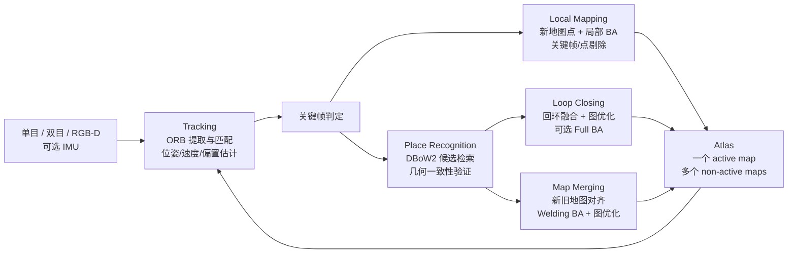
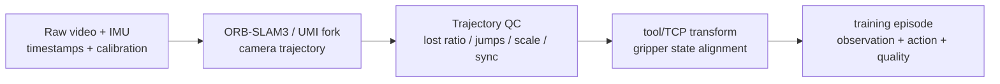

# ORB-SLAM3 技术原理、工程选型与商业落地深度调研

> [!summary] 先给结论
> **ORB-SLAM3 是“经典而强”的稀疏特征视觉 SLAM 基线，不是开箱即用的机器人导航产品。**它把单目、双目、RGB-D、单目/双目视觉惯性、鱼眼/针孔相机与 Atlas 多地图复用统一进同一库；核心竞争力是短期、共视中期、回环长期和跨会话数据关联，而不是稠密重建、语义理解或端到端导航。
>
> **技术上仍值得学和做 PoC，2026 年新商业项目不宜默认直接采用官方上游。**官方 `v1.0` 发布于 2021-12-22，默认分支最新提交为 2022-02-10；官方示例停留在 Ubuntu 16.04/18.04、ROS Melodic，未提供官方 ROS 2 包。GPLv3 也意味着闭源商业产品必须先完成许可决策，官方 README 提供另行联系商业闭源许可的路径。
>
> **最合适的现实定位：**研究/教学基线、受控环境定位、离线 UMI-like 轨迹恢复、需要跨会话重定位与地图复用的限定 PoC。对于 ROS 2 移动机器人稠密建图/导航，先看 RTAB-Map；对于 NVIDIA 边缘平台和多相机实时 VSLAM，评估 cuVSLAM；对于纯 VIO/标定研究，评估 OpenVINS/VINS-Fusion。
>
> **总判断置信度：高（技术边界与代码状态），中（商业需求与未来替代）。**论文和官方仓库是一手证据；没有在目标相机、国产算力或真实客户现场独立复现实验，商业成功率必须做任务级 A/B。

## 1. 分类与研究边界

| 字段 | 本次定义 |
|---|---|
| 主分类 | `R04 技术原理、论文与前沿方向调研` |
| 次分类 | `R05 产品、平台与工具选型`、`R07 商业落地与需求真实性` |
| 分类理由 | 用户需要理解 ORB-SLAM3 的原理、能力边界和真实工程价值，并决定是否学习、集成或产品化。 |
| 覆盖 | 算法架构、传感器模式、论文实验、复现条件、失败模式、许可证、维护状态、替代方案、商业/创业机会和 PoC。 |
| 不覆盖 | 不独立复现全套 benchmark；不对第三方 ROS 2 fork 做完整代码审计；不把作者 benchmark 外推为工厂、家庭或 UMI 生产可靠性；不提供法律意见。 |

## 2. 一句话理解：它到底解决什么问题

机器人或相机在未知环境里运动时，ORB-SLAM3 同时估计：

1. 当前相机/IMU 在世界坐标系中的 6DoF 位姿；
2. 被反复观察到的稀疏三维地图点与关键帧；
3. 当前观测是否回到了历史位置；
4. 跟踪丢失后，是否能在旧地图中重定位，或先建新地图再与旧地图合并。

它输出的核心是**轨迹 + 稀疏几何地图 + 关键帧/地图关系**。它不直接输出可供 Nav2 使用的完整 2D 占据栅格，不负责语义分割、动态物体跟踪、路径规划、避障、底盘控制或功能安全。

## 3. 系统架构

### 3.1 为什么叫 ORB-SLAM3

- **ORB**：用 FAST 角点与旋转不变的 BRIEF 描述子形成二进制局部特征，速度快，适合 CPU 实时匹配。
- **SLAM**：不仅做最近几帧的 odometry，还维护地图、回环、重定位和跨会话复用。
- **3**：在 ORB-SLAM2 的单目/双目/RGB-D 基础上，系统性加入紧耦合视觉惯性、多地图 Atlas、地图合并和相机模型抽象。

### 3.2 四层数据关联是核心价值

| 层次 | 作用 | 工程意义 |
|---|---|---|
| 短期 | 当前帧与上一帧/局部运动模型 | 保持实时连续跟踪 |
| 中期 | 当前帧与共视关键帧、局部地图点 | 利用更大视差提高精度，减少只看滑窗造成的信息损失 |
| 长期 | DBoW2 地点识别与回环 | 回到旧区域时抑制累计漂移 |
| 多地图/多会话 | Atlas 中跨 map 重定位与合并 | 跟踪丢失时不必永久失败，可建新 map 后再“焊接”回旧地图 |

这也是论文认为它优于只保留最近滑窗的 VIO/VO 系统的主要原因。证据：[`SRC-robotics-338`](../../raw/robotics-embodied-ai/documents/SRC-robotics-338-orb-slam3-full-paper.md)。

## 4. 关键技术机制

### 4.1 Tracking：先找特征，再估位姿

每帧先提取 ORB 特征，然后把 2D 特征与局部地图中的 3D map point 匹配，通过最小化重投影误差估计当前位姿。视觉惯性模式还把 IMU 预积分残差加入优化，同时估计速度和 IMU bias。

优势是几何可解释、CPU 可实时、旧地图特征可直接复用；代价是对弱纹理、运动模糊、重复纹理和外观剧变敏感。

### 4.2 Local Mapping：用局部 BA 保持几何一致

Local Mapping 插入关键帧、三角化地图点、剔除不稳定点和冗余关键帧，并做局部 bundle adjustment。被优化的是活跃局部窗口，其他共视关键帧可作为固定约束，从而复用早期观测而不把整个大地图每帧重算。

### 4.3 视觉惯性初始化：先视觉，再惯性 MAP

ORB-SLAM3 的视觉惯性初始化不是简单把 IMU 当作姿态先验：

1. 先建立纯视觉地图；
2. 用惯性-only MAP 估计尺度、重力方向、速度和 IMU bias；
3. 再做联合视觉惯性 BA；
4. 初始化后约 5 秒、15 秒再次优化，论文称可收敛到约 1% 尺度误差。

论文在 EuRoC 初始化实验中报告，约 2 秒轨迹可得到约 5% 尺度误差。这个结论依赖足够的运动激励、准确时间戳、外参与 IMU 噪声参数，不能理解为“静止两秒即可完成”。

### 4.4 Atlas：丢失后可以建新地图，再合并

Atlas 保存多个互相暂时不连通的 maps。Tracking 只在 active map 上实时运行；丢失后先尝试在 Atlas 全局重定位，失败则新建 map。未来再次看到已知区域时，通过地点识别、Sim(3)/SE(3) 对齐、局部“welding” BA 与图优化合并地图。

这使 ORB-SLAM3 特别适合重复进入同一环境、多次采集和短时视觉退化，但前提是后来能看到足够多、足够独特的旧特征。

### 4.5 相机模型抽象

官方实现支持针孔与 Kannala-Brandt 鱼眼模型，并允许通过投影、反投影和 Jacobian 接口扩展相机模型。官方校准文档要求明确世界、IMU body、左右相机坐标系，提供相机内参、畸变、双目外参、相机—IMU 外参、IMU 噪声/随机游走和频率。证据：[`SRC-robotics-341`](../../raw/robotics-embodied-ai/documents/SRC-robotics-341-orb-slam3-v1-0-calibration-tutorial.md)。

## 5. 支持能力与不支持边界

| 配置 | 是否支持 | 尺度 | 主要用途 | 关键边界 |
|---|---:|---|---|---|
| 单目 | 是 | 不可观绝对尺度；评测常用 Sim(3) 对齐 | 低成本研究、AR、已知场景重定位 | 初始化和尺度最脆弱 |
| 双目 | 是 | 公制尺度 | 机器人、无人机、AR/VR | 基线、同步、左右外参和纹理决定深度质量 |
| RGB-D | 是 | 公制尺度 | 室内近距离建图 | 官方模式不等同于 RGB-D + IMU；受深度量程/反光透明物影响 |
| 单目 + IMU | 是 | 初始化后公制尺度 | 轻量 VIO、手持/头戴、UMI-like | 依赖运动激励、同步、相机—IMU 标定 |
| 双目 + IMU | 是 | 公制尺度 | 论文中精度/鲁棒性最强配置 | 传感器和标定成本最高 |
| 针孔 / 鱼眼 | 是 | 取决于配置 | 常规/大视场相机 | 不等于自动支持任意 rolling-shutter 或事件相机模型 |
| 稠密点云/mesh/语义地图 | 否（核心库） | — | — | 需要外部深度融合、语义或重建模块 |
| ROS 2 / Nav2 成品集成 | 官方无 | — | — | 只能审计并维护第三方 wrapper/fork，或自建接口 |
| LiDAR / GNSS /轮速紧耦合 | 官方核心无 | — | — | 需要外部融合或改造；不要把研究 fork 当上游能力 |

## 6. 论文结果该怎样读

### 6.1 作者报告的主要精度

| 数据集/配置 | 作者报告 | 正确解释 |
|---|---:|---|
| EuRoC 单目 | 平均 RMS ATE `0.041 m*` | `*` 表示未完成全部序列，平均只对成功序列；单目还用 Sim(3) 对齐 |
| EuRoC 双目 | `0.084 m` | V203 为 `0.521 m`，说明平均数会掩盖困难序列 |
| EuRoC 单目惯性 | `0.043 m` | 11 序列中位数汇总；论文比较称约为 VINS-Mono 的 2.6 倍精度 |
| EuRoC 双目惯性 | `0.035 m` | 论文摘要概括为约 `3.5 cm` |
| TUM-VI room 单目 | `0.039 m` | 单目按 7DoF/Sim(3) 对齐，不能与真尺度方案直接比较 |
| TUM-VI room 双目 | `0.068 m` | 真尺度 SE(3) 对齐 |
| TUM-VI room 单目惯性 | `0.011 m` | 约 1.1 cm |
| TUM-VI room 双目惯性 | `0.009 m` | 论文摘要所称 9 mm 手持快速运动结果 |

`SRC-robotics-338` 的表格混合了他人论文报告值、作者自己运行的默认配置值、raw/processed ground truth、keyframe/full trajectory 与成功序列平均。它适合证明“ORB-SLAM3 在该论文设置中很强”，不适合做精确无偏的跨系统排名。

### 6.2 实时性能

论文运行环境是 Intel Core i7-7700 3.6 GHz、32 GB 内存、纯 CPU；EuRoC V202 为 752×480、20 Hz，相机模式跟踪总时间约：

| 配置 | 单帧 Tracking 总时间（均值） |
|---|---:|
| 单目 | 21.52 ms |
| 双目 | 31.48 ms |
| 单目惯性 | 23.22 ms |
| 双目惯性 | 33.05 ms |

作者据此称系统可运行在 30–40 fps，Local Mapping 约 3–6 keyframes/s；回环/地图合并通常低于 1 秒，但 Full BA 可达数秒并在独立线程运行。`v1.0` release 又报告相对论文版本的平均 tracking 加速 16%、mapping 加速 19%，未在本次调研中独立复现。证据：[`SRC-robotics-338`](../../raw/robotics-embodied-ai/documents/SRC-robotics-338-orb-slam3-full-paper.md)、[`SRC-robotics-340`](../../raw/robotics-embodied-ai/documents/SRC-robotics-340-orb-slam3-github-repository-and-maintenance-audit.md)。

### 6.3 为什么 benchmark 不等于现场可靠性

- EuRoC 是 MAV 传感器数据，TUM-VI 是硬件同步的手持鱼眼双目 + 200 Hz IMU；它们不是客户现场的滚动快门相机、动态人群、货架重复纹理或 UMI 操作者数据。
- TUM-VI 多数长序列只在起点和终点附近有 ground truth，测到的是长程漂移的特定切片；room 序列才有完整 mocap ground truth。
- 算法、相机、曝光、标定、同步、CPU 调度和 ROS 消息路径共同决定结果。
- 论文没有统一硬件下与所有替代方案比较运行时间，也没有给生产级故障恢复、内存长期增长或安全完整性证据。

官方 benchmark 背景：[`SRC-robotics-347`](../../raw/robotics-embodied-ai/documents/SRC-robotics-347-tum-vi-benchmark-official-dataset-page.md)、[`SRC-robotics-348`](../../raw/robotics-embodied-ai/documents/SRC-robotics-348-euroc-mav-dataset-official-page.md)。

## 7. 失败模式与工程成本

| 失败模式 | 原因 | 可观测信号 | 缓解方式 |
|---|---|---|---|
| 弱纹理/纯色表面 | ORB 角点和描述子不足 | tracked map points 下降、频繁 reset/new map | 增加结构纹理/主动光，换双目惯性/LiDAR，或采用更适合的光流/直接法/学习特征 |
| 运动模糊/快速转动 | 特征定位和匹配不稳定 | 帧间匹配骤降、轨迹跳变 | 缩短曝光、提高帧率、加 IMU、限制运动 SOP |
| 遮挡或相机被手/物体挡住 | 短时视觉信息消失 | visually lost、tracking lost | 双目惯性、多相机、重定位/新 map，记录失败时间段 |
| 动态人群/移动物体 | 静态世界假设被破坏 | 错误 map point、假回环、漂移 | 动态 mask、语义过滤、场景分区、外部 LiDAR/轮速融合 |
| 重复纹理/相似走廊 | DBoW2 候选歧义 | 错误回环或迟迟不闭环 | 更严格几何验证、增加视角/传感器、地点先验 |
| 光照/季节/陈设变化 | ORB 描述子跨域不变性有限 | 旧地图重定位率下降 | 多会话建图、外观增强、学习型 place recognition、定期地图维护 |
| 标定/时间同步错误 | 视觉与惯性残差互相冲突 | bias/尺度异常、反复初始化失败 | Kalibr/OpenCV 标定、硬件同步、时间偏移 A/B、标定版本管理 |
| 运动激励不足 | IMU 初始化的尺度/重力不可观 | 初始化慢、尺度不稳 | 设计六自由度激励轨迹，避免纯匀速/静止启动 |
| 长期运行与大地图 | 关键帧/地图点/回环优化增加资源压力 | 内存、Full BA 时间、地图加载变大 | 地图分区、关键帧预算、后台优化、长期 soak test |

论文明确把**低纹理环境**列为主要失败案例；动态场景、长期地图和 rolling-shutter 相关结论是基于其静态稀疏特征架构与官方支持范围做出的工程判断，必须在目标设备上验证。

## 8. 代码、依赖、维护与许可证审计

### 8.1 2026-08-05 快照

| 项目 | 状态 |
|---|---|
| 官方仓库 | `UZ-SLAMLab/ORB_SLAM3`，未归档 |
| 默认分支 | `master`，head `4452a3c4ab75...` |
| 默认分支最后提交 | 2022-02-10 |
| 最新 release | `v1.0-release`，2021-12-22 |
| 社区信号 | 8,908 stars、3,141 forks；541 issues、30 pull requests（动态快照） |
| 官方测试环境 | Ubuntu 16.04/18.04；可选 ROS 示例测试于 ROS Melodic + Ubuntu 18.04 |
| 主要依赖 | C++11、Pangolin、OpenCV ≥3.0、Eigen ≥3.1、修改版 DBoW2/g2o、Sophus；ROS 可选 |
| 官方 ROS 2 | 默认分支未见官方 ROS 2 包 |

高 star/fork 说明社区注意力，不等于部署数量、维护 SLA 或安全质量。高 issue 数也不等于 541 个严重缺陷，但提示集成与支持负担不能忽略。动态审计见 [`SRC-robotics-340`](../../raw/robotics-embodied-ai/documents/SRC-robotics-340-orb-slam3-github-repository-and-maintenance-audit.md)。

### 8.2 GPLv3 是选型门槛，不是脚注

- 官方开源代码是 GPLv3。
- 官方 README 明确：闭源商业版本应联系作者提供的邮箱路径。
- DBoW2/g2o/Sophus/OpenCV/Pangolin/Eigen 等依赖各有许可证，官方清单见 [`SRC-robotics-342`](../../raw/robotics-embodied-ai/documents/SRC-robotics-342-orb-slam3-dependency-and-license-inventory-at-audited-commit.md)。

因此闭源机器人产品在 PoC 前就应选择：

1. 整体按 GPLv3 合规开源；
2. 与权利方谈商业闭源许可；
3. 改用许可证更适合的替代方案；
4. 将独立进程/服务边界交给律师做具体合规判断，不能自行假设“动态链接/进程隔离一定规避 GPL”。

本报告不是法律意见。

## 9. 与主要替代方案对比

| 方案 | 最强定位 | 传感器/地图 | 工程生态 | 许可证 | 更适合什么 |
|---|---|---|---|---|---|
| ORB-SLAM3 | 稀疏特征、回环、多地图、多会话 V/VI-SLAM | mono/stereo/RGB-D；mono/stereo + IMU；Atlas | 官方 ROS1-era，ROS 2 依赖第三方 | GPLv3；官方提供商业许可联系路径 | 研究基线、跨会话地图复用、离线轨迹恢复、受控 PoC |
| VINS-Fusion | 优化型多传感器状态估计 | mono+IMU、stereo、stereo+IMU；loop；示例 GPS global fusion | Ubuntu/ROS1-era，在线时空标定 | GPLv3 | VIO/无人机/车辆，重视在线 time offset/extrinsic 与 GNSS 扩展 |
| OpenVINS | MSCKF 滤波 VIO 研究平台 | mono/stereo/多相机、IMU；标定/仿真/多种 feature representation | 有 ROS 2、Docker、完善研究文档 | GPLv3 | 可解释滤波、标定、仿真、VIO 研究与教学；不是默认多地图导航栈 |
| RTAB-Map ROS2 | 长期视觉/LiDAR 图优化、稠密/占据建图和机器人集成 | RGB-D、stereo、3D LiDAR 等；可接外部 odometry | ROS 2 Humble/Jazzy/Rolling 包、Nav2/机器人示例 | BSD-3-Clause（包） | ROS 2 移动机器人、稠密地图、2D/3D 导航与多传感器集成 |
| NVIDIA cuVSLAM | CUDA 加速、多相机视觉/视觉惯性 odometry + mapping | stereo/multi-camera，最多 32 cameras；IMU；实验性 multisensor | 当前 ROS 2/Jetson/CUDA 生态活跃 | NVIDIA Community License | 已锁定 NVIDIA/Jetson、需要多相机和 GPU 实时性能的产品 PoC |

选择逻辑：

- 需要**跨会话稀疏地图复用 + CPU + 学术透明度**：ORB-SLAM3 值得进短名单。
- 需要**ROS 2 + Nav2 + 稠密/占据地图 + LiDAR/RGB-D 集成**：优先 RTAB-Map，再决定是否外接 ORB-SLAM3 odometry。
- 需要**滤波器一致性、在线标定和 VIO 研究**：OpenVINS 更像研究平台；VINS-Fusion 适合经典优化型 VIO/GNSS 扩展。
- 需要**Jetson/CUDA、多相机、当前供应商支持**：评估 cuVSLAM，但接受 NVIDIA 软件/硬件与许可证锁定。

对照来源：[`SRC-robotics-343`](../../raw/robotics-embodied-ai/documents/SRC-robotics-343-vins-fusion-official-repository-readme-at-audited-commit.md)、[`SRC-robotics-344`](../../raw/robotics-embodied-ai/documents/SRC-robotics-344-openvins-official-repository-readme-at-audited-commit.md)、[`SRC-robotics-345`](../../raw/robotics-embodied-ai/documents/SRC-robotics-345-rtab-map-ros2-official-repository-readme-at-audited-commit.md)、[`SRC-robotics-346`](../../raw/robotics-embodied-ai/documents/SRC-robotics-346-nvidia-cuvslam-official-repository-readme-at-audited-commit.md)、[`SRC-robotics-349`](../../raw/robotics-embodied-ai/documents/SRC-robotics-349-rtab-map-ros2-bsd-3-clause-license-at-audited-commit.md)。

## 10. 对 UMI-like 具身数采的意义

在 UMI-like 场景，ORB-SLAM3 的价值不是“建一张好看的地图”，而是把相机/IMU观测转成带尺度、时间对齐的手持工具 6DoF 轨迹，供动作重建和训练数据生成使用。

必须同时验收：

- 轨迹是否覆盖任务关键段，而不是只看程序是否退出为 0；
- 尺度、坐标系、相机到 TCP 变换是否正确；
- 视频、IMU、夹爪开合信号是否同一时间轴；
- 丢失、重定位和 map merge 前后是否产生不可接受的轨迹跳变；
- 每条 episode 是否记录 `success/partial/failed`、失败原因和重采建议。

因此 ORB-SLAM3 可以是数据产线的一个 estimator，但必须外包一层数据契约、QC、人工复核和失败回流。参见 [[SLAM|SLAM 同时定位与建图]]、[[robotics-embodied-ai/08-umi-gripper-research-and-business-plan|UMI Gripper 研究与业务计划]]。

## 11. 商业应用可能性

### 11.1 客户与价值链

| 角色 | 典型对象 | 关心的问题 |
|---|---|---|
| 使用者 | SLAM/机器人/AR 工程师、具身数据工程师 | 能否快速跑通、调参、定位故障、导出稳定轨迹 |
| 决策者 | 机器人研发负责人、数据平台负责人 | 比自研/替代方案少多少周期，是否可维护、可合规 |
| 采购者 | 研发采购、系统集成商、算法供应商 | 许可、硬件、交付物、验收、售后和源码责任 |
| 付款者 | 机器人整机厂、自动化客户、数据服务商 | 单台/单场景部署成本，失败率、接管和返工是否下降 |

ORB-SLAM3 本身免费开源不等于零成本。主要成本来自标定架、同步硬件、ROS 2/驱动封装、参数/场景适配、地图生命周期、故障诊断、测试数据、GPL/商业许可和长期维护。

### 11.2 最可能率先形成付费的场景

1. **UMI/机器人数据的离线轨迹恢复与质检**：客户为具身数采团队；价值按“有效 episode 成本、重采率、人工复核时长”计量。
2. **受控室内环境的定位/重定位组件**：客户为 AMR、巡检、AR 设备和专用机器人团队；环境可布置纹理、相机和光照，更容易形成确定验收。
3. **高校/企业 SLAM 教学与基准平台**：付费点是课程、容器、数据集、可视化和实验服务，不是算法代码本身。

不应优先承诺：开放世界家庭长期自治、纯视觉安全定位、弱纹理仓库/隧道、强动态人群、完全无人维护的多年地图。

### 11.3 成熟度判断

| 层级 | 判断 |
|---|---|
| 学术与算法成熟度 | **高**：经典论文、公开代码、丰富研究复用 |
| 开源工程成熟度 | **中**：v1.0 稳定但上游冻结，现代系统/ROS 2 需集成 |
| 受控场景 PoC | **中高**：满足相机、标定、同步和纹理条件时可快速验证 |
| 重复采购/规模部署 | **待验证**：取决于封装、SLA、许可、地图运维和目标场景失败率 |
| 安全关键单一定位源 | **不适合直接采用**：没有功能安全认证和冗余证据 |

**近期 1–2 年：中等可能性（中等置信度）**。价值集中在算法集成、数据质量、定位模块和教学，不在出售未修改代码。

**中期 3–5 年：未改造上游的商业吸引力中低，方法论与衍生工程价值仍高（中低置信度）**。学习特征、多模态 fusion、GPU vendor stack 和端到端感知会继续替代部分场景，但 ORB-SLAM3 仍可能作为可解释基线、fallback 或离线审计工具。

## 12. 中小型创业者的机会

### 12.1 可立即验证

| 切口 | MVP | 首批客户 | 首个收费交付物 | 为什么头部公司会采购 |
|---|---|---|---|---|
| SLAM benchmark/QC harness | 一键跑 EuRoC/TUM-VI/客户 bag，输出 ATE/RPE、lost、relocalization、延迟/资源报告 | 机器人创业公司、数采团队、高校 | 目标传感器“可用/不可用”验收报告 + 自动回归 | 跨算法/跨相机验证是脏活，内部工具难产品化 |
| UMI 轨迹质检与失败回流 | episode 级轨迹等级、跳变/尺度/同步检查、重采建议 | 具身数据采集商、VLA 团队 | 按有效 episode 或月度平台收费 | 客户更关心有效数据成本，不想维护多个 SLAM fork |
| ROS 2/国产硬件集成服务 | 稳定 wrapper、容器、相机驱动、监控和地图服务 | AMR/巡检/教育机器人厂商 | 设备适配包 + 现场 PoC + 维保 | 单个客户不愿长期养 SLAM/依赖专家 |
| 标定与同步工具包 | 相机/IMU/双目标定流程、质量分、版本追踪 | 传感器厂商、机器人研发团队 | 标定工装 + 软件 + 验收报告 | 标定决定效果但难形成核心产品，自研优先级低 |

建议最小团队：1 名 SLAM/C++ 工程师 + 1 名 ROS 2/数据平台工程师 + 1 名场景/测试工程师；启动资金等级为低至中，首个限定 PoC 可在 4–8 周内验证。具体金额因传感器、场地和人力地区差异大，当前证据不足，标记为 `待验证`。

### 12.2 需要条件成熟

- 获得闭源商业许可后，把 ORB-SLAM3 做成长期维护的嵌入式 SDK。
- 面向国产 SoC/GPU 的特征提取、匹配和优化加速；必须先证明客户规模，而不是先做大规模底层重写。
- 多模态定位中间件：ORB-SLAM3 + LiDAR/轮速/GNSS/语义动态 mask；需要稳定的时间同步、外参和故障隔离能力。
- 多场景地图资产服务：地图版本、变更检测、重定位成功率、回滚和现场更新；需要真实 fleet 数据与服务网络。

### 12.3 不建议进入

- 把 GPL 代码简单换壳后闭源销售。
- 以“通用视觉 SLAM 引擎”正面和 NVIDIA、机器人平台厂商或成熟开源生态竞争，却没有场景数据、硬件渠道或售后能力。
- 只卖 benchmark 精度，不承诺现场可用率、故障恢复、维保和单位任务成本。
- 在安全关键场景把单个视觉 SLAM 当唯一定位源。

可形成的壁垒不是 ORB-SLAM3 代码本身，而是**目标相机/场景的失败数据、标定/同步 know-how、自动验收、地图运维、客户现场 SOP 与故障知识库**。

## 13. 中国优势、短板与十五五关联

ORB-SLAM3 由西班牙萨拉戈萨大学团队开发，不是国产基础算法。中国的相对优势更可能在：完整相机/IMU/机器人供应链、低成本硬件集成、丰富制造/仓储/巡检场景和快速工程迭代；短板在高质量标定/同步、长期地图运维、跨传感器融合、软件许可证治理、功能安全与稳定研发工具链。

它与十五五的连接是**间接的机器人自主定位与工程工具链能力**，不是可单独获得政策溢价的赛道。商业判断应回到是否降低现场部署、返工、人工接管或有效数据成本，不能把“具身智能政策重要”直接推导为“ORB-SLAM3 集成业务必然有订单”。

## 14. 最小验证方案（PoC）

> [!important] 提案边界
> 下列门槛是本报告为选型设计的**提案**，不是 ORB-SLAM3 官方标准。应按机器人速度、场景风险和客户 SLA 调整。

### 14.1 四阶段

1. **许可证与架构 gate**：确认 GPL 开源、商业许可或替代方案；明确 offline/online、ROS 2、CPU/GPU 和地图输出接口。
2. **公开数据复现**：固定 `v1.0`/commit、编译器、OpenCV、参数和 seed，在 EuRoC/TUM-VI 复现 ATE、成功序列数和运行时。
3. **自有传感器 A/B**：同一 rig 在正常纹理、弱纹理、快速运动、遮挡、动态人群、重复走廊和光照变化下各采 10 条标准轨迹。
4. **业务闭环**：接入 ROS 2/UMI 数据管线，验证地图保存/加载、重定位、episode QC、失败回流和长时间 soak。

### 14.2 必须记录的指标

| 层 | 指标 |
|---|---|
| 精度 | ATE、RPE、orientation error、尺度误差；ground truth 来源与对齐自由度 |
| 鲁棒性 | 轨迹成功率、lost frame ratio、reset/new-map 次数、relocalization/merge 成功率、最大跳变 |
| 实时性 | 端到端 latency P50/P95/P99、输入积压/丢帧、Tracking/Mapping/Loop 各线程时间 |
| 资源 | CPU、峰值内存、地图增长、启动与 map load 时间、功耗（边缘设备） |
| 数据质量 | 标定版本、同步误差、曝光/模糊、有效 episode 率、人工复核和重采率 |
| 商业 | 每台部署工时、每有效轨迹成本、现场干预、故障定位时间、许可和维保成本 |

### 14.3 首轮建议门槛

- 正常目标场景轨迹成功率 ≥95%，任务关键段 lost ratio <1%。
- 重定位成功后最大位置/姿态跳变不超过下游控制或数据训练可接受阈值；阈值由业务定义，不能统一拍脑袋。
- 目标硬件在输入帧率下 P95 延迟低于帧周期，连续 8 小时无积压/崩溃/不可控内存增长。
- 标定与时间偏移扰动试验能找到性能拐点，并形成“重新标定/重采”规则。
- ORB-SLAM3 相比至少一个替代方案，在**相同硬件、相同传感器、相同数据和相同对齐口径**下提供可解释优势。

### 14.4 停止条件

- 目标环境长期缺少稳定视觉特征，增加 IMU/双目/曝光控制仍不能达到可用率。
- 客户要求闭源但商业许可无法达成，或合规成本超过替代方案。
- ROS 2/现代依赖维护成本高于 RTAB-Map/cuVSLAM/自有融合栈的场景价值。
- 轨迹指标好看，但下游导航/训练成功率、人工干预或单位任务成本没有改善。

## 15. 事实、估计、判断与假设

| 类型 | 内容 |
|---|---|
| 已验证事实 | 官方支持 mono/stereo/RGB-D、mono/stereo + IMU、pinhole/fisheye、多地图 Atlas；代码 GPLv3；`v1.0` 2021-12-22；默认分支最后提交 2022-02-10。 |
| 论文结果 | EuRoC 双目惯性平均 ATE 约 3.5 cm、TUM-VI room 双目惯性 9 mm、CPU 30–40 fps，均为作者实验条件下结果。 |
| 当前判断 | ORB-SLAM3 仍是优秀学习/研究/限定 PoC 基线，但不应直接视为 2026 年现代 ROS 2 商业默认选项。 |
| 估计 | 集成服务、标定/QC、UMI 离线轨迹产线比“出售算法”更容易形成中小团队收入；缺少公开订单数据，置信度中。 |
| 假设 | 如果学习型 place recognition、动态 mask 与多传感器融合被稳定工程化，ORB-SLAM3 衍生栈仍可在特定场景延长生命；需要 A/B 验证。 |

## 16. 反方证据、知识冲突与证伪条件

| 当前结论 | 反方证据/冲突 | 怎样证伪或修正 |
|---|---|---|
| 论文精度很强 | 同一表中双目 V203 达 0.521 m；部分比较口径不一致 | 在同硬件同参数同 ground-truth 口径复现，并报告所有失败而非成功平均 |
| 多地图能提高鲁棒性 | 若从未重新看到足够旧特征，地图无法合并；错误地点识别也有风险 | 做遮挡后重访、跨光照/陈设/季节的重定位 precision/recall 测试 |
| IMU 提高精度和尺度 | 标定、同步或激励不足时 IMU 可能让系统更差 | 对时间偏移、外参、noise 参数和运动激励做系统扰动 A/B |
| 上游冻结意味着工程风险 | 稳定库也可能无需频繁更新，社区 fork 能补 ROS 2 | 审计目标 fork 的维护者、CI、issue、依赖、实测和回合并策略 |
| 适合 UMI 轨迹恢复 | GoPro/手持任务可能弱纹理、模糊、遮挡且非硬件同步 | 用真实操作者/任务做 episode 级成功率和下游 policy A/B |
| 中小团队可做集成业务 | 客户可能把 SLAM 当通用组件，不愿付费 | 以 3 家设计伙伴验证可量化返工/部署成本和付费意愿 |

会改变本报告结论的条件：官方发布现代 ROS 2/LTS 版本并恢复持续维护；替代方案在同场景显著降低总拥有成本；独立复现显示 ORB-SLAM3 在目标场景稳定优于当前方案；或商业许可/客户需求出现明确变化。

## 17. 风险与监测指标

- **技术**：目标场景纹理、光照、动态比例、相机 rolling shutter、IMU 温漂、同步和地图长期变化。
- **工程**：C++/OpenCV/Pangolin/ROS 依赖漂移，第三方 fork 分裂，地图/内存长期运行。
- **商业**：客户不为算法付费，只为结果/SLA 付费；闭源许可成本与周期待询价。
- **竞争**：RTAB-Map/Isaac ROS/传感器厂商 SDK、LiDAR/VIO 融合与学习式 SLAM 继续挤压纯经典 VSLAM。
- **安全**：无功能安全认证，不能单源支撑高风险控制。

建议季度监测：官方 release/commit、主流 ROS 2 fork CI、客户目标相机供应、同场景成功率/干预/单位成本、商业许可条件、替代方案版本和真实部署反馈。

## 18. 待验证事项与下一步

1. 在当前工作站/目标边缘设备编译固定版本，复现 EuRoC/TUM-VI；当前仅做论文与静态代码/文档审计。
2. 选择一个真实传感器 rig，保存原始时间戳、内外参、曝光、IMU 参数和 ground truth，跑完第 14 节 PoC。
3. 若用于 ROS 2，建立第三方 wrapper 候选池，审计 commit、CI、消息同步、TF 约定、许可证与维护者活跃度。
4. 若用于闭源产品，向权利方询问商业许可范围、费用、衍生修改、升级和支持条款。
5. 若用于 UMI，比较 ORB-SLAM3、设备原生 VIO、ARKit/ARCore 或 LiDAR-SLAM 的有效 episode 成本，而不是只比 ATE。

## 19. 来源与证据质量

| 来源组 | 等级 | 用途与限制 |
|---|---:|---|
| ORB-SLAM3 T-RO/arXiv 论文 | S | 原理、作者实验、失败模式；非独立复现和商业证据 |
| 官方固定提交 README/校准/依赖 | S | 支持模式、构建、坐标/标定、许可证；文档停留在上游版本 |
| GitHub API/公开仓库快照 | S | 维护时间和动态计数；stars/issues 不等于采用/质量 |
| VINS-Fusion/OpenVINS/RTAB-Map/cuVSLAM 官方仓库 | S | 选型边界；没有做统一硬件性能排名 |
| EuRoC/TUM-VI 官方 benchmark | S | 解释数据采集与 ground-truth 条件；不代表客户现场 |

完整来源卡见 [[_sources/orb-slam3-paper-code-benchmark-source-set|ORB-SLAM3 论文、代码与 benchmark 来源集]]。

## 关联连接

- [[ORBSLAM3|ORB-SLAM3 实体页]]
- [[SLAM|SLAM 同时定位与建图]]
- [[VisualInertialSLAM|视觉惯性 SLAM]]
- [[ThreeDSLAM|3D SLAM]]
- [[robotics-embodied-ai/08-umi-gripper-research-and-business-plan|UMI Gripper 研究与业务计划]]
- [[robotics-embodied-ai/research-notes/umi-hardware-localization-2026-05-27|UMI 硬件本土化与定位路线]]
- [[robotics-embodied-ai/research-notes/dora-1-vs-ros2-2026-06-23|dora 1.0 vs ROS 2 调研]]
- [[robotics-embodied-ai/00-source-capture-index|机器人来源抽取索引]]

