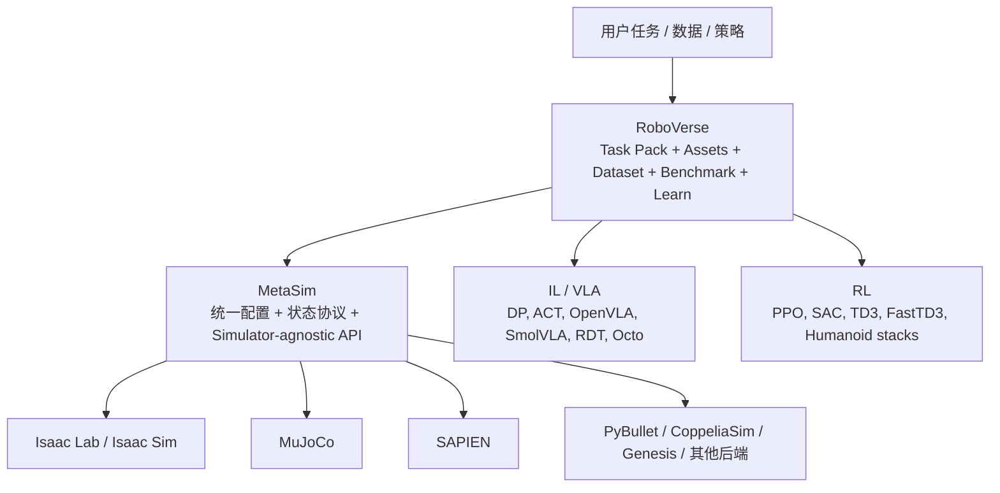
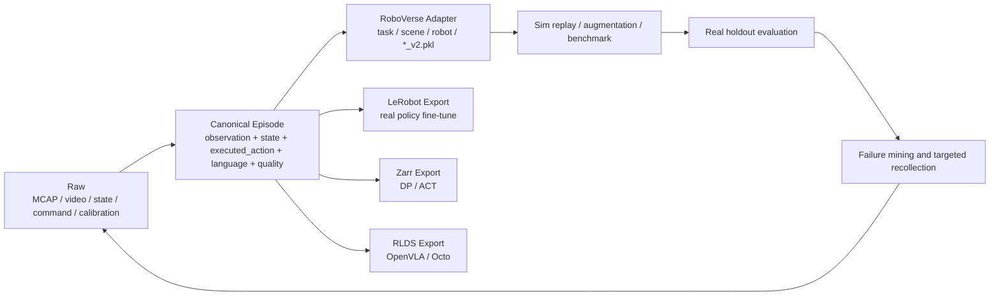

# RoboVerse 能力边界与具身智能数采数据增益深度调研

> [!summary] 先给结论
> **RoboVerse 是机器人学习的“统一仿真任务/数据/评测工作台”，不是一个会直接控制机器人的通用模型。**它最有价值的地方，是把异构 simulator、机器人本体、任务、资产、轨迹和 IL/VLA/RL baseline 接到一套接口与 benchmark 中。
>
> **具身智能数采数据可以提升 RoboVerse，但不是把视频文件上传进去就会变强。**价值最高的是同步的 `observation + robot state + executed action + calibration + task/outcome`，其次是用于 Real2Sim 的多视角场景/物体数据、用于 system identification 的力/扭矩/接触与真实 rollout、用于 benchmark 的失败/接管数据。只有普通 RGB 视频而没有动作、状态、坐标系和标定，主要能补视觉/场景先验，难以直接提升控制和物理仿真。
>
> **总判断置信度：中高。**平台边界、代码与论文结果有 S 级一手证据；“自有数据能带来多大真实成功率增益”必须在目标任务上做 A/B，现有论文不足以给出通用百分点。

## 1. 分类与研究边界

| 字段 | 本次定义 |
|---|---|
| 主分类 | `R05 产品、平台与工具选型调研` |
| 次分类 | `R04 技术原理`、`R07 商业落地与需求真实性` |
| 分类理由 | 用户要理解 RoboVerse 是什么、能做什么，并决定自有具身数采数据是否值得接入及如何验证增益。 |
| 覆盖 | 平台/MetaSim 边界、数据/任务/训练/评测工作流、真实数据的五类增益路径、数据契约、PoC、商业与创业机会。 |
| 不覆盖 | 不复现完整 GPU 环境；不比较所有 simulator 的绝对速度；不把作者实验外推为生产可靠性；不讨论同名 Robuverse 公司或旧 PyPI 包。 |

## 2. RoboVerse 到底是什么

官方当前文档把生态拆成两层：

- **MetaSim**负责共性底座：机器人、对象、传感器、任务、物理参数的统一配置，以及 launch/load/step/reset/render/state 等接口抽象。
- **RoboVerse**负责内容和学习：预配置 robot/task/scene/assets、迁移后的数据与轨迹、benchmark 协议、IL/VLA/RL 训练与评测脚本。
- 论文中的“simulation platform”表述容易让人把两层合并理解；当前仓库已经把核心 MetaSim 拆为独立依赖。证据：[`SRC-robotics-329`](../../raw/robotics-embodied-ai/documents/SRC-robotics-329-roboverse-scope-and-architecture-documentation-at-audited-commit.md)。

### 2.1 它不是什么

- **不是基础模型**：平台能训练/评测 OpenVLA、SmolVLA 等模型，论文也讨论世界模型，但没有发布一个名为 RoboVerse 的通用控制模型。
- **不是 ROS 2 替代品**：它侧重仿真、任务、数据和学习，不覆盖真机驱动、实时通信、完整设备生命周期和生产安全栈。
- **不是 LeRobot 替代品**：LeRobot 更偏真实机器人采集、标准数据格式、模型训练/分享；RoboVerse 更偏 simulation/benchmark，并把 LeRobot/RLDS/Zarr 当作学习侧出口。
- **不是“跨引擎动力学自动等价器”**：统一 API 降低迁移成本，但同一轨迹在不同引擎的接触、摩擦、控制器与 solver 仍可能不同。
- **不是企业级数据湖**：当前没有现成覆盖权限、隐私、数据血缘、版本审计、现场采集健康度和客户隔离的完整产品。

## 3. RoboVerse 能做什么

### 3.1 统一调用多个仿真器

RoboVerse/MetaSim 把跨 simulator 的共性操作抽象为统一配置和 API。适合以下工作：

- 在不同物理/渲染后端初始化相同或对应的 robot、object、scene、task。
- 用统一 `step/reset/render` 类接口运行环境。
- 把一个来源 benchmark 的任务、资产、轨迹迁移到另一个后端。
- 用一个后端做大规模并行训练，再用另一个后端做 sim-to-sim 检查。

真实边界：API 对齐不代表数值、控制和接触行为完全一致。官方双臂数据文档明确说，跨引擎 state replay 是 kinematic playback，能检查轨迹/画面对应关系，但不等于 open-loop action 在另一引擎仍成功。证据：[`SRC-robotics-330`](../../raw/robotics-embodied-ai/documents/SRC-robotics-330-roboverse-multi-agent-trajectory-format-and-cross-simulator-replay-documentation.md)。

### 3.2 汇聚任务、机器人、资产和轨迹

论文通过数据迁移、policy rollout、motion planning、teleoperation、AI task generation 和 Real2Sim 构造任务与轨迹：

| 数据生产方式 | 作用 | 适合场景 |
|---|---|---|
| 迁移已有 benchmark | 统一 ManiSkill、RLBench、LIBERO、MetaWorld、robosuite 等异构来源 | 快速建立广覆盖任务库 |
| Motion planning / RL rollout | 对只有 keypoint、grasp pose 或 policy 的来源补全轨迹 | 可定义成功判据的结构化任务 |
| 仿真 teleoperation | 键鼠、手柄、手机、动捕、VR 驱动不同本体 | 少量高质量 seed demonstration |
| Trajectory augmentation | 从少量 source demos 生成不同初始/目标状态轨迹 | 提升单任务分布覆盖 |
| Domain randomization | 随机场景材质、光照、相机、反射等 | 视觉鲁棒性和 sim-to-real |
| AI-assisted task generation | 基于资产库与格式校验生成新布局/任务 | 扩任务组合，需过滤幻觉和不可行任务 |
| Real2Sim | 多视角图像→Gaussian/mesh/URDF/场景 | 让仿真更贴近目标现场 |

论文的两个统计口径需要分开：总览称超过 **1,000 个任务、1,000 万 transitions**；核心 manipulation 迁移表统计 **276 个 task categories、约 510.5k trajectories、约 5.5k assets**。这是作者数据集口径，不是当前本地 clone 已逐项验证的可下载清单。证据：[`SRC-robotics-336`](../../raw/robotics-embodied-ai/documents/SRC-robotics-336-roboverse-rss-2025-paper-full-pdf.md)。

### 3.3 训练和评测机器人策略

当前文档覆盖：

- 模仿学习：Diffusion Policy、ACT。
- VLA：OpenVLA、SmolVLA、RDT、Octo 等。
- 强化学习：PPO、FastTD3、SAC、TD3、SkillBlender/humanoid 路线。
- 数据转换：仿真 demo 可转 Zarr；SmolVLA/π0 路线可转 LeRobot；OpenVLA/Octo 路线使用 RLDS。
- 评测：按任务成功率和不同层级 randomization 做泛化评测。

这使 RoboVerse 适合“同一任务定义下比较不同 policy/baseline”，但 benchmark 分数仍受实现质量、训练预算、成功判据和环境版本影响。论文自己说明某些 baseline 可能未充分优化，主要目标不是给算法做最终排名。

### 3.4 做跨本体、跨引擎与 sim-to-real 研究

- Cross-embodiment：对 gripper-based robot 的末端轨迹做 retargeting，复用部分示范。
- Sim-to-sim：用不同物理引擎检查 policy/轨迹稳定性和后端偏差。
- Sim-to-real：用高保真渲染、域随机化、真实资产重建和真机试验评估迁移。

论文 direct sim-to-real 只展示有限任务和试次。表 V 对 3 个语言引导抓取任务、每任务 10 分，OpenVLA 作者报告 7/10、8/10、5/10，Octo 为 5/10、3/10、6/10；又采用接触得 0.5 分的 partial reward。因此它证明“值得做”，不证明“普遍可生产部署”。

### 3.5 支持世界模型与合成数据研究

论文训练了动作条件视频生成 world model：

- DROID-50K 真机集；
- RoboVerse-50K 合成集；
- DROID-RoboVerse-100K 混合集。

作者报告：加入 RoboVerse 合成数据后，在 DROID 样本上物体几何保持改善；但复杂真实物理仍学不好。训练使用 8 张 H100、240×320 分辨率、16 帧序列，最初模型约 100M 参数，补充实验扩大到 500M。该结果支持“真实+合成互补”，但主要是生成质量证据，不是下游真机成功率的因果证明。

## 4. 与相邻平台怎么区分

| 平台 | 最强定位 | 相比 RoboVerse 的优势 | RoboVerse 的相对优势 | 选用建议 |
|---|---|---|---|---|
| Isaac Lab | NVIDIA/PhysX 上的统一 RL、示范学习、motion planning | 单栈集成、GPU/渲染/云生态更集中 | 多 simulator、跨来源 task/data migration | 已锁定 NVIDIA 高保真/大规模训练时优先 Isaac Lab；需要跨引擎/异构 benchmark 时评估 RoboVerse |
| ManiSkill | SAPIEN 上的 manipulation GPU 仿真与基准 | 操作任务深、GPU 并行与 task API 集中 | 汇聚 ManiSkill 及其他来源，不限单一后端 | 单栈 manipulation 训练优先 ManiSkill；跨 benchmark 统一评测可加 RoboVerse |
| RoboTwin | 双臂 manipulation 数据生成与 50-task benchmark | 双臂任务和真实资产/behavior generation 更聚焦 | 范围更广、覆盖单臂/灵巧手/人形/导航和多后端 | 双臂专项优先 RoboTwin；全栈对比或迁移用 RoboVerse bridge |
| LeRobot | 真机采集、标准数据集、模型训练和分享 | 真机设备/数据生命周期、Hub/Parquet/MP4 生态 | 仿真 task/asset/physics/benchmark 和多后端 | 真机数据主库用 LeRobot/MCAP；RoboVerse 作为仿真增强与评测消费者 |

结论不是四选一。更合理的组合是：`MCAP/LeRobot 真实数据底座 + RoboVerse/MetaSim 仿真任务与 benchmark + 目标模型训练栈 + 真机评测 harness`。

## 5. 具身数采数据能否提升 RoboVerse

### 5.1 先拆成四个“被提升对象”

| 被提升对象 | 数据如何起作用 | 能否提升 |
|---|---|---|
| RoboVerse 数据集 | 增加本体、场景、对象、任务和失败分布 | **可以，直接** |
| RoboVerse 仿真真实性 | 重建资产/场景、拟合物理/传感/控制参数 | **可以，但需 Real2Sim 和 system ID** |
| RoboVerse benchmark 价值 | 用真实任务、失败和分布定义评测切分 | **可以，且商业价值高** |
| 在 RoboVerse 中训练的模型 | 真实+合成混训、真机 fine-tune、失败回流 | **可以，但增益依模型/任务而定** |

因此，“数据提升 RoboVerse”不是单一路径。对自有数据业务最现实的是先提升 **任务真实性、评测相关性和 sim-to-real 校准**，再证明模型成功率增益。

### 5.2 六类数据的价值排序

| 数据类型 | 对 RoboVerse 的主要增益 | 必需字段 | 当前可行性 | 判断 |
|---|---|---|---|---|
| 真机遥操/示教 episode | 训练 IL/VLA、成为 trajectory augmentation seed、做 cross-embodiment retargeting | 多视角 RGB、joint/eef/gripper state、**实际执行 action**、时间戳、坐标系、标定、任务/成败 | 需写 importer 和本体/控制 adapter | **高价值** |
| 真实 rollout、失败、接管、恢复 | 构建 real holdout、failure taxonomy、active data collection | policy/version、观测/动作、接管点、失败原因、安全事件、结果 | 当前平台需外部数据治理层 | **最高边际价值** |
| 多视角场景/物体扫描 | Real2Sim mesh/Gaussian/URDF，缩小视觉和几何 gap | 相机内外参、多视角 RGB/深度、尺度、对象 mask/CAD | 论文已有路径 | **高价值** |
| 力/扭矩、触觉、接触、物理实验 | 拟合 mass/friction/compliance/contact，校准接触丰富任务 | F/T、tactile、joint torque/current、接触事件、材料、载荷、重复实验 | 需要扩展数据 schema 和 sensor/backend | **高价值但工程重** |
| 现场传感器噪声/延迟日志 | 校准 camera/IMU/LiDAR 噪声、控制延迟、drop/jitter 和 domain randomization | 源/采集时间戳、clock domain、丢帧、曝光、延迟、传感器配置 | 易被低估，需专门校准工具 | **高价值** |
| 仅 RGB/Ego 人类视频 | 补场景、对象、任务语义和视觉表征 | 视频、相机轨迹/尺度最好可得 | 缺 robot action/本体状态，不能直接教控制 | **中低；不能冒充机器人轨迹** |

### 5.3 已有直接证据

1. **真实+合成可互补**：DROID-50K + RoboVerse-50K 的 world model 混训，作者报告几何保持优于仅 DROID，但复杂物理仍失败。这支持混合数据，而不是“合成替代真实”。
2. **真实图像可改善仿真资产**：Real2Sim 流程用多视角图像重建 Gaussian/mesh/URDF；作者报告抓取成功率 80% 对 DexGraspNet 资产基线 50%。但样本、置信区间和跨对象复现未充分公开。
3. **少量 source demos 可被仿真扩增**：论文四个任务中，Diffusion Policy 随 50 source demos 扩增到 200/1,000/3,000 demos 呈一致改善；具体任务迁移到目标真机仍需重新验证。

### 5.4 为什么很多数采数据“看起来多，但接不进去”

- 只存 observation，不存 policy 发出的 command 或实际执行 action。
- action 是 `eef delta`，RoboVerse 任务需要 `joint target`，却没有 IK/controller/version 元数据。
- 相机和机器人时钟不同步，接触瞬间错位数帧。
- 坐标系、四元数顺序、单位、关节命名、gripper 定义未版本化。
- 只有成功片段，没有失败/接管/恢复，也没有成功判据。
- 物体没有稳定 ID、CAD/mesh、尺度和 material/physical property。
- 训练/测试随机切 episode，导致相同 room/object/operator 泄露。
- 许可只允许研究或包含客户隐私，无法进入开源 benchmark 或商业资产库。

## 6. 建议的数据接入契约

RoboVerse 原生轨迹强调 `init_state + actions + optional states`，训练侧又使用 Zarr、LeRobot、RLDS。自有数采系统不应直接把任一 export 当原始主库，而应增加 canonical episode：

### 6.1 最小字段

| 对象 | 最小字段 |
|---|---|
| Episode | `episode_id`, `task_id`, `robot_id`, `scene_id`, `object_ids`, `start/end`, `outcome`, `failure_code`, `policy/operator` |
| Observation | 相机帧/深度/可选 tactile/LiDAR，`source_timestamp`, intrinsics/extrinsics, exposure/sensor config |
| Robot state | joint position/velocity/effort、eef pose、gripper、base；单位、frame、joint order |
| Action | command 与 actual/executed action 分开；control mode、rate、controller version、latency |
| Calibration | robot kinematics、camera extrinsic、tool/TCP、time offset、calibration hash |
| Task semantics | instruction、subtask、success checker、对象/目标状态、扰动标签 |
| Quality | drop/jitter、visibility、sync drift、action jump、operator rejection、QC version |
| Governance | schema/data version、split group、license、privacy、lineage、exporter version |

### 6.2 接入分级

- `L0 视觉参考`：只有视频；仅用于资产/场景/视觉预训练。
- `L1 可回放`：视频 + robot state；可以 state replay，但不能证明动作动力学。
- `L2 可训练`：再加 action、task、outcome、同步/标定；可用于 IL/VLA。
- `L3 可仿真增强`：再加对象 pose/mesh、success checker、controller/physics metadata；可做 augmentation/benchmark。
- `L4 可闭环验证`：再加真机 policy rollout、失败/接管和严格 holdout；可证明业务增益。

建议把“可提升 RoboVerse”的合格线设为 **至少 L2**；要提升 sim-to-real，目标应是 **L3/L4**。

## 7. 最小可行 PoC：怎样证明数据真的有用

### 7.1 选择任务

选 2–3 个接触性质不同、现场可重复的任务：

- 刚性 pick-place：验证视觉/几何/抓取。
- articulated object：开抽屉/柜门，验证接触和状态变化。
- insertion/tool-use：验证精度、力和失败恢复。

首轮不选软体衣物、透明液体或复杂人形全身任务，因为 RoboVerse 论文明确未统一支持 non-rigid，且物理参数难从视觉恢复。

### 7.2 四组 A/B

| 组 | 训练/仿真数据 | 要回答的问题 |
|---|---|---|
| A | RoboVerse synthetic only | 合成基线有多强 |
| B | real only | 自有真实数据本身是否足够 |
| C | real + naive synthetic | 直接混合是否有增益或负迁移 |
| D | real + calibrated/targeted synthetic | 用真实数据校准资产、参数和失败分布后，定向合成是否最好 |

所有组固定模型、训练预算、seed 数、动作空间和评测脚本。验证集按 **未见对象 × 未见布局 × 未见光照** 分组；真机测试每任务每组建议至少 50 次，报告置信区间，不用单次 demo 下结论。

### 7.3 指标

| 层 | 指标 |
|---|---|
| 数据 | QC pass rate、同步误差、有效 episode 数、分布覆盖、数据泄露检查 |
| 仿真 | action/state replay error、接触/对象轨迹误差、success checker 一致率、sim-real policy rank correlation |
| 世界模型 | action-conditioned future error、对象几何/接触一致性、rollout drift；不能只看画质 |
| 真机策略 | strict success、partial success、人工接管、恢复成功、碰撞/安全事件、周期时间 |
| 商业 | 每新增 1pp 成功率的有效数据成本、部署/标定工时、有效 episode 单价、返工率 |

### 7.4 建议验收门槛（本报告提案，不是 RoboVerse 官方标准）

- D 组相对 A 组在目标真机 holdout 上 **成功率绝对提升 ≥10pp**，且 95% CI 不与零增益重叠；或人工接管率降低 ≥20%。
- 对已见任务不出现超过 5pp 的系统性回退。
- simulator 中的 policy 排序与真机排序 Spearman `ρ ≥ 0.7`，否则 benchmark 不能作为选模代理。
- 数据 adapter 重跑一致、schema/QC/split 可审计；任何来源都能追到 raw、calibration 和 exporter version。
- 若 2 个迭代周期后 D 组不优于 C/A，停止扩量，优先排查动作语义、同步、标定、物理参数和 success checker。

## 8. 技术成熟度、成本与风险

### 8.1 当前成熟度判断

| 能力 | 成熟度 | 证据与边界 |
|---|---|---|
| 多来源任务/资产迁移 | 研究可用、持续演进 | 论文+仓库；公开 issue 仍有 missing asset、task discovery、backend 差异等信号 |
| IL/RL/VLA baseline | 研究可用 | 文档覆盖广；baseline 质量和依赖矩阵需任务级复现 |
| 数据格式桥接 | 可做但碎片化 | PKL/Zarr/LeRobot/RLDS 多出口；任意真机数据无通用 importer |
| Real2Sim | 研究 PoC | 有论文实验；friction/mass/material/non-rigid 明确受限 |
| Direct sim-to-real | 有限任务验证 | 小样本作者实验，不等于量产现场可靠性 |
| 企业生产平台 | 待验证 | 权限、审计、隐私、版本治理、SLA、真机 fleet 闭环不完整 |

### 8.2 主要工程成本

- 多 simulator 依赖、GPU/驱动、资产下载和版本兼容。
- 每种 robot/control mode 的 adapter、retargeting 和校准。
- 实际场景的 mesh/URDF、collision geometry、material、mass/friction/compliance 重建。
- 真实数据从 MCAP/LeRobot/HDF5 转为 RoboVerse task/scene/trajectory 的 ETL 与验证。
- 真机 safety、reset、自动 success checker、重复评测和故障恢复。
- 第三方数据与资产 license lineage；README 明示部分资产许可仍待补。

### 8.3 反方证据与知识冲突

| 支持当前结论 | 反方/限制 | 如何验证 |
|---|---|---|
| 混合 DROID+RoboVerse 改善世界模型几何 | 主要是定性生成结果，真实复杂物理仍失败 | 用同一模型做下游 planning/policy A/B |
| Real2Sim 抓取 80% 对 50% | 样本规模、对象分布和置信区间不足 | 多对象、多材质、50+ rollout/condition 独立复现 |
| trajectory augmentation 随数量改善 | 合成偏差可能被同步放大 | A/B 比较 naive 与 calibrated synthetic，监测负迁移 |
| 跨 simulator 接口统一 | state replay 不等于 dynamics equivalence | 固定 action、控制器、初态，比较对象轨迹和任务成功 |
| 平台覆盖多个学习算法 | 官方承认 baseline 可能次优 | 与上游原生实现同预算复现 |
| Apache-2.0 根许可证 | 第三方 assets/datasets 不自动继承 | 建立逐资产 SPDX/来源/用途许可台账 |

## 9. 商业应用可能性

### 9.1 谁会买、买什么

| 角色 | 痛点 | 可交付物 | 付款逻辑 |
|---|---|---|---|
| 机器人模型/本体公司 | 真机数据少、仿真与现场不一致、评测慢 | 目标任务 Real2Sim 包、真实+合成数据包、baseline 与真机报告 | 缩短数据/模型迭代，降低真机试验占用 |
| 工业客户/集成商 | demo 成功但换对象/光照就失败 | 现场 digital twin、扰动 benchmark、验收与回归套件 | 降低部署返工、售后和停线风险 |
| 公共训练场/高校 | benchmark 碎片化、资产和算力分散 | 标准任务包、数据卡、评测服务、课程环境 | 科研/公共平台预算 |
| 数据服务商 | 只能按小时卖采集，难证明数据价值 | RoboVerse adapter、定向合成、失败回流和边际增益报告 | 从劳务升级为“数据+效果”交付 |

### 9.2 近期与中期

- **1–2 年：中等可能性。**最现实的是内部研发平台、定向 benchmark、Real2Sim 资产/任务包和数据增强 PoC；采购往往随模型/机器人项目，而不是单独购买 RoboVerse 软件许可。
- **3–5 年：中高可能性但取决于标准化。**若真实场景训练行动、训练平台标准和机器人数据格式逐步统一，跨引擎 benchmark、真实-仿真校准、持续回归可能成为数据/模型交付的标配。
- **规模订单门槛**：真机相关性、稳定安装、资产合法性、可维护 adapter、客户数据隔离、可量化成功率/接管率改善，而不是任务数量和渲染视频。

中国的政策位置与“实景实训、仿真平台验证、训练平台接口/指标标准化”方向一致；但政策支持不能替代采购 ROI。可参考 `SRC-robotics-316` 和 `SRC-robotics-317` 的既有政策/标准计划证据。

## 10. 中小型创业者的机会

### 可立即验证

| 机会 | MVP | 首批客户/收费交付 | 团队与周期 |
|---|---|---|---|
| 真机数据→RoboVerse/LeRobot adapter + QC | 支持 1 种 robot、2 相机、1 control mode、1 task | 数据服务商/机器人小团队；转换器、dataset card、可回放/可训练报告 | 2–3 人，4–8 周，低到中资本 |
| Real2Sim 资产/任务包 | 10 个对象+1 个现场、mesh/URDF/collision/success checker | 集成商/实验室；可复现 task pack + sim-real gap 报告 | 3–5 人，6–12 周，中资本 |
| Benchmark-as-a-service | 3 个任务、4 个扰动、真机 50 rollouts/condition | 模型/本体公司；独立 A/B 与失败 taxonomy | 3–5 人，6–10 周，中资本 |
| 数据价值评估 | real-only/sim-only/mixed/calibrated 四组实验 | 数据供应商/采购方；边际增益与停止条件报告 | 模型+数据工程 3–4 人，6–12 周 |

### 需要条件成熟

- 跨客户可复用的 vertical task pack marketplace：需解决资产许可、场景标准、客户隐私和版本维护。
- 触觉/F/T/柔性物体的 system identification 与仿真插件：技术价值高，但后端支持和 ground truth 成本高。
- 云端多 simulator benchmark 服务：需稳定容器镜像、GPU 调度、资产分发和结果可复现。

### 不建议进入

- 直接 fork RoboVerse 做“国产通用仿真平台”，没有独特任务/客户/数据和真机闭环。
- 只卖“更多合成视频/轨迹”，不绑定真实 holdout 和数据增益。
- 自建通用机器人 foundation model 与头部实验室拼算力。
- 聚合来源不清的第三方 assets/datasets 后商业分发。

头部平台愿意采购小团队服务的原因，不是做不出一个 converter，而是长尾本体、现场标定、资产清洗、成功判据、私有化和持续回归非常碎片化；这正是服务商能形成流程 know-how、adapter library、failure library 和切换成本的位置。

## 11. 风险、证伪条件与监测指标

### 会改变结论的证据

- 独立复现显示 calibrated real+synthetic 在多个任务上不优于 real-only 或上游原生 simulator。
- 目标本体/action space 无法稳定映射，跨后端 success/rank correlation 长期低。
- 资产/数据许可证无法满足商业交付。
- 上游重构频繁导致 adapter 维护成本超过收益。
- 客户真正采购的是单一 Isaac/ManiSkill/RoboTwin 栈，不需要多后端抽象。

### 持续监测

- RoboVerse/MetaSim releases、破坏性 API 变化、CI/backend coverage、开放 issue 的关闭速度。
- 当前 task/robot/sensor/data format 的真实可运行覆盖，不看静态列表。
- LeRobot/RLDS/Zarr converters 是否双向、是否保留 action semantics/calibration/quality。
- Real2Sim 在反光/透明/软体/接触任务上的独立 benchmark。
- sim-real policy rank correlation、真机成功率、接管率和单位有效 episode 成本。
- 资产/data license 清单是否补齐。

## 12. 待验证事项与下一步

1. 在目标 Linux/NVIDIA 环境安装审阅 commit 与当前 release，跑通 MuJoCo 最小任务和一个第二后端。
2. 选自有 L2 以上数据，开发一个真实 episode→canonical→RoboVerse task/trajectory adapter。
3. 对刚性抓取任务完成 A/B/C/D 四组，先验证 action/state replay、success checker 和真机相关性。
4. 再加入一项 articulated/contact-rich 任务，使用 F/T 或 motor current 拟合摩擦/接触参数。
5. 独立核验论文 Real2Sim 80%/50% 和 world-model mixed-data 结果；无复现前只作为方向性证据。
6. 建立第三方 asset/dataset 的 license lineage；商业 PoC 不使用许可不清资产。

## 13. 事实、估计、判断、假设清单

| 类型 | 内容 |
|---|---|
| 事实 | RoboVerse 当前是 MetaSim 上的任务/资产/数据/benchmark/learning 层；有论文、代码和官方文档。 |
| 事实 | 论文做了 DROID-50K、RoboVerse-50K、混合 100K world-model 实验，并报告混合数据几何改善。 |
| 事实 | 官方文档存在 PKL、Zarr、LeRobot、RLDS 等多条路径；跨引擎 state replay 不等于 dynamics 等价。 |
| 事实 | 论文/README 明示 non-rigid、物理参数估计、baseline 和资产许可等限制。 |
| 估计 | 数据 adapter/单任务 benchmark MVP 可由 2–5 人在 1–3 个月完成；依本体和客户现场波动。 |
| 判断 | 自有数采数据最强价值不是堆量，而是校准真实分布、定义 benchmark、发现失败并定向生成。 |
| 假设 | calibrated real+synthetic 会优于 naive mixture；必须用四组 A/B 证伪或确认。 |

## 14. 来源与证据质量

- S 级：RoboVerse 论文、固定提交代码/文档、GitHub API、Isaac Lab/LeRobot/ManiSkill 官方文档。
- B 级：公开 issue 中的用户工程反馈；仅用于发现风险，不用于证明普遍故障率。
- 本次未使用公司营销稿、媒体排名或无来源市场规模作为关键证据。
- 完整来源卡见 [[_sources/roboverse-platform-dataset-benchmark-source-set|RoboVerse 来源集]]。

## 关联连接

- [[RoboVerse|RoboVerse 实体页]]
- [[_sources/roboverse-platform-dataset-benchmark-source-set|RoboVerse 来源集]]
- [[robotics-embodied-ai/research-notes/vla-world-model-data-infrastructure-platform-design-2026-07-06|VLA 与世界模型数据基建平台]]
- [[robotics-embodied-ai/research-notes/robot-training-data-value-evaluation-2026-06-29|具身智能训练数据价值评估框架]]
- [[robotics-embodied-ai/research-notes/embodied-model-physical-understanding-evaluation-2026-07-03|具身大模型物理理解评估框架]]
- [[robotics-embodied-ai/research-notes/open-embodied-ai-datasets-comparison-2026-06-11|开源具身数据集对比]]
- [[robotics-embodied-ai/research-notes/isaac-sim-vs-gazebo-vs-mujoco-2026-07-14|机器人仿真平台选型]]
- [[_concepts/robot-training-data|Robot Training Data]]
