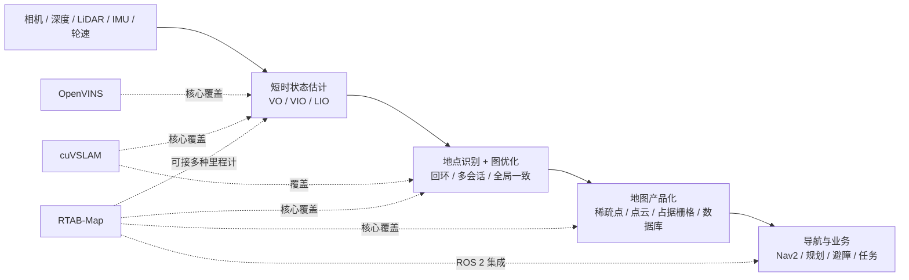
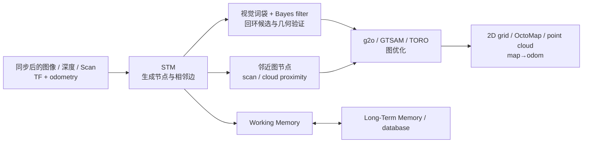

# RTAB-Map、cuVSLAM、OpenVINS 技术与工程选型深度调研

> [!summary] 先给结论
> **三者不是同一层级的替代品。**[[RTABMap|RTAB-Map]] 是面向长期在线运行、ROS 2 导航与 2D/3D 地图输出的多传感器图 SLAM 系统；[[cuVSLAM]] 是面向 NVIDIA GPU/Jetson 的多模式、多相机实时视觉里程计与稀疏 VSLAM SDK；[[OpenVINS]] 是以 MSCKF 为核心、适合研究估计器、标定与 VIO 前端的滤波平台。
>
> **默认选择：**ROS 2 AMR、RGB-D/LiDAR、占据栅格和 Nav2 选 RTAB-Map；已锁定 Jetson、追求多相机低延迟定位选 cuVSLAM；需要可解释状态估计、在线标定、仿真和算法研究选 OpenVINS。若一个产品同时需要“高速 VIO + 长期地图 + 导航地图”，合理架构往往是分层组合，而不是强迫单一库包办。
>
> **商业边界差异大：**RTAB-Map core/ROS 包为 BSD-3-Clause，集成弹性最好；cuVSLAM 允许商业使用和衍生分发，但授权限定在 NVIDIA Platforms；OpenVINS 为 GPL-3.0，闭源分发必须在 PoC 前做法律与架构审查。本报告不是法律意见。
>
> **置信度：**技术定位、公开能力、维护与许可证为高；跨产品性能排序、现场可靠性和商业 ROI 为中低，因为没有在统一硬件、统一传感器和客户场景独立复现。

## 1. 分类与研究边界

| 字段 | 本次定义 |
|---|---|
| 主分类 | `R05 产品、平台与工具选型` |
| 次分类 | `R04 技术原理、论文与前沿方向`、`R07 商业落地与需求真实性` |
| 决策问题 | 三套系统各处在哪一层、输入输出与失败边界是什么，如何按机器人/数采/研究场景选择和验证。 |
| 覆盖 | 原理、传感器与地图、ROS 2、部署、维护、许可证、论文证据、失败模式、商业/创业机会、PoC。 |
| 不覆盖 | 不复现 benchmark；不审计所有可选依赖；不提供法律意见；不把 stars、作者 KPI 或数据集成绩外推为生产 SLA。 |

## 2. 先把三者放回正确层级

| 维度 | RTAB-Map | cuVSLAM | OpenVINS |
|---|---|---|---|
| 正确类别 | 长期视觉/LiDAR graph-SLAM、数据库和地图集成 | CUDA 加速 VO/VIO/VSLAM SDK | 滑窗 MSCKF 滤波 VIO 研究平台 |
| 主要产物 | `/map→/odom` 修正、图、数据库、点云、2D grid、OctoMap | 平滑 odometry、全局优化轨迹、稀疏 landmarks/map | IMU 状态、轨迹、协方差、稀疏 active/SLAM features |
| 是否默认解决长期全局地图 | 是，含 WM/LTM、回环、近邻约束、多会话 | 是，异步回环与 pose-graph；地图产品能力弱于 RTAB-Map | 否；核心是局部 VIO，回环示例是外部 `ov_secondary` |
| 是否默认给导航占据地图 | 是 | 否，通常另接 nvblox/导航栈 | 否 |
| 最强生态 | 通用 C++、ROS/ROS 2、Nav2、桌面/机器人 | CUDA、Jetson、Isaac ROS、C++/Python | ROS 1/2、ROS-free、Docker、教学/论文 |

## 3. RTAB-Map：长期记忆、图优化和导航地图

### 3.1 工作机制

RTAB-Map 把地图表示为“节点 + 约束边”的图。节点保存位姿、压缩传感器数据、视觉词和局部 occupancy；边包括相邻、视觉回环和几何 proximity 三类。它不要求固定里程计：可用自带 RGB-D/stereo F2F/F2M、2D/3D LiDAR S2S/S2M，也可接轮速、VIO、LIO 等外部 odometry。

最有辨识度的是 WM/LTM：当更新时间或节点数超过阈值，低权重、较旧节点转入 LTM；再次看到旧区域时，相关邻居可逐步取回 WM。这不是“永不增长”，而是把在线图规模和计算时间限制在预算内。代价是在线发布的全局 occupancy 可能只覆盖当前工作区域，完整最终图需从数据库/LTM 重建。

### 3.2 能力与工程判断

- 视觉前端可用 GFTT/BRIEF、光流、PnP RANSAC 与局部 BA；LiDAR 前端可用 ICP P2P/P2N，并允许轮速作为退化方向的运动先验。
- 回环使用增量视觉词袋、TF-IDF 与 Bayes filter，候选必须通过位姿估计；有 scan/cloud 时还能用 ICP 精化。重复外观仍会造成假回环风险。
- 每个节点可预存局部 2D/3D occupancy；图优化后重新拼接全局 grid、OctoMap 或 point cloud，直接面向导航消费者。
- 当前 core README 列出 ROS 2 Humble、Jazzy、Kilted、Lyrical、Rolling 二进制；`rtabmap_ros` 还提供 RGB-D、stereo、3D LiDAR、TurtleBot 与 Nav2 示例。当前 core `0.23.8` 发布于 2026-07-05，审计 head 为 2026-08-03，属于活跃维护。

### 3.3 主要失败模式

| 风险 | 机制 | 现场门槛 |
|---|---|---|
| 白墙、暗区、相似走廊 | 视觉 odometry/BoW 信息不足或歧义 | 记录 odometry lost、回环 precision、重定位时延；必要时加轮速/LiDAR |
| 长直走廊/空旷区 | 短距 LiDAR 几何退化，ICP 沿走廊不可观 | 用轮速/IMU先验；监测 point-cloud complexity |
| 玻璃、反光和动态人群 | 深度/LiDAR 假点与残留 occupancy | 语义/动态过滤、地图衰减和真实避障验收 |
| 大图资源增长 | 图优化、回环检索和全局重拼装变慢 | 同时验 P95 update、RAM、DB 增长与完整地图恢复时间 |
| 参数面很大 | 不同 odometry、grid、回环阈值相互影响 | 固化传感器 profile，做参数版本与 rosbag 回归 |

论文使用的是较早 RTAB-Map 版本和 Ubuntu 16.04-era 硬件，适合解释机制与传感器取舍，不应当作当前版本速度榜。证据：[`SRC-robotics-350`](../../raw/robotics-embodied-ai/documents/SRC-robotics-350-rtab-map-large-scale-and-long-term-lidar-and-visual-slam-paper-full-pdf.md)、[`SRC-robotics-345`](../../raw/robotics-embodied-ai/documents/SRC-robotics-345-rtab-map-ros2-official-repository-readme-at-audited-commit.md)、[`SRC-robotics-353`](../../raw/robotics-embodied-ai/documents/SRC-robotics-353-rtab-map-github-repository-release-and-maintenance-audit.md)。

## 4. cuVSLAM：NVIDIA 平台上的低延迟多相机 VSLAM

### 4.1 工作机制

cuVSLAM 把实时局部连续性与全局一致性拆开：前端维护最近关键帧、3D landmarks 与观测，负责低延迟姿态；后端异步整合关键帧、视觉 patch、pose delta 和 landmarks，做回环与 pose-graph optimization。前端使用 Shi–Tomasi 特征、改进 Lucas–Kanade 光流和 NCC 过滤；关键帧进行跨相机跟踪、三角化、PnP 与 CUDA sparse bundle adjustment。

多相机模式会根据内外参自动构建 Frustum Intersection Graph，把共享视场的相机连成可跨相机追踪的有向边；这解释了为什么“最多 32 相机”不等于任意 32 个互不重叠的相机都能提供同样约束。所有用于同一批次估计的图像仍需准确同步。

视觉惯性模式维护 15DoF pose/velocity/bias 状态，先纯视觉初始化，再估重力、速度与 bias，使用 IMU 预积分和视觉因子做逐帧估计及 VI-SBA。RGB-D 模式还使用像素级 intensity/depth、point-to-point 与稀疏重投影因子，由 GPU LM solver 优化。

### 4.2 当前模式与部署

| 模式 | 必需输入 | 尺度/边界 |
|---|---|---|
| Mono | 1 RGB | 尺度不确定，最低硬件成本 |
| RGBD | 对齐 RGB + depth | 公制；依赖有效深度、对齐和遮挡边界 |
| Multicamera | 至少一个重叠相机对，最多 32 cameras | 纯视觉多双目；硬件同步、内外参和 FoV 拓扑是门槛 |
| Inertial | 1 stereo pair + IMU | stereo VIO；IMU 用于短时视觉退化鲁棒性 |
| Multisensor | 至少 RGB-D 或重叠相机对；可加 RGB/RGB-D/IMU | 当前 README 标为 experimental，仅 pinhole，且需 cuNLS |

当前预编译目标覆盖 Ubuntu 22.04/24.04 的 x86_64，以及 Jetson Orin/Thor 对应 JetPack/CUDA 组合；Python wheel 与 C++ SDK 均可用，ROS 2 通过 Isaac ROS Visual SLAM。审计时最新版为 `v17.0.0`（2026-07-23），不是搜索缓存里仍常见的 `v15.0.0`。

### 4.3 论文成绩怎样读

论文报告 Jetson AGX Orin 上特定输入、模式和 MAXN 条件下的 tracking call 时间，并在 KITTI、EuRoC、TUM-VI、TUM RGB-D 等数据集给出结果。它还公开了重要反例：TUM-VI 需边缘 mask 缓解鱼眼畸变；AR-table 的深度断流需切段独立跟踪后合并；部分坏序列和 outlier 被排除；缩放对齐使某些 translation metric 不宜直接比较。正确结论是“作者证明了目标硬件上的强可用性”，不是“任何 Jetson + 任意相机都比其他方案快且准”。

### 4.4 主要失败模式

- 相机/IMU 内外参、时间戳和硬件同步是第一故障源；多相机数量越多，线束、触发、带宽和温漂成本越高。
- 运动模糊、曝光、低纹理、重复地面/天空和摄像头遮挡仍会损伤 classical feature tracking；多相机增加观测方向但不消除场景退化。
- GPU 过载、图像保存/可视化和 ROS acquisition 会引入论文单次 tracking call 之外的系统延迟，必须测端到端 P99 和 dropped frames。
- `Multisensor` 仍为实验能力，不能因“任意 mix”表述跳过 rig 级验证。
- NVIDIA Community License 的商业许可只覆盖 NVIDIA Platforms；这构成硬件与供应链锁定，国产 GPU/非 NVIDIA CPU 迁移不能假设合规或可编译。

证据：[`SRC-robotics-346`](../../raw/robotics-embodied-ai/documents/SRC-robotics-346-nvidia-cuvslam-official-repository-readme-at-audited-commit.md)、[`SRC-robotics-354`](../../raw/robotics-embodied-ai/documents/SRC-robotics-354-cuvslam-cuda-accelerated-visual-odometry-and-mapping-paper-full-pdf.md)、[`SRC-robotics-355`](../../raw/robotics-embodied-ai/documents/SRC-robotics-355-cuvslam-nvidia-community-license-at-audited-commit.md)、[`SRC-robotics-356`](../../raw/robotics-embodied-ai/documents/SRC-robotics-356-cuvslam-github-repository-release-and-maintenance-audit.md)。

## 5. OpenVINS：可解释、可扩展的 MSCKF VIO 平台

### 5.1 工作机制

OpenVINS 的核心状态包含当前 IMU pose/velocity/bias、历史 IMU pose clones、可选长期 SLAM landmarks，以及相机内参、相机—IMU 外参和 time offset。IMU 高频传播状态与协方差；相机帧到来时克隆当前 pose；一个特征跨多个 clone 被跟踪后，先三角化，再把 landmark 方向从观测残差中做 MSCKF nullspace projection，使它约束相机/IMU 状态而不把每个短寿命 landmark 永久加入滤波状态。

这带来两点价值：计算量能通过 clone/window 与 feature 数量约束；协方差、可观性和一致性可以显式分析。OpenVINS 还提供 FEJ、on-manifold type system、多种 feature representation、SLAM features、ZUPT、静态/动态初始化、视觉惯性 simulator 与 `ov_eval`。

### 5.2 “有 SLAM feature”不等于“完整 SLAM 产品”

OpenVINS 可把 ArUco 或稀疏长期 landmarks 放进滤波状态，但核心项目没有 RTAB-Map 式数据库、长期地图管理、占据栅格或默认全局回环。官方 `ov_secondary` 是基于 VINS-Fusion 的松耦合二级线程，回环修正不反馈到底层 OpenVINS odometry。因此它更准确的名字是 visual-inertial estimation/VIO 平台。

官方文档支持 monocular、同步 stereo 和同步 binocular tracking，KLT/descriptor/mask，ROS 1/2、ROS-free 与 Docker。文档中的“arbitrary number of cameras / arbitrary sensor rate”明确属于 simulator 能力，不应误读为现成实机 32 相机产品支持。

### 5.3 标定与失败边界

| 风险 | 为什么敏感 | 验收 |
|---|---|---|
| camera–IMU time offset | 动态轨迹中小时间差迅速形成系统残差 | 硬件时间基准 + 在线 offset 收敛 + 人工时间偏移 A/B |
| 外参/内参错误 | 视觉 residual 被错误解释为运动或 bias | Kalibr 全视场采集；官方建议良好 reprojection error 低于约 `0.2–0.5 px` |
| IMU noise 配置错误 | 协方差和滤波权重失真 | Allan variance；报告建议工程上测试放大噪声的敏感性 |
| 激励不足/初始化退化 | gravity、bias、尺度或时空标定不可观 | 设计有旋转/平移的启动轨迹；记录初始化时长和失败率 |
| 长程无回环 | 局部 VIO 漂移持续累计 | 接外部 pose graph/GNSS/地图定位，或选择 RTAB-Map/cuVSLAM SLAM 层 |
| 动态物体/模糊/弱纹理 | 稀疏 KLT/descriptor tracks 被污染或不足 | mask、短曝光、高帧率、track 数与 innovation gating |

维护快照需分开看：最新 tag `v2.7` 是 2023-06-20，但默认分支 head 到 2025-11-30，不能简单判定为停止维护；相较另外两者，正式 release cadence 确实较慢。许可证为 GPL-3.0。

证据：[`SRC-robotics-344`](../../raw/robotics-embodied-ai/documents/SRC-robotics-344-openvins-official-repository-readme-at-audited-commit.md)、[`SRC-robotics-357`](../../raw/robotics-embodied-ai/documents/SRC-robotics-357-openvins-research-platform-for-visual-inertial-estimation-paper-full-pdf.md)、[`SRC-robotics-358`](../../raw/robotics-embodied-ai/documents/SRC-robotics-358-openvins-official-project-features-and-architecture-documentation.md)、[`SRC-robotics-359`](../../raw/robotics-embodied-ai/documents/SRC-robotics-359-openvins-official-sensor-calibration-guide.md)、[`SRC-robotics-360`](../../raw/robotics-embodied-ai/documents/SRC-robotics-360-openvins-github-repository-release-and-maintenance-audit.md)。

## 6. 统一选型矩阵

评分仅表示本次边界下的相对适配：`强 / 中 / 弱`，不是性能排名。

| 决策维度 | RTAB-Map | cuVSLAM | OpenVINS |
|---|---|---|---|
| ROS 2 移动机器人/Nav2 | **强** | 中（Isaac ROS） | 弱（仅状态估计） |
| 2D occupancy / OctoMap / 点云 | **强** | 弱，需外接 | 弱 |
| RGB-D + LiDAR + 外部 odometry 组合 | **强** | 中，Multisensor 实验 | 弱 |
| Jetson 低延迟多相机 | 中 | **强** | 弱至中 |
| 非 NVIDIA/CPU 可移植性 | **强** | 弱 | **强** |
| 滤波一致性/协方差/标定研究 | 中 | 弱（内部抽象） | **强** |
| 长期数据库/多会话地图 | **强** | 中 | 弱 |
| 开箱参数体验 | 中偏弱，参数多 | **强**，但要求 rig 正确 | 中，研究配置多 |
| 闭源商业许可弹性 | **强（BSD）** | 中（商用但 NVIDIA-only） | 弱（GPL） |
| 源码可解释与二次算法研究 | **强** | 中（公开代码但受平台许可） | **强** |

### 6.1 按场景直接选

1. **室内 AMR、清扫/巡检、仓储 ROS 2 导航**：RTAB-Map 进主线；先确定 LiDAR/轮速为稳定 odometry，视觉用于地点识别或 3D 障碍，而不是指望单前视 RGB-D 包办。
2. **Jetson Orin/Thor、多方向相机、无人机/移动机器人定位**：cuVSLAM 进主线；前置硬件同步、标定、带宽、热设计和 NVIDIA 供应链决策。
3. **VIO 论文、标定工具、滤波器教学、估计器研发**：OpenVINS 进主线；若业务要全局地图，再接 pose graph/地图定位层。
4. **UMI-like 手持数采**：需要高透明度、误差协方差和标定研究时选 OpenVINS；已用 Jetson、多相机或 RGB-D 并重视实时低延迟时测 cuVSLAM；需要跨会话数据库、点云/占据地图或离线地图维护时测 RTAB-Map。最终用动作重建误差而不是 ATE 单指标决策。
5. **既要 VIO 又要长期导航地图**：可用 OpenVINS/cuVSLAM 输出 odometry，再让 RTAB-Map负责回环、图、数据库和 occupancy；但要验证坐标系、协方差、reset、回环重复修正和许可证组合。

## 7. 总拥有成本与集成边界

| 成本项 | RTAB-Map | cuVSLAM | OpenVINS |
|---|---|---|---|
| 前期硬件 | 可从低成本 RGB-D 到 LiDAR/多传感器 | NVIDIA compute + 同步相机 rig | 相机 + 高质量 IMU；CPU 即可 |
| 集成成本 | ROS topic/TF 丰富但参数和组合多 | 支持矩阵清晰；CUDA/JetPack/Isaac 版本耦合 | 标定、噪声、状态与 estimator tuning 较重 |
| 运行运维 | DB、地图更新、图优化和传感器健康 | GPU/热/带宽、版本和设备供应 | 标定漂移、初始化和 VIO drift 监测 |
| 迁移成本 | 相对低，BSD/多平台 | 高，平台许可与 CUDA 绑定 | 中，GPL 与 estimator 接口重构 |

**判断：**对多数商业团队，算法运行时间不是最大成本；rig 标定、现场退化、数据回放、版本回归、故障可观测性和许可设计才是长期成本主体。

## 8. 商业应用可能性

### 8.1 已有明确可能性的应用

- **RTAB-Map**：室内移动机器人建图与定位、巡检/清扫、仓储 AMR、低成本 RGB-D 3D 扫描、研究和机器人集成验证。价值来自 ROS 2/地图格式/数据库的“最后一公里”，不是单项 ATE 冠军。
- **cuVSLAM**：NVIDIA 边缘设备上的多相机定位、仓储与配送机器人、无人机、AR/遥操作和具身数采。价值来自高吞吐、多 FoV 与供应商栈整合；客户必须接受 NVIDIA 平台。
- **OpenVINS**：VIO 研发、传感器标定与验收、算法教学、相机—IMU 模组评测、定制状态估计器。更像技术底座与工程服务，不是直接售卖的导航产品。

### 8.2 商业证据边界

本次一手资料证明公开能力、版本和作者实验，**没有证明中国市场订单、付费客户数量、SLA、毛利或特定行业采购意愿**。因此商业优先级是判断，不是事实；下一步需客户访谈、BOM/算力测算和现场 PoC。

## 9. 中小型创业者的机会

### 9.1 值得做

1. **“传感器 rig + 标定 + 退化测试”交付包**：为国产相机/IMU/底盘提供时间同步、内外参、Allan variance、rosbag 回归和温漂复标，三套系统都需要。
2. **SLAM/VIO 独立验收平台**：统一采集 ground truth/参考轨迹，输出 ATE/RPE、lost ratio、重定位时延、地图一致性、CPU/GPU/RAM/功耗和失败样本。
3. **RTAB-Map 行业 profile**：为仓库、酒店、工厂走廊固化传感器组合、TF、参数、动态障碍策略与数据库维护 SOP。
4. **轨迹质量数据产品**：把 VIO/SLAM 的 reset、uncertainty、遮挡、同步和标定状态写入具身训练 episode，支持失败片段过滤和 action 可信度分层。

### 9.2 有条件做

- cuVSLAM 的 Jetson 多相机整机与运维服务可做，但应把 NVIDIA 许可、供货、JetPack/CUDA 矩阵和客户出口合规写进商业模型。
- OpenVINS 定制模块可做研究合作或咨询；若要闭源分发，先完成 GPL 方案，不要在交付末期补救。
- 把 OpenVINS/cuVSLAM odometry 接入 RTAB-Map 的组合方案可做，但价值必须由目标场景 lost rate 和导航成功率证明，不能只展示 RViz 轨迹。

### 9.3 不建议

- 再包装一个“通用 SLAM SDK”却没有传感器标定、失败检测、现场数据和维护能力。
- 用单个公开数据集 ATE 或 star 数作为采购理由。
- 在客户没有决定 NVIDIA 锁定或 GPL 交付方式前，先做深度产品集成。

## 10. 可执行 PoC：同一数据，不同层级验收

### 10.1 数据与分组

用目标机器人/手持 rig 采集至少五类序列：正常、弱纹理/重复纹理、快速转动/模糊、短时遮挡、跨会话复访；保留原始时间戳、曝光、内外参、IMU、轮速/LiDAR、温度和 ground truth/参考轨迹。每类至少 10 次，固定软件 commit、参数、种子和硬件功耗模式。

### 10.2 指标分层

| 层 | 指标 | 三者共同/专有 |
|---|---|---|
| Estimator | ATE/RPE、lost/reset、初始化时长、P50/P95/P99 latency、dropped frames、协方差一致性 | 共同；NEES/NIS 对 OpenVINS 特别重要 |
| Global SLAM | 回环 precision/recall、误回环、重定位时延、跨会话成功率、闭环前后跳变 | RTAB-Map/cuVSLAM；OpenVINS 外接层 |
| Map | occupancy IoU/ghost obstacle、完整性、DB/RAM 增长、重建时间 | RTAB-Map 为主 |
| Robot task | Nav2 到达率、避障率、抓取/TCP 重建误差、人工接管率 | 最终决策指标 |
| Operations | 标定时间、复标周期、故障定位时长、版本升级回归、许可证路径 | 共同 |

### 10.3 Gate

- **G0 数据健康**：时间戳单调、同步误差、掉帧、曝光和标定全部可追溯。
- **G1 离线 estimator**：在困难集上达到任务阈值，且失败能被 telemetry 识别。
- **G2 实时系统**：含 ROS acquisition/可视化/其他节点仍满足 P99、功耗与热稳定。
- **G3 地图与恢复**：回环、跨会话、reset/重定位和数据库长期运行通过。
- **G4 任务价值**：导航或动作重建指标优于现有方案，节省的人工/失败成本覆盖硬件和维护。
- **G5 合规与供应链**：BSD/GPL/NVIDIA Platform、依赖、出口合规和硬件替代路径确认。

## 11. 事实、判断、假设与冲突

### 已验证事实

- RTAB-Map 提供视觉/LiDAR图 SLAM、WM/LTM、ROS 2 与 2D/3D 地图输出；core 与 `rtabmap_ros` 为 BSD-3-Clause 文本。
- cuVSLAM 支持 Mono/RGBD/Multicamera/Inertial/experimental Multisensor，当前 release 为 v17.0.0；其许可允许商业使用但限定 NVIDIA Platforms。
- OpenVINS 是 EKF/MSCKF 平台，有 ROS 2、在线标定、仿真与 sparse SLAM features；核心不提供默认全局回环/占据地图，许可证为 GPL-3.0。

### 判断

- RTAB-Map 是三者中最接近“机器人地图与导航中间件”的方案。
- cuVSLAM 的主要商业价值与主要风险都来自 NVIDIA 软硬件一体化。
- OpenVINS 更适合做透明 estimator 与研发基线，而非直接承担生产长期定位。

### 待验证假设

- 多相机 cuVSLAM 在目标动态/遮挡场景能以可接受 BOM 显著降低 lost rate。
- OpenVINS 的协方差和在线标定能提升下游动作轨迹质检，而不只是提升 ATE。
- RTAB-Map 的数据库/内存管理在客户地图规模和变化率下仍满足长期 P99 与地图完整性。

### 反证与知识冲突

- cuVSLAM 搜索缓存仍显示 v15，但 2026-08-05 GitHub API 的 latest release 为 v17.0.0；以时点 API 审计为准。
- OpenVINS “arbitrary number of cameras”出现在 simulator 特性中，实机 tracking 列表是 mono/stereo/binocular；不能扩大解释。
- RTAB-Map 2019 论文的具体默认参数、硬件与当前 0.23.8 不一致；机制结论可复用，速度/精度数值需重测。
- OpenVINS 有 SLAM landmarks 和外部 loop closure 示例，但这不等价于 RTAB-Map/cuVSLAM 的默认全局 SLAM 产品。

## 12. 风险、证伪条件与监测指标

| 假设 | 证伪条件 | 长期监测 |
|---|---|---|
| 目标场景可由视觉主导 | 弱纹理/模糊集 lost 或任务失败超过门槛 | tracked features、innovation、lost/reset、曝光 |
| cuVSLAM 的 GPU 优势能转成系统价值 | 含完整 ROS 栈后 P99/功耗/BOM 无优势 | GPU/CPU/RAM、热降频、drop、JetPack 版本 |
| RTAB-Map 适合长期运行 | DB/RAM 无界增长或 WM/LTM 造成地图缺失影响任务 | update P99、DB size/km、回环、map completeness |
| OpenVINS 在线标定可控 | 参数漂移、不可观或跨 session 不稳定 | time offset/extrinsic/bias、NEES/NIS、复标差异 |
| 许可可接受 | 客户硬件/闭源/出口要求与许可冲突 | SBOM、目标平台、分发方式、法律 sign-off |

## 13. 下一步

1. 先按目标场景从三者中选 1 个主线、1 个对照，不做三套同时产品化。
2. 冻结 rig、时间同步、标定和 rosbag，再跑统一 PoC；禁止用各自论文最佳数字直接做采购表。
3. 若是 AMR：优先 `RTAB-Map + 稳定 odometry`；若是 Jetson 多相机：优先 cuVSLAM，并用 RTAB-Map/任务指标验证地图层；若是算法/数采标定：优先 OpenVINS。
4. 在正式集成前完成 GPL/NVIDIA Platform/依赖 SBOM 审查。

## 关联连接

- [[robotics-embodied-ai/research-notes/orb-slam3-technology-engineering-commercial-deep-dive-2026-08-05|ORB-SLAM3 技术原理、工程选型与商业落地深度调研]]
- [[_sources/rtabmap-cuvslam-openvins-source-set|RTAB-Map、cuVSLAM、OpenVINS 来源集]]
- [[RTABMap|RTAB-Map]]
- [[cuVSLAM]]
- [[OpenVINS]]
- [[SLAM]]
- [[robotics-embodied-ai/research-notes/dora-1-vs-ros2-2026-06-23|ROS 2 与 dora]]
- [[_entities/UniversalManipulationInterface|Universal Manipulation Interface]]
