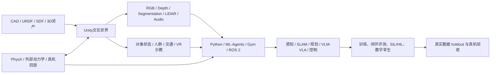

# Unity 在机器人与具身智能中的应用、开源项目和论文调研

> [!summary]
> Unity 在机器人/具身智能中的核心价值，是一套**可快速制作交互式世界、合成多模态观测、接入人类示教/VR，并通过 Python 或 ROS 与学习和控制栈闭环**的实时 3D 平台。它最成熟的研究成果集中在室内具身智能（AI2-THOR、ProcTHOR、ALFRED、TEACh）、通用强化/模仿学习（ML-Agents）、合成数据，以及自动驾驶和无人机等垂直模拟器。它不是开源机器人引擎，也不应仅凭 PhysX 画面判定动力学或 sim-to-real 有效。综合结论置信度：**高**。

## 1. 分类与研究边界

- **主分类：R04 技术原理、论文与前沿方向调研**。
- **次分类：R05 产品、平台与工具选型；R06 市场扫描与候选池构建**。
- **分类理由**：问题既要求解释 Unity 在机器人和具身智能中的技术位置，也要求形成可复用的开源项目、论文和选型候选池。
- **覆盖范围**：截至 2026-08-06 可核验的 Unity 机器人建模、ROS/ROS 2、学习、合成数据、室内具身环境、自动驾驶、无人机、多机器人、数字孪生与人类示教项目。
- **排除项**：纯游戏 NPC、只有演示视频而无公开交付物的项目，以及仅借 Unity 渲染但与机器人/具身任务没有闭环的普通 3D 应用。
- **“开源”口径**：代码仓库、Unity Editor/runtime、场景资产、数据集和云服务分别判断；仓库公开不等于整套系统为 OSI 开源或可商用。

## 2. 结论摘要

### 2.1 Unity 在机器人技术栈中的位置

| 能力层 | 适配度 | 结论 |
|---|---:|---|
| 交互式室内世界、对象状态和任务脚本 | 很高 | AI2-THOR、VirtualHome、ALFRED/TEACh 已形成丰富研究谱系。 |
| 强化学习、模仿学习和多智能体 | 高 | ML-Agents 提供 Python、Gym/PettingZoo、PPO/SAC、示教和 curriculum，但并非机器人专用算法栈。[SRC-robotics-467] [SRC-robotics-468] |
| 合成视觉数据和 domain randomization | 高 | Perception 能输出 RGB/标注并做随机化，但官方已停止支持，只适合维护、复现或二次开发，不宜直接作为长期绿地依赖。[SRC-robotics-469] |
| ROS/ROS 2、URDF 与数字孪生 | 中高 | 官方 TCP 桥、URDF Importer、ROS#、ros2-for-unity 可用；时钟、坐标、QoS 和动力学一致性仍需工程验收。[SRC-robotics-464] [SRC-robotics-465] [SRC-robotics-466] [SRC-robotics-470] [SRC-robotics-472] |
| VR/AR、人类示教和 HRI | 很高 | Unity 的编辑器、XR 和交互组件适合示教采集、远程操作、培训和数字孪生前端。 |
| 自动驾驶、无人机与多机器人 | 高（用专用项目） | AWSIM、SVL、AutoDRIVE、Flightmare、CLOiSim 已封装领域模型；不建议从裸 Unity 重造全部传感器和接口。 |
| 精确接触、系统辨识和控制验证 | 中低（单独使用） | Unity/PhysX 可做实时刚体与 Articulation，但精密抓取、柔性接触、轮胎/水动力和控制稳定性需要目标数据标定或外部专用求解器。 |
| 大规模 GPU 并行机器人 RL | 中 | ML-Agents 支持并发实例，但裸 Unity 的进程/渲染开销通常不如 Isaac Lab、MuJoCo 等训练专用栈；须按每秒环境步和成本实测。 |

### 2.2 最值得关注的项目组合

- **通用机器人接入**：Unity Robotics Hub + URDF Importer + ROS-TCP；高吞吐 ROS 2 可比较 ros2-for-unity。
- **策略训练**：ML-Agents；若目标是家居语义和长时任务，优先 AI2-THOR/ProcTHOR/ALFRED/TEACh，不要从空场景重新定义 benchmark。
- **合成数据**：Perception 作为历史参考或可控 fork；新项目先验证维护责任和替代方案。
- **自动驾驶**：Autoware 选 AWSIM；SVL 只做遗留复现；缩比车/HIL/教学可看 AutoDRIVE。
- **无人机**：Flightmare 适合视觉、规划和 RL 研究，但维护信号偏弱，绿地项目需先验证 Unity、编译器和 ROS 兼容性。
- **多机器人/服务机器人**：CLOiSim 的 SDF + ROS 2 路线值得 PoC。

## 3. 系统架构与应用场景

### 3.1 ROS/ROS 2 联调、机器人模型导入与数字孪生

Unity Robotics Hub 提供 ROS–Unity、URDF、pick-and-place、物体位姿估计和 Nav2/SLAM 示例；ROS-TCP Connector/Endpoint 完成消息桥接，URDF Importer 将 link/joint 转为 Unity articulation。[SRC-robotics-464] [SRC-robotics-465] [SRC-robotics-466]

这条路线适合教学、算法可视化、操作台数字孪生、AMR 场景联调和客户演示。对新 ROS 2 工程，应同时测试 RobotecAI 的 `ros2-for-unity`：它在 Unity 进程中提供 ROS 2 node/pub/sub 路线，减少通用 rosbridge/TCP 的序列化层；但原生 DDS 并不自动解决仿真时间、QoS、坐标和确定性问题。[SRC-robotics-470]

### 3.2 强化学习、模仿学习与多智能体

ML-Agents 把 Unity 场景包装为可由 Python 控制的学习环境，支持 PPO、SAC、行为克隆、GAIL、多智能体、自博弈、curriculum、环境随机化以及 Gym/PettingZoo 接口。[SRC-robotics-467] [SRC-robotics-468]

机器人应用包括移动导航、机械臂到达/抓取的简化任务、群体协作、人机交互策略和视觉控制。其优势是任务和观测设计自由；弱点是**自由度高导致 benchmark 容易不可比**，而且高画质环境与大规模训练吞吐存在冲突。

### 3.3 合成数据、感知与 sim-to-real

Unity Perception 提供相机、标签、2D/3D bounding box、实例/语义分割、关键点和 domain randomization，并能导出 SOLO/COCO 相关数据。Robotics Object Pose Estimation 示例把 URDF、ROS、合成标注、模型训练和模拟抓取连成端到端流程。[SRC-robotics-469] [SRC-robotics-499]

适用任务包括目标检测、6D pose、人体/工人感知、仓储货物、机器人相机测试和隐私敏感数据生成。关键限制有三点：Perception 已停更；合成标注正确不等于画面分布接近真实；任何增益都必须在未参与场景制作的真实 holdout 上验证。

### 3.4 家庭具身智能、导航、操作与语言交互

Unity 在这一方向形成了最有影响力的研究链：

1. **AI2-THOR**：可导航、可交互的室内场景与对象状态，是视觉 AI/具身学习底座。[SRC-robotics-473] [SRC-robotics-474]
2. **RoboTHOR**：将模拟场景与物理对应环境配对，直接揭示 sim-to-real 差距。[SRC-robotics-475]
3. **ManipulaTHOR**：在视觉丰富室内环境研究移动机械臂和 ArmPointNav。[SRC-robotics-478]
4. **ProcTHOR**：程序化生成大规模房屋，覆盖导航、重排和机械臂任务，缓解少量手工场景过拟合。[SRC-robotics-476] [SRC-robotics-477]
5. **ALFRED**：将自然语言、第一视角视觉和长时家务动作序列结合。[SRC-robotics-481] [SRC-robotics-482]
6. **TEACh**：把人类对话、澄清和任务执行放进同一家庭任务。[SRC-robotics-483] [SRC-robotics-484]
7. **Holodeck**：利用 LLM、空间约束和 Objaverse 资产按文本生成新型交互环境。[SRC-robotics-479] [SRC-robotics-480]

这些平台适合研究 VLM/VLA 的语义导航、对象状态、长时规划、记忆和人机对话，但代理动作通常是离散/抽象接口；在 benchmark 中完成 `PickupObject` 不等于真实机器人已解决视觉伺服、IK、碰撞、接触和抓取稳定性。

### 3.5 人类活动、VR 示教和社会交互

VirtualHome 用程序化动作序列表达家务活动，并支持多智能体仿真；VRKitchen 允许人类在 VR 厨房中给出细粒度操作示范；TDW 进一步覆盖图像、音频、刚体、布料、液体、可变形物体、多智能体和 VR。[SRC-robotics-485] [SRC-robotics-486] [SRC-robotics-487] [SRC-robotics-488] [SRC-robotics-489] [SRC-robotics-490]

它们可用于活动理解、语言到程序、示教学习、社会机器人和多模态世界模型。但 VirtualHome/VRKitchen 的虚拟人动作不是机器人本体可直接执行的 action，必须经过 embodiment mapping、可达性、碰撞和动力学验收。

### 3.6 自动驾驶、无人机和多机器人

- **AWSIM**：为 Autoware 优化，提供原生 ROS 2、车辆/交通、相机、GNSS/IMU、GPU LiDAR、点云和 OpenSCENARIO 接入。2026-05-07 已转入 Autoware Foundation；代码 Apache-2.0，但 release 资产 CC BY-NC。[SRC-robotics-493]
- **SVL Simulator**：Unity HDRP、Autoware/Apollo 全栈仿真的历史代表。官方从 2022-01-01 起停止开发，WISE 云服务源码也不公开，且自定义许可限制商业使用。[SRC-robotics-494] [SRC-robotics-495]
- **AutoDRIVE**：将 Unity 数字孪生、缩比车、智能基础设施、ROS/ROS 2 和 HIL 组合，用于教学和 cyber-physical 研究。[SRC-robotics-496] [SRC-robotics-497]
- **Flightmare**：Unity 渲染与外部四旋翼动力学解耦，用于视觉、VIO、规划、强化学习和 VR。[SRC-robotics-491] [SRC-robotics-492]
- **CLOiSim**：通过 SDFormat 建立 Unity 多机器人世界，并以 ROS 2 连接服务机器人/AMR；适合已有 SDF 资产和多机器人场景的团队。[SRC-robotics-498]

## 4. 开源项目候选池

完整字段、维护信号和许可证见 [Unity 项目机器可读清单](../../../raw/robotics-embodied-ai/data/unity-robotics-open-projects-2026-08-06.csv)。

### 4.1 第一梯队：建议直接做 PoC

| 项目 | 最适用 | 选择理由 | 主要风险 |
|---|---|---|---|
| [ML-Agents](https://github.com/Unity-Technologies/ml-agents) | 自定义 RL/IL、多智能体 | 仍活跃、Apache-2.0、Python/Gym/PettingZoo、训练功能完整 | 不是机器人标准栈；吞吐和物理需实测 |
| [AI2-THOR](https://github.com/allenai/ai2thor) | 室内具身导航与交互 | 任务/论文/数据生态强，代码可核验 | 离散动作不等于真机可执行性 |
| [ProcTHOR](https://github.com/allenai/procthor) | 扩大室内训练世界 | 可程序化生成大量交互房屋 | 资产许可、物理分布和真实泛化需审计 |
| [Unity Robotics Hub](https://github.com/Unity-Technologies/Unity-Robotics-Hub) + [ROS-TCP](https://github.com/Unity-Technologies/ROS-TCP-Connector) + [URDF Importer](https://github.com/Unity-Technologies/URDF-Importer) | ROS 教学、联调和数字孪生原型 | 官方教程链完整、Apache-2.0 | 示例版本偏旧，长期维护信号弱于 ML-Agents |
| [ros2-for-unity](https://github.com/RobotecAI/ros2-for-unity) | 高吞吐 ROS 2 联调 | 原生 ROS 2、在 AWSIM 等项目中使用 | Unity/ROS 2/平台版本矩阵需固定 |
| [AWSIM](https://github.com/autowarefoundation/AWSIM) | Autoware 自动驾驶 | 当前归属 Autoware Foundation、ROS 2 原生、垂直功能完整 | 资产非商业；不适用于通用机器人操作 |
| [CLOiSim](https://github.com/lge-ros2/cloisim) | SDF + ROS 2 多机器人 | 活跃、MIT、服务机器人和 AMR 方向清晰 | 社区较小，传感器和物理需目标 PoC |
| [VirtualHome](https://github.com/xavierpuigf/virtualhome) | 多智能体家庭活动/语言规划 | 活跃、MIT、活动程序表达清晰 | 人类动作到机器人动作需重定向 |

### 4.2 第二梯队：按场景使用

| 项目 | 适合什么 | 判断 |
|---|---|---|
| [ALFRED](https://github.com/askforalfred/alfred) | 长时视觉语言家务任务 | 很适合 benchmark 和算法复现，不是通用仿真底座。 |
| [TEACh](https://github.com/alexa/teach) | 对话澄清和家庭任务执行 | 研究价值高；复用前核实数据/代码许可。 |
| [Holodeck](https://github.com/allenai/Holodeck) | 文本生成多样化具身场景 | 适合环境生成研究；Objaverse 等资产逐件继承许可。 |
| [TDW](https://github.com/threedworld-mit/tdw) | 多模态物理、音频、VR、认知研究 | 能力独特，但已进入 LTS，只做小修。 |
| [Flightmare](https://github.com/uzh-rpg/flightmare) | 四旋翼视觉、规划、RL | 架构优秀但维护偏弱；先过现代工具链编译门。 |
| [AutoDRIVE](https://github.com/Tinker-Twins/AutoDRIVE) | 缩比车、HIL、教学和智能基础设施 | 适合 cyber-physical 教研，小众生态和资产交付需核验。 |
| [Robotec GPU LiDAR](https://github.com/RobotecAI/RobotecGPULidar) | Unity/AWSIM 高吞吐 LiDAR | 对自动驾驶和 AMR 传感器仿真有用；依赖 NVIDIA GPU。[SRC-robotics-471] |
| [ROS#](https://github.com/siemens/ros-sharp) | C#/.NET、rosbridge 和历史项目 | 社区仍有更新；新 ROS 2 项目应与原生方案对比。 |

### 4.3 历史项目或谨慎采用

- **Unity Perception**：Apache-2.0 代码仍可 fork，但官方明确已停止支持。[SRC-robotics-469]
- **SVL Simulator**：具有历史和论文价值，但官方停更、WISE 不开源、自定义许可非商业，不建议作为新产品底座。[SRC-robotics-494]
- **Robotics Object Pose Estimation**：很好的端到端教学样例，最后推送在 2022 年，不能代表当前生产栈。[SRC-robotics-499]
- **VRKitchen**：论文方向有价值，但仓库许可未由 GitHub API 识别，复用前需人工确认。

## 5. 代表论文地图

机器可读版本见 [Unity 论文索引 CSV](../../../raw/robotics-embodied-ai/data/unity-robotics-papers-2026-08-06.csv)。

| 研究线 | 代表论文 | 关键贡献/阅读目的 |
|---|---|---|
| 通用学习平台 | Unity: A General Platform for Intelligent Agents（2018/2020） | 解释为何游戏引擎可承载视觉、物理、任务和社会复杂度，以及 ML-Agents 的定位。[SRC-robotics-468] |
| 交互式室内世界 | AI2-THOR（2017） | 建立可导航、可改变对象状态的室内 Visual AI 环境。[SRC-robotics-474] |
| 家庭活动程序 | VirtualHome（CVPR 2018） | 用原子动作程序表示复杂家务，并驱动 Unity 虚拟人。[SRC-robotics-486] |
| VR 示教 | VRKitchen（2019） | 将细粒度厨房交互、人类 VR 示教和 task-oriented learning 放在一起。[SRC-robotics-488] |
| 视觉语言长时任务 | ALFRED（CVPR 2020） | 用 25k 指令研究第一视角视觉到长序列家务动作。[SRC-robotics-482] |
| Sim-to-real 导航 | RoboTHOR（CVPR 2020） | 用模拟/真实配对环境量化迁移差距，而不是假设渲染真实即可迁移。[SRC-robotics-475] |
| 移动操作 | ManipulaTHOR（CVPR 2021） | 视觉丰富场景中的移动机械臂、抓取和 ArmPointNav。[SRC-robotics-478] |
| 对话具身任务 | TEACh（AAAI 2022） | 研究人类对话、歧义消解、错误恢复和任务执行。[SRC-robotics-484] |
| 程序化规模化 | ProcTHOR（NeurIPS 2022） | 以 10,000 个程序化房屋展示跨导航、重排和操作 benchmark 的预训练价值。[SRC-robotics-477] |
| 多模态物理 | ThreeDWorld（NeurIPS 2021） | 视觉、音频、物体物理、可变形材质、多智能体和 VR 的统一环境。[SRC-robotics-490] |
| 无人机仿真 | Flightmare（CoRL 2020） | 解耦 Unity 渲染与高频动力学，兼顾视觉和控制/RL。[SRC-robotics-492] |
| 自动驾驶 | LGSVL Simulator（ITSC 2020） | Unity HDRP、Autoware/Apollo、传感器和数字孪生的经典全栈方案。[SRC-robotics-495] |
| 数字孪生/HIL | AutoDRIVE（2022/2023） | 连接 Unity、缩比硬件、智能基础设施和 ROS/ROS 2。[SRC-robotics-497] |
| 语言生成世界 | Holodeck（CVPR 2024） | 用 LLM 生成空间约束并布置 Objaverse 资产，降低新环境人工制作成本。[SRC-robotics-480] |
| 分布式自动驾驶 | D-AWSIM（2025）、DMAVA（2026） | 将 AWSIM 扩展到多主机、密集 LiDAR/交通和多车闭环；均属作者实验，不能直接视为成熟产品。[SRC-robotics-500] [SRC-robotics-501] |

## 6. Unity 与 UE、Gazebo、MuJoCo、Isaac Sim 的定位对照

| 主要目标 | 默认优先 | Unity 的相对位置 |
|---|---|---|
| 家庭语义、对象状态、语言任务 benchmark | AI2-THOR/ProcTHOR（Unity）或 Habitat | Unity 生态在可交互家居和语言任务上非常强。 |
| 快速做自定义 3D 任务和人类 VR 示教 | Unity | C#、编辑器和 XR 迭代快，适合小团队原型。 |
| 影视级大场景、灾害、城市和高端视觉 | [[unreal-engine-in-robotics-and-embodied-ai-2026-08-06|Unreal Engine]] | UE 的大场景/画质/行业模拟生态通常更强；Unity 的工具学习曲线和 AI2-THOR 研究生态更友好。 |
| ROS 2 系统联调和标准机器人传感器 | Gazebo/Webots | Unity 需要桥接和自建验证；Gazebo 的 ROS 原生性更强。 |
| 接触丰富操作、控制和系统辨识 | MuJoCo | Unity 可做视觉/交互前端，权威动力学优先 MuJoCo 或经验证的专用模型。 |
| NVIDIA GPU 并行 RL、USD/Replicator | Isaac Sim/Isaac Lab | Unity 更适合定制世界、跨平台和交互体验；训练吞吐与 NVIDIA 机器人生态通常不占优。 |
| Autoware 全栈 | AWSIM（Unity） | 直接用垂直平台；不要从裸 Unity 重造自动驾驶栈。 |

**与 UE 的关键差异判断**：Unity 更像“易于编程和教学的交互式实验室”，并拥有 AI2-THOR/ML-Agents 这条强研究链；UE 更像“高真实感、大尺度、复杂行业环境和数字孪生展示层”。两者都不是精密机器人动力学的天然权威来源。

## 7. 许可证、维护和可复现性边界

### 7.1 不能混为一谈的五层许可

1. **项目代码**：例如 ML-Agents、AI2-THOR、ROS-TCP 常为 Apache-2.0；VirtualHome 为 MIT。
2. **Unity Editor/runtime**：专有软件，受 Unity 当前订阅层级与 Editor Terms 约束；不是项目代码许可证的一部分。[SRC-robotics-463]
3. **场景和模型资产**：可能来自 Unity Asset Store、Objaverse、研究团队或商业地图，条款逐件不同。
4. **数据集/预训练模型**：即使生成工具可商用，输入资产、人物形象、真实数据和模型权重仍可能限制训练或再分发。
5. **云服务/二进制交付**：SVL 的 WISE 即是源代码未开放的依赖；AWSIM 的代码与 release 资产也采用不同许可。[SRC-robotics-493] [SRC-robotics-494]

截至本次核验，Unity 官方页面说明：非游戏/娱乐的工业应用若企业总财务规模超过 100 万美元，需要 Unity Industry；当前价格和运行时分发条款仍应在采购/交付日由法务按合同复核。[SRC-robotics-463]

### 7.2 维护信号不能只看“未 archived”

- Perception 明示停更；SVL 明示 sunset；TDW 明示 LTS 小修。
- Unity Robotics Hub 未 archived，但主分支最后推送在 2024 年，示例仍以较老 Unity/ROS 版本为主。
- ML-Agents 仍有活跃开发和较新正式 release。
- AWSIM 已转入基金会组织，是本次自动驾驶候选中最重要的治理变化。

## 8. 最小 PoC 与验收标准

建议选一个“移动操作机器人在室内寻找目标、导航、接近并执行一次取放”的统一任务，用同一资产和真实 holdout 对比 Unity、UE 或专用模拟器。

### 8.1 四周 PoC

1. **第 1 周**：固定 Unity/项目/ROS 2/显卡驱动版本；导入 URDF；建立米制、轴向和外参单元测试。
2. **第 2 周**：接通 RGB、深度、语义、TF/odom、joint state 和 command；记录时间戳、丢帧、延迟和实时因子。
3. **第 3 周**：完成真实-only、sim-only、naive mix、calibrated mix 四组感知或策略实验。
4. **第 4 周**：在未参与调参的真实场景测试成功率、碰撞、超时、接管和分布外失败；审计全部代码/资产/数据/运行时许可。

### 8.2 验收门

| 门 | 指标 |
|---|---|
| 可复现 | 固定 commit、Unity 版本、包锁、资产 hash、随机种子；干净机器一键运行。 |
| 坐标与时间 | 左/右手系、米/厘米、相机外参有测试；传感器时间差、ROS 延迟和 jitter 可测。 |
| 物理 | 质量、惯量、关节限位、摩擦、接触、轮胎/推进器模型分别校准；画面不作证据。 |
| 数据 | 标签正确率抽检；真实/仿真分布差异可视化；真实 holdout 不进入场景调参。 |
| 训练性能 | environment steps/s、并发实例、GPU/CPU/显存、崩溃恢复和每千 episode 成本。 |
| 任务价值 | 真机成功率、碰撞/接管、周期时间、数据成本和人工成本相对 baseline 改善。 |
| 法务 | 代码、引擎、资产、数据、模型、云服务分别通过；非商业条款不得被 Apache/MIT 代码掩盖。 |

## 9. 商业应用可能性

### 9.1 近期 1–2 年

| 场景 | 使用者/付款者 | 当前成熟度 | 判断 |
|---|---|---:|---|
| 工业/仓储数字孪生、售前演示、培训 | 自动化团队、集成商、设备商、工厂 | 付费项目到重复交付 | **高可能性**：视觉和交互价值直观，物理精度可按用途分层。 |
| 合成视觉数据和场景回归 | 机器人感知团队、数据负责人 | PoC 到重复项目 | **中高可能性**：必须以真实 holdout 增益和单位有效样本成本付款。 |
| Autoware 仿真和开发服务 | 车企、自动驾驶团队、研究机构 | 工程采用 | **中高可能性**：AWSIM 有明确生态，但资产商业限制和安全验证链需补齐。 |
| VR 示教、遥操作界面和 HRI 试验 | 机器人公司、实验室、培训机构 | PoC/定制项目 | **中高可能性**：Unity XR 优势明显，机器人动作映射与安全是成本中心。 |
| 家务 VLM/VLA benchmark 和数据生成 | 模型团队、大学、机器人初创 | 研究/PoC | **中等**：论文价值高，付费取决于转成目标本体数据和真机提升。 |
| 仅凭 Unity 物理做安全认证 | 机器人 OEM/监管 | 不成熟 | **低可能性**：缺少经校准模型、覆盖率和独立验证时不能形成安全证据。 |

**采购链**：使用者通常是仿真/算法工程师；决策者是研发负责人或产品负责人；采购者是 IT/采购/法务；付款者来自研发、数字孪生、培训、测试验证或数据预算。只有“减少实机占用、降低危险测试成本、缩短场景制作周期、提升真实 holdout 指标”可量化时，Demo 才可能转成订单。

### 9.2 中期 3–5 年

中期更大的机会不是售卖一个 Unity 场景，而是形成**场景资产—传感器模型—任务回放—自动评测—真机失败回灌**的持续服务。前提是开放场景标准、版本治理、运行时自动化和真实数据闭环成熟。判断：**中等可能性，中等置信度**。

## 10. 中小型创业者的机会

### 10.1 可立即验证

| 切口 | MVP | 首批客户/收费交付物 | 验证周期/资本强度 |
|---|---|---|---|
| Unity–ROS 2 场景集成 | 一个机器人、一套 TF/传感器/控制闭环和自动回归 | 机器人 OEM/集成商；按场景包和验收报告收费 | 4–8 周；低到中 |
| 垂直合成数据服务 | 客户一个感知任务的四组 A/B 数据包 | 感知团队；按有效样本、真实提升和复现实验收费 | 6–10 周；中 |
| VR 示教/遥操作 UI | 支持一个机械臂/移动机器人的采集、回放和异常标记 | 机器人数据团队；软件+集成+培训 | 6–12 周；中 |
| AWSIM/Autoware 测试服务 | 一条 ODD、传感器配置、场景回放和 CI 报告 | 自动驾驶团队/高校；项目制测试包 | 6–12 周；中 |
| 老项目迁移与维护 | Perception/SVL/旧 Unity 项目迁至可维护版本或替代栈 | 既有实验室/企业；迁移、固定版本和 SLA | 4–12 周；低到中 |

头部平台通常不会为每一种中国工厂、仓库、本体和 ROS 图定制最后一公里；它们更可能采购具备现场数据、资产生产和验收 know-how 的垂直集成服务。复购来自场景版本、机器人型号、传感器标定、回归用例和真机失败库，而不是一次性美术资产。

### 10.2 需要条件成熟

- 可跨 Unity/UE/Isaac/Gazebo 的 SimReady 资产编译与验证服务。
- 面向 VLM/VLA 的自动任务生成、难例挖掘和真机失败回放平台。
- 经真实传感器标定的相机/LiDAR/噪声模型库。
- 面向危险环境、养老和医疗培训的可审计人机协同数字孪生。

### 10.3 不建议进入

- 从零做“通用 Unity 机器人模拟器”，与成熟 ROS/Isaac/MuJoCo/AI2-THOR 生态正面竞争。
- 只出售漂亮场景或合成图片，不承诺任务指标、许可清单和复现环境。
- 把 Unity 画面、PhysX 接触或 benchmark 成绩包装成真机可靠性/安全认证。
- 依赖已停更 Perception/SVL 的闭源资产或云服务，却没有可替代和迁移计划。

## 11. 反方证据、风险与证伪条件

### 11.1 反方证据与知识冲突

- **“Unity 视觉真实，所以 sim-to-real 好”**：RoboTHOR 的核心结果恰恰是模拟到真实仍有显著差距。[SRC-robotics-475]
- **“官方机器人栈一直活跃”**：ML-Agents 活跃，但 Perception 已停更，Robotics Hub/URDF/ROS-TCP 的主线推送较老；不能把公司品牌当作统一维护承诺。
- **“项目 Apache/MIT，所以可商用”**：AWSIM 代码 Apache-2.0、资产 CC BY-NC；SVL 自定义许可限制商业使用；Unity Runtime 又有独立条款。[SRC-robotics-463] [SRC-robotics-493] [SRC-robotics-494]
- **“具身 benchmark 成功即可落机器人”**：AI2-THOR 的高层离散交互跳过连续控制、IK、接触和安全约束，论文指标不能直接外推。

### 11.2 主要风险

- Unity 版本、包版本、Python/ROS 依赖和显卡驱动组合脆弱。
- 左手/右手坐标、单位和时间同步错误会产生“看起来正确”的隐性数据污染。
- PhysX 参数、传感器噪声和场景资产未经真实标定，导致策略学到仿真捷径。
- 引擎订阅、工业条款、Runtime、Asset Store 和第三方数据条款变化。
- 场景制作和维护成本超过省下的实机时间；训练吞吐不足以支撑规模化 RL。

### 11.3 证伪条件与监测指标

若出现以下任一项，应降低 Unity 路线优先级：

- 目标任务真实 holdout 不优于 real-only baseline，或 calibrated mix 不优于 naive mix。
- 达不到所需实时因子/环境步吞吐，GPU 和许可证 TCO 高于专用模拟器。
- 关键项目连续 12–18 个月无兼容更新，且团队无法承担 fork。
- 资产、运行时或数据许可不能覆盖客户部署和模型训练/再分发。
- 接触/车辆/飞行动力学误差主导任务，而无法用外部模型或真实回放校准。

每季度监测：项目 release/commit/issue 响应、Unity LTS 和条款、ROS 2 版本、每秒环境步、崩溃率、真实任务成功率、接管/碰撞率、场景生产工时、每个有效样本成本和资产许可通过率。

## 12. 待验证事项与下一步

1. 用目标机器人/场景实测 ML-Agents、ROS-TCP 和 ros2-for-unity 的吞吐、时钟与故障恢复。
2. 对 TEACh、VRKitchen、RGL 的仓库 LICENSE 和资产链做逐文件法律复核。
3. 核实 Unity 2026 Industry/Runtime 分发费用在中国主体、内部仿真和客户交付三种情形下的合同口径。
4. 用同一室内移动操作任务对比 Unity、UE + MuJoCo、Gazebo 和 Isaac Sim，禁止跨论文指标横排。
5. 对 AWSIM 做代码/资产分离部署 PoC，确认 CC BY-NC 资产能否替换为客户自有地图。

## 13. 来源与证据质量

- **S 级**：Unity 当前条款/产品页、官方/原作者 GitHub 仓库、论文原文、Autoware Foundation 项目页。
- **A 级**：本报告没有用媒体报道支撑关键技术或许可结论。
- **动态证据**：GitHub stars、push、archived 和默认分支在 2026-08-06 通过 GitHub API 核验，只作为维护信号，不作为质量排名。
- **限制**：本轮未逐一编译 23 个项目，也未独立复现论文实验；论文中的场景数、性能和泛化结果均视为作者实验。

来源集合见 [[_sources/unity-robotics-embodied-ai-source-set|Unity 机器人与具身智能来源集]]；项目与论文全集见两份机器可读 CSV。

## 关联连接

- [[unreal-engine-in-robotics-and-embodied-ai-2026-08-06|Unreal Engine 在机器人与具身智能中的应用、开源项目和论文调研]]
- [[isaac-sim-vs-gazebo-vs-mujoco-2026-07-14|Isaac Sim vs Gazebo vs MuJoCo 机器人仿真平台选型]]
- [[3d-simulation-asset-production-pipelines-comparison-2026-08-06|3D 仿真资产生产技术管线综合调研]]
- [[07-training-data|机器人训练数据生产与处理]]
- [[_concepts/embodied-ai|Embodied AI]]
- [[_sources/unity-robotics-embodied-ai-source-set|Unity 机器人与具身智能来源集]]
