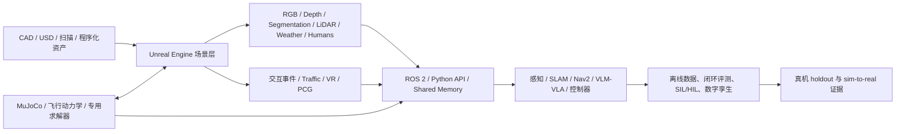

# Unreal Engine 在机器人与具身智能中的应用、开源项目和论文调研

> [!summary]
> Unreal Engine（UE）在机器人领域最有价值的角色，不是单独替代 Gazebo、MuJoCo 或 Isaac Sim，而是充当**高真实感场景、可编程传感器、人/交通/天气交互、数字孪生可视化和复杂事件生成层**。当任务以视觉感知、城市/灾害/水下环境、HIL/SIL、VLM/VLA 交互或人机协作为主时，UE 很有优势；当任务以接触丰富操作、精确控制、可微/批量强化学习为主时，更合理的工程架构通常是 **UE + MuJoCo/专用动力学 + ROS 2**。综合结论置信度：**高**；具体项目可用性置信度因项目而异。

## 1. 分类与研究边界

- **主分类：R04 技术原理、论文与前沿方向调研**。
- **次分类：R05 产品、平台与工具选型；R06 市场扫描与候选池构建**。
- **分类理由**：问题同时要求解释 UE 在机器人/具身智能中的技术作用，列出可复用的开源项目与论文，并支持后续平台选型。
- **覆盖范围**：截至 2026-08-06 可核验的 UE4/UE5 机器人仿真、合成数据、ROS/ROS 2 接口、自主系统、数字孪生、VLM/VLA benchmark、人机协作和混合物理架构。
- **排除项**：只把 UE 用作宣传动画、没有机器人闭环的普通游戏项目；Unity、Isaac Sim、Gazebo、MuJoCo 只作为对照，不做完整横向选型；未公开代码或无法找到正式交付物的论文只列为“论文雷达”，不冒充已验证开源项目。

## 2. 先给结论

### 2.1 UE 在机器人栈中的正确位置

| 层 | UE 的适配度 | 说明 |
|---|---:|---|
| 高真实感环境与资产 | 很高 | 大尺度室内外场景、天气、光照、材质、动态人群、交通、灾害事件和 VR/XR 是核心优势。 |
| 相机与视觉真值 | 很高 | RGB、深度、法线、语义/实例、材质、光流和多视角同步可由插件或项目导出。 |
| 人机交互与可视化 | 很高 | VR 遥操作、操作员训练、数字孪生、演示和协同评测比传统机器人模拟器更自然。 |
| 道路/UAV/水下自主系统 | 高 | AirSim、CARLA、Cosys-AirSim、HoloOcean、UNav-Sim 已形成垂直生态。 |
| ROS 2 联调、SIL/HIL | 中高 | 可通过 rclUE、ROSIntegration、AirSim 系列或自定义桥接接入，但时钟、坐标系和消息 QoS 需单独验收。 |
| 接触丰富操作与精确动力学 | 中低（单独使用） | Chaos 是实时游戏物理系统；关节、摩擦、柔性接触和控制器验证不能由画面真实代替。[SRC-robotics-427] |
| 大规模并行 RL | 中低 | UE 的渲染、编辑器、资产和进程开销通常高于面向 GPU 批量训练的专用机器人模拟器。 |
| 产品级安全认证 | 低（单独使用） | 必须有经校准传感器模型、动力学验证、真实场景 holdout、回放和可审计测试链。 |

**核心判断**：UE 是“世界与观测生成器”时最强；作为“唯一物理真值和控制训练器”时风险最大。

### 2.2 推荐架构

这类架构已经在 Unreal Robotics Lab 的 UE5 + MuJoCo 内嵌方案、SPEAR 的 MuJoCo co-simulation 示例，以及既有 [[zsibot-matrix-robotics-simulator-deep-dive-2026-07-20|MATRiX 调研]]中出现。[SRC-robotics-440] [SRC-robotics-441] [SRC-robotics-442] [SRC-robotics-443]

## 3. 具体应用场景

### 3.1 合成数据与机器人视觉

**适用任务**：目标检测、语义/实例分割、深度、光流、6D pose、视觉抓取、SLAM/VIO robustness、相机标定与多视角感知。

UE 的优势是每个渲染帧都可同时获得图像和完整场景真值，并能系统改变光照、材质、天气、遮挡、相机位置和对象分布。UnrealCV 奠定了“外部程序控制 UE 并读取真值”的接口路线；UnrealROX/RobotriX 把它推进到室内机器人、VR 操作和大规模标注轨迹；NDDS 是早期 UE4 合成数据插件；SPEAR 进一步扩大了可编程 UE API 和传感器输出。[SRC-robotics-428] [SRC-robotics-429] [SRC-robotics-448] [SRC-robotics-449] [SRC-robotics-450] [SRC-robotics-455]

2025 年的机器人足球研究还展示了将 3D Gaussian Splatting 重建的场景放入 UE 生成训练数据的 real-to-sim 路线，但“作者任务上有效”不能外推到其他相机、材质和目标类别。[SRC-robotics-459]

### 3.2 视觉导航、SLAM 与具身导航

- Gym-UnrealCV 提供 active tracking、object search、多智能体和有限的机械臂视觉 RL 示例。[SRC-robotics-430]
- Unreal Robotics Lab 用烟、火、水等视觉扰动评估视觉导航和 SLAM，并由 MuJoCo 承担机器人动力学。[SRC-robotics-441]
- SimWorld-Robotics 面向大型动态城市，评估多模态指令跟随、长距离安全导航、空间推理和多机器人协作。[SRC-robotics-444] [SRC-robotics-445]
- VirtualEnv 把 UE5 用于 LLM/VLM 驱动的导航、物体交互、程序化任务和多智能体协作，但本轮没有找到可审计的官方代码仓库，因此只作为论文级候选。[SRC-robotics-460]

### 3.3 无人机、自动驾驶与空地协同

- **AirSim**：UAV/车辆、PX4/ArduPilot、SIL/HIL、相机与数据采集的经典入口；适合维护遗留代码和研究复现，不建议把 2022 年 release 当作绿地项目的默认主线。[SRC-robotics-431] [SRC-robotics-432]
- **Project AirSim**：由原团队成员在 UE5 上延续，强调可插拔物理、控制器、执行器和传感器，是新 UAV/自主系统项目更值得先 PoC 的后继路线。[SRC-robotics-433]
- **Cosys-AirSim**：活跃 AirSim 分支，扩展传感器、车辆、ROS 2 和工业场景，是兼容既有 AirSim API 又需要新传感器的候选。[SRC-robotics-434] [SRC-robotics-435]
- **CARLA**：道路自动驾驶、交通、行人和城市传感器验证的成熟 UE 平台；不是通用机械臂模拟器。[SRC-robotics-436] [SRC-robotics-437]
- **CARLA-Air**：在一个 UE 进程内合并 CARLA 地面系统和 AirSim 飞行栈，用于空地协同、VLA、数据集和 RL；但当前许可仅允许学术/非商业使用，商业项目必须另行授权。[SRC-robotics-438] [SRC-robotics-439]
- **HERCULES**：面向 UAV-UGV 多机器人 SLAM、协同感知和探索，增加红外、夜视、火灾、洪水等复杂现象；论文称已开放代码和数据，但本轮未完成仓库级许可证审计。[SRC-robotics-456]

### 3.4 水下与海洋机器人

- **HoloOcean**：UE4 基础的水下多智能体、声呐、DVL、IMU、光学/声学通信和 Python 控制。[SRC-robotics-453] [SRC-robotics-454]
- **UNav-Sim**：UE5 + AirSim 衍生接口，面向水下视觉、ROS、导航和合成数据。[SRC-robotics-451] [SRC-robotics-452]

水下仿真是 UE 特别合适的垂直场景，因为真实海试昂贵、风险高，而光学衰减、粒子、光照和复杂地形高度依赖视觉环境；但推进器、水动力、声呐和通信模型仍必须独立标定。

### 3.5 灾害、应急与危险环境机器人

HEROES 利用 Chaos Destruction 构造坍塌、爆炸和不稳定碎石环境，并通过 ROSBridge 与机器人控制、传感器输出及 VR 训练连接。论文的十人易用性研究只能证明初步可用性，不能证明灾害物理或真实救援效果。[SRC-robotics-457]

这类路线适合消防、矿山、隧道、核电、化工和灾后搜救中的低频高风险场景：真实故障注入成本高，而 UE 可以可控地重放能见度、障碍物和人群变化。

### 3.6 机械臂、移动操作与数字孪生

UE 在操作任务中最适合承担**视觉、工作站、人员、VR 和数字孪生交互层**，精细接触则交给 MuJoCo/其他求解器。Unreal Robotics Lab、MATRiX 和 URoboViz 类方案都体现了这一方向。2025 年的一项协作机器人数字孪生研究还给出 UE5、ROS 2、双向通信、视频流和光学追踪的实施经验。[SRC-robotics-440] [SRC-robotics-458]

不应直接由“机械臂在 UE 画面里运动正常”推导出关节控制、碰撞、抓取稳定性或 sim-to-real 已成立。

### 3.7 VLM/VLA、LLM Agent 与自动生成训练世界

最近项目开始把 UE 从人工制作场景转向“Agent 可编程世界”：

- SPEAR 暴露大量 UE 反射接口，并支持逐帧确定性事务、PCG 控制和自然语言场景编辑。[SRC-robotics-442] [SRC-robotics-443]
- SimWorld-Robotics 用 UE5 测试 VLM 城市导航、交通理解和多机器人 grounded communication。[SRC-robotics-445]
- SimWorld Studio 让 coding agent 生成和修复 UE 环境，再导出 Gym 环境与自适应课程；但公开 README 表明源码构建依赖另一个未公开访问的 `simworld_arena`，所以目前不应标成“完整可复现开源栈”。[SRC-robotics-461] [SRC-robotics-462]
- VirtualEnv 研究 LLM 驱动的物体操作、工具使用和 escape-room 式多步推理；代码开放状态仍待核验。[SRC-robotics-460]

## 4. 开源项目候选池

完整的许可证、接口、维护信号与适用范围见 [项目机器可读清单](../../../raw/robotics-embodied-ai/data/unreal-engine-robotics-open-projects-2026-08-06.csv)。

### 4.1 第一梯队：值得直接做 PoC

| 项目 | 适合什么 | 为什么进入第一梯队 | 关键限制 |
|---|---|---|---|
| [UnrealCV](https://github.com/unrealcv/unrealcv) | 视觉真值、场景控制、感知数据 | 通用、轻量、UE4/5、MIT，且 2026 仍有提交 | 不是完整物理/机器人训练平台 |
| [SPEAR](https://github.com/spear-sim/spear) | 通用 UE 编程、传感器、PCG、MuJoCo co-sim | 新一代高可编程接口，代码/项目资产许可较清楚 | 新项目，生态和机器人模板仍需积累 |
| [Unreal Robotics Lab](https://github.com/URLab-Sim/UnrealRoboticsLab) | UE5 视觉 + MuJoCo 物理 | 架构直接解决 UE 视觉与机器人动力学分工 | 年轻，稳定性、导入和规模化待 PoC |
| [Project AirSim](https://github.com/iamaisim/ProjectAirSim) | 新 UAV/自主系统 | AirSim 后继、UE5、模块化物理与传感器 | 当前案例仍偏飞行器，迁移成本需测 |
| [Cosys-AirSim](https://github.com/Cosys-Lab/Cosys-AirSim) | AirSim 兼容、更多传感器与 ROS2 | 活跃、兼容既有研究栈、工业传感器扩展 | 分支和资产依赖复杂，需固定版本 |
| [CARLA](https://github.com/carla-simulator/carla) | 道路自动驾驶、交通和传感器验证 | 成熟生态、专用城市资产和场景系统 | 不是通用机器人/操作平台，硬件要求高 |
| [rclUE](https://github.com/rapyuta-robotics/rclUE) | UE 原生 ROS 2 集成 | ROS 2 pub/sub/service/action 基础层 | 只解决通信，不提供物理和 benchmark |
| [MATRiX](https://github.com/zsibot/matrix) | 中国四足/导航/感知联调 | UE + MuJoCo + ROS 的成套演示入口 | 适用边界和组件许可证见专门审计 |

### 4.2 第二梯队：垂直场景优先

| 项目 | 垂直场景 | 使用判断 |
|---|---|---|
| [SimWorld-Robotics](https://github.com/SCAI-JHU/SimWorld-Robotics) | 城市 VLM/VLA、多人交通、多机器人 | 适合研究 benchmark，不宜直接当生产机器人底座。 |
| [UNav-Sim](https://github.com/open-airlab/UNav-Sim) | 水下视觉和导航 | 水下感知 PoC 值得试；水动力和传感器标定是验收重点。 |
| [HoloOcean](https://byu-holoocean.github.io/holoocean-docs/) | 海洋传感器、通信、多智能体 | Python 使用门槛低；需核查所需 world package 和核心源码交付。 |
| [CARLA-Air](https://github.com/louiszengCN/CarlaAir) | 空地协同和低空经济 | 技术方向很贴合中国低空场景，但当前非商业许可阻止直接产品化。 |
| HERCULES | 多机器人 SLAM、红外/夜视、灾害/农业 | 前沿研究价值高；先做仓库、数据和许可证审计。 |
| HEROES | 灾害搜救和人机训练 | 适合场景设计参考；代码交付和物理验证尚不足。 |

### 4.3 历史/参考实现

- **Microsoft AirSim**：经典且影响大；用于遗留项目、论文复现和 API 迁移基线。正式 release 停在 2022，但仓库当前未设置 GitHub archived，不能把两者混为一谈。[SRC-robotics-431]
- **UnrealROX / RobotriX**：合成视觉、VR 操作、视觉抓取和室内数据集的历史重要工作；代码年代较老。[SRC-robotics-448] [SRC-robotics-449] [SRC-robotics-450]
- **NVIDIA NDDS**：早期 UE4 合成数据插件；最后代码推送为 2020，且 CC BY-NC-SA 与 UE EULA 的组合应由法务审查，不建议绿地项目直接依赖。[SRC-robotics-455]
- **ROSIntegration**：ROS/rosbridge 历史接入层；新 ROS 2 项目优先比较 rclUE 或项目原生 ROS 2 接口。[SRC-robotics-447]

## 5. 代表论文地图

机器可读清单见 [论文索引 CSV](../../../raw/robotics-embodied-ai/data/unreal-engine-robotics-papers-2026-08-06.csv)。

| 研究线 | 代表论文 | 读它解决什么问题 |
|---|---|---|
| 可编程视觉世界 | UnrealCV（2016） | 如何把 UE 变成外部算法可控制、可读真值的实验环境。[SRC-robotics-429] |
| UAV/车辆仿真 | AirSim（2017） | 视觉、飞行动力学、PX4/HIL 和自动驾驶 API 的经典架构。[SRC-robotics-432] |
| 城市自动驾驶 | CARLA（2017） | 城市、交通、传感器和驾驶策略训练/验证。[SRC-robotics-437] |
| 室内机器人视觉 | UnrealROX（2018）、RobotriX（2019） | VR 采集交互轨迹、视觉抓取和全标注数据。[SRC-robotics-449] [SRC-robotics-450] |
| 水下机器人 | HoloOcean（2022）、UNav-Sim（2023） | 水下传感器、通信、视觉和导航。[SRC-robotics-454] [SRC-robotics-452] |
| 工业自主系统 | Cosys-AirSim（2023） | 如何扩展 AirSim 的传感器、车辆和工业场景。[SRC-robotics-435] |
| 灾害机器人 | HEROES（2023） | 可破坏环境、ROSBridge、VR 和搜救导航训练。[SRC-robotics-457] |
| UE + 专用物理 | Unreal Robotics Lab（2025/ICRA 2026） | UE5 视觉与 MuJoCo 物理怎样在进程内组合。[SRC-robotics-441] |
| 数字孪生 | Collaborative Robot Digital Twins（2025） | 双机械臂、ROS 2、光学追踪和双向通信的工程经验。[SRC-robotics-458] |
| Real-to-Sim 数据 | 3DGS Synthetic Dataset for AMR（2025） | 3DGS 场景进入 UE 后怎样生成机器人视觉训练数据。[SRC-robotics-459] |
| 城市具身智能 | SimWorld-Robotics（NeurIPS 2025） | VLM 城市导航、多机器人通信和动态交通 benchmark。[SRC-robotics-445] |
| 空地具身智能 | CARLA-Air（2026） | 同一 UE tick 下统一 UAV 与地面交通。[SRC-robotics-439] |
| 异构多机器人 | HERCULES（2026） | UAV-UGV SLAM、协同感知、红外/夜视与复杂灾害现象。[SRC-robotics-456] |
| 通用 UE 具身编程 | SPEAR（ECCV 2026） | 大范围 UE API 暴露、共享内存传感器和可定义同步语义。[SRC-robotics-443] |
| LLM/VLM 世界 | VirtualEnv、SimWorld Studio（2026） | 语言驱动交互、自动场景/任务生成和自适应课程。[SRC-robotics-460] [SRC-robotics-462] |

## 6. UE 与其他机器人模拟器的关系

Unity 的完整项目、论文与许可对照见 [[unity-in-robotics-and-embodied-ai-2026-08-06|Unity 在机器人与具身智能中的应用调研]]。

| 目标 | 默认优先 | UE 的位置 |
|---|---|---|
| ROS 2 驱动、传感器、Nav2、标准机器人模型 | Gazebo/Webots | UE 可作为更真实的视觉/人群/客户场景前端。 |
| 接触丰富操作、控制、系统辨识 | MuJoCo | UE 负责渲染与交互，MuJoCo 负责权威状态。 |
| GPU 并行 RL、Isaac 生态、USD/Replicator | Isaac Sim/Isaac Lab | UE 适合自定义视觉、城市/灾害环境和非 NVIDIA 路线；训练吞吐需实测。 |
| 自动驾驶 | CARLA 或专用商业 V&V | CARLA 本身就是 UE 生态；无需从裸 UE 重造。 |
| 视觉感知和合成数据 | UnrealCV/SPEAR/专用 UE pipeline | UE 可成为主平台，但必须保留真实数据 holdout。 |
| VR、操作员训练、数字孪生和展示 | UE | 通常比纯机器人模拟器更合适。 |

**判断**：团队不应先问“UE 能否替代某个模拟器”，而应先问“哪个系统拥有权威物理状态、哪个系统生成观测、如何同步、最终用什么真机指标验收”。

## 7. 最小 PoC 与验收标准

建议用一个“移动操作机器人在仓储/实验室中导航、识别、抓取并在人附近安全停止”的参考任务，在 4 周内验证。

### 7.1 技术路线

1. 用现有 CAD/扫描/资产建立一个目标区域，固定资产版本和许可。
2. 以 SPEAR 或 UnrealCV 生成相机、深度、语义真值；以 rclUE/项目原生接口接 ROS 2。
3. 若含抓取，采用 MuJoCo/真实控制仿真作为权威动力学；UE 只同步渲染状态。
4. 运行真实-only、sim-only、naive mix、calibrated mix 四组感知/策略实验。
5. 在真机保留场景上测成功率、失败模式和接管率，不允许只汇报仿真分数。

### 7.2 验收门

| 门 | 最低检查项 |
|---|---|
| 可复现 | 固定 UE、插件、显卡驱动、资产、仓库提交；一键启动；记录随机种子。 |
| 时间 | 仿真时钟单调；RGB/深度/位姿时间戳对齐；ROS 2 延迟、抖动和丢包可测。 |
| 坐标 | UE 左手/厘米与 ROS 右手/米转换有单元测试；外参误差有阈值。 |
| 视觉 | 关键对象的真实/仿真分布差异、遮挡、曝光、材质和噪声被量化。 |
| 物理 | 关节、质量、惯量、摩擦、碰撞、接触稳定性和控制频率逐项校准。 |
| 任务 | 与真实-only baseline 比较；报告成功、超时、碰撞、接管和长尾失败。 |
| 性能 | GPU 显存、端到端 FPS、传感器吞吐、并发实例数和每千 episode 成本。 |
| 法务 | UE EULA、插件代码、Marketplace/Fab/第三方资产、数据和模型许可分别审查。[SRC-robotics-426] |

## 8. 商业应用可能性

### 8.1 最可能率先落地的场景

1. **机器人视觉合成数据与 robustness 测试（近期高）**：使用者是算法工程师，采购者通常是研发负责人或数据平台团队，付款来自研发/数据预算。价值可用标注成本、真实数据缺口、模型在真实 holdout 的增益和发现长尾失败的数量衡量。
2. **自主系统数字孪生、SIL/HIL 和售前验证（近期中高）**：无人机、巡检车、AMR、自动驾驶和海洋机器人可在高风险场景前先验证传感器、通信、任务流程和操作员界面。规模化门槛是场景复用、模型校准、版本管理与自动回归，而不是画面质量。
3. **VLM/VLA 与多机器人交互 benchmark（近期中、中期高）**：研究热度高，采购者仍以高校和大公司研发部门为主；从论文 demo 到重复采购需要统一任务接口、可靠评价器、数据许可和与真机的关联证据。
4. **安全培训、VR 遥操作与人机协作（近期中高）**：消防、矿山、化工、核电、海洋和虚拟制作中的真实训练成本高，UE 的沉浸式和动态场景能力直接产生价值；需要行业专家定义事故脚本和验收。

### 8.2 成熟度判断

- **已经规模化或成熟的邻近领域**：自动驾驶仿真、游戏/影视实时渲染、VR 培训。
- **已进入 PoC/研究生产力阶段**：UAV、海洋机器人、合成视觉数据、ROS 2 数字孪生。
- **仍偏研究阶段**：通用 VLA 训练世界、自动生成可验证物理任务、UE 内大规模操作 RL。

近期 1–2 年最确定的收入不是“卖一个通用具身模拟器”，而是**场景资产、传感器/数据、集成、回归测试和行业交付**。中期 3–5 年，如果 VLM/VLA benchmark 与真实任务成功率形成稳定相关性，平台订阅和数据飞轮才更可能成立。

## 9. 中小型创业者的机会

### 9.1 可立即验证

| 机会 | MVP | 首批客户 | 首个可收费交付物 | 为什么大厂可能采购 |
|---|---|---|---|---|
| UE + ROS 2 场景联调包 | 一个真实客户场景、固定机器人、传感器和 ROS bag 回放 | AMR、巡检、无人机、机器人集成商 | 可运行场景 + 接口适配 + 验收报告 | 场景定制碎片化、项目制，内部团队不愿长期维护。 |
| 合成视觉数据与 hard-case 测试 | 1 个感知任务、3 类域随机化、真实 holdout A/B | 机器人视觉团队、相机/传感器厂商 | 数据包 + 生成配置 + 模型增益/失败报告 | 客户缺 3D/UE/数据工程的组合能力。 |
| 机器人数字孪生可视化 | ROS 2 状态同步、告警、回放和远程运维 UI | 设备商、产线集成商、实验室 | 数字孪生看板与回放工具 | 大厂平台通用，客户现场协议和流程高度定制。 |
| 危险场景培训/验证 | 1 个事故脚本、VR 或操作台、评分规则 | 消防、矿山、化工、海洋培训机构 | 可复现训练课程与考核记录 | 需要领域专家和本地交付，头部基础平台难覆盖全部长尾。 |

团队需要 UE/3D、ROS 2、机器人算法、数据/DevOps 和行业交付的复合能力；轻资产 MVP 可在 2–4 人、8–12 周内验证，但高质量场景、现场集成和专用传感器模型会显著提高资金需求。

### 9.2 需要条件成熟

- VLM/VLA 城市或工业 benchmark SaaS：需先证明仿真指标与真机任务结果相关。
- 自动 real-to-sim 场景工厂：需稳定处理动态物体、尺度、碰撞、语义和材料，而不是只重建外观。
- 国产 GPU 上的 UE 机器人仿真云：需先解决 UE 渲染兼容、容器化、调度、授权和真实客户吞吐。
- 行业传感器模型市场：LiDAR、雷达、声呐、热成像模型必须有可追踪标定数据和误差模型。

### 9.3 不建议进入

- 从零重做一个“通用 UE 机器人模拟器”，同时与 Gazebo、MuJoCo、Isaac、CARLA 和成熟商业平台竞争。
- 只卖高质量画面或 demo 视频，没有 ROS/数据接口、任务回归和真机证据。
- 依赖 Marketplace/Fab 资产拼装后声称自有仿真 IP，或忽略第三方资产与 UE 的商业许可。
- 把 CARLA-Air、NDDS 等非商业/ShareAlike 代码直接嵌入商业交付而不做许可证审查。

## 10. 中国视角

**判断**：UE 机器人生态与中国最有结合度的方向是低空经济与空地协同、工业/能源巡检、应急救援、机器人数据生产、数字孪生交付，以及文化/影视场景中的机器人摄像和虚拟制作。中国的优势在于机器人硬件、场景客户和 3D 内容交付团队密度；短板是底层引擎控制、精确传感器模型、通用 SimReady 资产标准、可审计 sim-to-real 数据和长期维护的开源基础设施。

政策或产业热度不应直接转化为市场规模假设。真正需要跟踪的是：客户是否把仿真纳入持续集成、场景能否复用、真实测试次数是否下降、模型真实成功率是否提高，以及是否形成年度维护/数据更新预算。

## 11. 反方证据、知识冲突与失败模式

1. **视觉真实不等于物理真实**：Lumen/Nanite/高分辨率纹理不能证明摩擦、接触、关节、柔性体和传感器噪声正确。
2. **作者 benchmark 不可横排**：AirSim、URLab、SPEAR、SimWorld 的任务、硬件、分辨率、同步方式和指标不同，不能直接按 FPS 或成功率排名。
3. **开源层级冲突**：UE 本体是 proprietary licensed technology；插件是 MIT/Apache 不代表完整发行栈开放。[SRC-robotics-426]
4. **AirSim 状态冲突**：Project AirSim 与 CARLA-Air 材料称微软已停止/归档原项目；但 2026-08-06 GitHub API 显示 `archived=false` 且仓库仍有提交。最稳妥表述是“正式 release 长期停滞、原厂主线已被后继项目替代，但 GitHub 仓库并未设置 archived”。
5. **论文称开放不等于可复现**：VirtualEnv 未定位到官方代码仓库；SimWorld Studio 的公开仓库又依赖另一个需授权的源码；HERCULES 仍待仓库审计。[SRC-robotics-460] [SRC-robotics-461] [SRC-robotics-456]
6. **版本耦合**：UE、插件、编译器、GPU 驱动和项目资产强耦合，升级通常不是零成本。
7. **数据偏差**：合成数据容易继承资产、材质、灯光、相机和行为模型的系统偏差；必须用真实 holdout 证伪。

## 12. 风险、证伪条件与监测指标

### 会改变本报告结论的证据

- UE 原生或开源扩展在统一机器人 benchmark 上达到 MuJoCo/Isaac 类并行训练吞吐，同时保持视觉质量和可重复物理。
- URLab/SPEAR/MATRiX 等混合架构在多个真实机器人任务上公开、独立复现显著 sim-to-real 增益。
- UE 或主流项目改变许可，使完整商业发行、云服务或资产再分发条件显著收紧/放宽。
- VirtualEnv、SimWorld Studio、HERCULES 发布完整、可构建、可复现的仓库和长期 release。

### 应持续监测

- GitHub release、最近 commit、issue 响应、兼容 UE 版本、ROS 2 发行版。
- 许可证与依赖树，尤其 Epic/Fab 资产、非商业条款、ShareAlike 和 GPL 类冲突。
- 同一任务的 real-only/sim-only/mixed 数据结果、真实接管率和长尾事故发现率。
- GPU 小时/千 episode、并发实例数、端到端传感器吞吐和 CI 稳定性。
- 中国机器人公司是否形成重复采购、年度数据/场景更新和仿真回归岗位，而不是一次性演示。

## 13. 待验证事项与下一步

- 对第一梯队候选固定 commit，做 Ubuntu 22.04/24.04、ROS 2 Humble/Jazzy、UE 版本和 GPU 的可安装性矩阵。
- 审计 Project AirSim、Cosys-AirSim、CARLA-Air、HoloOcean、HERCULES 的完整依赖与资产许可证。
- 选一个真实机器人任务，运行 URLab vs SPEAR+MuJoCo vs Gazebo/Isaac 的统一 A/B；不要比较作者论文中的异构指标。
- 核验 VirtualEnv 官方代码链接、SimWorld Studio 的公开构建边界、HERCULES 的代码/数据仓库。
- 补充中国公司在 UE 机器人仿真、数字孪生、低空和应急场景中的实际付费案例、合同和复购证据。

## 14. 来源与数据文件

- [开源项目候选池 CSV](../../../raw/robotics-embodied-ai/data/unreal-engine-robotics-open-projects-2026-08-06.csv)
- [代表论文 CSV](../../../raw/robotics-embodied-ai/data/unreal-engine-robotics-papers-2026-08-06.csv)
- [[_sources/unreal-engine-robotics-embodied-ai-source-set|Unreal Engine 机器人与具身智能来源集]]
- `knowledge/robotics-embodied-ai/sources.csv`：`SRC-robotics-426`–`SRC-robotics-462`
- GitHub 动态元数据查询日期：2026-08-06；stars、forks、issue 和 push 时间只作维护上下文。

## 关联连接

- [[robotics-embodied-ai/00-index|机器人与具身智能研究入口]]
- [[robotics-embodied-ai/research-notes/isaac-sim-vs-gazebo-vs-mujoco-2026-07-14|Isaac Sim、Gazebo 与 MuJoCo 选型]]
- [[robotics-embodied-ai/research-notes/zsibot-matrix-robotics-simulator-deep-dive-2026-07-20|MATRiX 机器人仿真平台深研]]
- [[robotics-embodied-ai/research-notes/3d-simulation-asset-production-pipelines-comparison-2026-08-06|3D 仿真资产生产管线调研]]
- [[robotics-embodied-ai/12-robotics-engineering-platforms-2026-06-04|机器人工程平台综合调研]]
