# VLA&世界模型数据基建平台系统调研与设计

> [!summary]
> `BV1ZFTq6pEA3` 给出的关键启发是：具身数据采集不是“拍视频”，而是同步生产可对齐的 `observation + action + language + quality`，再经过时间同步、空间标定、机器质检、episode 打包、语义切分、多格式导出、版本管理和失败回流，变成 VLA、模仿学习和世界模型可训练的数据资产。本文把这条 15 阶段 SOP 扩展成一个面向中国具身智能团队的数据基建平台系统设计。

## 一句话判断

**VLA&世界模型数据基建平台**不应定位为普通标注平台，也不应定位为单一训练框架。它更像具身智能的数据生产操作系统：上接机器人、传感器、遥操作和现场任务；中间负责同步、质检、episode 化、语义结构化和版本治理；下接 LeRobot、HDF5、Zarr、MCAP、RLDS、OpenPI/OpenVLA/ACT/Diffusion Policy、世界模型训练和真机评测。

对中国市场而言，近期更现实的切入点不是做“最大通用具身数据集”，而是为机器人公司、模型公司、公共训练场、地方具身智能平台和工业客户提供 **任务包 + 数据包 + 质检报告 + baseline 训练/评测 + 失败补采闭环**。

## 来源可信度边界

| 来源 | 本文用法 | 可信度处理 |
|---|---|---|
| [[_sources/bilibili-bv1zftq6pea3-vla\|BV1ZFTq6pEA3 source card]] / raw transcript | 抽取 15 阶段 SOP 和系统需求 | B 级视频线索；用于启发系统设计，不单独证明行业事实 |
| [[robotics-embodied-ai/12-robotics-engineering-platforms-2026-06-04\|机器人工程平台综合调研]] | 机器人平台分层、组件图谱、VLA/评测/部署边界 | 已综合官方文档和 raw artifacts |
| [[robotics-embodied-ai/research-notes/airspeed-data-production-platform-2026-06-23\|AIRSPEED 调研]] | ROS2/YAML/HDF5/LeRobot 转换、三服务平台参照 | 需区分当前开源能力与论文/商业化愿景 |
| [[robotics-embodied-ai/research-notes/open-embodied-ai-datasets-comparison-2026-06-11\|开源具身数据集对比]] | LeRobot/RLDS/HDF5/Zarr、DROID/AgiBot/RoboMIND 启发 | 作为格式和数据完整度参照 |
| [[robotics-embodied-ai/research-notes/robot-training-data-value-evaluation-2026-06-29\|训练数据价值评估框架]] | QC、有效 episode 成本、边际能力提升指标 | 作为项目验收和运营指标框架 |
| [[robotics-embodied-ai/research-notes/dora-1-vs-ros2-2026-06-23\|dora vs ROS 2]] | 高带宽 AI dataflow 与 ROS2 组合架构 | dora 版本成熟度仍需验证 |

## BV1ZFTq6pEA3 的 15 阶段 SOP 抽象

| 视频阶段 | 原始含义 | 平台能力 |
|---|---|---|
| 1. 定义输入输出空间 | 明确 observation、action、language、quality | 数据契约、任务 schema、action space、质量标准 |
| 2. 设备初始化 | 加载参数并做健康检查 | 设备注册、标定版本、在线自检、阈值配置 |
| 3. 同步流 | vision、IMU、audio、action、command、robot state 汇入 sink buffer | 多模态流接入、时间戳对齐、stream registry |
| 4. 触发式保护 | 滚动缓存，按保存键固化有效片段 | Edge ring buffer、trigger capture、操作员 UI |
| 5. 结构化落盘 | 不只保存 MP4，而是 episode 目录 | raw/processed/export 分层、episode writer |
| 6. 机器质检 | RGB、同步、action 连贯性形成报告 | 自动 QC pipeline、异常检测、重采建议 |
| 7. 深度置信度 | 离线深度和 confidence mask | depth service、mask、低可信区域标记 |
| 8. IMU/VIO 对齐 | 检测外参漂移并截断坏数据 | VIO residual、calibration drift、stop-loss |
| 9. 音频/ASR | 语音转 instruction，音频事件作时间锚点 | ASR、audio event detector、subtask anchor |
| 10. episode 生成 | 对齐 observation/action/language 为监督数据 | episode builder、step table、manifest |
| 11. 层级切分 | long-horizon 语义 + short action primitive | hierarchical segmentation、skill/subtask labels |
| 12. 语义 JSON 标签 | 任务、对象、动作阶段、成败 | annotation schema、object/task registry |
| 13. 格式导出 | HDF5/MCAP/manifest 供训练加载 | LeRobot/HDF5/Zarr/MCAP/RLDS exporter、loader SDK |
| 14. 数据资产管理 | 版本、切分、防泄露、loader 一起交付 | dataset registry、split policy、versioning、dataset card |
| 15. 数据飞轮闭环 | 根据模型失败反向补采 | failure mining、active data collection、next campaign |

关键结论：这套 SOP 的主线不是“采集自动化”，而是**把物理交互变成可审计、可复训、可评测的数据资产**。

## 平台定位

### 目标客户

| 客户 | 核心痛点 | 可售卖价值 |
|---|---|---|
| 机器人本体公司 | 真机数据分散、训练格式不统一、模型部署缺失败回流 | 多本体数据闭环、训练/评测/部署日志统一 |
| VLA/世界模型团队 | 缺少可混训、可切分、可追溯的真实交互数据 | 标准 episode、语言/动作/未来预测导出 |
| 公共训练场/地方平台 | 需要标准任务包、数据产品目录、可审计交付 | SOP、QC、任务包、数据产品化与验收报表 |
| 工业/服务客户 | 担心采集影响现场、数据安全、模型效果不可验证 | 私有化部署、权限审计、验收指标、ROI 追踪 |
| 数据服务商 | 需要从人力采集升级为工程平台交付 | 采集员工作台、质检、交付模板、复购补采 |

### 不做什么

- 不替代 ROS 2、MoveIt、Isaac、LeRobot、OpenPI/OpenVLA；平台应把它们接起来。
- 不把视频转录中的流程指标直接包装成“官方标准”；需要真实项目复测。
- 不以“采集小时数”作为主要价值单位；应以有效 episode、QC pass rate、holdout lift、失败率下降和客户验收指标计量。

## 竞品和参照物

| 参照 | 强项 | 对本平台的启发 | 主要空白 |
|---|---|---|---|
| AIRSPEED | ROS2/YAML/HDF5/LeRobot 转换、真实采集 + 仿真生成 + 数据集构建愿景 | 先做采集核心和格式转换，再扩展仿真与企业功能 | 当前开源能力与完整平台愿景存在版本差异 |
| LeRobot | PyTorch/HF 友好的数据、训练、评测工具链 | 把 LeRobot 作为默认训练出口之一 | 企业权限、私有化、复杂 QC 需另建 |
| DROID / AgiBot / RoboMIND | 生产级真实数据、多相机、metadata、失败/分段标签 | 数据完整度应覆盖 episode、task、robot、scene、failure、evaluation | 数据许可、下载边界和商业可用性需逐项核验 |
| EmbodiFlow / Unitree G1-D / Genie Studio | 企业/厂商生态平台 | 证明国内存在“采集-标注-审核-导出-训练-部署”闭环需求 | 跨本体开放性、客户复购和真实导出能力待验证 |
| ROS 2 + dora | ROS2 接硬件/控制，dora 可做 AI dataflow | 平台可采用 ROS2 底座 + 可选高带宽 dataflow runtime | dora 稳定性和 bridge 覆盖需项目级验证 |
| Isaac / ManiSkill / LIBERO | 仿真、生成、评测 | 世界模型平台必须连接仿真与真实 rollout | 仿真结果不能替代真实客户场景 |

## 系统总架构

```mermaid
flowchart LR
  A["任务定义<br/>task / scene / object / policy gap"] --> B["采集接入层<br/>robot / sensor / teleop / operator"]
  B --> C["同步与缓存层<br/>time sync / sink buffer / trigger capture"]
  C --> D["Raw Lake<br/>video / audio / IMU / state / action / calibration"]
  D --> E["处理与质检层<br/>QC / VIO / depth / ASR / event anchors"]
  E --> F["Episode Builder<br/>steps / observation / action / language / quality"]
  F --> G["语义与切分层<br/>subtask / skill / object / success / failure"]
  G --> H["Dataset Registry<br/>version / split / lineage / dataset card"]
  H --> I["Export & Loader SDK<br/>LeRobot / HDF5 / Zarr / MCAP / RLDS"]
  I --> J["训练与评测<br/>VLA / IL / world model / benchmark / rollout"]
  J --> K["失败挖掘<br/>failure case / data gap / next campaign"]
  K --> A
```



### 核心设计原则

1. **Episode-first**：平台主对象是 episode，不是视频、文件夹或标注任务。
2. **Raw 保真，Processed 可训，Export 可交付**：原始层不能被训练格式覆盖。
3. **质量标准前置**：采集前定义 quality，不在采后靠人工补救。
4. **多格式出口**：VLA、IL、世界模型、客户审计需要不同格式。
5. **失败数据一等公民**：失败、接管、恢复和重采原因必须结构化。
6. **防数据泄露**：split 必须按 scene/object/operator/room/task group 控制，不能随机切。
7. **私有化和审计优先**：中国 ToB 场景必须处理客户数据边界、权限和日志。

## 模块设计

### 1. 任务与数据契约中心

作用：把“今天去采一些杯子抓取视频”变成可执行的数据生产单。

| 对象 | 字段示例 | 说明 |
|---|---|---|
| `task` | `task_id`, `instruction`, `success_criteria`, `failure_taxonomy` | 定义模型要学什么 |
| `scene` | `scene_id`, `layout`, `lighting`, `room_group`, `privacy_level` | 控制泛化与 split |
| `object` | `object_id`, `category`, `material`, `reflective`, `transparent` | 支撑深度/接触风险分析 |
| `action_space` | `joint`, `eef_pose`, `gripper`, `base`, `canonical_action` | 区分 robot-native 和 canonical action |
| `quality_spec` | `timestamp_drift_ms`, `drop_rate`, `vio_residual`, `min_visibility` | 采前定义 QC 阈值 |

### 2. 采集接入层

最低支持：

- Robot adapter：ROS 2 topics、厂商 SDK、关节状态、末端位姿、夹爪状态、控制命令。
- Sensor adapter：RGB、depth、fisheye、IMU、audio、force/torque、tactile、LiDAR 可选。
- Teleop adapter：VR、手柄、脚踏、键鼠、UMI-like gripper、示教器。
- Operator UI：任务列表、健康检查、开始/暂停/保存/拒收、现场 QC 提示。

推荐架构：ROS 2 接硬件与控制，MCAP/rosbag 保留原始时序，平台自有 collector 订阅并写入 raw lake；高带宽图像/张量 pipeline 可实验 dora，但生产底座不应完全依赖新 runtime。

### 3. 同步与触发式缓存层

BV 视频里的“sink buffer + 触发式保护”是平台关键功能。推荐实现：

| 能力 | 设计 |
|---|---|
| 时间同步 | 所有 stream 保留 `source_timestamp`, `collector_timestamp`, `clock_domain` |
| Sink buffer | 按 stream ring buffer 保存最近 N 秒原始数据 |
| Trigger capture | 支持人工保存、任务事件保存、音频峰值保存、碰撞/异常保存 |
| Drop policy | 清楚记录因为带宽、磁盘或无效等待丢弃了什么 |
| Clock monitor | 持续检测 timestamp drift 和消息延迟 |

这样可以减少“发呆视频”和无效试错数据，同时保留失败/接管片段。

### 4. Raw Lake 和结构化落盘

推荐目录：

```text
project_<customer>_<campaign>/
  campaign.yaml
  raw/
    streams/
      camera_wrist/
      camera_front/
      imu/
      audio/
      robot_state/
      action_command/
    calibration/
    rosbag_or_mcap/
  processed/
    episodes/
    qc/
    annotations/
  exports/
    lerobot/
    hdf5/
    zarr/
    mcap/
    rlds/
  training/
    configs/
    loader_sdk/
    eval_reports/
  lineage/
    manifest.csv
    dataset_card.md
    split_policy.md
```

关键是 raw layer 不能只剩 MP4。相机、IMU、动作、机器人状态、标定和控制命令都要可回放、可重处理。

### 5. 自动质检层

| 类别 | 指标 | 触发动作 |
|---|---|---|
| RGB | 清晰度、曝光、遮挡、掉帧、目标可见性 | 标记低质量或重采 |
| Depth | depth hole、反光/透明区域、confidence mask | 低置信区域进入 mask，不静默训练 |
| Time sync | video-state-action drift、frame jitter | 截断 episode 或重采 |
| VIO/IMU | VIO residual、外参漂移、碰撞峰值 | 重新标定，坏片段拒收 |
| Action | 突跳、饱和、夹爪状态缺失、控制频率异常 | 标记 action 不连续 |
| Language | ASR 置信度、instruction 缺失、阶段边界不明 | 进入人工复核 |
| Outcome | success/failure/partial/retry 口径 | 统一验收定义 |

采集中要有 stop-loss：前 30-50 条 episode 若 QC pass rate 低于阈值，应先修标定、SOP 或硬件，而不是继续堆坏数据。

### 6. Episode Builder

平台应把所有模态切成统一 step table：

| 字段 | 示例 | 说明 |
|---|---|---|
| `episode_id` | `ep_20260706_000123` | 全局唯一 |
| `timestep` | `0..T` | 对齐后的 step |
| `observation.images.*` | wrist/front RGB path 或 frame ref | 可按 LeRobot 暴露 |
| `observation.state` | joint/eef/gripper/base | 明确单位、坐标系、index |
| `action` | target joint/eef/gripper command | 不把观测误当动作 |
| `language.instruction` | task/subtask text | 顶层任务和局部动作都可记录 |
| `quality` | QC flags / score | 每步或每段质量 |
| `event` | audio/contact/operator trigger | 用于切分与回放 |

### 7. 语义结构化和层级切分

视频里说的 long horizon + short action primitive 应落成两层标签：

| 层级 | 用途 | 标签示例 |
|---|---|---|
| Episode / task | VLA 高层规划、世界模型长时预测 | `prepare_table`, `open_drawer`, `transfer_cup` |
| Segment / subtask | 分段监督、skill library、失败定位 | `approach`, `grasp`, `lift`, `move`, `place`, `release` |
| Event / anchor | 对齐接触、声音、碰撞、接管 | `contact_sound`, `drawer_click`, `human_intervention` |

输出应为 JSON/JSONL sidecar，和 episode step 对齐。

### 8. 多格式导出和 Loader SDK

| 出口 | 适合对象 | 必备内容 |
|---|---|---|
| LeRobot | PyTorch/HF 训练、OpenPI 类微调、工程互通 | Parquet + MP4/images + metadata |
| HDF5 | ACT/ALOHA/IL、科研单任务 | 多流数组、episode group、attrs |
| Zarr | UMI/Diffusion Policy、大数组并行读取 | chunked arrays、compressor、metadata |
| MCAP/rosbag | 回放、审计、机器人现场调试 | 原始消息、topic、timestamp |
| RLDS/TFDS | OXE/OpenVLA 生态 | step/episode nested records |
| World model package | 未来预测、latent world model | continuous sequence、mask、event、next-state target |

每次导出必须生成 `manifest_hash`、`exporter_version`、`schema_version`、`source_dataset_version` 和 loader 示例代码。

### 9. Dataset Registry 和版本治理

必备能力：

- Dataset version：`v0.1`, `v0.2`, `v0.5`，记录新增分布和剔除规则。
- Split policy：按 scene/object/operator/room/task group 切分，防止相似样本泄露。
- Lineage：追踪 raw -> processed -> export -> training run -> evaluation report。
- Dataset card：任务、硬件、传感器、格式、许可、隐私、QC、限制。
- Data diff：比较两个版本的 episode 数、分布、QC、失败类型、holdout 指标。

### 10. 训练、评测与失败回流

平台不需要自研所有模型，但要对接模型栈：

| 模型/任务 | 对接方式 | 评测重点 |
|---|---|---|
| ACT / Diffusion Policy | HDF5/Zarr/LeRobot loader | 单任务模仿学习、动作连续性 |
| OpenPI / Pi0 | LeRobot 格式、自有 fine-tune config | VLA 微调、policy server |
| OpenVLA / OXE 路线 | RLDS/TFDS 或转换器 | 跨任务/跨本体适配 |
| 世界模型 / JEPA / video world model | 连续序列、mask、event、未来状态 target | latent prediction、物理一致性、动作后果 |
| LIBERO/ManiSkill/Isaac | benchmark adapter | 仿真任务成功率和扰动鲁棒性 |
| 真机 rollout | Robot adapter + policy server + logs | 成功率、接管率、延迟、安全事件 |

失败回流应支持把模型 rollout 中的失败视频、接管点、任务分布缺口自动转成下一轮采集 campaign。

## 数据模型草案

| 表/对象 | 关键字段 |
|---|---|
| `projects` | `project_id`, `customer_id`, `privacy_level`, `deployment_mode` |
| `campaigns` | `campaign_id`, `goal`, `target_lift`, `task_ids`, `quality_spec_id` |
| `devices` | `device_id`, `type`, `serial`, `firmware`, `calibration_id` |
| `streams` | `stream_id`, `device_id`, `modality`, `topic`, `fps_hz`, `clock_domain` |
| `episodes` | `episode_id`, `campaign_id`, `task_id`, `scene_id`, `operator_id`, `outcome`, `qc_status` |
| `episode_steps` | `episode_id`, `timestep`, `timestamp`, `obs_ref`, `state_ref`, `action_ref`, `quality_ref` |
| `segments` | `segment_id`, `episode_id`, `start_t`, `end_t`, `skill_label`, `language` |
| `events` | `event_id`, `episode_id`, `timestamp`, `event_type`, `source`, `confidence` |
| `qc_reports` | `episode_id`, `metric`, `value`, `threshold`, `status`, `reason` |
| `datasets` | `dataset_id`, `version`, `schema_version`, `split_policy`, `manifest_hash` |
| `exports` | `export_id`, `dataset_id`, `format`, `path`, `exporter_version`, `loader_path` |
| `training_runs` | `run_id`, `dataset_version`, `model_type`, `config_hash`, `checkpoint_ref` |
| `eval_runs` | `eval_id`, `run_id`, `benchmark`, `success_rate`, `failure_taxonomy`, `report_path` |

## 技术栈建议

| 层 | MVP 推荐 | 扩展方向 |
|---|---|---|
| 硬件接入 | ROS 2 + 厂商 SDK adapter | dora dataflow、Zenoh、跨机采集 |
| 原始日志 | MCAP/rosbag + object storage | 分布式采集、边缘缓存 |
| 中间格式 | HDF5 episode + manifest | Zarr、Arrow/Parquet |
| 训练出口 | LeRobot + HDF5 | RLDS、world model sequence package |
| 元数据 | Postgres + object storage path | Data lakehouse、DuckDB/Polars 体检 |
| 后处理 | Batch workers + GPU depth/VIO jobs | workflow engine、队列调度 |
| 可视化 | Web dashboard + replay viewer | 3D trajectory viewer、timeline debugger |
| 权限 | 项目/客户/角色隔离 | 私有化、审计、脱敏、数据水印 |

## MVP 路线

### 0-30 天：最小闭环

目标：单机械臂/单任务/双相机/状态动作同步，跑通 50-100 条 episode。

- 支持 task schema、设备检查、采集 UI、trigger capture。
- 记录 RGB、robot state、action command、calibration。
- 输出 HDF5 + LeRobot。
- 自动 QC：掉帧、timestamp drift、action jump、episode 边界。
- 跑一个 ACT 或 Diffusion Policy baseline，生成初版评测报告。

验收：`qc_pass_rate`、有效 episode 成本、loader 可跑、holdout rollout 或仿真评测有记录。

### 31-90 天：数据产品化

- 增加 ASR/audio event、depth confidence、VIO residual。
- 支持 segment/subtask/failure 标签。
- 增加 dataset registry、版本 diff、split policy。
- 支持 MCAP/Zarr 导出。
- 增加失败回流：模型失败案例 -> 数据缺口 -> 补采任务。
- 提供客户版数据包：manifest、schema、QC、baseline、限制说明。

### 91-180 天：平台化和私有化

- 多项目、多本体、多采集站并发。
- 权限、审计、隐私脱敏、客户数据隔离。
- 接入 LIBERO/ManiSkill/Isaac 和真机 rollout 评测。
- 接 OpenPI/OpenVLA/VLA policy server。
- 建立任务包市场：仓储、零售后场、轻装配、实验室耗材、家庭服务子任务。

## 运营指标

| 指标 | 含义 | 用法 |
|---|---|---|
| `qc_pass_rate` | 通过同步、标定、字段和标签检查的比例 | 判断 SOP/硬件是否稳定 |
| `useful_episode_cost` | 通过 QC 并进入训练集的单条成本 | 比较任务和供应商 |
| `timestamp_drift_p95` | 多流时间漂移 P95 | 判断是否可训练 |
| `calibration_drift_rate` | 外参/内参失效率 | 判断采集设备可靠性 |
| `export_success_rate` | 多格式导出成功率 | 判断数据工程成熟度 |
| `loader_repro_rate` | 客户/算法同学能否复现加载 | 判断交付质量 |
| `holdout_lift` | 新数据对未见物体/场景/任务提升 | 决定是否继续采同分布 |
| `failure_reduction` | 失败率/接管率下降 | 衡量商业部署价值 |
| `data_gap_turnaround` | 失败发现到补采交付周期 | 衡量数据飞轮速度 |

## 中国落地判断

**政策和产业位置。** 具身智能数据基建与中国十五五期间的未来产业、机器人、AI+制造、数据要素和公共训练场方向相容。地方训练场、公共测评平台和产业园区可能需要标准任务包、采集 SOP、数据治理、测评报告和可审计数据资产。

**商业先后顺序。** 先做数据采集与交付闭环，再做大平台叙事。真实客户会先为“能降低返工、能训练、能验收、能私有化”的数据包付费，而不是为抽象平台付费。

**最适合切入的场景。**

| 场景 | 原因 | 第一版任务包 |
|---|---|---|
| 仓储/零售后场 | 物体多、布局半结构化、ROI 较清楚 | 拣选、补货、开箱、扫码、放置 |
| 轻装配/质检辅助 | 工业客户有验收流程 | 拿取、插接、旋拧、放料、视觉复核 |
| 实验室/医疗耗材 | 任务重复、物体标准化 | 试管/耗材搬运、开关盖、分类 |
| 家庭服务子任务 | 长期价值高，但短期难 | 开关门/抽屉、拿放杯子、整理桌面 |
| 公共训练场 | 需要标准化、可审计 | 标准任务包 + 数据包 + baseline 报告 |

## 主要风险

| 风险 | 表现 | 缓解 |
|---|---|---|
| 只采视频不可训练 | 缺 action/state/timestamp/calibration | 数据契约前置，一票否决 |
| 数据泄露导致虚高 | 相似场景跨 train/test | split policy 按 group 控制 |
| 平台空转 | 没有真实任务和客户 | 先从窄任务包切入 |
| 格式碎片化 | 每个模型一套脚本 | raw/processed/export 分层 + loader SDK |
| 标定/同步成本被低估 | 采后大量报废 | 在线健康检查 + stop-loss |
| 世界模型目标不清 | 只生成漂亮视频 | 绑定动作后果、物理一致性和 rollout |
| 私有化复杂 | 客户数据不能出场 | 边缘采集站 + 本地对象存储 + 审计 |

## 产品路线选择

### 方案 A：数据工厂平台

定位：服务 ToB 数据采集和交付。优先做 task/campaign、采集工作台、QC、导出和报告。

适合最早商业化，因为它直接解决客户“采的数据能不能用”的问题。

### 方案 B：模型训练平台

定位：把 OpenPI/OpenVLA/ACT/Diffusion Policy 接到数据上，提供训练和评测。

适合作为第二阶段，不宜第一天就和大型模型平台正面竞争。

### 方案 C：世界模型数据平台

定位：专门生产连续时序、future prediction、event/mask/physics labels，用于世界模型。

技术壁垒更高，但需求也更早期。建议作为数据工厂的高级出口，而不是独立起步。

### 推荐

从 **方案 A 数据工厂平台** 起步，同时在架构上保留 B/C 出口。也就是先把“采集-质检-episode-导出-评测-失败回流”做厚，再逐步接 VLA 和世界模型。

## 下一步验证任务

1. 用一个低成本机械臂或 UMI-like 设备复刻视频里的 15 阶段最小闭环。
2. 选单任务采 50-100 条 episode，统计 QC pass rate、有效 episode 成本和导出成功率。
3. 同时导出 LeRobot、HDF5、MCAP，验证 loader 可复现。
4. 跑 ACT/Diffusion Policy 或 OpenPI 小样本 fine-tune，做 holdout rollout。
5. 把失败案例转回补采 campaign，验证数据飞轮是否缩短迭代周期。
6. 对 AIRSPEED 做代码级复现，判断可借鉴哪些 ROS2/YAML/HDF5 设计。

## 关联连接

- [[_sources/bilibili-bv1zftq6pea3-vla|VLA&世界模型数据基建：从原始传感器信号到可用训练资产]]
- [[_syntheses/bilibili-embodied-ai-signals-2026-07-02|Bilibili 具身智能与 AI 工具链线索 2026-07-02]]
- [[robotics-embodied-ai/12-robotics-engineering-platforms-2026-06-04|机器人工程平台综合调研]]
- [[robotics-embodied-ai/research-notes/airspeed-data-production-platform-2026-06-23|AIRSPEED 具身智能数据生产平台调研]]
- [[robotics-embodied-ai/research-notes/robot-training-data-value-evaluation-2026-06-29|具身智能训练数据价值评估框架]]
- [[robotics-embodied-ai/research-notes/open-embodied-ai-datasets-comparison-2026-06-11|开源具身智能训练与评估数据集横向调研]]
- [[robotics-embodied-ai/research-notes/dora-1-vs-ros2-2026-06-23|dora 1.0 vs ROS 2 调研]]
- [[_concepts/robot-training-data|Robot Training Data]]
- [[_concepts/vision-language-tactile-action|Vision-Language-Tactile-Action]]
- [[_entities/QualityControl|Quality Control]]
- [[_entities/DataPackage|Data Package]]
