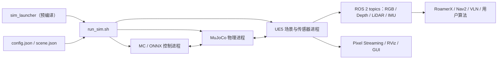

# zsibot/matrix（MATRiX）机器人仿真平台深度调研

> [!summary] 结论摘要
> **MATRiX 值得作为“中国四足机器人 + ROS 2 导航 + UE 高保真场景”的可下载 PoC 候选，但目前不应直接视为完整开源、可复现 benchmark 已建立、可支撑大规模 RL 或生产 SLA 的通用仿真平台。**它的真实价值是把 MuJoCo 动力学、UE5 渲染、四足本体、传感器、导航与一批可下载场景包装成可运行发行版；主要风险是核心运行时以预编译资产交付、公开性能证据缺失、文档与代码漂移、安装面重、许可边界需复核。**总体置信度：中高**（代码/发行/政策事实高，运行性能与商业落地低至中）。

> [!tip] 最短决策
> - **学习、展览、四足导航原型**：建议试用。
> - **GENISOM/ZsiBot 本体二次开发**：优先级较高，但仍先做验收 PoC。
> - **大规模强化学习、通用人形/机械臂、跨平台 CI**：不建议把 MATRiX 作为唯一主平台。
> - **采购或对客户交付**：先补许可证清单、可复现安装、性能 benchmark 和真实 sim-to-real 验收。

## 分类与研究边界

| 字段 | 结论 |
|---|---|
| 主分类 | **R05 产品、平台与工具选型调研** |
| 次分类 | **R04 技术原理与前沿方向**；**R07 商业落地与需求真实性验证** |
| 分类理由 | 研究对象是一个开源/预编译混合交付的机器人仿真平台，核心决策是“是否值得学习、采用、集成或围绕其创业”，需要同时审查架构、许可证、成熟度和真实交付证据。 |
| 截止日期 | 2026-07-20（GitHub 指标会变化） |
| 覆盖 | 主分支 `918fae3`、v0.1.2 Release、公开 tag/commit/issue/PR、文档与脚本静态审阅、公司生态、政策与可比平台。 |
| 不覆盖 | 未下载并执行约 3GB 起的完整 Ubuntu/ROS/GPU 运行包；未进行真机、长稳、传感器精度或 sim-to-real 实测；不对 UE/第三方资产许可给出法律意见。 |

## 一页式判断

| 维度 | 判断 | 证据/边界 |
|---|---|---|
| 产品完成度 | **可安装发行版 / 产品化原型** | 有 launcher、分块资产、校验和、19 个地图包、环境检查和 3 个正式 Release；但核心运行时不是仓库内可构建源码。 |
| 最强场景 | **四足机器人导航、巡检场景验证、教学演示** | 五种内置四足/轮足本体、ROS 2 Humble、RGB/depth/LiDAR、RoamerX/Nav2 连接和 UE 场景。 |
| 物理/视觉组合 | **有工程价值，但不是独有技术路线** | MuJoCo + UE 的组合合理；项目还致谢一个更早的 PoC，上线前已有独立 Unreal Robotics Lab 论文。 |
| 开源程度 | **外层开源、核心运行时预编译** | 可见仓库主要是 Shell/Python、文档、配置和 `.deb`；UE、MC、launcher、控制模型及核心二进制由 Release 提供。 |
| 可复现性 | **中低** | Ubuntu 22.04 + NVIDIA + ROS 2 Humble 硬锁；安装脚本修改系统包；缺 CI、公开 Dockerfile、标准 benchmark 与锁定的完整 SBOM。 |
| 社区成熟度 | **早期但有真实试用** | 347 stars、40 forks、26 个 issue、v0.1.2 必需资产约 800 次下载；外部 PR 和公开问题闭环较弱。 |
| 商业成熟度 | **待验证** | 未见平台价格、付费客户、续费、SLA 或平台收入；更像 GENISOM 硬件/导航/VLN 生态入口。 |
| 采用建议 | **PoC 后条件采用** | 先完成本文验收矩阵；不要仅凭演示画面或 stars 进入主线。 |

## 项目事实快照

### 可核验事实

- 仓库由 `zsibot` 组织维护，创建于 2025-09；审阅时为 347 stars、40 forks、6 watchers/subscribers，GitHub 识别根许可证为 BSD-3-Clause。[`SRC-robotics-312`](../../../raw/robotics-embodied-ai/documents/SRC-robotics-312-matrix-github-maintenance-and-issue-audit.md)
- 公开历史有 80 次提交，集中在 2025-12、2026-01 和 2026-04；前两位作者名合计贡献 59/80 次，维护集中度较高。[`SRC-robotics-312`](../../../raw/robotics-embodied-ai/documents/SRC-robotics-312-matrix-github-maintenance-and-issue-audit.md)
- 正式 Release 为 v0.1.0、v0.1.1、v0.1.2；稳定安装文档与主分支仍指向 v0.1.2。[`SRC-robotics-311`](../../../raw/robotics-embodied-ai/documents/SRC-robotics-311-matrix-v0-1-2-release-and-package-manifest.md)
- `v0.2.2` 只是一个未发布 Release 的 tag，且指向 2026-04-24 的旧提交；不能仅按版本号把它视为最新稳定版。[`SRC-robotics-312`](../../../raw/robotics-embodied-ai/documents/SRC-robotics-312-matrix-github-maintenance-and-issue-audit.md)
- 官网把 MATRiX 与 `genisom_vln`、RoamerX、URDF 模型和机器人 SDK 并列，说明它是 GENISOM 开发生态的一部分，而不是孤立的仿真产品。[`SRC-robotics-313`](../../../raw/robotics-embodied-ai/documents/SRC-robotics-313-genisom-ai-official-open-source-catalog.md)

### 事实、估计、判断与假设分离

| 类型 | 内容 |
|---|---|
| 事实 | 安装基线是 Ubuntu 22.04、ROS 2 Humble、NVIDIA driver ≥535、建议 RTX 4060 以上；运行包按 Release 下载。 |
| 事实 | `run_sim.sh` 在启用 MuJoCo 时分别启动 MuJoCo、UE 和 MC 进程；UE 启动参数把最高帧率设为 30 FPS。 |
| 事实 | 公开主分支没有 UE/C++ 核心源码、`.github/workflows`、Dockerfile 或常规测试目录。 |
| 估计 | 一台已具备 4060 级 GPU 的开发机，最小下载约 3.15GB；加 shared 包约 6.60GB，未计地图、系统包和缓存。 |
| 判断 | MATRiX 当前护城河主要来自“整机—控制—导航—场景—服务”的垂直集成，而不是单一仿真内核创新。 |
| 假设 | 若 GENISOM 把真实项目中的场景、标定、控制器和回归数据持续回流，平台可形成硬件生态粘性；公开资料尚不能验证该闭环规模。 |

## 产品边界：它是什么，不是什么

### 它是什么

MATRiX 是一个面向四足/轮足机器人的**软件在环发行环境**：MuJoCo 负责动力学和控制状态，Unreal Engine 负责视觉、场景和传感器，ROS 2/UDP/Zenoh 等承担外部算法连接，GENISOM 的 MC/ONNX 控制资产与 RoamerX 导航补齐可运行链路。[`SRC-robotics-310`](../../../raw/robotics-embodied-ai/documents/SRC-robotics-310-matrix-repository-readme-at-audited-commit.md)

### 它不是什么

- **不是纯源码可重建的仿真器**：主仓库可见面主要是约 8,824 行 Shell/Python、配置、文档、`.deb` 和演示媒体；launcher、UE runtime、MC/WBC 库、ONNX 控制器和模型由 Release 压缩包提供。
- **不是向量化 RL 训练框架**：未见等价于 Isaac Lab/MJX 的环境 API、任务注册、并行 rollout、reward/observation schema 或训练 benchmark；issue 中的 5–100 机器人规模被维护者表述为后续计划。[`SRC-robotics-312`](../../../raw/robotics-embodied-ai/documents/SRC-robotics-312-matrix-github-maintenance-and-issue-audit.md)
- **不是已经证明 sim-to-real 的 benchmark**：公开资料没有同一控制器在仿真/真机的误差、成功率、稳定性、能耗或故障分布对照。
- **不是 CARLA API 的完整替代或封装**：README 写“集成 CARLA”，包文档提到 Fab/CARLA shared resources，但可见代码未找到 CARLA server、Python API、traffic manager 或显式 bridge；现阶段更稳妥的说法是“使用/继承 CARLA/UE 场景资源”，深度集成程度待验证。

## 核心能力审阅

### 机器人、地图与传感器

| 能力 | 公开状态 | 选型含义 |
|---|---|---|
| 内置机器人 | `xgb`、`xgw`、`zgws`、Unitree Go2、Go2W | 四足/轮足优先；人形与机械臂不是主边界。 |
| 地图 | v0.1.2 manifest 有 19 个可选地图 | 覆盖仓库、城镇、庭院、家庭、办公室、IROS、3DGS、月面、会议室等；资产许可和几何/物理精度需逐包核验。 |
| 基础传感器 | RGB、depth、Mid-360 风格 LiDAR，文档另列 wide-angle、panorama | topic 接入方便；噪声模型、内外参、时间戳、滚动快门和传感器真值误差没有公开 benchmark。 |
| 多机器人 | 文档给出多端口配置 | 示例引用的 `config_multi_robot.json`、`multirobot/highlevel_demo.py` 不在主分支，当前可复现性不足。 |
| 自定义机器人 | v0.1.2 加入 URDF 导入；脚本有 URDF→MJCF、资源重写、contract 检查 | 方向正确，但脚本近 2,000 行、路径与教程漂移；通用 URDF 需要逐模型验收。 |
| 导航 | RoamerX/Nav2 一键连接、RViz、ROS_DOMAIN_ID/RMW 配置 | 对 GENISOM 四足导航最有价值；外部本体、ROS 发行版和网络拓扑要独立测试。 |
| 远程显示 | UE Pixel Streaming | 适合演示和远程观察；不是云端多租户调度或 headless 训练平台。 |

### 自定义 URDF 的真实边界

实现并非简单“导入任意 URDF”：脚本会按文件名识别 `xgb/xgw/zgws/go2/go2w` 等 reference profile，对 generic robot 做 mesh/link/inertial/actuator 修复，再同步两套 UE/MuJoCo 目录。当前风险包括：

- 文档仍引用旧的 `src/robot_mujoco/robots/custom/`，代码实际使用 `src/robot_mujoco/zsibot_robots/custom/_cache/`；
- `zgws/go2/go2w` 的 profile 注释仍含 placeholder/TBD；
- 通用 URDF 能转换，不等于控制器可用；关节顺序、执行器、惯量、接触、sensor site 与 MC profile 都需要匹配；
- 当前 custom 流程固定 `CustomWorld` 场景入口，不能假定任意地图组合已被验证。

**结论**：自定义本体能力属于“有较强工程脚手架，但需模型级调试”，不是零配置兼容。

## 安装、兼容性与总拥有成本

### 最小环境

| 项目 | 要求/现状 | 风险 |
|---|---|---|
| OS | Ubuntu 22.04 | Ubuntu 24.04 仅在 issue 中指向 preview Docker 流程，未成为稳定主线。 |
| GPU | RTX 4060+，driver ≥535 | NVIDIA 锁定；没有国产 GPU/AMD 官方路径。 |
| ROS | Humble | 与较新 ROS/Gazebo/企业基础镜像存在版本治理成本。 |
| 必需包 | assets 1.03GB + base 2.12GB | 最小约 3.15GB；README release note 的 assets “约 675MB”与实际资产 1.03GB冲突。 |
| 推荐包 | shared 3.45GB | 加入后约 6.60GB；地图另计。 |
| 系统修改 | 大量 `sudo apt`、ROS apt source、六个本地 `.deb` | 不宜直接在共享开发机运行；应先放到专用主机/快照 VM。 |
| 容器 | 文档和脚本存在，但主分支无 Dockerfile | 不能仅凭文档认为镜像可复建；需要验证 image 来源、tag、SBOM 和 CVE。 |

### 运维与安全注意

- `install_deps.sh` 会写 ROS apt 源、安装桌面 ROS、Qt、PCL、OpenCV、Zenoh 等，并安装仓库内本地 `.deb`；建议使用隔离主机、基础镜像快照和下载哈希白名单。
- `run_sim.sh` 清理进程时使用多个 `pkill -f` pattern，包括通用的 `UnrealGame`、`UE4Editor`、`mc_ctrl`；共享工作站上可能误杀其他项目进程。
- 下载脚本会自动尝试 aria2/axel/wget/curl、读取 Git proxy 并处理断点包；可靠性设计较丰富，但网络、代理、TLS 和大包损坏仍是主要故障面。
- Release 提供 SHA256 是优点；仍缺完整 SBOM、第三方 notice、二进制构建 provenance 和签名发布链。

## 开源与许可证边界

> [!warning] 不是法律意见
> 根目录 BSD-3-Clause 只足以说明仓库自身声明，不自动覆盖 Unreal Engine runtime、地图/纹理、CARLA/Fab 资产、本地 `.deb`、MC/WBC 库、ONNX 控制器和所有第三方内容。对外再分发、云服务或嵌入产品时必须逐项审计。

| 层 | 公开情况 | 风险判断 |
|---|---|---|
| 仓库脚本/文档 | BSD-3-Clause | 通常可修改/再分发，保留 notice。 |
| MuJoCo | 上游 Apache-2.0；仓库打包 3.3.0 `.deb` | 核心许可较清晰，但打包内容仍需保留 notice。 |
| Unreal Engine runtime | 预编译发行资产 | 受 Epic EULA/内容许可影响，不能仅按 BSD 处理。 |
| CARLA/Fab/地图 | shared/map 包 | 每个资产的来源与再分发权待建立清单。 |
| MC/WBC/ONNX/launcher | 预编译二进制 | 源码、第三方依赖、商用/再分发边界未公开。 |
| 致谢上游插件 | `oneclicklabs/MuJoCo-Unreal-Engine-Plugin` | GitHub API 未检测到上游许可证；MATRiX 只说明“builds upon”，无法从公开材料判断代码沿袭程度与授权方式。[`SRC-robotics-314`](../../../raw/robotics-embodied-ai/documents/SRC-robotics-314-mujoco-unreal-engine-plugin-upstream-repository.md) |

**采购前必须取得**：组件级 SBOM、第三方 notice、UE/CARLA/Fab 资产清单、二进制再分发权说明、云服务边界、商用支持条款和安全更新承诺。

## 工程成熟度与社区信号

### 正向信号

- 3 个正式 Release，分块下载、manifest、SHA256、断点续传、离线包和环境检查形成了真实发行工程；
- v0.1.2 的 assets/base 各约 800 次下载，显著高于仅有宣传页面的项目；
- 公开 issue 覆盖真实安装、控制、topic、Docker 和地图问题，说明有人实际尝试；
- Shell 语法检查与 `validate_xml_contract.py` 字节编译在本次静态审阅中通过。

### 负向信号

- 没有公开 CI workflow、自动化 runtime regression、coverage 或 release reproducibility；
- 七个 PR 均来自同一内部贡献者，尚未形成外部治理；
- 部分 issue 被转移到微信群，公开线程没有问题根因与修复版本；2026-07-19 有多条旧 issue 被集中关闭；
- 文档引用不存在的配置/示例文件、旧目录和旧 Pixel Streaming 路径；Markdown 还存在五个失效的本地链接；
- 版本编号、tag、release、主分支之间存在 `v0.2.2` 异常，版本治理需要澄清。

## 性能、稳定性与可复现性：目前缺什么

公开资料没有提供以下统一口径：

- real-time factor、physics steps/s、UE FPS 与机器人/传感器数量曲线；
- CPU/GPU/显存/内存占用，headless 与 Pixel Streaming 开销；
- 多机器人规模和消息吞吐；
- RGB/depth/LiDAR/IMU 的频率误差、时间戳、延迟、噪声和真值误差；
- MuJoCo—UE 状态同步误差、丢帧与确定性；
- 自定义 URDF 成功率或公开兼容模型矩阵；
- 同一控制策略的 sim-to-sim / sim-to-real 成功率和故障分布；
- 8/24/72 小时稳定性、内存增长、崩溃恢复和日志可观测性。

因此“high-fidelity”“optimized sim-to-real”“大规模并行”等只能分别视为**产品定位、待验证主张或路线图**，不能当作已建立的比较优势。

## 与主流方案的统一场景比较

详见 [[isaac-sim-vs-gazebo-vs-mujoco-2026-07-14|Isaac Sim vs Gazebo vs MuJoCo 机器人仿真平台选型]]。MATRiX 的比较口径如下：

| 需求 | MATRiX | 更稳妥首选 | 原因 |
|---|---|---|---|
| GENISOM 四足 + UE 场景 + RoamerX | **有优势** | MATRiX | 本体、控制器、场景和导航垂直打通。 |
| 通用运动控制 / 接触 / 系统辨识 | 可用但偏重 | MuJoCo/MJX | API、可构建源码、测试与批量训练生态更直接。 |
| 大规模 RL/IL | 证据不足 | Isaac Lab 或 MJX/Warp | 有向量化环境、任务/训练框架和公开 benchmark。 |
| ROS 2 Nav2 / AMR 系统联调 | 条件可用 | Gazebo | ROS 版本配套、插件、SDF 与系统仿真生态更成熟。 |
| 高保真视觉 / SDG / OpenUSD | 场景效果强但工具链不透明 | Isaac Sim | 传感器、Replicator、USD、标注与商业文档更完整。 |
| UE + MuJoCo 学术研究 | 有产品化包装 | Unreal Robotics Lab | URL 有论文与导航/SLAM benchmark；MATRiX 更偏四足发行包。 |
| 国产 GPU 或跨 GPU | 不适合 | Gazebo 或 CPU MuJoCo | MATRiX 明确要求 NVIDIA RTX。 |
| 内网离线演示 | 较适合 | MATRiX / Gazebo | MATRiX 提供大包离线交付，但需许可与镜像治理。 |

### 关于“全球首个”

MATRiX 的宣传曾出现“全球首个 MuJoCo + UE5”表述，但 Unreal Robotics Lab 的 v1 预印本在 2025-04-19 已公开同类组合，并带有导航/SLAM benchmark；MATRiX 仓库初始公开提交是 2025-09。[`SRC-robotics-315`](../../../raw/robotics-embodied-ai/documents/SRC-robotics-315-unreal-robotics-lab-a-high-fidelity-robotics-simulator-with-advanced-physics-and.md) 这不否定 MATRiX 的工程整合价值，但应把创新点改写为**面向中国四足生态的产品化发行与垂直集成**，而不是未经限定的技术首创。

## 中国与“十五五”位置

### 政策机会

2026 年工信部、国务院国资委的实景实训专项行动明确覆盖四足机器人，要求建设真实场景、量化成功率/效率/安全/经济性，并提出把验证成熟的仿真平台推广到整机企业。[`SRC-robotics-316`](../../../raw/robotics-embodied-ai/documents/SRC-robotics-316-2026.md) 同年国家标准计划 `20261662-T-604` 启动《人形机器人模型训练平台技术规范》起草，计划周期 12 个月。[`SRC-robotics-317`](../../../raw/robotics-embodied-ai/documents/SRC-robotics-317-source.md)

### 对 MATRiX 的含义

- **利好**：国产可控的仿真、训练、测试和场景资产会得到更多联合体验证机会；GENISOM 具备本体、控制、导航和现场渠道，更容易组织 real2sim2real 项目。
- **压力**：政策方向从“能演示”转向“有真实场景指标、验证报告和可复制部署”；MATRiX 当前公开 benchmark 与第三方验证不足。
- **真正窗口**：不是再造一个物理引擎，而是围绕中国工业/特种场景建立资产转换、传感器标定、故障注入、标准评测、真实回放和结果审计层。

## 商业应用可能性

### 谁的问题、谁付钱

| 角色 | 典型主体 | 关心什么 |
|---|---|---|
| 使用者 | 机器人算法/控制/导航/测试工程师、学生 | 少上真机、快速复现、可观察 sensor/topic。 |
| 决策者 | 机器人研发负责人、解决方案负责人、高校实验室 PI | 研发周期、硬件损耗、项目交付风险和人才学习成本。 |
| 采购者 | 整机企业、系统集成商、高校、央国企创新中心 | 可部署环境、支持、本体/场景适配、许可和验收。 |
| 付款者 | 机器人公司、项目总包、高校实验室、行业客户 | 降低真机试错、缩短方案演示/验收时间，而非为“仿真画面”本身付费。 |

### 价值增量与成熟度

- **可量化价值**应来自：减少真机占用小时、减少摔机/场地成本、提高回归用例数、缩短场景复建时间、提前发现导航/感知/控制问题。
- **当前成熟度判断**：开源可下载发行版 + 社区试用，接近“产品化 PoC/生态工具”；公开证据不足以证明重复采购或平台规模化收入。
- **部署成本**：专用 NVIDIA Linux 工作站、大包下载、系统依赖、ROS/UE/MuJoCo 运维、场景/本体适配、日志排障、许可证与安全审计。
- **组织成本**：需要算法、机器人系统、UE/3D 资产和 DevOps 能力协同；不是纯 Python 团队一键接入。

### 最可能率先落地的 3 个场景

1. **高校/企业四足导航与感知教学**：内置机器人、地图、ROS topic 和 RViz 能形成完整实验；对生产 SLA 要求较低。
2. **电力/安防/应急巡检的方案预验证**：把客户场景转成 UE/3DGS/mesh，先跑路径、视场、遮挡、避障和异常用例，再进入现场。
3. **GENISOM 机器人售前与二次开发**：MATRiX + RoamerX + VLN + SDK 可作为硬件生态的开发入口、演示工具和交付加速器。

### 从试点到规模订单的门槛

- 同一场景、同一本体的仿真—真机相关性报告；
- 统一数据/时间戳/TF/传感器噪声和评测 schema；
- 可复现容器/镜像、离线安装、版本迁移和安全更新；
- 第三方资产与二进制许可清单；
- 故障注入、长稳、回放、审计与客户验收报告；
- 不依赖微信群完成关键问题支持的 ticket/SLA 体系。

### 时间判断

| 时段 | 判断 | 置信度 |
|---|---|---|
| 1–2 年 | 在 GENISOM 四足生态、教学、比赛、售前和巡检 PoC 中有**中等偏高**落地可能；作为通用仿真平台为**中低**。 | 中 |
| 3–5 年 | 若补齐标准评测、场景资产流水线、第三方本体、云/内网交付与 real2sim2real 数据，可能成为垂直行业平台；否则会被更成熟通用平台挤压为硬件配套工具。 | 低至中 |

## 中小型创业者的机会

### 可立即验证

| 切口 | MVP | 首批客户 | 首个收费交付物 | 启动条件 |
|---|---|---|---|---|
| 安装与版本治理 | 可复现 Ubuntu 镜像、离线包、环境检查报告 | 高校、四足创业公司、集成商 | “一台机器装好 + 验收 + 运维手册” | 1–2 名 ROS/Linux/DevOps；低资金；2–4 周验证。 |
| 本体与传感器适配 | 一个非 GENISOM 四足 URDF、LiDAR/camera/TF 全链路 | 本体厂、实验室 | 模型转换包 + 标定报告 + regression case | ROS/MuJoCo/URDF；需要客户模型与真机。 |
| 垂直场景资产服务 | 仓库/配电房/园区的 3DGS/mesh → 可运行场景 | 巡检方案商、央国企创新项目 | 场景包 + 路线/视场/异常用例 | UE/3D/测绘能力；中低资金；4–8 周。 |
| 自动化评测层 | 传感器频率、TF、碰撞、任务成功率、资源占用报告 | 仿真团队、机器人测试团队 | CLI/报告模板 + 一组验收用例 | Python/ROS/test infra；2–6 周。 |
| 培训与课程 | MATRiX + RoamerX 的 2 日实验课 | 高校、职业教育、企业培训 | 课程、镜像、实验手册和技术支持 | 内容+现场支持；低资金。 |

头部公司未必立即做这些，因为它们是碎片化、强现场、客单价有限的“最后一公里”工作；但平台/整机厂愿意采购或合作，因为外部服务商能扩大交付半径并沉淀行业模板。护城河来自可复用场景、验收数据、客户流程 know-how、适配矩阵和持续运维，而不是简单搬运开源代码。

### 需要条件成熟

- **标准化仿真验证服务**：等待 `20261662-T-604` 等规范进一步明确，再把测试用例和报告变成第三方服务。
- **Real2Sim 场景工厂**：需要真实项目场景、客户数据授权、传感器标定和仿真—真机相关性证据。
- **私有云/远程仿真**：需要 UE 与全部资产的云服务/再分发许可、GPU 调度、隔离和计费闭环。
- **跨仿真器资产/评测转换**：需要客户同时维护 MATRiX、Gazebo、Isaac/MuJoCo，且资产成本足够高。

### 不建议进入

- **重做 MuJoCo/UE 核心引擎**：资本、图形/物理人才和生态要求过高，且现有上游强。
- **只卖地图素材包**：许可、盗版、复购和差异化弱；必须绑定行业验收/数据闭环。
- **承诺“仿真训练后零调参上真机”**：当前证据不支持，责任和安全风险高。
- **未澄清许可就封装 SaaS 或 OEM 分发**：可能触发 UE、资产、二进制和上游代码许可问题。
- **把 stars/download 当付费需求**：它们只能证明关注和下载，不能证明安装成功、活跃使用或预算。

## 建议的最小验证方案

### PoC 设计

| 阶段 | 目标 | 交付物 | 建议停止条件 |
|---|---|---|---|
| 0. 合规 | 确认二进制/地图/云与客户交付许可 | SBOM、license matrix、责任人确认 | 无法获得关键资产/二进制授权说明。 |
| 1. 可复现安装 | 三台/三次干净 Ubuntu 22.04 环境完成安装 | 镜像 hash、脚本日志、失败分类、恢复步骤 | 成功依赖手工私聊或不可记录操作。 |
| 2. 基础闭环 | 内置四足完成站立/运动、RGB/depth/LiDAR/IMU、RViz | rosbag、topic/TF 检查、资源曲线 | 关键 topic 缺失、时间戳/TF 不一致且无公开修复。 |
| 3. 客户本体 | 导入一个非内置 URDF 并通过模型验收 | 惯量/限位/接触/零位/控制器报告 | 只能靠伪装成内置 profile 才可运行。 |
| 4. 业务任务 | 在客户场景完成 Nav2/巡检任务 | 成功率、耗时、碰撞、恢复与日志 | 无法定义重复、自动的任务 reset/验收。 |
| 5. 真机相关性 | 同策略、同路线、同传感器配置做 sim/real 对照 | 轨迹、观测、故障分布和校准项 | 仿真指标与真机排序/故障不相关。 |

### 推荐验收指标

下面是**建议阈值**，不是项目官方指标，应按客户风险调整：

- 干净环境安装成功率 `3/3`，所有包 SHA256 通过；
- 配置 10Hz 的关键 sensor topic，长稳测试中实际频率中位数在目标值 ±10%，无持续时间倒退；
- 30 分钟基础任务无进程崩溃，8 小时 soak test 内存无持续单调增长；
- 同一 seed、同一初始条件的关键任务结果可重复，并记录非确定来源；
- 自定义 URDF 的总质量、质心、惯量、关节限位、零位与真机/模型源一致；
- 100 次可自动 reset 的业务任务，报告成功、超时、碰撞、卡死、感知和规划失败分布；
- 与纯 MuJoCo/Gazebo 的同任务对照中，MATRiX 必须在视觉/场景/交付效率上给出可量化增量。

## 风险、证伪条件与监测指标

| 当前判断 | 证伪/改变条件 | 应监测指标 |
|---|---|---|
| 仅适合条件采用 | 发布可构建核心源码、CI、公开 benchmark 和稳定容器 | Release 频率、main 活跃、CI、外部 PR、文档修复。 |
| 大规模训练能力不足 | 出现向量化 API、可复现 100+ 并行环境 benchmark | steps/s、real-time factor、GPU/显存、任务集。 |
| 商业成熟度待验证 | 公布付费客户、重复采购、SLA 或平台收入 | 客户案例证据等级、续费、交付周期、支持工单。 |
| sim-to-real 未证明 | 同一任务/策略的公开仿真—真机相关性报告 | 轨迹误差、成功率排序、故障分布、校准成本。 |
| 许可风险偏高 | 发布完整 SBOM/notice 与再分发/云服务说明 | 组件许可证、资产来源、EULA 更新、CVE 修复。 |
| 文档/版本治理较弱 | tag/release/main 统一并建立迁移说明 | 最新 stable、弃用策略、issue 公开闭环时间。 |

## 反方证据与知识冲突

| 冲突 | 支持方 | 反方/限制 | 下一步 |
|---|---|---|---|
| “完整开源平台” | 根仓库 BSD、脚本和文档公开 | 核心 UE/MC/launcher/模型以二进制交付 | 要 SBOM、源码清单和商业授权说明。 |
| assets 约 675MB | Release note | GitHub 实际资产 1,030,738,643 bytes | 以 manifest/API 为准并修正文档。 |
| “全球首个 MuJoCo+UE5” | 公司/媒体宣传 | Unreal Robotics Lab v1 早于 MATRiX 仓库公开 | 限定创新点为四足生态产品化。 |
| “高保真/优化 sim-to-real” | README 与演示 | 无统一 benchmark 或真机相关性数据 | 做阶段 4–5 PoC。 |
| “支持多机器人” | 教程与配置概念 | 示例文件不在主分支，并行规模是路线图回复 | 要可运行示例与资源曲线。 |
| “支持自定义 URDF” | v0.1.2 与 1,994 行转换脚本 | 文档路径过时、部分 profile TBD、控制器仍有限制 | 用非内置本体验收。 |
| 最新版本 | tags 有 v0.2.2 | 正式 Latest Release/README 是 v0.1.2，tag 指旧提交 | 要维护者澄清版本语义。 |

## 待验证事项与下一步

- `待验证`：实际下载并在目标 NVIDIA 设备完成三次干净安装；
- `待验证`：CARLA 的代码/API/版本/许可和“集成”层级；
- `待验证`：UE、地图、Fab/CARLA、MC/WBC、ONNX、launcher 的逐项许可证；
- `待验证`：自定义非 GENISOM 本体的成功率与控制器接口；
- `待验证`：传感器噪声、时间戳、TF、延迟和真值精度；
- `待验证`：多机器人、headless、Pixel Streaming 和 8/24/72 小时稳定性；
- `待验证`：GENISOM 客户是否真实使用 MATRiX 完成重复部署，以及平台是否有付费模式；
- `待验证`：与 Gazebo、Isaac Sim、纯 MuJoCo、Unreal Robotics Lab 的统一任务 benchmark。

## 来源与证据质量

| 等级 | 来源 | 本文用法 |
|---|---|---|
| S | MATRiX pinned README、Release、GitHub API/代码审阅、上游插件仓库、Unreal Robotics Lab 论文、工信部政策、国家标准计划 | 项目事实、架构、版本、社区、政策和反方证据。 |
| A | GENISOM 官方开源目录 | 公司生态定位；不用于独立性能和商业验证。 |
| B | GitHub issue 中的用户故障报告和维护者回复 | 真实使用信号、路线图和支持方式；不是 benchmark。 |
| C | 本文未把无来源自媒体数字作为关键证据 | 只用于发现线索时才应保留。 |

主要原始证据：

- [`SRC-robotics-310`](../../../raw/robotics-embodied-ai/documents/SRC-robotics-310-matrix-repository-readme-at-audited-commit.md)：README 与安装边界。
- [`SRC-robotics-311`](../../../raw/robotics-embodied-ai/documents/SRC-robotics-311-matrix-v0-1-2-release-and-package-manifest.md)：v0.1.2 功能、包与 release note。
- [`SRC-robotics-312`](../../../raw/robotics-embodied-ai/documents/SRC-robotics-312-matrix-github-maintenance-and-issue-audit.md)：GitHub 维护、下载、issue、PR、tag 与静态审阅快照。
- [`SRC-robotics-313`](../../../raw/robotics-embodied-ai/documents/SRC-robotics-313-genisom-ai-official-open-source-catalog.md)：GENISOM 开发生态。
- [`SRC-robotics-314`](../../../raw/robotics-embodied-ai/documents/SRC-robotics-314-mujoco-unreal-engine-plugin-upstream-repository.md)：被致谢的 MuJoCo-UE 上游 PoC。
- [`SRC-robotics-315`](../../../raw/robotics-embodied-ai/documents/SRC-robotics-315-unreal-robotics-lab-a-high-fidelity-robotics-simulator-with-advanced-physics-and.md)：更早的 UE+MuJoCo 论文与 benchmark 路线。
- [`SRC-robotics-316`](../../../raw/robotics-embodied-ai/documents/SRC-robotics-316-2026.md)：2026 实景实训专项行动。
- [`SRC-robotics-317`](../../../raw/robotics-embodied-ai/documents/SRC-robotics-317-source.md)：模型训练平台技术规范国家标准计划。

## 关联连接

- [[MATRiXSimulator|MATRiX Simulator 实体页]]
- [[_sources/zsibot-matrix-robotics-simulator-source-set|zsibot/matrix 来源集摘要]]
- [[isaac-sim-vs-gazebo-vs-mujoco-2026-07-14|Isaac Sim vs Gazebo vs MuJoCo 机器人仿真平台选型]]
- [[../12-robotics-engineering-platforms-2026-06-04|机器人工程平台综合调研]]
- [[../03-market-and-policy|机器人行业市场与政策]]
- [[../00-index|机器人（具身智能）研究入口]]
